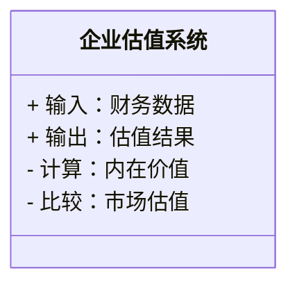
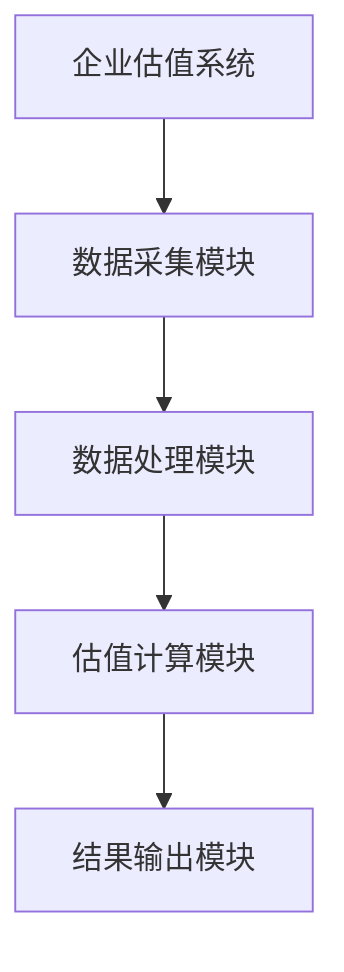

                 


# 如何识别被低估的优质企业

> 关键词：企业估值，投资分析，市场低估，优质企业，财务分析

> 摘要：本文将详细探讨如何识别被低估的优质企业，从背景介绍、核心概念、算法原理、系统分析到项目实战，全面解析这一过程。通过科学的方法和工具，帮助投资者和企业分析人员准确识别具备长期竞争优势且市场估值低于内在价值的优质企业。

---

# 第一部分: 背景介绍

## 第1章: 企业低估的定义与背景

### 1.1 企业低估的定义与背景

#### 1.1.1 企业低估的定义
企业低估是指一家公司的市场估值（通常通过市盈率、市净率等指标衡量）低于其内在价值（通过财务指标和竞争优势评估得出的合理估值）。这种低估可能是由于市场认知偏差、信息不对称或短期市场波动导致的。

#### 1.1.2 市场失灵与企业低估的现象
市场失灵是企业低估的主要原因之一。例如，投资者可能过度关注短期财务数据，而忽视企业的长期竞争优势；或者市场情绪化导致投资者对某些行业或公司失去信心，从而低估其实际价值。

#### 1.1.3 识别被低估企业的意义
识别被低估的企业对投资者和企业管理者具有重要意义：
- 投资者可以从中发现潜在的投资机会，获得超额收益。
- 企业管理者可以利用这一信息优化公司治理和战略决策。
- 对于整个市场而言，识别被低估企业有助于纠正市场失灵，促进资源的合理配置。

---

## 第2章: 优质企业的核心特征

### 2.1 优质企业的定义

优质企业是指那些具备持续竞争优势、稳健财务状况和良好成长潜力的企业。这些企业在行业中具有领先地位，能够通过不断创新和优化降低成本，提高利润率。

### 2.2 优质企业的核心属性对比表

| 属性           | 非优质企业           | 优质企业           |
|----------------|----------------------|--------------------|
| 财务状况       | 盈利能力低           | 盈利能力强         |
| 市场地位       | 市场份额小           | 市场份额大         |
| 竞争优势       | 竞争优势不明显       | 竞争优势明显       |
| 管理团队       | 管理能力一般         | 管理能力强         |
| 技术创新       | 技术落后             | 技术领先           |

### 2.3 优质企业的竞争优势分析

优质企业的竞争优势主要体现在以下几个方面：
1. **成本优势**：通过规模化生产或技术创新降低成本。
2. **技术优势**：拥有独特的专利技术或研发能力。
3. **品牌优势**：强大的品牌影响力能够吸引更多的客户。
4. **市场网络**：广泛的销售渠道和客户资源。
5. **管理优势**：高效的管理团队能够快速响应市场变化。

---

# 第二部分: 核心概念与联系

## 第3章: 核心概念与联系

### 3.1 企业低估与优质企业的关系

#### 3.1.1 企业低估的成因分析

企业低估的原因可能包括：
1. **市场认知偏差**：投资者对行业的认知不足，导致对企业价值的误判。
2. **短期业绩波动**：企业的短期财务数据不佳，影响市场对其估值。
3. **行业周期性**：行业处于下行周期时，投资者可能低估企业的长期价值。

#### 3.1.2 优质企业的市场认知偏差

优质企业可能因为以下原因被市场低估：
1. **短期负面新闻**：企业短期内出现负面事件，影响投资者信心。
2. **行业竞争加剧**：行业内竞争激烈，投资者担心企业的市场份额受到挤压。
3. **市场情绪化**：市场情绪波动导致投资者对优质企业失去信心。

#### 3.1.3 低估与优质企业的动态平衡

企业价值的动态平衡可以通过以下方式实现：
1. **市场回归机制**：市场会逐渐发现优质企业的价值，导致股价回升。
2. **企业自身努力**：优质企业通过不断优化管理和技术创新，提升市场竞争力。
3. **投资者理性回归**：随着信息的透明化和市场教育的深入，投资者会对优质企业重新估值。

### 3.2 核心概念原理

#### 3.2.1 企业价值的评估模型

企业价值的评估模型可以通过以下公式表示：
$$
\text{企业价值} = \text{净利润} \times \text{市盈率} \quad \text{或} \quad \text{净资产} \times \text{市净率}
$$

#### 3.2.2 市场估值与内在价值的差异

市场估值与内在价值的差异可以通过以下方式计算：
$$
\text{市场低估} = \text{内在价值} - \text{市场估值}
$$

---

# 第三部分: 算法原理讲解

## 第4章: 算法原理讲解

### 4.1 企业价值评估算法

#### 4.1.1 算法原理

企业价值评估算法的核心是通过财务数据和市场指标计算企业的内在价值，并与市场估值进行对比，识别被低估的企业。

#### 4.1.2 算法实现

以下是一个简单的Python代码示例，用于计算企业的内在价值：

```python
def calculate_intrinsic_value(revenue, net_profit, market_cap):
    # 示例算法：使用市盈率和市净率的加权平均
    pe_ratio = net_profit * 15  # 假设合理市盈率为15
    pb_ratio = revenue * 0.5  # 假设合理市净率为0.5
    intrinsic_value = pe_ratio + pb_ratio
    if intrinsic_value > market_cap:
        return "低估"
    else:
        return "高估或合理"
```

---

## 第5章: 系统分析与架构设计

### 5.1 问题场景介绍

企业估值系统需要解决以下问题：
1. 如何高效地收集和处理企业的财务数据？
2. 如何准确地评估企业的内在价值？
3. 如何快速识别市场低估的企业？

### 5.2 系统功能设计

#### 5.2.1 领域模型



#### 5.2.2 系统架构设计



### 5.3 系统接口设计

系统接口设计如下：
1. 数据输入接口：接收企业的财务数据。
2. 数据处理接口：对数据进行清洗和转换。
3. 估值计算接口：计算企业的内在价值。
4. 结果输出接口：输出企业的估值结果。

---

## 第6章: 项目实战

### 6.1 环境安装与配置

#### 6.1.1 安装Python环境

```bash
python --version
pip install numpy pandas matplotlib
```

#### 6.1.2 数据源配置

```python
import pandas as pd
import numpy as np

# 示例数据
data = {
    "公司": ["公司A", "公司B", "公司C"],
    "收入": [100, 200, 150],
    "净利润": [20, 30, 25],
    "市值": [1000, 2000, 1500]
}
df = pd.DataFrame(data)
```

---

## 第7章: 最佳实践与总结

### 7.1 最佳实践

1. **数据质量**：确保数据来源可靠，数据清洗充分。
2. **模型选择**：根据行业特点选择合适的估值模型。
3. **持续监控**：定期更新数据和重新评估企业价值。

### 7.2 小结

通过科学的方法和工具，识别被低估的优质企业需要结合财务分析、市场研究和竞争优势分析。只有综合考虑这些因素，才能准确识别出具备长期投资价值的企业。

### 7.3 注意事项

- 避免仅依赖单一估值指标，应结合多种指标进行综合评估。
- 保持对市场变化的敏感性，及时调整估值模型。
- 长期关注企业的基本面，避免被短期市场波动影响判断。

### 7.4 拓展阅读

- 《投资学原理》
- 《财务报表分析》
- 《竞争优势分析》

---

# 作者：AI天才研究院/AI Genius Institute & 禅与计算机程序设计艺术 /Zen And The Art of Computer Programming

---

通过本文的详细讲解，您已经掌握了如何识别被低估的优质企业的核心方法。希望这些内容能够帮助您在投资和企业分析中做出更明智的决策。

