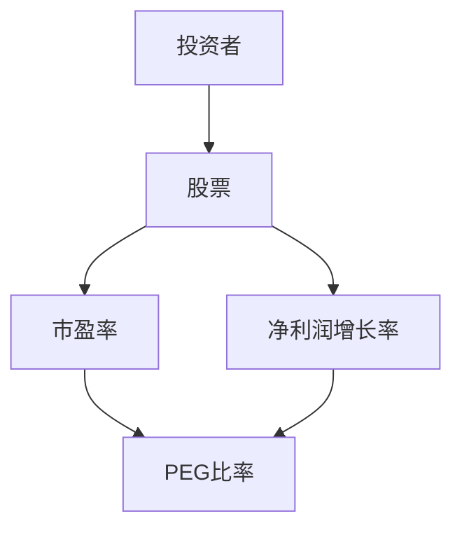
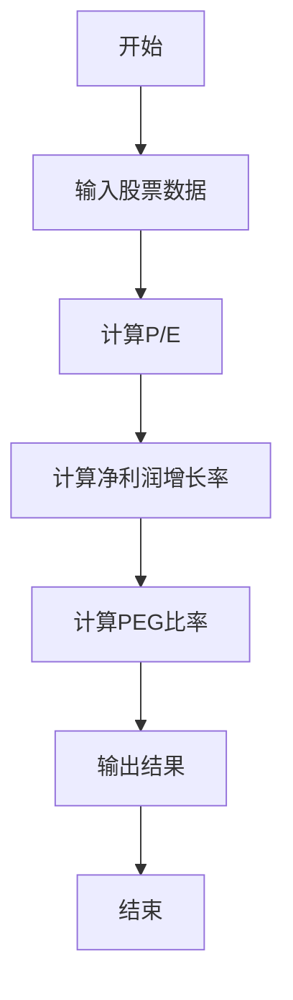
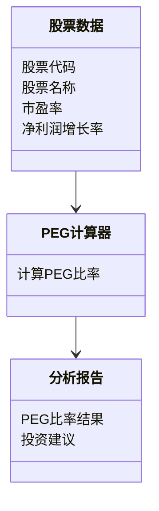
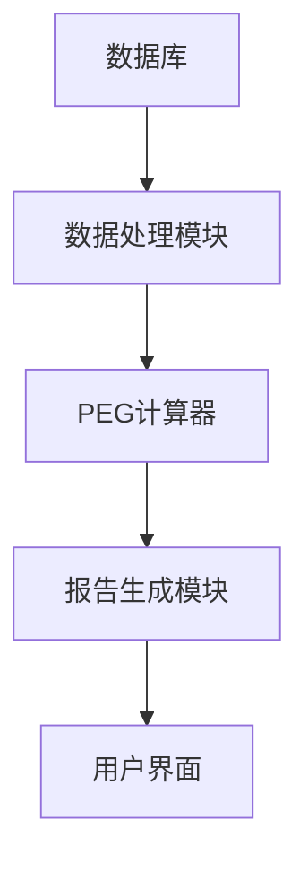

                 


# 如何运用彼得林奇的PEG比率选股

> 关键词：彼得·林奇, PEG比率, 选股策略, 价值投资, 股票估值

> 摘要：本文详细探讨了如何运用彼得·林奇的PEG比率进行选股，分析了其背后的逻辑、计算方法及其在实际投资中的应用。通过系统的方法，帮助投资者科学地评估股票价值，做出明智的投资决策。

---

# 第一部分：PEG比率的核心概念与背景

## 第1章：PEG比率的基本概念

### 1.1 什么是PEG比率

#### 1.1.1 PEG比率的定义

彼得·林奇的PEG（Price/Earnings to Growth）比率是一种用于评估股票价值的指标，它结合了市盈率（P/E）和公司盈利增长率。其公式为：

$$PEG = \frac{\text{市盈率}}{\text{净利润增长率}}$$

PEG比率的目的是衡量股票的相对估值，帮助投资者判断股票是否被高估或低估。

#### 1.1.2 PEG比率与PE、PB的关系

- **市盈率（P/E）**：反映股票的静态估值，仅考虑当前盈利情况。
- **市净率（P/B）**：反映股票相对于账面价值的估值。
- **PEG比率**：不仅考虑当前市盈率，还考虑了未来的盈利增长潜力。

### 1.2 彼得·林奇的投资理念

彼得·林奇是著名的投资大师，他强调长期投资和基本面分析。PEG比率在林奇的选股策略中占据重要地位，因为他认为，只有那些盈利增长速度快于平均水平的公司，才能为投资者带来超额收益。

---

## 第2章：PEG比率的计算与分析

### 2.1 PEG比率的计算公式

PEG比率的计算公式如下：

$$PEG = \frac{\text{市盈率}}{\text{净利润增长率}}$$

其中：
- **市盈率（P/E）**：股票的价格除以每股净利润。
- **净利润增长率**：公司净利润的年复合增长率。

### 2.2 PEG比率的分析方法

#### 2.2.1 行业适用性

不同行业的PEG比率标准不同。例如，成长型行业（如科技行业）的合理PEG比率通常高于成熟行业（如公用事业）。

#### 2.2.2 动态调整

PEG比率应根据市场变化和公司业绩进行动态调整，以反映最新的估值情况。

#### 2.2.3 与其他估值指标的对比

| 指标 | 定义 | 作用 |
|------|------|------|
| P/E  | 市盈率 | 评估股票价格是否合理 |
| P/B  | 市净率 | 衡量股票相对于账面价值的估值 |
| PEG  | P/E / 净利润增长率 | 衡量股票的相对估值，考虑盈利增长潜力 |

### 2.3 ER实体关系图



---

## 第3章：PEG比率的核心概念与联系

### 3.1 核心概念原理

PEG比率的数学模型可以表示为：

$$PEG = \frac{P/E}{\text{净利润增长率}}$$

其中：
- **P/E**：市盈率，反映当前股价相对于盈利的水平。
- **净利润增长率**：公司未来盈利增长的预期。

### 3.2 核心概念对比表

| 指标 | 定义 | 作用 |
|------|------|------|
| P/E  | 市盈率 | 评估股票价格是否合理 |
| 净利润增长率 | 净利润年增长率 | 衡量公司盈利能力的提升 |
| PEG比率 | P/E / 净利润增长率 | 衡量股票的相对估值，考虑盈利增长潜力 |

### 3.3 核心概念的数学模型

$$PEG = \frac{P/E}{\text{净利润增长率}}$$

---

## 第4章：PEG比率的算法原理

### 4.1 算法流程图



### 4.2 代码实现

```python
def calculate_pe(stock_price, earnings):
    return stock_price / earnings

def calculate_growth_rate(earnings_year1, earnings_year2):
    return (earnings_year2 - earnings_year1) / earnings_year1

def calculate_peg(pe, growth_rate):
    return pe / growth_rate

# 示例代码
stock_price = 100
earnings_year1 = 10
earnings_year2 = 15

pe = calculate_pe(stock_price, earnings_year2)
growth_rate = calculate_growth_rate(earnings_year1, earnings_year2)
peg = calculate_peg(pe, growth_rate)

print(f"PEG比率 = {peg}")
```

---

## 第5章：系统分析与架构设计

### 5.1 项目介绍

本项目旨在开发一个基于PEG比率的选股系统，帮助投资者筛选出具有投资潜力的股票。

### 5.2 系统功能设计

#### 5.2.1 需求分析

- 数据获取：从数据库或API获取股票数据。
- 计算PEG比率：根据股票数据计算PEG比率。
- 生成报告：输出分析报告，包括PEG比率和投资建议。

#### 5.2.2 功能模块

- 数据获取模块
- 数据处理模块
- 计算PEG模块
- 报告生成模块

#### 5.2.3 领域模型类图



### 5.3 系统架构设计



---

## 第6章：项目实战

### 6.1 环境安装

- 安装Python和必要的库（如Pandas、Matplotlib）。
- 安装股票数据获取工具（如Yahoo Finance API）。

### 6.2 核心实现代码

```python
import pandas as pd
import requests

# 获取股票数据
def get_stock_data(ticker):
    url = f"https://api.example.com/stock/{ticker}"
    response = requests.get(url)
    data = response.json()
    return pd.DataFrame(data)

# 计算PEG比率
def calculate_peg(pe, growth_rate):
    return pe / growth_rate

# 示例代码
stock_data = get_stock_data("AAPL")
pe = stock_data['PE'].mean()
growth_rate = stock_data['净利润增长率'].mean()
peg = calculate_peg(pe, growth_rate)
print(f"PEG比率 = {peg}")
```

### 6.3 实际案例分析

以苹果公司为例，计算其PEG比率，并分析其投资价值。

---

## 第7章：最佳实践与小结

### 7.1 最佳实践

- 定期更新股票数据，确保PEG比率的准确性。
- 结合其他估值指标（如P/B、P/S）进行综合分析。
- 长期跟踪公司业绩，动态调整投资策略。

### 7.2 小结

PEG比率是一种有效的选股工具，能够帮助投资者识别具有成长潜力的股票。然而，投资者需要结合市场环境和公司基本面，综合运用多种估值方法，以做出更明智的投资决策。

### 7.3 注意事项

- PEG比率仅适用于盈利增长稳定的公司。
- 高增长行业的合理PEG比率通常较高。
- 避免仅依赖PEG比率，忽略其他基本面因素。

### 7.4 拓展阅读

- 《彼得·林奇的成功投资》
- 《投资学基础》

---

# 作者：AI天才研究院/AI Genius Institute & 禅与计算机程序设计艺术 /Zen And The Art of Computer Programming

---

本文通过详细讲解彼得·林奇的PEG比率，帮助投资者掌握一种科学的选股方法。通过实际案例和代码实现，读者可以更好地理解和应用PEG比率，做出更明智的投资决策。

