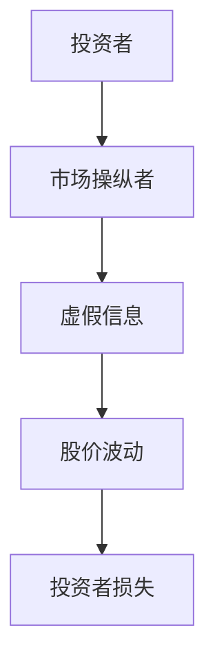
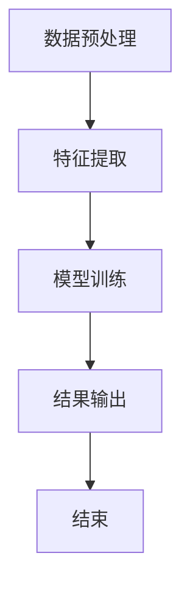
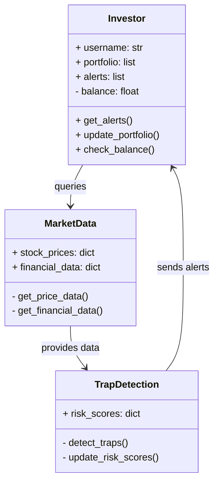
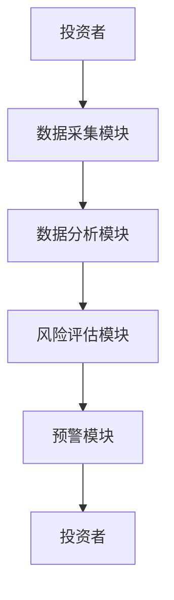

                 


# 如何避免特价股票投资中的陷阱

> 关键词：特价股票、投资陷阱、风险管理、技术分析、价值投资、市场操纵

> 摘要：本文详细探讨了如何识别和避免特价股票投资中的常见陷阱，包括低价股的流动性风险、财务造假风险和市场操纵风险。通过系统化的分析、算法原理和实际案例，本文为投资者提供了科学的投资策略和风险管理方法，帮助投资者在特价股票市场中做出更明智的决策。

---

# 第一部分: 特价股票投资陷阱概述

# 第1章: 特价股票投资陷阱的背景与核心概念

## 1.1 特价股票的定义与特点

### 1.1.1 特价股票的定义
特价股票通常指的是价格低于市场平均水平的股票，通常出现在小盘股或 penny stock（一美元股票）中。这类股票的特点是价格低廉，但风险较高。

### 1.1.2 特价股票的核心特点
- **低价特性**：价格通常低于 $5 或 $1，甚至更低。
- **流动性风险**：交易量小，买卖价差大，难以快速变现。
- **波动性高**：价格波动剧烈，容易受到市场操纵影响。
- **基本面较差**：公司可能处于亏损状态或面临经营困境。

### 1.1.3 特价股票与正常股票的对比
| 特性 | 特价股票 | 正常股票 |
|------|----------|----------|
| 价格 | 低价     | 中高价   |
| 流动性 | 较差     | 较好     |
| 波动性 | 高       | 较低     |
| 市场操纵风险 | 高       | 较低     |

## 1.2 特价股票投资陷阱的背景

### 1.2.1 特价股票市场的现状
- 特价股票市场通常是一个高度不透明的市场，参与者包括散户和一些机构投资者。
- 市场参与者可能利用信息不对称进行操作，导致投资者陷入陷阱。

### 1.2.2 特价股票投资陷阱的普遍性
- 许多投资者认为低价股票有上涨空间，但忽略了其背后的风险。
- 市场操纵、虚假信息和公司基本面问题使特价股票成为高风险投资。

### 1.2.3 为什么投资者容易陷入陷阱
- **贪婪心理**：投资者看到低价股票容易产生“捡便宜”的心理，忽视潜在风险。
- **信息不对称**：小公司信息披露不完善，投资者难以全面了解公司情况。
- **市场操纵**：一些庄家利用市场操纵制造虚假上涨，吸引投资者接盘。

## 1.3 特价股票投资陷阱的核心概念

### 1.3.1 陷阱的定义与分类
- **陷阱**：指投资者在投资过程中因信息不对称、市场操纵或其他因素导致的亏损。
- **分类**：
  - **流动性陷阱**：因交易量小，难以变现。
  - **财务陷阱**：公司财务造假或基本面恶化。
  - **市场操纵陷阱**：庄家利用虚假信息操纵股价。

### 1.3.2 陷阱的形成机制
- **信息不对称**：投资者难以获取公司的真实信息。
- **市场操纵**：庄家通过拉高出货、打压股价等方式制造虚假行情。
- **投资者心理**：贪婪和恐惧导致非理性决策。

### 1.3.3 陷阱的识别与规避
- **识别**：通过分析公司基本面、市场流动性、交易量等指标。
- **规避**：选择流动性好、信息披露透明的股票，避免盲目跟风。

## 1.4 本章小结
本章从特价股票的定义、特点入手，分析了投资陷阱的背景、分类和形成机制，并提出了初步的识别与规避方法。

---

# 第二部分: 特价股票投资陷阱的核心概念与联系

# 第2章: 特价股票投资陷阱的核心原理

## 2.1 特价股票投资陷阱的原理分析

### 2.1.1 低价股的流动性风险
- **定义**：因交易量小，投资者难以以合理价格买卖股票。
- **影响**：价格波动大，难以及时变现。

### 2.1.2 低价股的财务造假风险
- **定义**：公司通过虚假财务报告误导投资者。
- **影响**：投资者可能因虚假信息买入股票，导致亏损。

### 2.1.3 低价股的市场操纵风险
- **定义**：庄家通过操纵股价吸引投资者。
- **影响**：股价短期上涨后迅速下跌，导致投资者亏损。

## 2.2 特价股票陷阱的特征对比

### 2.2.1 特价股票陷阱的属性特征对比表
| 特性         | 特价股票陷阱         | 正常股票陷阱         |
|--------------|----------------------|----------------------|
| 发生概率     | 较高                 | 较低                 |
| 影响范围     | 小盘股为主           | 大盘股为主           |
| 操纵难度     | 较低（因价格低）     | 较高                 |

### 2.2.2 特价股票陷阱的ER实体关系图


---

# 第三部分: 特价股票投资陷阱的算法原理

# 第3章: 特价股票投资陷阱识别算法

## 3.1 特价股票陷阱识别算法的原理

### 3.1.1 算法概述
- **目标**：识别可能存在的市场操纵或虚假信息。
- **输入**：股票价格、交易量、财务数据等。
- **输出**：风险评分（0-1，0为无风险，1为高风险）。

### 3.1.2 算法输入与输出
- **输入**：历史股价数据、交易量数据、财务报表数据。
- **输出**：风险评分和预警信号。

### 3.1.3 算法的数学模型
$$ \text{风险评分} = \alpha \times \text{流动性风险} + \beta \times \text{市场操纵风险} + \gamma \times \text{财务风险} $$
其中，$\alpha + \beta + \gamma = 1$。

## 3.2 特价股票陷阱识别算法的实现

### 3.2.1 算法流程图


### 3.2.2 算法的Python实现
```python
import numpy as np
import pandas as pd
from sklearn.model_selection import train_test_split
from sklearn.ensemble import RandomForestClassifier

# 数据预处理
data = pd.read_csv('stock_data.csv')
X = data[['volume', 'price', 'financial_ratios']]
y = data['is_trap']

# 模型训练
X_train, X_test, y_train, y_test = train_test_split(X, y, test_size=0.2)
model = RandomForestClassifier()
model.fit(X_train, y_train)

# 模型预测
predictions = model.predict(X_test)
```

---

# 第四部分: 特价股票投资陷阱的系统分析与架构设计

# 第4章: 特价股票投资陷阱的系统分析与架构设计

## 4.1 系统功能设计

### 4.1.1 问题场景介绍
- **目标**：构建一个实时监控系统，识别特价股票中的投资陷阱。

### 4.1.2 系统功能设计（领域模型）


### 4.1.3 系统架构设计


---

# 第五部分: 特价股票投资陷阱的项目实战

# 第5章: 特价股票投资陷阱的项目实战

## 5.1 项目环境安装

```bash
pip install numpy pandas scikit-learn matplotlib
```

## 5.2 核心代码实现

### 5.2.1 数据采集
```python
import pandas_datareader as pdr

# 从Yahoo Finance获取数据
data = pdr.get_data_yahoo('AAPL', start='2023-01-01', end='2023-12-31')
```

### 5.2.2 数据分析
```python
import pandas as pd
import numpy as np

# 计算流动性指标（如换手率）
data['turnover'] = data['volume'] / data['float'] * 100
```

### 5.2.3 模型实现
```python
from sklearn.ensemble import IsolationForest

# 模型训练
model = IsolationForest(random_state=42)
model.fit(data[['turnover', 'open', 'high', 'low', 'close']])
```

---

# 第六部分: 特价股票投资陷阱的最佳实践

# 第6章: 特价股票投资陷阱的最佳实践

## 6.1 投资策略与风险管理

### 6.1.1 投资策略
- **分散投资**：避免将所有资金投入到一只股票。
- **长期价值投资**：关注公司基本面，而非短期价格波动。

### 6.1.2 风险管理
- **止损策略**：设定止损点，避免亏损扩大。
- **仓位控制**：根据风险承受能力分配仓位。

## 6.2 小结与注意事项

### 6.2.1 小结
- 特价股票投资需谨慎，避免因贪便宜而陷入陷阱。
- 通过技术分析和基本面分析相结合，降低投资风险。

### 6.2.2 注意事项
- 避免盲目跟风，保持理性。
- 定期复盘，总结经验教训。

---

# 作者

**作者：AI天才研究院/AI Genius Institute & 禅与计算机程序设计艺术 /Zen And The Art of Computer Programming**

---

以上内容是基于对特价股票投资陷阱的系统化分析和实践总结，希望对投资者有所帮助。

