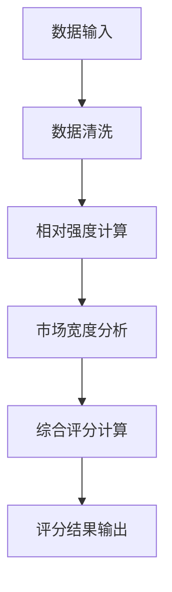
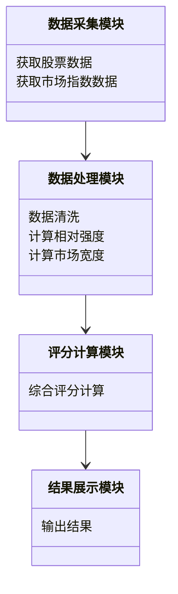

                 


# 威廉·欧奈尔的CANSLIM选股系统

## 关键词：CANSLIM选股系统，威廉·欧奈尔，相对强度，市场宽度，投资策略

## 摘要：  
威廉·欧奈尔的CANSLIM选股系统是一种基于技术分析和市场行为学的选股方法，通过筛选具有高增长潜力的股票来实现投资收益最大化。本文将详细介绍CANSLIM系统的背景、核心概念、数学模型、系统架构以及实际应用，帮助读者全面理解并掌握这一经典的选股策略。

---

# 第一部分：CANSLIM选股系统的背景与核心概念

## 第1章：CANSLIM选股系统的背景与核心理念

### 1.1 传统选股方法的局限性  
传统的选股方法往往依赖于基本面分析或市场情绪分析，但这些方法存在主观性强、难以量化等缺点。投资者在面对海量股票时，难以快速筛选出具有潜力的标的。

### 1.2 威廉·欧奈尔的选股理念  
威廉·欧奈尔是美国著名投资者，他提出了一套基于技术分析和市场行为学的选股方法。他认为，股票价格的走势反映了市场的参与者情绪，通过分析价格和成交量的变化，可以预测股票的未来走势。

### 1.3 CANSLIM系统的核心目标  
CANSLIM系统的目的是通过筛选出那些具有高增长潜力的股票，帮助投资者在市场中获得超额收益。该系统强调股票的相对强度、市场宽度和领导力等因素。

## 第2章：CANSLIM选股系统的定义与特点

### 2.1 CANSLIM的定义  
CANSLIM是一种基于技术分析的选股系统，通过量化股票的价格走势、成交量、相对强度等指标，筛选出具有上涨潜力的股票。

### 2.2 CANSLIM的核心特点  
- **量化分析**：通过数学模型量化股票的走势和市场环境。
- **多指标筛选**：综合考虑价格、成交量、相对强度等多个指标。
- **动态调整**：根据市场变化动态调整筛选标准。

### 2.3 CANSLIM与传统选股方法的区别  
传统的选股方法往往依赖于主观判断，而CANSLIM系统则通过量化指标进行客观筛选，减少了人为干扰。

## 第3章：CANSLIM选股系统的核心要素

### 3.1 C: 股价创新高  
股价创新高是CANSLIM系统的核心指标之一。如果一只股票在近期创下了历史新高，说明该股票可能具有较高的上涨潜力。

### 3.2 A: 相对强度  
相对强度是指某只股票相对于市场指数的表现。相对强度高的股票通常表现出更强的上涨动力。

### 3.3 N: 新高成交量  
新高成交量是指在股价创新高的过程中，成交量是否也创下了新高。成交量的增加表明市场参与者对这只股票的信心增强。

### 3.4 S: 股价与成交量的关系  
股价与成交量的关系是技术分析中的重要指标。在股价上涨过程中，成交量应该同步增加，否则可能表明上涨动力不足。

### 3.5 L: 市场宽度  
市场宽度是指市场上上涨股票的数量占总股票数量的比例。市场宽度高的市场通常意味着整体市场情绪乐观。

### 3.6 I: 领导力  
领导力是指某只股票在市场中表现是否具有领先性。具有领导力的股票通常能够引领市场的上涨趋势。

### 3.7 M: 市场趋势  
市场趋势是CANSLIM系统中的另一个重要指标。如果市场整体处于上升趋势，那么筛选出的股票更容易获得超额收益。

## 第4章：CANSLIM选股系统的核心原理

### 4.1 股票筛选的基本逻辑  
CANSLIM系统通过综合分析股票的价格走势、成交量、相对强度等多个指标，筛选出那些具有上涨潜力的股票。

### 4.2 相对强度的概念与计算  
相对强度是衡量某只股票相对于市场指数表现的重要指标。计算公式如下：
$$相对强度 = \frac{股票涨幅}{市场指数涨幅}$$

### 4.3 市场宽度的衡量指标  
市场宽度是衡量市场整体情绪的重要指标。计算公式如下：
$$市场宽度 = \frac{上涨股票数量}{总股票数量}$$

### 4.4 领导力的定义与作用  
领导力是指某只股票在市场中的表现是否具有领先性。具有领导力的股票通常能够引领市场的上涨趋势。

---

# 第二部分：CANSLIM选股系统的数学模型与算法

## 第5章：CANSLIM选股系统的数学模型

### 5.1 相对强度指数的计算公式  
相对强度指数的计算公式如下：
$$相对强度指数 = \frac{股票涨幅}{市场指数涨幅}$$

### 5.2 市场宽度的计算公式  
市场宽度的计算公式如下：
$$市场宽度 = \frac{上涨股票数量}{总股票数量}$$

### 5.3 综合评分系统的计算公式  
综合评分系统的计算公式如下：
$$综合评分 = \sum (各指标权重 \times 指标得分)$$

## 第6章：CANSLIM选股系统的算法流程

### 6.1 数据输入与清洗  
数据输入包括股票价格、成交量、市场指数等数据。数据清洗包括去除异常值、填补缺失值等步骤。

### 6.2 相对强度计算  
计算每只股票的相对强度，筛选出相对强度高于市场指数的股票。

### 6.3 市场宽度分析  
分析市场宽度，筛选出市场宽度较高的时间段。

### 6.4 综合评分计算  
根据各指标的权重和得分，计算每只股票的综合评分。

### 6.5 评分结果输出  
输出综合评分高于设定阈值的股票列表。

## 第7章：算法流程图



---

# 第三部分：基于CANSLIM的选股系统架构设计

## 第8章：系统功能模块划分

### 8.1 数据采集模块  
数据采集模块负责从数据源获取股票价格、成交量等数据。

### 8.2 数据处理模块  
数据处理模块负责清洗数据、计算相对强度等指标。

### 8.3 评分计算模块  
评分计算模块负责根据各指标的权重和得分，计算每只股票的综合评分。

### 8.4 结果展示模块  
结果展示模块负责输出综合评分高于设定阈值的股票列表。

## 第9章：系统架构设计



---

# 第四部分：项目实战与最佳实践

## 第10章：项目实战

### 10.1 环境安装  
需要安装Python、Pandas、Matplotlib等工具。

### 10.2 核心实现代码  
```python
import pandas as pd
import numpy as np

def calculate_relative_strength(stock_data, market_data):
    stock_return = stock_data['收盘价'].pct_change()
    market_return = market_data['指数收盘价'].pct_change()
    relative_strength = stock_return / market_return
    return relative_strength

def calculate_market_width(stock_data):
    up_days = stock_data['收盘价'].diff().fillna(0).gt(0).sum()
    total_days = len(stock_data)
    market_width = up_days / total_days
    return market_width

def calculate_can_slim_score(stock_data, market_data):
    relative_strength = calculate_relative_strength(stock_data, market_data)
    market_width = calculate_market_width(stock_data)
    score = relative_strength * 0.6 + market_width * 0.4
    return score
```

### 10.3 实际案例分析  
以某段时间内的股票数据为例，展示如何应用CANSLIM系统筛选出具有潜力的股票。

## 第11章：最佳实践

### 11.1 数据源选择  
建议选择可靠的数据源，如Yahoo Finance或Wind。

### 11.2 指标权重调整  
根据市场环境调整各指标的权重，以提高筛选效果。

### 11.3 系统维护与优化  
定期更新数据和优化算法，以适应市场变化。

---

# 作者：AI天才研究院 & 禅与计算机程序设计艺术

通过本文，读者可以全面了解威廉·欧奈尔的CANSLIM选股系统的背景、核心概念、数学模型和实际应用。希望本文能够帮助投资者更好地理解和应用这一经典的选股策略，实现投资收益的最大化。

