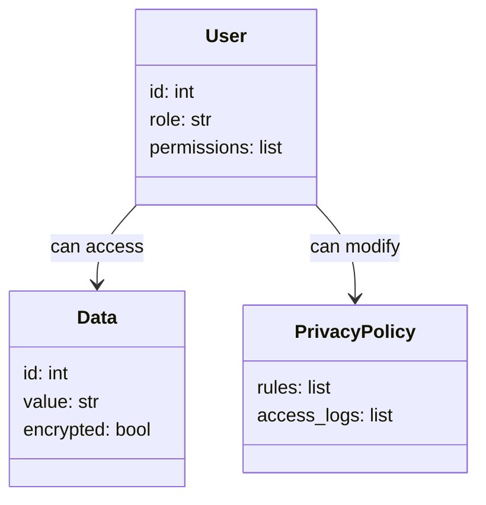
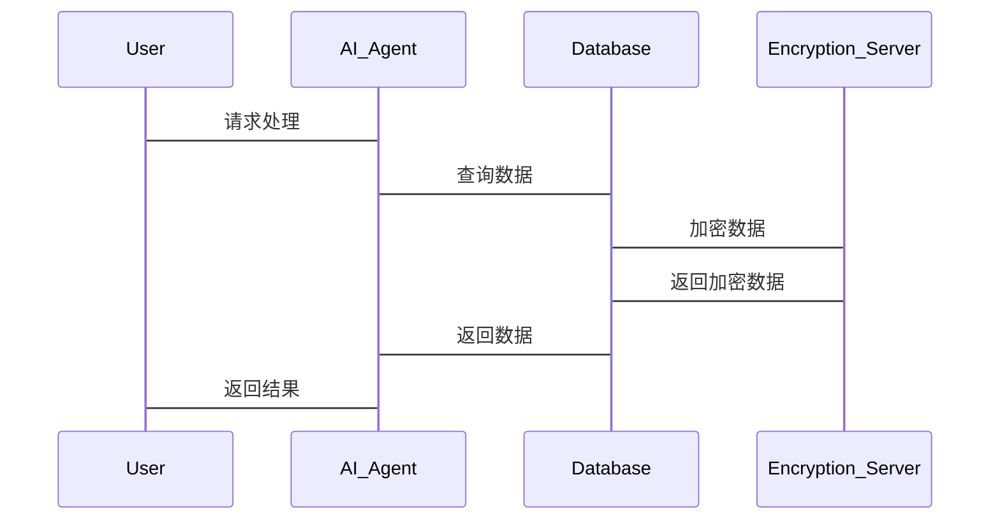

                 


# 安全与隐私保护：构建可信赖的AI Agent

> 关键词：AI Agent, 安全, 隐私保护, 可信赖系统, 数据加密, 差分隐私

> 摘要：本文详细探讨了构建可信赖的AI Agent所需的安全与隐私保护技术，涵盖核心概念、算法原理、系统设计与实战案例，旨在为技术开发者和研究人员提供全面的理论与实践指导。

---

## 第1章 安全与隐私保护的背景与问题分析

### 1.1 安全与隐私保护的背景

#### 1.1.1 数字化时代的安全与隐私挑战
在数字化时代，AI Agent广泛应用，但安全与隐私问题日益突出。数据泄露、恶意攻击等问题频发，威胁到系统的可信度。

#### 1.1.2 AI Agent在现代信息环境中的角色
AI Agent作为智能化工具，处理大量敏感数据，成为攻击者的主要目标。其安全性直接影响用户信任和数据安全。

#### 1.1.3 可信赖AI Agent的核心意义
可信赖AI Agent需具备安全性、隐私保护和可靠性，确保在各种场景下稳定运行，保护用户隐私和数据安全。

### 1.2 问题背景与问题描述

#### 1.2.1 AI Agent面临的安全威胁
- 数据泄露：未经授权访问敏感数据。
- 恶意攻击：通过漏洞破坏系统或窃取信息。
- 隐私侵犯：未授权收集和使用用户数据。

#### 1.2.2 隐私保护的必要性
隐私保护是用户的基本权利，AI Agent处理的数据可能包含敏感信息，必须确保其不被滥用。

#### 1.2.3 可信赖AI Agent的目标与边界
目标是构建安全、隐私保护的AI系统，边界包括数据处理、算法选择和系统设计。

### 1.3 问题解决与核心要素

#### 1.3.1 可信赖AI Agent的构建原则
- 安全性：防止未经授权访问和数据泄露。
- 隐私保护：确保数据处理符合隐私法规。
- 可追溯性：记录操作，便于审计和追踪。

#### 1.3.2 核心概念与技术框架
涉及数据安全、加密技术、隐私保护算法等，构建多层次防护体系。

#### 1.3.3 安全与隐私保护的实现路径
采用数据加密、访问控制、隐私保护技术，结合安全设计方法，构建可信系统。

### 1.4 本章小结
本章分析了AI Agent面临的安全与隐私挑战，明确了构建可信赖系统的必要性，并概述了解决方案和实现路径。

---

## 第2章 AI Agent的核心概念与原理

### 2.1 AI Agent的基本概念

#### 2.1.1 AI Agent的定义与分类
AI Agent是智能体，能感知环境并采取行动，分类包括简单反射、基于模型等。

#### 2.1.2 可信赖AI Agent的特性
具备安全性、隐私保护、可靠性和可解释性，确保用户信任和数据安全。

#### 2.1.3 AI Agent与人类交互的模式
通过自然语言处理与用户互动，需确保交互过程中的数据安全和隐私保护。

### 2.2 安全与隐私保护的核心概念

#### 2.2.1 安全性与隐私保护的定义
安全性指防止未经授权访问，隐私保护指确保数据处理符合隐私要求。

#### 2.2.2 数据安全与隐私保护的关键技术
包括加密技术、访问控制、隐私保护算法等，保护数据在存储和传输中的安全。

#### 2.2.3 可信赖AI Agent的安全与隐私模型
构建包括数据安全、隐私保护、访问控制的多层次模型，确保系统安全。

### 2.3 核心概念之间的关系

#### 2.3.1 AI Agent、安全与隐私保护的关系
AI Agent依赖安全和隐私保护技术，确保其功能和数据处理的可信度。

#### 2.3.2 数据流与隐私保护的实体关系图
使用ER图展示数据流中的实体关系，包括数据源、处理节点和用户。

#### 2.3.3 可视化ER实体关系图
```mermaid
erDiagram
    user ||--|{ many } data_record
    data_record ||--|{ one } privacy_policy
    user ||--|{ one } access_log
```

### 2.4 本章小结
本章详细介绍了AI Agent的核心概念和安全与隐私保护的关系，为后续技术分析奠定基础。

---

## 第3章 安全与隐私保护的核心技术原理

### 3.1 数据加密与隐私保护

#### 3.1.1 同态加密原理
同态加密允许在密文上进行计算，确保数据加密状态下仍能处理。

#### 3.1.2 隐私保护的数学模型
$$ E(x) = x \cdot e \mod p $$
$$ D(E(x)) = x \cdot e^{-1} \mod p $$

#### 3.1.3 数据加密的实现流程
1. 数据加密：使用公钥加密数据。
2. 数据处理：在密文上进行计算。
3. 结果解密：还原明文结果。

#### 3.1.4 同态加密的Python实现
```python
class HomomorphicEncryption:
    def __init__(self, p, e):
        self.p = p
        self.e = e

    def encrypt(self, x):
        return (x * self.e) % self.p

    def decrypt(self, enc):
        return (enc * pow(self.e, -1, self.p)) % self.p
```

### 3.2 差分隐私与数据脱敏

#### 3.2.1 差分隐私的定义与原理
差分隐私通过在数据中添加噪声，确保查询结果无法推断单个数据点。

#### 3.2.2 数据脱敏技术的实现
对敏感数据进行变形处理，如替换、遮盖等，防止数据泄露。

#### 3.2.3 差分隐私与数据脱敏的对比
| 技术 | 差分隐私 | 数据脱敏 |
|------|-----------|----------|
| 目标 | 防止数据推断 | 防止数据泄露 |
| 方法 | 添加噪声 | 数据变形 |

#### 3.2.4 差分隐私的Python实现
```python
import numpy as np

def add_noise(data, noise_level):
    noise = np.random.laplace(0, noise_level, data.shape)
    return data + noise
```

### 3.3 可信赖AI Agent的安全机制

#### 3.3.1 AI Agent的安全威胁分析
识别可能的安全威胁，如数据泄露、身份伪造等。

#### 3.3.2 安全机制的设计原则
- 最小权限原则：限制数据访问权限。
- 双因素认证：结合身份验证和授权。

#### 3.3.3 安全机制的实现
1. 数据访问控制：基于角色的访问控制（RBAC）。
2. 身份验证：多因素认证（MFA）。

### 3.4 本章小结
本章深入分析了数据加密、差分隐私和安全机制，为构建可信赖AI Agent提供了技术基础。

---

## 第4章 系统分析与架构设计

### 4.1 系统场景介绍

#### 4.1.1 问题场景
AI Agent在医疗、金融等领域的应用，需确保数据安全和隐私保护。

#### 4.1.2 系统介绍
设计一个AI Agent，处理敏感数据，确保其安全性和隐私保护。

### 4.2 系统功能设计

#### 4.2.1 领域模型类图


#### 4.2.2 系统架构设计


### 4.3 系统接口设计

#### 4.3.1 接口设计
- 用户接口：处理用户请求和反馈。
- 数据接口：与数据库交互，确保数据加密。
- 隐私接口：执行隐私政策，记录日志。

#### 4.3.2 接口实现
使用RESTful API，定义明确的端点和请求格式。

### 4.4 系统交互流程

#### 4.4.1 序列图


### 4.5 本章小结
本章通过系统设计和架构分析，展示了如何构建可信赖的AI Agent，确保其安全和隐私保护。

---

## 第5章 项目实战：构建可信赖的医疗AI Agent

### 5.1 环境安装

#### 5.1.1 安装Python和依赖
```bash
pip install numpy scikit-learn flask
```

### 5.2 核心代码实现

#### 5.2.1 数据加密模块
```python
class MedicalDataEncryption:
    def __init__(self, key):
        self.key = key

    def encrypt(self, data):
        return data ^ self.key

    def decrypt(self, enc_data):
        return enc_data ^ self.key
```

#### 5.2.2 隐私保护模块
```python
class PrivacyProtection:
    def __init__(self, epsilon):
        self.epsilon = epsilon

    def add_noise(self, data):
        noise = np.random.laplace(0, self.epsilon, data.shape)
        return data + noise
```

### 5.3 案例分析与解读

#### 5.3.1 系统功能实现
AI Agent在医疗场景中，处理患者数据，确保加密和隐私保护。

#### 5.3.2 测试与验证
测试加密和隐私保护模块，确保数据安全和隐私保护有效。

### 5.4 项目总结

#### 5.4.1 成果总结
成功构建可信赖的医疗AI Agent，确保数据安全和隐私保护。

#### 5.4.2 经验与不足
经验：模块化设计和严格的安全措施。不足：性能优化和用户体验提升。

### 5.5 本章小结
通过实战案例，展示了如何构建可信赖的AI Agent，并总结了经验与改进建议。

---

## 第6章 最佳实践与总结

### 6.1 最佳实践

#### 6.1.1 安全性
- 实施最小权限原则，限制数据访问。
- 定期安全审计和漏洞扫描。

#### 6.1.2 隐私保护
- 采用同态加密和差分隐私技术。
- 遵守数据隐私法规，如GDPR。

#### 6.1.3 可靠性
- 设计容错机制，确保系统稳定。
- 建立数据备份和恢复机制。

### 6.2 小结

### 6.3 注意事项

#### 6.3.1 安全与隐私的平衡
在确保安全的同时，保持系统的可用性和用户体验。

#### 6.3.2 遵守法律法规
确保系统设计符合相关隐私保护法规。

### 6.4 拓展阅读

#### 6.4.1 推荐书籍
- 《数据加密与隐私保护》
- 《AI系统安全设计》

#### 6.4.2 推荐论文
- 同态加密在AI中的应用
- 差分隐私技术研究进展

---

## 作者

作者：AI天才研究院/AI Genius Institute & 禅与计算机程序设计艺术 /Zen And The Art of Computer Programming

---

本文详细探讨了构建可信赖的AI Agent所需的安全与隐私保护技术，结合理论分析和实战案例，为技术开发者和研究人员提供了全面的指导。

