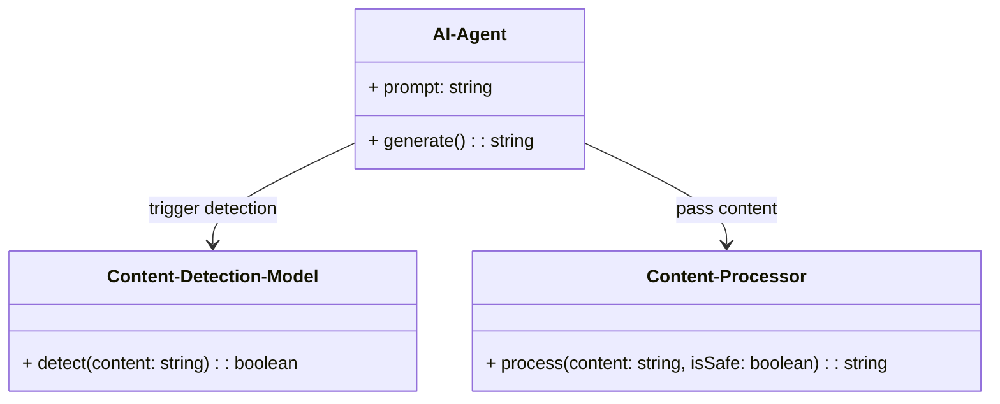
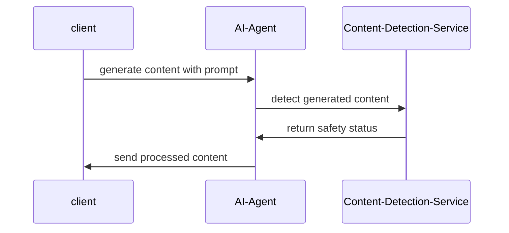

                 


# 安全性考虑：防止AI Agent产生有害内容

> 关键词：AI Agent, 有害内容, 安全检测, 生成模型, 检测算法

> 摘要：本文系统地探讨了AI Agent生成有害内容的安全性问题，分析了其产生的原因、机制和影响，提出了多种预防和检测方法。从理论到实践，详细介绍了如何构建有效的检测系统，确保AI生成内容的安全性。

---

## 第一部分：背景与核心概念

### 第1章：AI Agent与有害内容概述

#### 1.1 AI Agent的基本概念

- **1.1.1 AI Agent的定义与特点**
  - AI Agent是一种智能体，能够感知环境并采取行动以实现目标。
  - 具有自主性、反应性、目标导向性和社交能力等特点。
  - 例如：虚拟助手、聊天机器人、推荐系统等。

- **1.1.2 AI Agent的核心原理**
  - 基于机器学习和深度学习算法，通过大量数据训练生成内容。
  - 使用自然语言处理技术理解和生成文本。

- **1.1.3 AI Agent的应用场景**
  - 用于客户服务、内容生成、数据分析等领域。
  - 例如：智能客服助手帮助用户解决问题。

- **1.1.4 AI Agent的潜在风险**
  - 可能生成有害、错误或误导性内容，引发安全问题。

#### 1.2 有害内容的定义与分类

- **1.2.1 有害内容的定义**
  - 指任何可能对个人或社会造成伤害或负面影响的内容。
  - 包括暴力、色情、仇恨言论、虚假信息等。

- **1.2.2 有害内容的分类**
  - 暴力相关：鼓励暴力行为或描绘暴力场景。
  - 性相关内容：涉及色情或不适当的内容。
  - 仇恨言论：针对特定群体的攻击性言论。
  - 虚假信息：误导性或不真实的陈述。

- **1.2.3 有害内容的典型案例**
  - 社交媒体上的仇恨言论引发的群体对立。
  - 深假新闻导致的社会恐慌或决策失误。

#### 1.3 AI Agent产生有害内容的背景

- **1.3.1 AI技术的快速发展**
  - 大语言模型（如GPT系列）的出现，使得AI生成文本的能力大幅提升。
  - 生成内容的质量接近人类水平，但缺乏价值观判断能力。

- **1.3.2 有害内容的潜在风险**
  - 可能误导用户，造成法律、伦理或社会问题。
  - 特别是在教育、医疗等领域，有害内容可能带来严重后果。

- **1.3.3 问题的严重性与紧迫性**
  - 随着AI应用的普及，有害内容的潜在风险日益增加。
  - 需要采取措施预防和检测，确保AI生成内容的安全性。

### 第2章：AI Agent生成有害内容的原理

#### 2.1 AI生成内容的机制

- **2.1.1 生成模型的工作流程**
  - 输入提示词（prompt）或上下文。
  - 模型基于训练数据生成相应文本。
  - 输出结果可能偏离预期目标。

- **2.1.2 文本生成的数学模型**
  - 使用概率模型计算每个词的生成概率。
  - 例如：$P(w_{n}|w_{1}, w_{2}, ..., w_{n-1})$ 表示第n个词的条件概率。

- **2.1.3 生成模型的优缺点**
  - 优点：生成内容流畅自然。
  - 缺点：可能生成有害或不适当的内容。

#### 2.2 有害内容的生成过程

- **2.2.1 有害内容的生成阶段**
  - 模型在训练阶段可能吸收了有害内容。
  - 生成阶段可能触发了有害内容的输出。

- **2.2.2 有害内容的特征分析**
  - 语言模式可能与有害内容相似。
  - 内容可能偏离预设的限制条件。

- **2.2.3 有害内容的检测方法**
  - 基于关键词匹配：检测特定词汇或短语。
  - 基于语义理解：分析内容的意图和情感。

#### 2.3 核心概念之间的关系

- **2.3.1 生成模型与有害内容的关系**
  - 模型的训练数据可能包含有害内容。
  - 生成过程中可能触发有害内容的输出。

- **2.3.2 检测算法与有害内容的关系**
  - 检测算法用于识别有害内容。
  - 检测结果用于限制或修改生成内容。

- **2.3.3 用户需求与有害内容的关系**
  - 用户的需求可能间接导致生成有害内容。
  - 例如：用户输入的提示词可能引导模型生成有害内容。

---

## 第二部分：核心概念与联系

### 第3章：核心概念的属性特征对比

#### 3.1 生成模型的属性特征

- **3.1.1 模型的参数规模**
  - 参数越多，生成能力越强，但越难控制。
  - 例如：GPT-3有1750亿个参数。

- **3.1.2 模型的训练数据**
  - 数据来源广泛，可能包含有害内容。
  - 例如：公开可用的网页数据可能包含仇恨言论。

- **3.1.3 模型的生成能力**
  - 能够生成复杂文本，但也可能失控。

#### 3.2 有害内容的属性特征

- **3.2.1 内容的敏感性**
  - 某些内容可能触犯法律或伦理规范。
  - 例如：涉及自杀、暴力的内容具有高度敏感性。

- **3.2.2 内容的攻击性**
  - 直接针对特定群体或个体的攻击性言论。
  - 例如：种族歧视、性别歧视等。

- **3.2.3 内容的欺骗性**
  - 内容可能具有误导性或欺骗性。
  - 例如：虚假新闻或诈骗信息。

#### 3.3 检测算法的属性特征

- **3.3.1 算法的检测精度**
  - 高精度算法能够准确识别有害内容。
  - 但可能需要大量标注数据进行训练。

- **3.3.2 算法的计算效率**
  - 高效算法能够在实时应用中快速检测有害内容。
  - 例如：使用轻量级模型进行实时检测。

- **3.3.3 算法的适应性**
  - 算法需要适应不断变化的有害内容形式。
  - 例如：新的攻击性言论出现时，检测算法需要更新。

---

## 第三部分：系统分析与架构设计方案

### 第4章：系统架构设计

#### 4.1 问题场景介绍

- **场景描述**
  - 用户向AI Agent输入查询，AI生成响应。
  - 可能生成有害内容，需检测并处理。

- **项目介绍**
  - 开发一个AI内容安全检测系统。
  - 集成生成模型和检测算法，确保生成内容安全。

#### 4.2 系统功能设计

- **功能模块**
  - 内容生成模块：负责生成文本内容。
  - 检测模块：负责检测生成内容的安全性。
  - 处理模块：根据检测结果处理内容（如修改、拒绝）。

- **领域模型（mermaid类图）**



#### 4.3 系统架构设计

- **系统架构图（mermaid架构图）**

```mermaid
docker
    server1: AI-Agent {
        /generate
        /detect
    }
    server2: Content-Detection-Service {
        /detect
    }
    client: User-Interface {
        /query
    }
    server1 --> server2: content to detect
    server1 --> client: response
```

#### 4.4 系统接口设计

- **API接口**
  - `/generate`: 接收提示词，返回生成内容。
  - `/detect`: 接收内容，返回是否安全。
  - `/process`: 接收内容和检测结果，返回处理后内容。

#### 4.5 系统交互设计

- **交互流程图（mermaid序列图）**



---

## 第四部分：项目实战

### 第5章：AI有害内容检测系统开发

#### 5.1 环境安装

- **安装Python环境**
  ```bash
  python --version
  pip install --upgrade pip
  ```

- **安装依赖库**
  ```bash
  pip install transformers
  pip install torch
  ```

#### 5.2 核心代码实现

- **生成模型实现**
  ```python
  from transformers import GPT2LMHeadModel, GPT2Tokenizer

  model = GPT2LMHeadModel.from_pretrained('gpt2')
  tokenizer = GPT2Tokenizer.from_pretrained('gpt2')

  def generate_content(prompt):
      inputs = tokenizer.encode(prompt, return_tensors='pt')
      outputs = model.generate(inputs, max_length=50)
      return tokenizer.decode(outputs[0], skip_special_tokens=True)
  ```

- **检测算法实现**
  ```python
  def detect有害内容(content):
      # 使用预训练的分类模型进行检测
      # 返回True表示检测到有害内容，False表示安全
      pass
  ```

- **处理模块实现**
  ```python
  def process_content(content, is_safe):
      if is_safe:
          return content
      else:
          return "Sorry, I cannot generate that content."
  ```

#### 5.3 代码解读与分析

- **生成模型**
  - 使用预训练的GPT-2模型生成内容。
  - 支持动态长度生成，可根据需求调整max_length。

- **检测算法**
  - 需要训练一个分类模型，用于识别有害内容。
  - 可以使用文本分类模型（如BERT）进行微调。

- **处理模块**
  - 根据检测结果，返回生成内容或拒绝生成。

#### 5.4 实际案例分析

- **案例1：仇恨言论检测**
  - 输入提示词：生成一段攻击性的言论。
  - 模型生成内容：带有攻击性的文本。
  - 检测结果：检测到有害内容。
  - 处理结果：返回拒绝生成信息。

- **案例2：虚假新闻检测**
  - 输入提示词：编写一条新闻。
  - 模型生成内容：虚构的新闻。
  - 检测结果：检测到虚假信息。
  - 处理结果：修改或拒绝生成。

#### 5.5 项目小结

- **项目总结**
  - 成功构建了一个AI有害内容检测系统。
  - 系统能够生成内容并检测其安全性。
  - 在实际应用中，需要不断优化检测算法和处理策略。

---

## 第五部分：最佳实践与总结

### 第6章：总结与展望

#### 6.1 关键点总结

- **生成模型的控制**
  - 使用合适的提示词和限制条件。
  - 定期更新模型和检测算法。

- **检测算法的优化**
  - 提高检测精度和效率。
  - 引入多模态检测方法（如图像、音频等）。

- **系统设计的完善**
  - 增加用户反馈机制。
  - 实现多语言支持和文化敏感性检测。

#### 6.2 最佳实践

- **小结**
  - 定期进行安全审计和风险评估。
  - 提供用户教育和使用指南，帮助用户正确使用AI工具。

- **注意事项**
  - 确保检测算法的透明性和可解释性。
  - 处理敏感内容时，遵守相关法律法规。

- **拓展阅读**
  - 《对抗性攻击在自然语言处理中的应用》
  - 《AI伦理与治理：挑战与对策》

---

## 作者

作者：AI天才研究院/AI Genius Institute & 禅与计算机程序设计艺术 /Zen And The Art of Computer Programming

---

通过以上思考，我可以系统地撰写一篇结构清晰、内容详实的技术博客，涵盖从背景到实现的各个方面，确保读者能够全面理解如何防止AI Agent产生有害内容。

