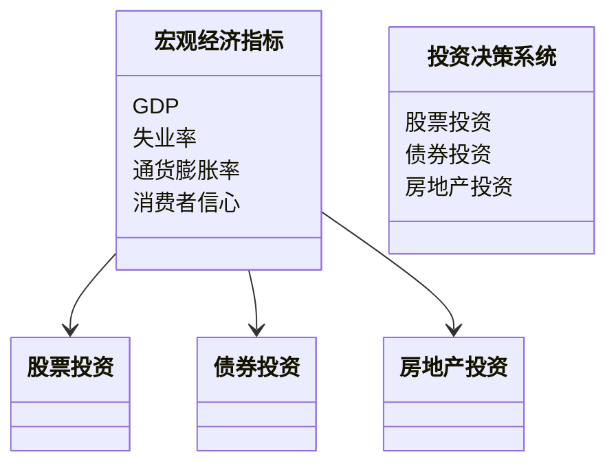
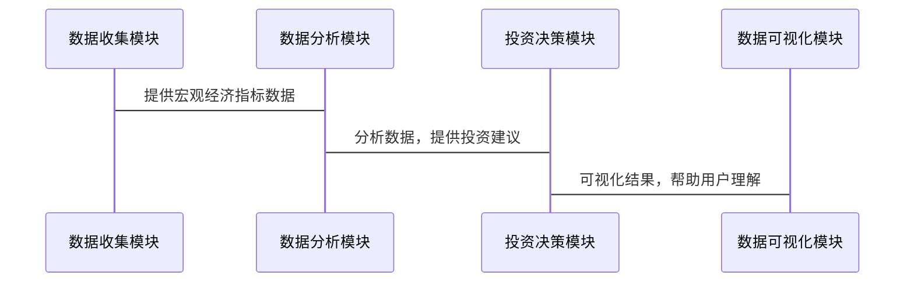

                 


# 宏观经济指标对投资决策的影响

## 关键词：宏观经济指标，投资决策，GDP，通货膨胀率，失业率，经济周期，风险管理

## 摘要：本文探讨宏观经济指标如何影响投资决策，分析主要宏观经济指标及其对不同类型投资的影响，结合数学模型和系统设计，展示如何利用这些指标进行有效投资决策。

---

## 第一章: 宏观经济指标与投资决策的背景

### 1.1 宏观经济指标的基本概念

#### 1.1.1 宏观经济指标的定义与分类

宏观经济指标是衡量整体经济状况的关键数据，分为总量指标（如GDP）、结构指标（如失业率）和价格指标（如通货膨胀率）。这些指标帮助投资者理解经济趋势，做出投资决策。

#### 1.1.2 宏观经济指标与投资决策的关系

宏观经济指标影响投资环境，投资者通过分析这些指标评估市场风险和收益潜力。例如，GDP增长预示经济繁荣，可能推高股市表现。

#### 1.1.3 宏观经济分析在投资中的重要性

宏观经济分析帮助投资者识别经济周期，制定投资策略。例如，在经济衰退期，债券可能比股票更安全。

### 1.2 宏观经济指标的主要类型

#### 1.2.1 GDP与GDP平减指数

GDP衡量经济总产出，GDP平减指数消除价格变化影响，显示实际经济增长。例如，GDP增长3%可能意味着经济扩张。

#### 1.2.2 失业率与劳动力市场

失业率反映就业市场健康，高失业率可能导致消费者支出下降，影响企业利润和股价。

#### 1.2.3 利率与货币政策

利率影响借贷成本和投资回报。低利率可能促使更多资金流入股市，推高股价。

#### 1.2.4 通货膨胀率与物价水平

高通货膨胀率可能侵蚀投资回报，尤其是固定收益投资，如债券。

#### 1.2.5 消费者信心指数与市场情绪

消费者信心影响消费支出，进而影响企业收益和股价。高信心指数可能预示股市上涨。

### 1.3 宏观经济指标的收集与分析方法

#### 1.3.1 数据来源与可靠性

数据来源包括政府统计部门、国际组织（如IMF、世界银行）和金融市场数据供应商。可靠性取决于数据收集方法和发布机构的信誉。

#### 1.3.2 数据分析的基本方法

常用方法包括趋势分析、同比和环比分析。例如，比较当前季度GDP与上季度的环比增长率。

#### 1.3.3 数据可视化与图表分析

使用折线图展示GDP趋势，柱状图比较不同地区的失业率，饼图显示经济结构中各产业的占比。

---

## 第二章: 宏观经济指标对投资决策的核心影响

### 2.1 宏观经济环境对投资的影响

#### 2.1.1 经济周期与投资决策

经济周期分为衰退、复苏、增长和衰退。投资者在不同阶段调整资产配置，如股市在复苏期可能表现较好。

#### 2.1.2 经济政策对投资的影响

货币政策和财政政策影响市场。例如，央行降低利率可能刺激投资和消费。

#### 2.1.3 国际经济环境与全球化

国际贸易和汇率变化影响跨国投资。例如，人民币升值可能影响外资流入中国股市。

### 2.2 宏观经济指标对不同类型投资的影响

#### 2.2.1 股票投资与宏观经济指标

高GDP增长和低失业率通常伴随股市上涨。例如，GDP增长超过预期可能推动股市上扬。

#### 2.2.2 债券投资与宏观经济指标

高通货膨胀率和高利率通常不利于债券投资，因为债券价格可能下跌，而利率上升会增加债券收益率。

#### 2.2.3 房地产投资与宏观经济指标

低失业率和高GDP增长可能推高房价，但高利率可能增加房贷负担，抑制房地产投资。

### 2.3 宏观经济指标对风险评估的作用

#### 2.3.1 风险因素的宏观经济分析

宏观经济风险包括经济衰退、通货膨胀和利率变化。例如，经济衰退可能增加企业违约风险。

#### 2.3.2 风险定价与宏观经济指标

投资者根据宏观经济指标评估风险，调整资产定价。例如，高通胀可能导致债券收益率上升。

#### 2.3.3 风险管理中的宏观经济考量

投资者通过多元化投资分散风险，同时关注宏观经济指标变化，及时调整投资组合。

---

## 第三章: 宏观经济指标分析的数学模型与公式

### 3.1 宏观经济指标的基本数学模型

#### 3.1.1 GDP计算公式

GDP = C + I + G + X - M

其中，C为消费，I为投资，G为政府支出，X为出口，M为进口。

#### 3.1.2 失业率计算公式

失业率 = (失业人口 / 劳动力总数) × 100%

#### 3.1.3 通货膨胀率计算公式

通货膨胀率 = [(当前物价指数 - 前期物价指数) / 前期物价指数] × 100%

### 3.2 投资决策中的回归分析模型

#### 3.2.1 线性回归模型

股票收益与GDP增长的回归方程：Ri = α + β * GDP + ε

其中，α为截距，β为回归系数，ε为误差项。

#### 3.2.2 多元回归模型

Ri = α + β1 * GDP + β2 * 利率 + β3 * 消费者信心 + ε

#### 3.2.3 回归分析在投资中的应用

通过回归分析，投资者可以预测不同宏观经济指标对资产收益的影响，优化投资组合。

### 3.3 时间序列分析与宏观经济预测

#### 3.3.1 时间序列的基本概念

时间序列数据按时间顺序排列，用于分析趋势、季节性变化和周期性波动。

#### 3.3.2 ARIMA模型

ARIMA(p, d, q)模型用于预测时间序列数据。p为自回归阶数，d为差分阶数，q为移动平均阶数。

#### 3.3.3 模型在宏观经济预测中的应用

使用ARIMA模型预测未来GDP增长，帮助投资者做出投资决策。

---

## 第四章: 宏观经济指标与投资决策的系统分析

### 4.1 系统功能设计

#### 4.1.1 领域模型（Mermaid类图）



#### 4.1.2 系统架构设计（Mermaid架构图）


#### 4.1.3 系统交互设计（Mermaid序列图）



### 4.2 项目实战

#### 4.2.1 环境安装

需要安装Python、Pandas、Matplotlib和statsmodels库，用于数据处理和分析。

#### 4.2.2 核心实现源代码

```python
import pandas as pd
import numpy as np
import matplotlib.pyplot as plt
from statsmodels.tsa.arima_model import ARIMA

# 示例数据加载
data = pd.read_csv('macroeconomic_indicators.csv')

# 数据分析与可视化
plt.plot(data['GDP'], label='GDP')
plt.title('GDP Growth Trend')
plt.xlabel('Year')
plt.ylabel('GDP')
plt.legend()
plt.show()

# 使用ARIMA模型进行预测
model = ARIMA(data['GDP'], order=(1, 1, 1))
model_fit = model.fit()
future_forecast = model_fit.forecast(steps=5)
print('未来5年的GDP预测值:', future_forecast)
```

#### 4.2.3 案例分析

以美国为例，分析2020年疫情对GDP和失业率的影响。结果显示，疫情导致GDP下降和失业率上升，影响投资决策。

#### 4.2.4 代码应用解读与分析

上述代码展示了如何使用Python进行宏观经济数据的分析和预测，帮助投资者做出基于数据的决策。

### 4.3 最佳实践 tips

- 定期更新数据，保持模型准确性。
- 结合多个宏观经济指标进行综合分析，避免单一指标误导。
- 在投资决策中考虑宏观经济指标的滞后性和前瞻性。

---

## 小结

宏观经济指标对投资决策具有重要影响，投资者应关注关键指标的变化，结合数学模型和系统分析，制定科学的投资策略。通过本文的分析，读者可以更好地理解如何利用宏观经济指标优化投资组合，降低风险，提高收益。

---

## 作者：AI天才研究院/AI Genius Institute & 禅与计算机程序设计艺术 /Zen And The Art of Computer Programming

