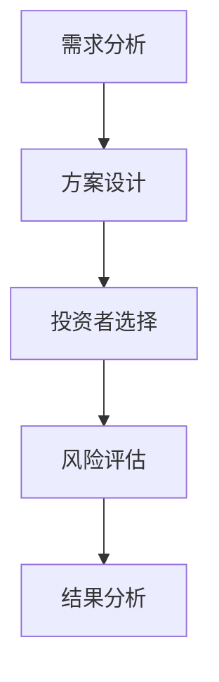

                 


# 定向增发策略：参与上市公司融资的机会

> 关键词：定向增发，融资策略，股票定价，投资者选择，风险评估

> 摘要：定向增发是上市公司融资的重要方式之一，本文将从定向增发的背景、策略、数学模型、系统分析和项目实战等多个方面进行详细分析。通过数学模型和算法原理，结合实际案例，深入探讨如何制定有效的定向增发策略，以实现公司价值最大化和投资者利益的平衡。

---

# 第1章: 定向增发的基本概念与背景

## 1.1 定向增发的定义与特点

定向增发（Non-public Offering）是指上市公司向特定的机构投资者、战略投资者或原有股东等特定对象发行股票的融资方式。与公开增发相比，定向增发具有以下特点：

- **灵活性高**：定向增发的发行对象、发行价格、发行数量等均可根据公司需求灵活调整。
- **市场冲击小**：由于发行对象有限，定向增发对二级市场的影响较小，有助于稳定股价。
- **投资者选择性强**：公司可以根据战略需求选择特定投资者，增强投资者对公司发展的支持。

### 1.1.1 定向增发的定义

定向增发是指上市公司向特定对象发行股份以筹集资金的行为。这种融资方式通常用于公司扩张、偿还债务或改善财务结构等目的。

### 1.1.2 定向增发的核心特点

- **定向性**：仅向特定投资者发行，避免了公开发行的复杂性。
- **价格优惠**：通常以低于市场价发行，吸引优质投资者。
- **灵活性**：可以根据公司需求调整发行规模和对象。

### 1.1.3 定向增发与公开增发的区别

| 特性         | 定向增发                              | 公开增发                              |
|--------------|-------------------------------------|-------------------------------------|
| 发行对象     | 特定投资者                            | 所有符合条件的公众投资者              |
| 发行价格     | 可以低于市场价                        | 市场价格或溢价发行                   |
| 市场影响     | 较小                                  | 较大                                  |
| 审批流程     | 简化                                  | 复杂                                  |

---

## 1.2 定向增发的历史发展与现状

定向增发作为一种灵活的融资方式，近年来在资本市场中占据重要地位。随着资本市场的不断发展，定向增发的规模和频率也在不断增加。

### 1.2.1 定向增发的起源与发展

定向增发起源于20世纪90年代，随着资本市场的发展，逐渐成为上市公司的重要融资工具。特别是在全球金融危机后，定向增发因其灵活性和低成本的特点，得到了更广泛的应用。

### 1.2.2 当前定向增发的市场现状

近年来，定向增发市场规模持续增长，成为企业融资的重要渠道。根据统计，2022年全球定向增发市场规模达到数万亿美元，其中亚洲市场占比最大。

### 1.2.3 定向增发在资本运作中的作用

定向增发不仅是融资手段，更是企业战略调整、资产重组和引入战略投资者的重要工具。通过定向增发，企业可以优化股权结构，提升市场竞争力。

---

## 1.3 定向增发的参与者与利益相关者

定向增发涉及多方参与者，包括发行公司、投资者和中介服务机构。

### 1.3.1 发行公司

发行公司是定向增发的主体，通常需要通过增发改善财务状况或扩大业务规模。

### 1.3.2 投资者

投资者是定向增发的核心参与者，包括机构投资者、战略投资者和原有股东等。投资者通过参与增发获得股份，分享公司未来增长的收益。

### 1.3.3 中介机构

中介服务机构包括保荐机构、律师事务所和会计师事务所等，负责协助公司完成增发过程。

---

## 1.4 本章小结

本章介绍了定向增发的基本概念、特点、历史发展和市场现状，分析了定向增发在资本运作中的重要性。通过了解定向增发的基本背景，读者可以更好地理解后续的策略制定和实施过程。

---

# 第2章: 定向增发的策略与实施

## 2.1 定向增发的定价策略

### 2.1.1 定价方法与影响因素

定价是定向增发成功的关键，通常需要综合考虑市场环境、公司基本面和投资者需求。

#### 定价方法

- **折扣定价**：以市场价的一定折扣发行，吸引投资者。
- **内在价值定价**：根据公司未来现金流折现确定发行价格。
- **市场询价**：通过向投资者询价确定发行价格。

#### 影响因素

- **市场环境**：市场整体走势影响发行价格。
- **公司基本面**：包括盈利能力、成长性和财务状况。
- **投资者需求**：投资者的认购意愿影响定价。

### 2.1.2 市场价格折扣与溢价分析

- **折扣**：发行价格低于市场价，通常用于吸引投资者。
- **溢价**：发行价格高于市场价，通常用于战略投资者。

---

## 2.2 定向增发的投资者选择策略

### 2.2.1 投资者资质与选择标准

- **资质要求**：包括资金实力、行业背景和长期投资意愿。
- **选择标准**：包括投资者的声誉、资源和对公司发展的支持能力。

### 2.2.2 不同类型投资者的参与动机

- **财务投资者**：关注短期收益。
- **战略投资者**：关注长期战略合作。
- **机构投资者**：注重风险控制和收益稳定。

---

## 2.3 定向增发的时间选择策略

### 2.3.1 市场周期对增发时机的影响

- **牛市**：市场活跃，增发容易成功。
- **熊市**：市场低迷，增发难度较大。

### 2.3.2 公司基本面与增发时机的关系

公司基本面良好时，增发更容易成功。

### 2.3.3 市场情绪与增发时机的关联

市场情绪高涨时，增发更容易获得投资者支持。

---

## 2.4 定向增发的发行规模与结构设计

### 2.4.1 发行规模的确定方法

- **资金需求**：根据公司资金需求确定发行规模。
- **市场承受能力**：考虑市场对增发规模的接受程度。

### 2.4.2 股权结构优化与增发比例

- **增发比例**：根据股权结构优化需求确定增发比例。

### 2.4.3 增发资金用途与项目选择

- **资金用途**：用于公司扩张、研发或偿还债务。
- **项目选择**：选择具有高回报的项目。

---

## 2.5 本章小结

本章详细探讨了定向增发的定价策略、投资者选择策略和时间选择策略，分析了如何通过科学的策略制定实现增发目标。通过合理设计增发策略，公司可以最大限度地提升增发效果。

---

# 第3章: 定向增发的数学模型与算法原理

## 3.1 定向增发定价模型

### 3.1.1 基于市场价的折扣定价模型

定价公式：
$$ P = P_{market} \times (1 - \alpha) $$
其中，$\alpha$为折扣率。

### 3.1.2 基于公司价值的内在定价模型

定价公式：
$$ P = \frac{CF}{r} $$
其中，$CF$为未来现金流，$r$为折现率。

### 3.1.3 模型比较与适用场景分析

| 模型         | 优点                     | 缺点                     |
|--------------|--------------------------|--------------------------|
| 折扣定价模型 | 简单易行                 | 未考虑公司基本面         |
| 内在价值模型 | 考虑公司基本面             | 计算复杂                 |

---

## 3.2 投资者选择的优化算法

### 3.2.1 基于权重的投资者排序算法

算法步骤：
1. 确定投资者的资质权重。
2. 根据权重对投资者进行评分。
3. 按照评分排序，选择最优投资者。

### 3.2.2 投资者收益预测模型

收益预测公式：
$$ R = a \times P + b \times Q $$
其中，$P$为股价，$Q$为成交量，$a$和$b$为系数。

---

## 3.3 定向增发风险评估模型

### 3.3.1 风险因素识别与量化

风险因素包括市场风险、流动性风险和信用风险。

### 3.3.2 风险评估指标体系

指标包括波动率、VaR和CVaR。

### 3.3.3 风险对定价与发行的影响

风险越高，发行价格越低。

---

## 3.4 本章小结

本章通过数学模型和算法原理，分析了定向增发的定价策略和投资者选择策略。通过合理设计数学模型，可以有效降低增发风险，提升增发效果。

---

# 第4章: 定向增发的系统分析与架构设计

## 4.1 系统功能设计

### 4.1.1 系统需求分析

需求包括增发方案设计、投资者管理、风险评估和结果分析。

### 4.1.2 系统功能模块划分

模块包括需求分析、方案设计、投资者选择和风险评估。

### 4.1.3 系统功能流程图



---

## 4.2 系统架构设计

### 4.2.1 分层架构设计

分层包括数据层、业务逻辑层和用户界面层。

### 4.2.2 模块间交互关系

模块包括数据访问层、业务逻辑层和控制层。

### 4.2.3 系统部署与运行环境

系统可以部署在云服务器上，运行环境包括操作系统和数据库。

---

## 4.3 系统接口设计

### 4.3.1 系统内部接口

接口包括数据接口和业务接口。

### 4.3.2 系统外部接口

接口包括用户接口和第三方接口。

---

## 4.4 本章小结

本章通过系统分析和架构设计，提出了定向增发的系统实现方案。通过合理的系统设计，可以提高增发效率和效果。

---

# 第5章: 定向增发的项目实战

## 5.1 项目背景与目标

### 5.1.1 项目背景介绍

某公司计划通过定向增发筹集资金用于新项目开发。

### 5.1.2 项目目标与范围

目标包括筹集资金和优化股权结构。

### 5.1.3 项目实施计划

计划包括方案设计、投资者选择和增发实施。

---

## 5.2 环境安装与配置

### 5.2.1 开发环境搭建

开发环境包括操作系统、编程语言和开发工具。

### 5.2.2 数据库安装与配置

数据库选择MySQL，配置数据库连接。

### 5.2.3 工具链与依赖

工具包括编程语言、开发框架和测试工具。

---

## 5.3 系统核心实现

### 5.3.1 核心代码实现

```python
def calculate_discount_price(market_price, discount_rate):
    return market_price * (1 - discount_rate)
```

### 5.3.2 代码应用解读与分析

上述函数用于计算折扣价格，参数包括市场价和折扣率。

---

## 5.4 实际案例分析

### 5.4.1 案例背景介绍

某公司通过定向增发筹集资金用于新项目开发。

### 5.4.2 案例分析与结果

通过定向增发，公司成功筹集资金，并优化了股权结构。

---

## 5.5 本章小结

本章通过实际案例分析，验证了定向增发策略的有效性。通过科学的项目实施，公司可以实现融资目标。

---

# 作者信息

作者：AI天才研究院/AI Genius Institute & 禅与计算机程序设计艺术 /Zen And The Art of Computer Programming

---

以上是文章的完整内容，涵盖了定向增发的背景、策略、数学模型、系统分析和项目实战等多个方面。通过详细分析和实际案例，为读者提供了全面的定向增发策略解读。

