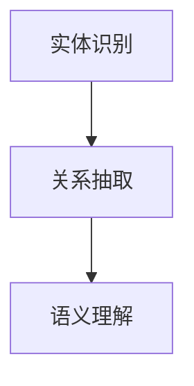
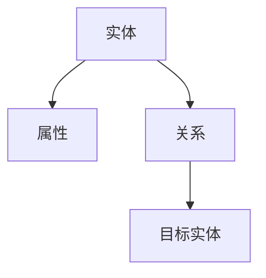
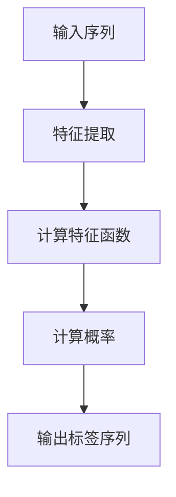
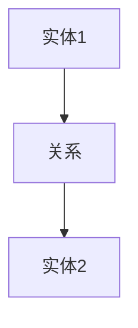
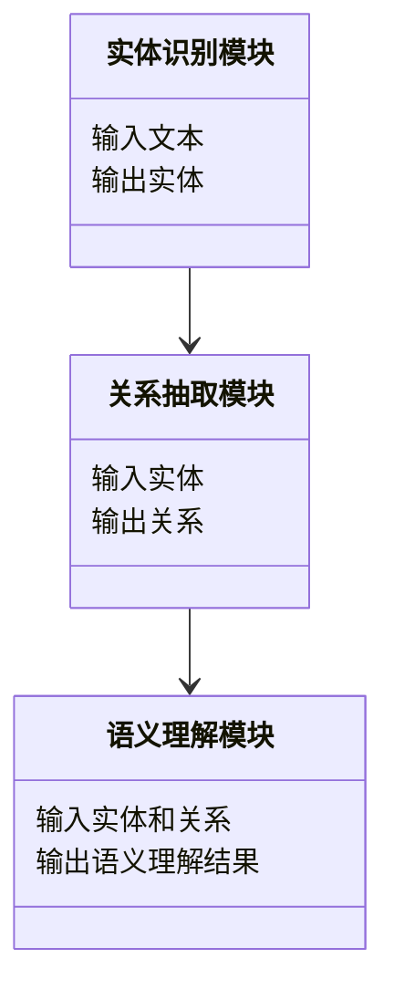
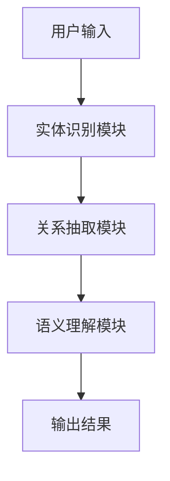
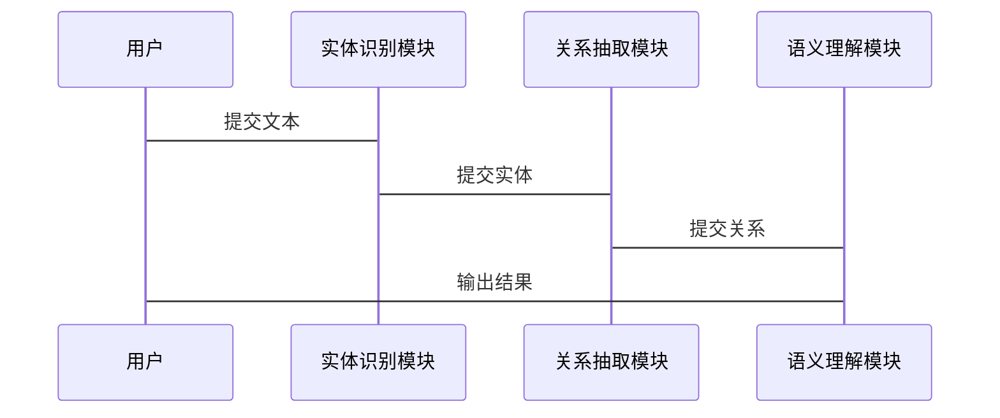

                 


# 实体识别与关系抽取：增强AI Agent的理解深度

> 关键词：实体识别，关系抽取，自然语言处理，AI Agent，深度学习，条件随机场（CRF），系统架构设计

> 摘要：本文系统性地探讨了实体识别与关系抽取的关键技术及其在AI Agent中的应用。通过分析实体识别和关系抽取的核心概念、算法原理、系统架构设计以及实际项目案例，展示了如何通过这些技术增强AI Agent对自然语言文本的理解深度。文章结合理论与实践，为读者提供了从基础到高级的全面解析。

---

# 第一部分: 实体识别与关系抽取概述

## 第1章: 实体识别与关系抽取概述

### 1.1 实体识别的基本概念

#### 1.1.1 实体识别的定义
实体识别（Entity Recognition）是自然语言处理中的一个核心任务，旨在从文本中识别出具有特定意义的实体，如人名、地名、组织名、时间等。实体识别通过对文本的语法结构和语义信息进行分析，帮助计算机理解文本中的关键信息。

#### 1.1.2 实体识别的核心问题
实体识别的核心问题包括：
1. 实体的边界识别：确定实体在文本中的起始和结束位置。
2. 实体类型分类：将识别出的实体分为不同的类别，如人名、地名等。
3. 实体歧义处理：处理文本中可能存在的实体歧义问题。

#### 1.1.3 实体识别的应用场景
实体识别广泛应用于：
- 信息抽取：从文本中提取关键信息。
- 问答系统：帮助回答问题时提取相关实体。
- 语义搜索：基于实体进行信息检索。

### 1.2 关系抽取的基本概念

#### 1.2.1 关系抽取的定义
关系抽取（Relation Extraction）是从文本中识别出实体之间的关系，如“苹果公司生产手机”中的“生产”关系。关系抽取不仅需要识别实体，还需要理解实体之间的语义关系。

#### 1.2.2 关系抽取的核心问题
关系抽取的核心问题包括：
1. 实体对识别：从文本中找到相关联的实体对。
2. 关系类型分类：确定实体之间的具体关系类型。
3. 关系句法/语义分析：分析句子的语法和语义结构，提取关系信息。

#### 1.2.3 关系抽取的应用场景
关系抽取广泛应用于：
- 知识图谱构建：从文本中抽取实体及其关系，构建知识图谱。
- 事件抽取：识别事件中的实体及其关系。
- 智能问答：基于实体关系提供更精准的答案。

### 1.3 实体识别与关系抽取的关系

#### 1.3.1 实体识别与关系抽取的协同作用
实体识别为关系抽取提供基础的实体信息，而关系抽取则进一步挖掘实体之间的语义联系。两者的协同作用使得AI Agent能够从文本中获取更深层次的理解。

#### 1.3.2 实体识别与关系抽取的流程图



### 1.4 本章小结
本章介绍了实体识别和关系抽取的基本概念、核心问题及其应用场景。通过流程图展示了两者之间的协同关系，为后续章节的深入分析奠定了基础。

---

# 第二部分: 实体识别的核心概念与算法原理

## 第2章: 实体识别的核心概念

### 2.1 实体识别的特征分析

#### 2.1.1 实体的属性特征
实体的属性特征包括：
- 名词性：实体通常由名词或名词短语构成。
- 专有名词：如人名、地名等。
- 唯一性：实体在文本中具有唯一性。

#### 2.1.2 实体的上下文特征
实体的上下文特征包括：
- 上下文语境：实体的出现通常依赖于特定的语境。
- 前后关系：实体之间可能存在语法或语义上的关联。

#### 2.1.3 实体的语义特征
实体的语义特征包括：
- 实体类型：如人名、地名等。
- 实体语义：实体在文本中的具体含义。

### 2.2 实体识别的特征对比表

| 特征类型 | 属性特征 | 上下文特征 | 语义特征 |
|----------|----------|-----------|---------|
| 描述     | 实体的固有属性 | 实体在文本中的上下文关系 | 实体的语义含义 |
| 示例     | 人名、地名 | 前后句的关系 | 实体在句子中的逻辑关系 |

### 2.3 实体识别的ER实体关系图



## 第3章: 实体识别的算法原理

### 3.1 实体识别的主流算法

#### 3.1.1 基于规则的方法
基于规则的方法通过预定义的规则和模式来识别实体。例如，使用正则表达式匹配电话号码或电子邮件地址。

#### 3.1.2 基于统计的方法
基于统计的方法利用统计学模型，如隐马尔可夫模型（HMM），通过训练数据学习实体的特征，从而进行实体识别。

#### 3.1.3 基于深度学习的方法
基于深度学习的方法利用神经网络模型，如循环神经网络（RNN）和转换器（Transformer），通过端到端的训练进行实体识别。

### 3.2 条件随机场（CRF）算法

#### 3.2.1 CRF的基本原理
条件随机场（CRF）是一种基于统计的序列标注模型，常用于实体识别任务。CRF通过考虑相邻标记之间的关系，提高了标注的准确性。

#### 3.2.2 CRF的数学模型

CRF的数学模型可以表示为：

$$ P(y|x) = \frac{1}{Z(x)} \exp(\sum_{i=1}^n f(y_{i-1}, y_i, x_i)) ) $$

其中：
- $y$ 是标签序列。
- $x$ 是输入序列。
- $f$ 是特征函数。
- $Z(x)$ 是归一化因子。

#### 3.2.3 CRF的流程图



### 3.3 基于深度学习的实体识别

#### 3.3.1 循环神经网络（RNN）
循环神经网络通过处理序列数据，可以有效捕捉文本中的上下文信息，常用于实体识别任务。

#### 3.3.2 转换器（Transformer）
转换器通过自注意力机制，可以更好地捕捉文本中的长距离依赖关系，适用于复杂的实体识别任务。

---

# 第三部分: 关系抽取的核心概念与算法原理

## 第4章: 关系抽取的核心概念

### 4.1 关系抽取的特征分析

#### 4.1.1 关系的属性特征
关系的属性特征包括：
- 关系类型：如“生产”、“位于”等。
- 关系方向：如“公司生产产品”中的方向性。

#### 4.1.2 关系的上下文特征
关系的上下文特征包括：
- 关系的主语和宾语。
- 关系的谓词。

#### 4.1.3 关系的语义特征
关系的语义特征包括：
- 关系的语义角色。
- 关系的语义强度。

### 4.2 关系抽取的特征对比表

| 特征类型 | 属性特征 | 上下文特征 | 语义特征 |
|----------|----------|-----------|---------|
| 描述     | 关系的固有属性 | 关系在文本中的上下文关系 | 关系的语义含义 |
| 示例     | “公司生产产品”中的“生产” | 主语和宾语的关系 | 关系在句子中的逻辑关系 |

### 4.3 关系抽取的ER实体关系图



## 第5章: 关系抽取的算法原理

### 5.1 关系抽取的主流算法

#### 5.1.1 基于规则的方法
基于规则的方法通过预定义的关系模式和规则，从文本中抽取关系。例如，使用正则表达式匹配特定的关系模式。

#### 5.1.2 基于统计的方法
基于统计的方法利用统计学模型，如最大熵模型（MaxEnt），通过训练数据学习关系的特征，从而进行关系抽取。

#### 5.1.3 基于深度学习的方法
基于深度学习的方法利用神经网络模型，如卷积神经网络（CNN）和循环神经网络（RNN），通过端到端的训练进行关系抽取。

### 5.2 基于深度学习的关系抽取

#### 5.2.1 卷积神经网络（CNN）
卷积神经网络通过处理文本的局部特征，可以有效捕捉文本中的句法和语义信息，常用于关系抽取任务。

#### 5.2.2 循环神经网络（RNN）
循环神经网络通过处理序列数据，可以有效捕捉文本中的上下文信息，适用于复杂的关系抽取任务。

---

# 第四部分: 实体识别与关系抽取的系统架构设计

## 第6章: 系统架构设计

### 6.1 项目背景介绍
本项目旨在通过实体识别和关系抽取技术，构建一个智能问答系统，帮助用户快速获取所需信息。

### 6.2 系统功能设计

#### 6.2.1 领域模型设计



#### 6.2.2 系统架构设计



### 6.3 系统接口设计
系统接口设计包括：
1. 实体识别接口：提供实体识别服务。
2. 关系抽取接口：提供关系抽取服务。
3. 语义理解接口：提供语义理解服务。

### 6.4 系统交互流程图



---

# 第五部分: 项目实战与总结

## 第7章: 项目实战

### 7.1 项目背景介绍
本项目旨在通过实体识别和关系抽取技术，构建一个医疗领域的疾病-症状抽取系统。

### 7.2 环境安装
项目环境包括Python 3.8以上版本，安装必要的库，如spaCy、NLTK、scikit-learn等。

### 7.3 系统核心实现源代码

#### 7.3.1 实体识别代码

```python
import spacy

nlp = spacy.load("en_core_web_sm")

def entity_recognition(text):
    doc = nlp(text)
    entities = [(ent.text, ent.label_) for ent in doc.ents]
    return entities
```

#### 7.3.2 关系抽取代码

```python
from spacy import displacy

def relation_extraction(doc):
    relations = []
    for sent in doc.sents:
        for token in sent:
            if token.dep_ == "ROOT":
                for child in token.children:
                    if child.dep_ == "nsubj":
                        relations.append((child.text, token.text, sent))
    return relations
```

### 7.4 代码应用解读与分析
通过上述代码，我们可以实现对医疗领域文本中疾病和症状的关系抽取，帮助医生快速获取疾病的相关症状。

### 7.5 实际案例分析
以“患者出现咳嗽症状，可能是感冒引起的”为例，系统可以识别出“咳嗽”和“感冒”之间的关系。

### 7.6 项目小结
本项目展示了实体识别和关系抽取技术在实际应用中的具体实现，为后续的系统优化和功能扩展提供了基础。

---

# 第六部分: 总结与展望

## 第8章: 总结与展望

### 8.1 本章内容回顾
本文系统性地探讨了实体识别与关系抽取的关键技术及其在AI Agent中的应用，通过理论与实践相结合的方式，展示了如何通过这些技术增强AI Agent对自然语言文本的理解深度。

### 8.2 技术趋势与未来方向
未来，随着深度学习技术的不断发展，实体识别与关系抽取将更加智能化和自动化。同时，多模态实体识别和动态关系抽取也将成为研究的热点方向。

### 8.3 学习建议与注意事项
对于初学者，建议从基础的实体识别和关系抽取算法入手，逐步掌握深度学习模型的应用。同时，注重实践，通过实际项目提升自己的技术能力。

---

# 作者：AI天才研究院/AI Genius Institute & 禅与计算机程序设计艺术 /Zen And The Art of Computer Programming

---

**注：本文由AI天才研究院/AI Genius Institute编写，转载请注明出处。**

