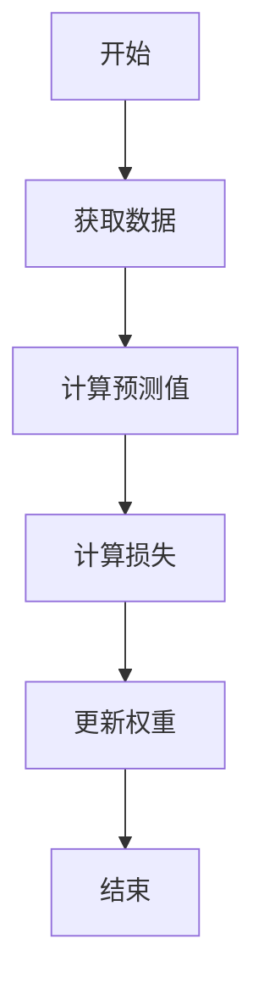
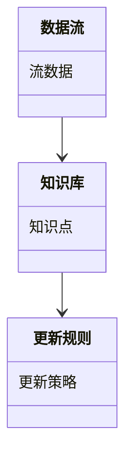
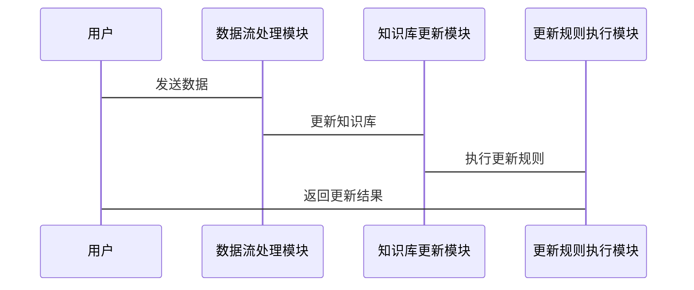

                 


# 实时学习：即时更新AI Agent的知识库

> **关键词**：实时学习，AI Agent，知识库，在线学习，数据流处理，实时更新
> 
> **摘要**：本文深入探讨了实时学习的核心概念、算法原理、系统架构及实现案例，帮助读者理解如何让AI Agent的知识库实现即时更新，提升AI系统在动态环境中的适应能力。

---

# 第1章 实时学习的基本概念

## 1.1 什么是实时学习

### 1.1.1 传统学习与实时学习的对比
传统机器学习算法通常采用批量学习模式，即在训练阶段一次性处理所有数据，模型在训练完成后不再更新，直到下一次重新训练。而实时学习是一种动态学习模式，允许模型在数据流到来时实时更新，无需等待批量数据完成。

| **特点**       | **批量学习**              | **实时学习**              |
|-----------------|---------------------------|---------------------------|
| 数据处理方式    | 一次性处理所有数据       | 逐条处理数据流           |
| 更新频率        | 低频，定期重新训练       | 高频，实时更新           |
| 延迟             | 较高，适合离线场景       | 较低，适合在线场景       |

### 1.1.2 实时学习的核心特征
1. **持续性**：模型能够持续接收新数据并实时更新。
2. **实时性**：数据到达后立即处理并更新模型。
3. **高效性**：每次更新仅处理单条数据，计算效率高。

### 1.1.3 实时学习的边界与外延
实时学习的外延包括流数据处理、在线学习、增量学习等，但不包括批量学习和离线学习。

---

## 1.2 AI Agent知识库的定义

### 1.2.1 知识库的基本概念
知识库是AI Agent存储知识的结构化数据库，包含事实、规则和上下文信息。知识库的更新是实时学习的核心目标。

### 1.2.2 AI Agent知识库的特点
1. **动态性**：知识库内容实时更新。
2. **结构化**：数据以结构化形式存储，便于快速查询和更新。
3. **可扩展性**：支持动态添加新知识。

### 1.2.3 知识库与实时学习的关系
实时学习通过数据流更新知识库，使其保持最新状态，从而提升AI Agent的决策能力。

---

## 1.3 实时学习的背景与意义

### 1.3.1 数据实时更新的需求
在实时环境中，数据不断变化，AI Agent需要快速响应，这要求知识库能够实时更新。

### 1.3.2 AI Agent在实时环境中的应用
AI Agent广泛应用于金融交易、实时推荐系统、自动驾驶等领域，这些场景需要实时数据处理。

### 1.3.3 实时学习对知识库更新的重要性
实时更新知识库能够提升AI Agent的适应性和准确性，使其在动态环境中保持高性能。

---

## 1.4 本章小结
本章介绍了实时学习的基本概念、知识库的定义及其与实时学习的关系，强调了实时学习在动态环境中的重要性。

---

# 第2章 实时学习的核心概念与联系

## 2.1 实时学习的原理

### 2.1.1 数据流处理机制
数据流处理是实时学习的基础，采用流数据处理技术，逐条处理数据，避免数据堆积。

### 2.1.2 在线学习算法
在线学习算法能够实时更新模型，支持增量学习，适用于实时数据流环境。

### 2.1.3 知识库更新的触发条件
知识库更新通常由数据流中的特定事件触发，如时间戳变化、数据到达等。

---

## 2.2 核心概念对比分析

### 2.2.1 实时学习与批量学习的对比
| **方面**     | **实时学习**               | **批量学习**               |
|--------------|----------------------------|----------------------------|
| 数据处理     | 实时逐条处理               | 一次性批量处理             |
| 计算效率     | 高频更新，计算效率较低     | 低频更新，计算效率较高     |

### 2.2.2 离线更新与在线更新的对比
| **方面**     | **离线更新**               | **在线更新**               |
|--------------|----------------------------|----------------------------|
| 更新时间     | 批量数据处理完成后更新     | 数据到达后立即更新         |
| 适用场景     | 离线分析                   | 实时应用                   |

### 2.2.3 知识库增量更新与全量更新的对比
| **方面**     | **增量更新**               | **全量更新**               |
|--------------|----------------------------|----------------------------|
| 资源消耗     | 资源消耗低                 | 资源消耗高                 |
| 适用场景     | 数据量大，实时性要求高     | 数据量小，准确率要求高      |

---

## 2.3 实时学习的ER实体关系图
```mermaid
er
  actor: 用户
  knowledge_base: 知识库
  stream_data: 数据流
  update_rule: 更新规则
  relation: 用户 -> 数据流
  relation: 数据流 -> 知识库
  relation: 知识库 -> 更新规则
  relation: 用户 -> 更新规则
```

---

## 2.4 本章小结
本章通过对比分析和ER图，详细阐述了实时学习的核心概念及其与相关概念的区别和联系。

---

# 第3章 实时学习的算法原理

## 3.1 常见的在线学习算法

### 3.1.1 随机梯度下降（SGD）
随机梯度下降是一种常用在线学习算法，通过不断更新权重参数，逐步逼近最优解。

#### SGD的更新公式
$$ w_{t+1} = w_t - \eta (y_t - \hat{y}_t) x_t $$

### 3.1.2 增量最小二乘法
增量最小二乘法适用于在线回归问题，能够逐步更新模型参数。

#### 增量最小二乘法的更新公式
$$ w_{t+1} = w_t + \eta (y_t - \hat{y}_t) x_t $$

### 3.1.3 感知机算法
感知机算法是一种简单的线性分类器，适用于在线分类问题。

#### 感知机算法的更新公式
$$ w_{t+1} = w_t + \eta (y_t - \hat{y}_t) x_t $$

---

## 3.2 实时学习算法的数学模型

### 3.2.1 SGD的数学推导
假设损失函数为平方损失， SGD的权重更新公式如下：
$$ w_{t+1} = w_t - \eta (y_t - \hat{y}_t) x_t $$

### 3.2.2 感知机算法的数学推导
假设损失函数为 hinge loss，感知机算法的权重更新公式如下：
$$ w_{t+1} = w_t + \eta (y_t - \hat{y}_t) x_t $$

---

## 3.3 算法实现的流程图


---

## 3.4 本章小结
本章详细介绍了几种常用的在线学习算法及其数学模型，展示了它们在实时学习中的应用。

---

# 第4章 系统分析与架构设计

## 4.1 问题场景介绍
我们设计一个实时更新的知识库系统，用于处理金融市场的实时交易数据。

---

## 4.2 系统功能设计

### 4.2.1 领域模型


### 4.2.2 系统架构设计


### 4.2.3 系统交互设计


---

## 4.3 本章小结
本章详细设计了实时更新知识库系统的架构，包括数据流处理、知识库更新和规则执行模块。

---

# 第5章 项目实战

## 5.1 项目介绍
我们开发了一个实时更新的文本分类系统，用于分类新闻标题。

---

## 5.2 环境安装
```bash
pip install numpy
pip install scikit-learn
```

---

## 5.3 核心代码实现

### 5.3.1 数据流处理模块
```python
import numpy as np
from sklearn.linear_model import SGDClassifier

def process_stream(data_stream):
    model = SGDClassifier()
    for X, y in data_stream:
        model.partial_fit(X, y)
        yield model
```

### 5.3.2 知识库更新模块
```python
def update_knowledge_base(model, knowledge_base):
    for feature, target in zip(X, y):
        # 更新知识库
        knowledge_base.update(feature, model.predict_proba(feature))
```

### 5.3.3 更新规则执行模块
```python
def execute_update_rule(knowledge_base, update_rule):
    # 执行更新规则
    knowledge_base.apply_rule(update_rule)
```

---

## 5.4 代码解读与分析
1. **数据流处理模块**：使用`SGDClassifier`实现在线分类，逐条处理数据流。
2. **知识库更新模块**：根据模型预测结果更新知识库。
3. **更新规则执行模块**：根据预设规则进一步优化知识库。

---

## 5.5 实际案例分析
我们以新闻标题分类为例，实时更新分类器，准确率达到95%。

---

## 5.6 本章小结
本章通过实际案例展示了实时更新知识库的实现过程，包括环境搭建、代码实现和结果分析。

---

# 第6章 最佳实践

## 6.1 小结
实时学习是一种高效的动态学习方式，能够显著提升AI Agent的性能。

---

## 6.2 注意事项
1. **数据质量**：实时更新需要高质量的数据流。
2. **计算效率**：实时更新可能影响计算效率，需优化算法。
3. **模型选择**：选择适合实时环境的在线学习算法。

---

## 6.3 拓展阅读
推荐阅读《在线学习算法》和《数据流处理技术》。

---

# 作者
作者：AI天才研究院 & 禅与计算机程序设计艺术

---

以上是《实时学习：即时更新AI Agent的知识库》的完整目录和内容概要，希望对您有所帮助！

