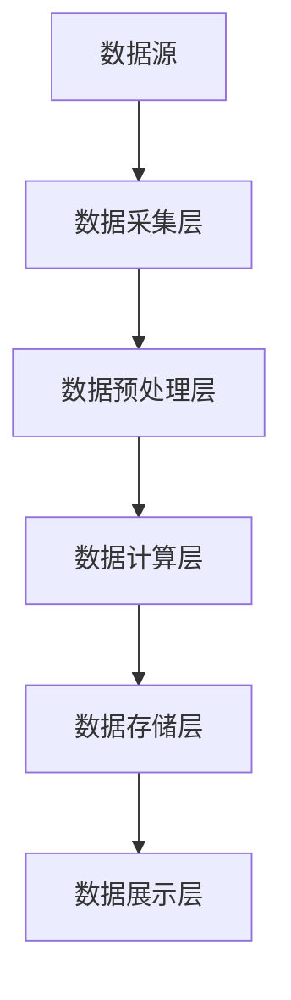

                 


# 实时数据分析与预测

> 关键词：实时数据分析、预测模型、流数据处理、时间序列分析、系统架构设计、机器学习

> 摘要：本文深入探讨了实时数据分析与预测的核心概念、算法原理、系统架构设计以及项目实战。通过详细讲解流数据处理、时间序列预测算法、系统架构设计和实际案例分析，帮助读者全面掌握实时数据分析与预测的技术和方法。

---

## 第一部分: 实时数据分析与预测的背景与概述

### 第1章: 实时数据分析与预测概述

#### 1.1 实时数据分析的背景与意义

实时数据分析在现代社会中扮演着越来越重要的角色。随着物联网、传感器技术和云计算的发展，数据的产生速度和规模呈指数级增长，实时数据分析的需求日益迫切。例如，在金融交易中，实时数据分析可以帮助机构快速识别异常交易行为，避免潜在的财务损失；在物联网设备中，实时数据分析可以及时发现设备故障，避免生产中断。

实时数据分析的核心价值在于其能够帮助我们快速做出决策，抓住机会或避免风险。例如，在交通管理中，实时数据分析可以帮助交通管理部门及时调整信号灯设置，优化交通流量，减少拥堵。

#### 1.2 数据分析与预测的基本概念

数据分析是指通过对数据的处理、分析和解释，发现数据中的模式、趋势和关联的过程。预测则是基于历史数据和当前数据，利用数学模型或算法，对未来事件或趋势进行预测。

实时数据分析与预测的区别在于数据的时间特性。实时数据分析强调数据的实时性，即数据是在不断流动的，分析过程需要在数据生成的同时进行。而预测则是基于实时数据分析的结果，对未来事件进行预测。

#### 1.3 实时数据分析与预测的挑战

实时数据分析与预测面临诸多挑战。首先，数据的实时性要求处理系统必须具有高速的数据处理能力，能够在数据生成的同时完成分析和预测。其次，数据的不完整性和噪声干扰可能会影响预测的准确性。此外，实时数据分析系统的可扩展性和容错性也是一个重要的挑战，尤其是在处理大规模数据时，系统需要能够快速响应，并在出现故障时能够恢复。

---

## 第二部分: 实时数据分析与预测的核心算法与技术

### 第2章: 流数据处理与实时计算

#### 2.1 流数据处理的基本原理

流数据是指在系统运行过程中不断生成和流动的数据。流数据处理的核心在于如何高效地处理这些动态数据，提取有用的信息。与批量数据处理不同，流数据处理需要实时处理数据，并且能够快速响应数据的变化。

流数据处理的主要方法包括滑动窗口技术、队列处理技术和分布式流处理技术。滑动窗口技术通过维护一个固定大小的窗口，实时更新数据，确保分析结果能够反映最新的数据状态。队列处理技术则通过将数据存入队列，按顺序处理数据，确保处理过程的有序性。分布式流处理技术利用分布式计算框架，将数据分发到多个节点进行并行处理，提高处理效率。

#### 2.2 实时计算技术

实时计算技术是指在数据生成的同时完成数据的处理和分析，能够在极短的时间内得到结果。实时计算技术的核心在于高效的数据处理和快速的计算能力。常见的实时计算框架包括Apache Flink、Apache Kafka和Google Cloud Pub/Sub等。

实时计算框架通常采用流处理模型，能够支持事件时间、处理时间和插入时间等多种时间模型，确保数据处理的准确性。同时，实时计算框架还支持窗口操作、连接操作和聚合操作等，能够满足多种实时数据分析的需求。

#### 2.3 流数据处理的算法实现

滑动窗口算法是一种常用的流数据处理算法，适用于需要实时跟踪数据窗口内信息的场景。例如，在股票交易中，滑动窗口算法可以用于计算过去五分钟内的股票价格平均值。

下面是一个滑动窗口算法的Python实现示例：

```python
class MovingWindow:
    def __init__(self, window_size):
        self.window_size = window_size
        self.window = []

    def add_data_point(self, value):
        self.window.append(value)
        if len(self.window) > self.window_size:
            self.window.pop(0)

    def get_current_average(self):
        if not self.window:
            return None
        return sum(self.window) / len(self.window)
```

在上述代码中，`MovingWindow`类维护了一个固定大小的窗口。`add_data_point`方法将新数据添加到窗口中，并确保窗口的大小不超过指定的`window_size`。`get_current_average`方法计算当前窗口的平均值。

---

### 第3章: 时间序列分析与实时预测

#### 3.1 时间序列分析的基本原理

时间序列分析是一种通过分析时间序列数据，发现数据中的模式、趋势和周期性，从而进行预测的方法。时间序列数据是指按时间顺序排列的数据，例如股票价格、气象数据和销售数据等。

时间序列分析的主要方法包括移动平均法、指数平滑法、ARIMA模型和LSTM网络等。这些方法各有优缺点，适用于不同的数据特性和预测需求。

#### 3.2 常见的时间序列预测算法

ARIMA（自回归积分滑动平均模型）是一种广泛应用于时间序列预测的模型。ARIMA模型通过自回归部分和滑动平均部分，能够捕捉数据中的趋势和周期性。

LSTM（长短期记忆网络）是一种基于深度学习的时间序列预测模型。LSTM通过记忆单元和控制门，能够捕捉长时间依赖关系，适用于复杂的时间序列数据。

#### 3.3 时间序列预测算法的实现

以下是一个ARIMA模型的Python实现示例：

```python
import pandas as pd
from statsmodels.tsa.arima_model import ARIMA

# 生成时间序列数据
data = pd.Series([1, 2, 3, 4, 5, 6, 7, 8, 9, 10])

# 定义ARIMA模型
model = ARIMA(data, order=(1, 1, 0))

# 拟合模型
model_fit = model.fit()

# 预测下一个值
forecast = model_fit.forecast(steps=1)
print(forecast)
```

在上述代码中，ARIMA模型被用于预测时间序列数据的下一个值。`order=(1, 1, 0)`表示模型的参数设置，其中自回归部分为1，差分为1，滑动平均部分为0。

---

## 第三部分: 实时数据分析与预测的系统架构设计

### 第4章: 实时数据分析系统的架构设计

#### 4.1 系统架构设计概述

实时数据分析系统的架构设计需要考虑数据的实时性、系统的可扩展性和数据的安全性。常见的实时数据分析系统架构包括流数据处理架构、事件驱动架构和微服务架构。

流数据处理架构通过将数据流分发到多个处理节点，实现数据的并行处理。事件驱动架构通过事件触发数据处理，适用于需要快速响应的场景。微服务架构通过将系统分解为多个独立的服务，实现系统的模块化和可扩展性。

#### 4.2 系统架构设计的关键点

系统架构设计的关键点包括数据采集、数据预处理、数据存储、数据计算和数据展示。数据采集需要考虑数据的实时性和稳定性，数据预处理需要考虑数据的质量和一致性，数据存储需要考虑数据的持久性和查询效率，数据计算需要考虑计算的效率和准确性，数据展示需要考虑结果的可视化和用户友好性。

#### 4.3 系统架构设计的实现

以下是一个实时数据分析系统的架构图：



在上述架构图中，数据源生成数据，数据采集层负责将数据传输到数据预处理层。数据预处理层对数据进行清洗和转换，确保数据的准确性和一致性。数据计算层利用流处理框架对数据进行实时分析和预测，数据存储层将结果存储到数据库中，数据展示层将结果以可视化的方式呈现给用户。

---

## 第四部分: 实时数据分析与预测的项目实战

### 第5章: 实时交通数据分析与预测

#### 5.1 项目背景与目标

本项目旨在通过实时数据分析技术，对交通流量进行实时监控和预测。通过对交通流量数据的分析，可以帮助交通管理部门优化信号灯控制，减少交通拥堵，提高道路利用率。

#### 5.2 数据采集与预处理

数据采集可以通过交通传感器或摄像头获取实时的交通流量数据。数据预处理包括数据清洗、数据转换和数据归一化等步骤。

#### 5.3 数据分析与预测

利用时间序列预测模型，对交通流量数据进行实时预测。以下是一个基于LSTM网络的交通流量预测模型的实现示例：

```python
import numpy as np
from tensorflow.keras.models import Sequential
from tensorflow.keras.layers import LSTM, Dense

# 生成训练数据
X_train = np.random.randn(100, 1, 1)
y_train = np.random.randn(100, 1)

# 定义LSTM模型
model = Sequential()
model.add(LSTM(5, input_shape=(1, 1)))
model.add(Dense(1))

# 编译模型
model.compile(loss='mean_squared_error', optimizer='adam')

# 训练模型
model.fit(X_train, y_train, epochs=10, batch_size=1)

# 预测下一个值
X_test = np.array([[0.5]])
X_test = X_test.reshape(1, 1, 1)
forecast = model.predict(X_test)
print(forecast)
```

在上述代码中，LSTM模型被用于预测交通流量的下一个值。模型通过训练数据进行优化，并在测试数据上进行预测。

---

## 第五部分: 实时数据分析与预测的最佳实践

### 第6章: 最佳实践与系统优化

#### 6.1 系统性能优化

系统性能优化是实时数据分析系统设计中的一个重要环节。可以通过优化数据处理流程、提高数据存储效率和改进计算算法等方法，提高系统的处理速度和响应能力。

#### 6.2 数据质量管理

数据质量管理是确保实时数据分析系统准确性和可靠性的关键。数据质量管理包括数据清洗、数据验证和数据标准化等步骤，能够有效减少数据中的噪声和错误。

#### 6.3 系统安全性

系统安全性是实时数据分析系统设计中的一个重要考虑因素。可以通过数据加密、访问控制和日志记录等方法，确保系统的数据安全和运行安全。

#### 6.4 本章小结

通过最佳实践和系统优化，可以显著提高实时数据分析系统的性能和可靠性。数据质量管理、系统性能优化和系统安全性是确保实时数据分析系统成功运行的重要保障。

---

## 作者：AI天才研究院/AI Genius Institute & 禅与计算机程序设计艺术 /Zen And The Art of Computer Programming

---

通过以上内容，读者可以全面了解实时数据分析与预测的核心概念、算法原理、系统架构设计和项目实战。希望本文能够为读者提供有价值的参考和启发，帮助他们在实时数据分析与预测领域取得更大的成功。

