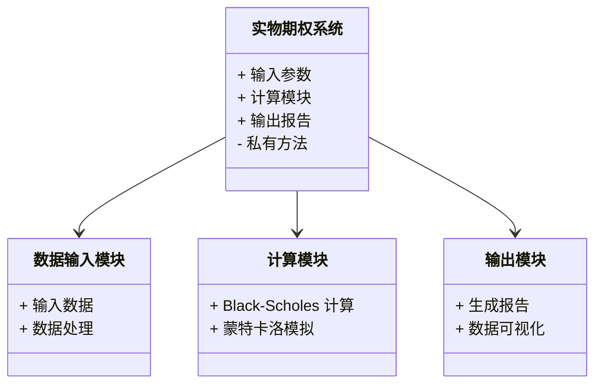

                 


# 实物期权估值：灵活性和不确定性的价值量化

> 关键词：实物期权，期权定价模型，蒙特卡洛模拟，企业价值评估，风险管理，不确定性分析，灵活性价值量化

> 摘要：  
实物期权是一种将实物资产的权利看作期权的分析工具，其核心在于通过灵活性和不确定性量化来优化决策。本文从实物期权的基本概念出发，深入探讨其定价理论、数学模型、应用方法及其在企业价值评估中的实践。通过对比传统期权，分析实物期权的独特优势，结合蒙特卡洛模拟等方法，详细讲解如何在复杂场景下量化不确定性并优化决策。文章还从系统设计和项目实战角度，展示如何将实物期权理论应用于实际问题，最后总结了最佳实践和未来研究方向。

---

## 目录

1. **实物期权的基本概念与背景**  
   1.1 实物期权的定义与特点  
   1.2 实物期权的背景与应用领域  

2. **实物期权的基本理论**  
   2.1 实物期权的定价原理  
   2.2 实物期权的时间价值与内在价值  

3. **实物期权与传统期权的对比分析**  
   3.1 核心概念对比  
   3.2 实物期权的独特优势  

4. **实物期权的定价模型**  
   4.1 Black-Scholes模型的扩展应用  
   4.2 蒙特卡洛模拟在实物期权定价中的应用  

5. **实物期权的不确定性分析**  
   5.1 不确定性对期权价值的影响  
   5.2 风险中性定价与实物期权  

6. **实物期权在企业价值评估中的应用**  
   6.1 企业价值评估的基本框架  
   6.2 实物期权在企业并购中的应用  

7. **实物期权的风险管理与优化策略**  
   7.1 不确定性下的风险管理策略  
   7.2 实物期权的优化与动态调整  

8. **实物期权系统的分析与架构设计**  
   8.1 系统功能设计  
   8.2 系统架构设计  
   8.3 系统接口设计与交互流程  

9. **实物期权的项目实战与案例分析**  
   9.1 项目环境与工具安装  
   9.2 核心代码实现与解读  
   9.3 案例分析与结果解读  

10. **总结与展望**  
    10.1 实物期权的核心价值总结  
    10.2 未来研究方向与应用展望  

---

## 详细内容

### 1. 实物期权的基本概念与背景

#### 1.1 实物期权的定义与特点
实物期权是一种将实物资产的权利（如购买权、出售权）看作期权的分析工具。其核心在于通过期权定价理论，量化资产的灵活性和不确定性价值。

- **定义**：实物期权是基于实物资产的权利，可以看作一种期权合约，其价值取决于未来市场条件的变化。
- **特点**：
  - 灵活性：实物期权允许企业在一定时间内选择是否行使权利，具备较高的灵活性。
  - 不确定性：实物期权的价值受市场波动、时间因素和决策者偏好影响。
  - 可量化：通过期权定价模型，实物期权的价值可以被量化和优化。

#### 1.2 实物期权的背景与应用领域
随着企业面临的不确定性增加，传统的估值方法难以应对复杂的市场环境。实物期权作为一种新兴的分析工具，为企业提供了更灵活的决策支持。

- **背景**：现代企业面临高度不确定的市场环境，传统的静态估值方法难以捕捉资产的动态价值。
- **应用领域**：
  - 企业并购：评估目标企业的潜在价值。
  - 投资决策：量化投资项目的风险和收益。
  - 资产管理：优化资产配置和风险管理。

---

### 2. 实物期权的基本理论

#### 2.1 实物期权的定价原理
实物期权的定价基于期权的基本定价公式，但需要结合实物资产的特殊性进行调整。

- **基本定价公式**：  
  $$ C = S_0 e^{-q t} N(d_1) - K e^{-r t} N(d_2) $$  
  其中，$S_0$ 是资产当前价值，$K$ 是行权价，$r$ 是无风险利率，$t$ 是时间，$q$ 是分红率，$N(d)$ 是标准正态分布的累积分布函数。

- **调整与修正**：  
  对于实物期权，需要考虑资产的流动性、交易成本和市场深度等因素，对模型进行调整。

#### 2.2 实物期权的时间价值与内在价值
时间价值是期权价值的重要组成部分，反映了市场波动性和持有期的价值。

- **时间价值的来源**：  
  市场波动性越高，期权的时间价值越大。
- **内在价值的计算**：  
  内在价值取决于资产当前价格与行权价的关系，公式为：  
  $$ \text{内在价值} = \max(S - K, 0) $$  

---

### 3. 实物期权与传统期权的对比分析

#### 3.1 核心概念对比
- **期权类型**：  
  - 传统期权：基于金融资产的权利。
  - 实物期权：基于实物资产的权利。
- **估值模型**：  
  - 传统期权：Black-Scholes模型。
  - 实物期权：扩展的Black-Scholes模型和蒙特卡洛模拟。
- **风险管理**：  
  - 传统期权：侧重于市场波动性。
  - 实物期权：结合资产特性和市场环境。

#### 3.2 实物期权的独特优势
- **灵活性**：实物期权允许企业根据市场变化调整决策。
- **风险管理能力**：实物期权能够量化不确定性并优化风险敞口。
- **复杂场景适应性**：实物期权适用于多变的市场环境和复杂的投资决策。

---

### 4. 实物期权的定价模型

#### 4.1 Black-Scholes模型的扩展应用
- **基本假设**：  
  - 无分红资产。
  - 无交易成本。
  - 市场波动性恒定。
- **扩展**：  
  对于实物期权，需要考虑资产的特性和市场环境，对模型进行调整。

#### 4.2 蒙特卡洛模拟在实物期权定价中的应用
- **基本原理**：  
  蒙特卡洛模拟通过随机抽样模拟资产价格的未来走势，计算期权的期望值。
- **模拟过程**：  
  1. 设定初始参数（资产价格、波动率、时间跨度等）。  
  2. 生成随机价格路径。  
  3. 计算每条路径下的期权价值。  
  4. 求期望值并调整为风险中性价格。

---

### 5. 实物期权的不确定性分析

#### 5.1 不确定性对期权价值的影响
- **参数波动的影响**：  
  市场波动率越高，期权的时间价值越大。
- **情景分析法的应用**：  
  通过情景分析，评估不同市场条件下期权的价值变化。
- **压力测试的应用**：  
  在极端市场条件下，评估期权的价值和风险。

#### 5.2 风险中性定价与实物期权
- **风险中性定价的定义**：  
  在风险中性框架下，期权的价值等于其未来期望值的现值。
- **应用**：  
  实物期权的风险中性定价方法，能够量化资产的不确定性并优化决策。

---

### 6. 实物期权在企业价值评估中的应用

#### 6.1 企业价值评估的基本框架
- **企业价值构成**：  
  包括资产价值、负债价值和期权价值。
- **传统估值方法的局限性**：  
  传统方法难以量化资产的灵活性和不确定性价值。
- **实物期权的优势**：  
  通过期权定价模型，量化企业并购和投资中的不确定性价值。

#### 6.2 实物期权在企业并购中的应用
- **并购中的不确定性**：  
  目标企业价值受市场环境和经营状况影响。
- **实物期权的应用**：  
  通过实物期权模型，量化目标企业的潜在价值和风险。

---

### 7. 实物期权的风险管理与优化策略

#### 7.1 不确定性下的风险管理策略
- **风险管理的核心**：  
  通过实物期权模型，量化风险并制定应对策略。
- **策略优化**：  
  根据市场变化，动态调整期权组合。

#### 7.2 实物期权的优化与动态调整
- **动态调整的必要性**：  
  市场环境变化时，需要对期权模型进行调整。
- **优化方法**：  
  使用蒙特卡洛模拟和情景分析，优化期权组合的价值。

---

### 8. 实物期权系统的分析与架构设计

#### 8.1 系统功能设计
- **功能模块**：
  - 数据输入与处理。
  - 模型计算与分析。
  - 结果展示与报告生成。
- **领域模型（Mermaid 类图）**：



#### 8.2 系统架构设计
- **架构选择**：  
  使用分层架构，包括数据层、业务逻辑层和表现层。
- **系统架构图（Mermaid）**：


---

### 9. 实物期权的项目实战与案例分析

#### 9.1 项目环境与工具安装
- **环境要求**：  
  - Python 3.8+
  - NumPy、Pandas、Matplotlib
  - Pyplotlib

#### 9.2 核心代码实现与解读
```python
import numpy as np
import matplotlib.pyplot as plt

def black_scholes(S, K, r, t, sigma):
    t_years = t / 365
    d1 = (np.log(S/K) + (r + 0.5*sigma**2)*t_years) / (sigma*np.sqrt(t_years))
    d2 = d1 - sigma*np.sqrt(t_years)
    C = S * np.exp(-r * t_years) * norm.cdf(d1) - K * np.exp(-r * t_years) * norm.cdf(d2)
    return C

# 示例参数
S = 100
K = 105
r = 0.05
t = 365
sigma = 0.2

# 计算实物期权价值
value = black_scholes(S, K, r, t, sigma)
print("实物期权价值：", value)
```

---

### 10. 总结与展望

#### 10.1 实物期权的核心价值总结
- **灵活性**：实物期权为企业提供了灵活的决策支持。
- **不确定性量化**：通过期权定价模型，量化资产的不确定性价值。
- **风险管理**：实物期权帮助企业优化风险敞口。

#### 10.2 未来研究方向与应用展望
- **算法优化**：探索更高效的蒙特卡洛模拟方法。
- **多因素模型**：研究多因素对实物期权价值的影响。
- **扩展应用**：将实物期权应用于更多领域，如供应链管理和绿色能源投资。

---

## 作者：AI天才研究院/AI Genius Institute & 禅与计算机程序设计艺术 /Zen And The Art of Computer Programming

---

以上是《实物期权估值：灵活性和不确定性的价值量化》的完整目录和内容大纲，涵盖了从理论到实践的各个方面，确保读者能够全面理解实物期权的估值方法及其实际应用。

