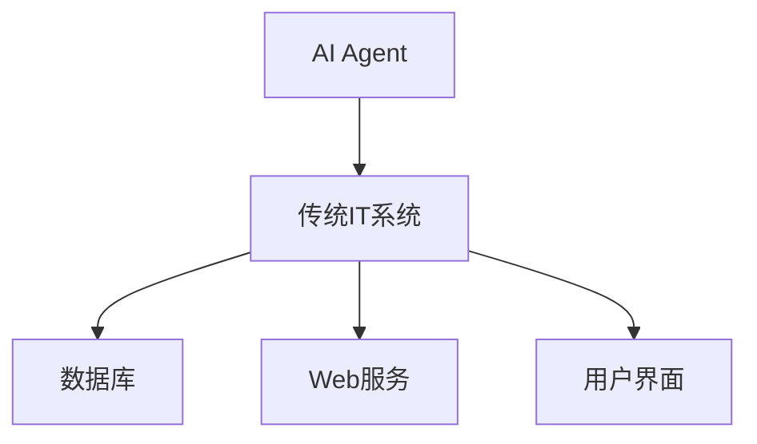

                 


# 实现AI Agent与传统IT系统的无缝集成

> 关键词：AI Agent, 传统IT系统, 系统集成, 无缝集成, 技术博客

> 摘要：本文详细探讨了AI Agent与传统IT系统无缝集成的核心原理、技术基础、系统架构及实现方案。通过逐步分析，结合实际案例和代码实现，全面解析了AI Agent与传统IT系统集成的关键技术点，包括API设计、通信协议、系统架构及算法实现等，并给出了最佳实践和未来发展趋势。

---

## 第一部分: AI Agent与传统IT系统集成概述

### 第1章: AI Agent与传统IT系统概述

#### 1.1 AI Agent的基本概念
- **AI Agent的定义**：AI Agent（智能体）是一种能够感知环境、自主决策并执行任务的智能系统，通常具备学习、推理和自适应能力。
- **AI Agent的核心特点**：
  - 感知能力：通过传感器或数据接口获取环境信息。
  - 决策能力：基于获取的信息进行推理和决策。
  - 执行能力：通过执行器或API与外部系统交互。
  - 自适应能力：能够根据反馈优化自身行为。
- **AI Agent与传统IT系统的区别**：
  | 特性       | AI Agent                          | 传统IT系统                        |
  |------------|-----------------------------------|------------------------------------|
  | 智能水平   | 高                                | 低                                |
  | 自主性     | 高                                | 低                                |
  | 学习能力   | 强                                | 无                                |

#### 1.2 传统IT系统的基本构成
- **传统IT系统的定义**：传统IT系统是指基于计算机技术和网络技术构建的系统，通常包括数据库、Web服务、API接口等。
- **传统IT系统的组成部分**：
  - 数据库：存储数据的核心组件。
  - 业务逻辑层：处理业务逻辑的中间件。
  - 用户界面层：与用户交互的前端部分。
- **传统IT系统的优缺点**：
  - 优点：结构清晰、易于管理。
  - 缺点：缺乏智能化、自动化能力较弱。

#### 1.3 AI Agent与传统IT系统的集成背景
- **企业数字化转型的驱动**：企业需要通过数字化转型提升效率和竞争力。
- **AI技术的快速发展**：AI技术的成熟为传统IT系统的升级提供了可能。
- **传统IT系统的局限性**：
  - 系统复杂性高，维护成本高。
  - 缺乏智能化，无法满足复杂业务需求。

#### 1.4 本章小结
本章介绍了AI Agent和传统IT系统的概念、特点和区别，并分析了AI Agent与传统IT系统集成的背景和必要性。

---

## 第2章: AI Agent的核心原理

### 2.1 AI Agent的工作流程
- **信息感知**：AI Agent通过传感器或API获取外部环境信息。
- **意图识别**：通过自然语言处理技术识别用户需求。
- **决策与执行**：基于知识库和推理引擎生成决策，并通过API调用执行。
- **反馈与优化**：根据执行结果优化自身行为。

### 2.2 AI Agent与传统IT系统的交互机制
- **数据接口**：通过API接口实现数据交互。
- **服务调用**：AI Agent调用传统IT系统提供的服务。
- **事件驱动**：通过事件驱动机制实现异步通信。

### 2.3 AI Agent的核心技术
- **自然语言处理**：用于理解和生成人类语言。
- **知识表示与推理**：通过知识图谱和逻辑推理技术实现智能决策。
- **机器学习与强化学习**：用于模型训练和优化。

### 2.4 本章小结
本章详细介绍了AI Agent的核心原理和与传统IT系统的交互机制，为后续集成提供了理论基础。

---

## 第3章: AI Agent与传统IT系统集成的技术基础

### 3.1 传统IT系统的通信协议
- **HTTP协议**：基于请求-响应模式的通信协议。
- **RESTful API**：基于HTTP协议的API设计风格。
- **WebSocket**：支持实时双向通信的协议。

### 3.2 AI Agent的通信协议
- **JSON-RPC**：基于JSON的远程过程调用协议。
- **gRPC**：基于HTTP/2的高性能RPC框架。
- **MQTT**：轻量级的物联网通信协议。

### 3.3 API设计与集成
- **API的设计原则**：
  - 简单性：API设计应尽量简单。
  - 可扩展性：API应支持未来扩展。
  - 安全性：确保API的安全性。
- **API的版本控制**：通过版本号管理API的变化。
- **API的安全性**：通过身份认证和权限控制保障API安全。

### 3.4 本章小结
本章介绍了传统IT系统和AI Agent的通信协议，以及API设计与集成的技术基础。

---

## 第4章: AI Agent与传统IT系统的集成架构

### 4.1 集成架构的设计原则
- **可扩展性**：架构应支持未来扩展。
- **可维护性**：架构应易于维护和升级。
- **可靠性**：架构应具备高可用性。

### 4.2 集成架构的实现方式
- **服务化集成**：将AI Agent作为服务集成到传统IT系统中。
- **数据流式集成**：通过数据流的方式实现数据共享。
- **事件驱动集成**：通过事件驱动的方式实现异步通信。

### 4.3 系统架构图


### 4.4 本章小结
本章详细介绍了AI Agent与传统IT系统集成的架构设计，并通过系统架构图展示了集成的整体结构。

---

## 第5章: AI Agent与传统IT系统集成的算法实现

### 5.1 意图识别算法
- **意图识别流程**：
  1. 数据预处理：对输入数据进行清洗和转换。
  2. 特征提取：提取文本特征。
  3. 模型训练：训练意图识别模型。
  4. 模型预测：基于模型预测用户意图。
- **意图识别算法的数学模型**：
  $$ P(y|x) = \frac{P(x|y)P(y)}{P(x)} $$
  其中，$P(y|x)$表示在输入$x$条件下，意图$y$的概率。

### 5.2 对话管理算法
- **对话管理流程**：
  1. 状态初始化：初始化对话状态。
  2. 用户输入解析：解析用户输入并生成响应。
  3. 状态更新：根据用户输入更新对话状态。
- **对话管理算法的数学模型**：
  $$ Q(s, a) = r + \gamma \max_{a'} Q(s', a') $$
  其中，$Q(s, a)$表示状态$s$下动作$a$的Q值，$\gamma$表示折扣因子。

### 5.3 知识推理算法
- **知识推理流程**：
  1. 知识表示：将知识表示为图结构。
  2. 推理规则：基于规则进行推理。
  3. 推理结果：生成推理结果。
- **知识推理算法的数学模型**：
  $$ \text{如果 } a \text{ 且 } b \text{，那么 } c $$
  其中，$a$和$b$是前提，$c$是结论。

### 5.4 本章小结
本章详细介绍了AI Agent与传统IT系统集成中的算法实现，包括意图识别、对话管理和知识推理。

---

## 第6章: AI Agent与传统IT系统集成的系统设计

### 6.1 项目介绍
- **项目背景**：本项目旨在实现AI Agent与传统IT系统的无缝集成。
- **项目目标**：
  - 实现AI Agent与传统IT系统的集成。
  - 提供可扩展的API接口。
  - 确保系统的高可用性。

### 6.2 系统功能设计
- **领域模型**：
  ```mermaid
  classDiagram
      class AI Agent {
          - 接收请求
          - 分析请求
          - 生成响应
      }
      class 传统IT系统 {
          - 提供API接口
          - 处理业务逻辑
          - 返回结果
      }
      AI Agent --> 传统IT系统
  ```

### 6.3 系统架构设计
- **系统架构图**：
  ```mermaid
  architecture
  客户端 --> AI Agent
  AI Agent --> 传统IT系统
  传统IT系统 --> 数据库
  ```

### 6.4 系统接口设计
- **API接口设计**：
  ```python
  def handle_request(request):
      # 调用传统IT系统服务
      response = traditional_system_service(request)
      return response
  ```

### 6.5 系统交互流程
- **交互流程图**：
  ```mermaid
  sequenceDiagram
      客户端 -> AI Agent: 发送请求
      AI Agent -> 传统IT系统: 调用API
      传统IT系统 -> AI Agent: 返回结果
      AI Agent -> 客户端: 返回响应
  ```

### 6.6 本章小结
本章详细介绍了AI Agent与传统IT系统集成的系统设计，包括项目介绍、系统功能设计、系统架构设计、系统接口设计和系统交互流程。

---

## 第7章: AI Agent与传统IT系统集成的项目实战

### 7.1 环境安装
- **安装Python**：安装Python 3.8及以上版本。
- **安装依赖库**：
  ```bash
  pip install flask requests
  ```

### 7.2 核心代码实现
- **AI Agent实现**：
  ```python
  from flask import Flask
  import requests

  app = Flask(__name__)

  def handle_request(request):
      # 调用传统IT系统API
      response = requests.post("http://traditional_system:8000/api", json=request)
      return response.json()

  @app.route("/api", methods=["POST"])
  def api():
      request_data = request.json
      result = handle_request(request_data)
      return result
  ```

- **传统IT系统实现**：
  ```python
  from flask import Flask
  app = Flask(__name__)

  @app.route("/api", methods=["POST"])
  def api():
      request_data = request.json
      # 处理业务逻辑
      result = {"status": "success", "message": "Request processed successfully"}
      return result
  ```

### 7.3 代码应用解读与分析
- **AI Agent代码解读**：
  - 通过Flask框架实现API接口。
  - 调用传统IT系统提供的API接口。
- **传统IT系统代码解读**：
  - 通过Flask框架实现API接口。
  - 处理业务逻辑并返回结果。

### 7.4 实际案例分析
- **案例描述**：
  - 用户发送请求到AI Agent。
  - AI Agent调用传统IT系统API。
  - 传统IT系统处理请求并返回结果。
  - AI Agent将结果返回给用户。

### 7.5 本章小结
本章通过实际案例展示了AI Agent与传统IT系统集成的实现过程，包括环境安装、核心代码实现、代码解读和案例分析。

---

## 第8章: 总结与展望

### 8.1 总结
- AI Agent与传统IT系统的无缝集成能够提升系统的智能化和自动化能力。
- 通过合理的系统设计和算法实现，能够实现高效的集成。

### 8.2 未来展望
- **多模态交互**：支持更多类型的交互方式。
- **边缘计算**：将AI Agent部署在边缘设备上，提升响应速度。
- **自适应优化**：进一步优化AI Agent的自适应能力。

### 8.3 注意事项
- 确保系统的安全性和稳定性。
- 定期更新和优化系统。

### 8.4 最佳实践Tips
- 在设计系统时，优先考虑可扩展性和可维护性。
- 使用成熟的框架和库，减少开发成本。

### 8.5 本章小结
本章总结了AI Agent与传统IT系统集成的实现过程，并展望了未来的发展方向。

---

## 作者：AI天才研究院/AI Genius Institute & 禅与计算机程序设计艺术 /Zen And The Art of Computer Programming

