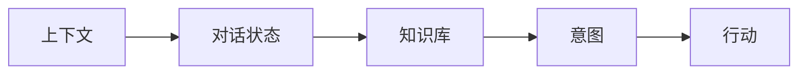
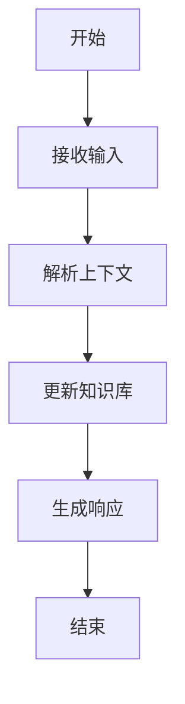
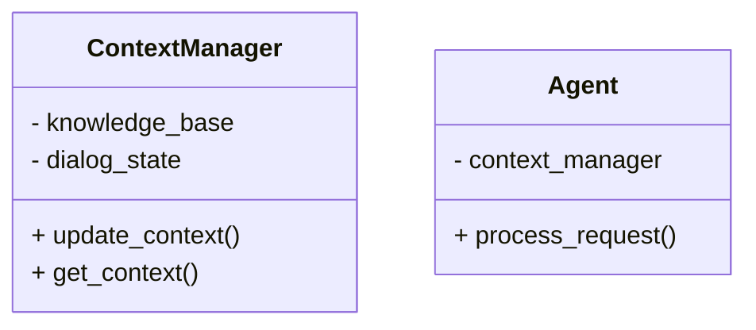
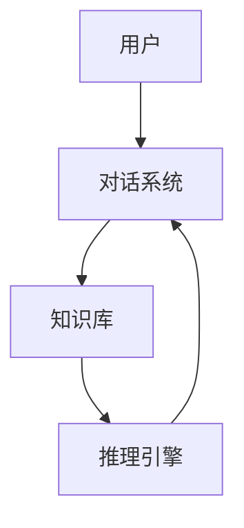
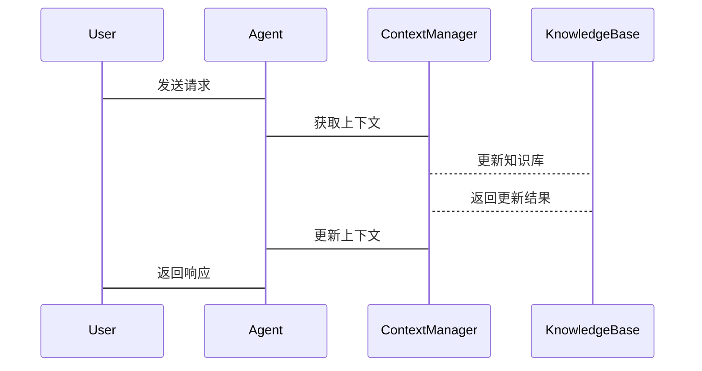

                 


# 实现AI Agent的上下文理解与管理

---

## 关键词

- AI Agent
- 上下文理解
- 知识图谱
- 对话系统
- 上下文管理

---

## 摘要

AI Agent（人工智能代理）的上下文理解与管理是实现智能交互的核心技术。本文从背景、核心概念、算法原理、系统架构到项目实战，详细探讨了上下文理解与管理的实现方法。通过对比分析、算法讲解和案例实践，为读者提供全面的技术指导。

---

## 第一部分: 背景介绍

### 第1章: 背景介绍

#### 1.1 问题背景

AI Agent是一种能够感知环境、自主决策并执行任务的智能实体。上下文理解与管理是其核心能力，涉及自然语言处理、知识图谱和对话系统。

#### 1.2 问题描述

上下文理解是指AI Agent能够理解当前对话的背景、参与者和目标。上下文管理则是指对这些信息进行有效存储和更新。

#### 1.3 问题解决

通过上下文理解模型和知识图谱，AI Agent能够准确捕捉用户意图，动态更新知识库，确保交互的连贯性。

#### 1.4 边界与外延

上下文理解的边界包括对话历史和当前意图，而其外延则涉及意图识别和知识抽取。

---

## 第二部分: 核心概念与联系

### 第2章: 核心概念原理

#### 2.1 上下文理解的原理

- **自然语言处理**：通过NLP技术解析用户输入。
- **知识图谱**：构建结构化的知识库。
- **对话系统**：维护对话状态，确保连贯性。

#### 2.2 上下文管理的机制

- **数学模型**：表示上下文关系。
- **更新规则**：动态更新知识库。
- **推理逻辑**：基于上下文推理。

#### 2.3 核心概念对比

| 概念 | 定义 | 关联性 |
|------|------|--------|
| 上下文理解 | 解析对话内容 | 高 |
| 知识抽取 | 提取实体信息 | 中 |
| 对话管理 | 维护对话状态 | 高 |

### 第3章: 实体关系图与流程图

#### 3.1 实体关系图



#### 3.2 流程图



---

## 第三部分: 算法原理讲解

### 第3章: 算法原理讲解

#### 3.1 注意力机制

数学模型：

$$
\text{注意力权重} = \frac{\exp(w_i^T x)}{\sum_{j} \exp(w_j^T x)}
$$

代码示例：

```python
def attention(query, keys):
    scores = query @ keys.T
    weights = torch.softmax(scores, dim=-1)
    return weights @ keys
```

#### 3.2 记忆网络

数学模型：

$$
p(\text{response} | \text{context}) = \sum_{i} \alpha_i p(\text{response} | e_i)
$$

代码示例：

```python
class MemoryNetwork(nn.Module):
    def __init__(self, memory_size):
        super().__init__()
        self.memory = torch.randn(memory_size, hidden_size)
    def forward(self, input, mask):
        scores = input @ self.memory.T
        weights = torch.softmax(scores * mask, dim=-1)
        output = weights @ self.memory
        return output
```

---

## 第四部分: 系统分析与架构设计

### 第4章: 系统分析与架构设计

#### 4.1 问题场景介绍

以智能客服对话系统为例，展示上下文理解和管理的应用场景。

#### 4.2 系统功能设计

类图：



#### 4.3 系统架构设计

架构图：



#### 4.4 系统接口设计

API定义：

- 输入：`POST /api/context`
- 输出：`JSON` 格式的状态更新。

#### 4.5 系统交互设计

序列图：



---

## 第五部分: 项目实战

### 第5章: 项目实战

#### 5.1 环境安装

安装必要的库：

```bash
pip install numpy torch transformers
```

#### 5.2 核心代码实现

代码示例：

```python
import torch
from transformers import AutoTokenizer, AutoModel

tokenizer = AutoTokenizer.from_pretrained('bert-base')
model = AutoModel.from_pretrained('bert-base')

def process_context(context):
    inputs = tokenizer(context, return_tensors='pt')
    outputs = model(**inputs)
    return outputs.last_hidden_state
```

#### 5.3 实际案例分析

分析智能客服对话系统的成功与失败案例，总结经验教训。

---

## 第六部分: 最佳实践与总结

### 第6章: 最佳实践

#### 6.1 小结

上下文理解和管理是AI Agent实现智能交互的关键，需要结合多种技术。

#### 6.2 注意事项

- 数据质量
- 算法选择
- 系统优化

#### 6.3 拓展阅读

推荐相关书籍和论文，如《深度学习》和《神经符号AI》。

---

## 作者

作者：AI天才研究院/AI Genius Institute & 禅与计算机程序设计艺术/Zen And The Art of Computer Programming

