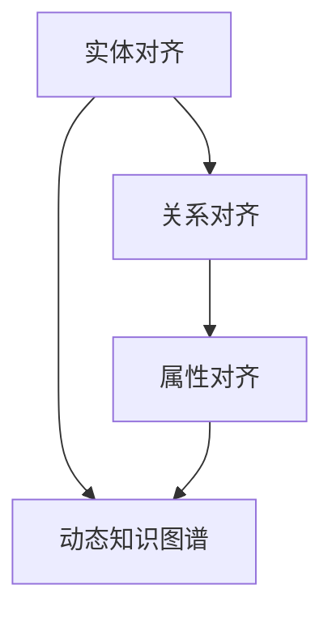
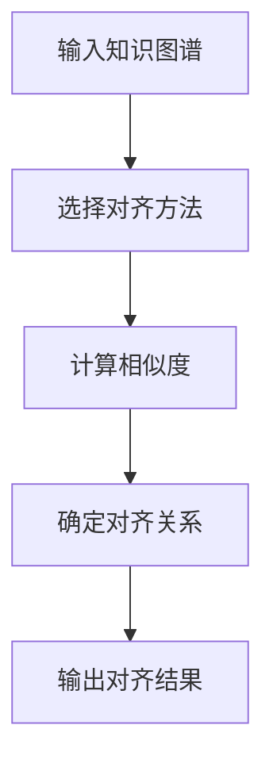
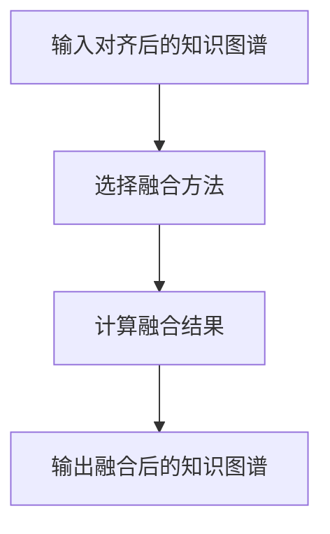
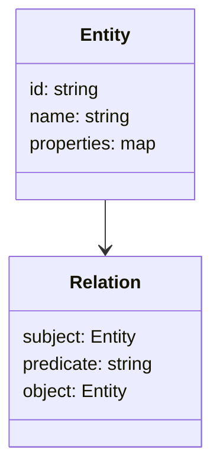
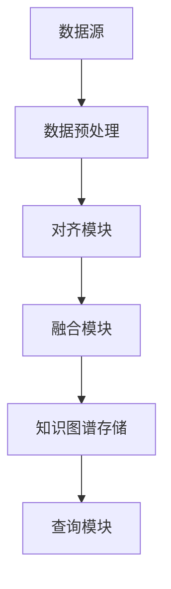
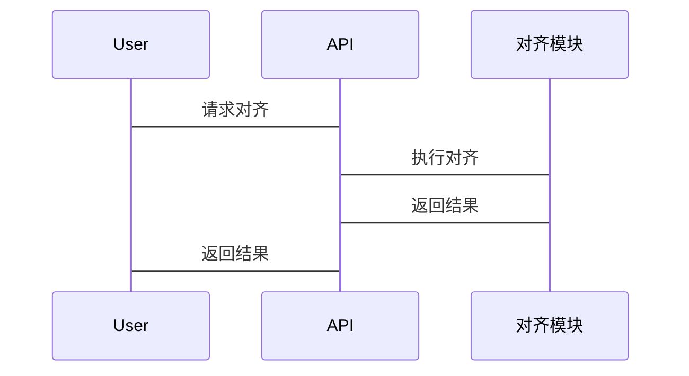

                 


# 实现AI Agent的动态知识图谱对齐与融合

---

## 关键词：
- AI Agent
- 知识图谱
- 动态对齐
- 融合算法
- 系统架构

---

## 摘要：
本文详细探讨实现AI Agent的动态知识图谱对齐与融合的技术方法。从基础概念到算法实现，再到系统架构设计，全面解析如何在动态变化的环境中高效对齐和融合多源知识图谱。通过实际案例分析和代码实现，提供可操作的解决方案，帮助读者掌握这一前沿技术。

---

# 第1章: AI Agent与动态知识图谱概述

## 1.1 AI Agent的基本概念
### 1.1.1 AI Agent的定义与分类
AI Agent（智能体）是指在环境中能够感知并自主行动以实现目标的实体。根据智能水平，AI Agent可分为反应式、基于模型和混合型三类。

### 1.1.2 动态知识图谱的定义与特点
动态知识图谱是在实时数据流中不断更新的知识网络，具有动态性、异构性和多源性的特点。

### 1.1.3 对齐与融合的必要性
在多源数据环境中，确保知识图谱的准确对齐与融合是实现AI Agent高效运作的关键。

---

## 1.2 知识图谱对齐与融合的背景
### 1.2.1 知识图谱的构建与应用
知识图谱通过结构化数据描述实体间的关系，广泛应用于搜索引擎、推荐系统等领域。

### 1.2.2 动态知识图谱的挑战
数据异构性、动态更新和语义漂移是动态知识图谱对齐与融合的主要挑战。

### 1.2.3 对齐与融合的行业需求
随着AI Agent的应用普及，对齐与融合技术的需求日益增长。

---

## 1.3 本章小结
本章介绍了AI Agent的基本概念和动态知识图谱的特点，强调了对齐与融合的重要性。

---

# 第2章: 知识图谱对齐的核心概念

## 2.1 知识图谱对齐的定义
### 2.1.1 实体对齐
通过符号或嵌入方法，将不同知识图谱中的实体映射到同一个概念。

### 2.1.2 关系对齐
确保不同知识图谱中的关系具有相同的语义。

### 2.1.3 属性对齐
对齐实体的属性以消除数据冗余。

---

## 2.2 动态知识图谱的特征
### 2.2.1 动态性
数据实时更新，知识图谱不断变化。

### 2.2.2 不一致性
不同来源的数据可能存在语义差异。

### 2.2.3 多源性
数据来自多个异构的来源。

---

## 2.3 对齐与融合的关系
### 2.3.1 对齐是融合的基础
准确的对齐是知识图谱融合的前提。

### 2.3.2 融合是对齐的结果
通过对齐后的知识图谱进行合并，消除冲突。

### 2.3.3 对齐与融合的循环过程
对齐和融合是动态过程，需要持续更新和优化。

---

## 2.4 核心概念对比表
| 概念 | 定义 | 特征 | 示例 |
|------|------|------|------|
| 实体对齐 | 实体之间的映射关系 | 唯一性、可逆性 | 电影《黑客帝国》与《The Matrix》 |
| 关系对齐 | 关系之间的映射关系 | 传递性、对称性 | "is a" 关系与"is part of"关系 |
| 属性对齐 | 属性之间的映射关系 | 多对多、可组合 | "上映时间"与"release date" |

---

## 2.5 ER实体关系图



---

## 2.6 本章小结
本章详细解释了知识图谱对齐的核心概念，并通过对比表和ER图帮助读者理解。

---

# 第3章: 对齐算法原理

## 3.1 符号对齐算法
### 3.1.1 基于符号的对齐方法
通过字符串匹配或本体论映射实现对齐。

### 3.1.2 字面匹配
直接比较实体名称或属性名称。

---

## 3.2 基于嵌入的对齐方法
### 3.2.1 嵌入表示学习
将实体和关系映射到向量空间，计算相似度。

### 3.2.2 训练模型
使用深度学习模型（如TransE、DistMult）进行训练。

---

## 3.3 算法流程图



---

## 3.4 Python代码实现

```python
import numpy as np

def compute_similarity(embedding1, embedding2):
    return np.dot(embedding1, embedding2) / (np.linalg.norm(embedding1) * np.linalg.norm(embedding2))

# 示例嵌入向量
embedding_a = np.array([0.5, 0.3, 0.2])
embedding_b = np.array([0.6, 0.4, 0.1])

similarity = compute_similarity(embedding_a, embedding_b)
print(f"相似度：{similarity}")
```

---

## 3.5 数学模型
相似度计算公式：

$$ \text{similarity} = \frac{\mathbf{a} \cdot \mathbf{b}}{||\mathbf{a}|| \cdot ||\mathbf{b}||} $$

---

## 3.6 本章小结
本章介绍了符号对齐和基于嵌入的对齐方法，通过代码示例和数学公式详细讲解了实现过程。

---

# 第4章: 融合算法原理

## 4.1 基于规则的融合方法
### 4.1.1 规则定义
根据领域知识制定融合规则。

### 4.1.2 冲突检测
识别并解决数据冲突。

---

## 4.2 基于概率的融合方法
### 4.2.1 概率模型
使用贝叶斯网络进行概率推理。

### 4.2.2 融合过程
根据概率计算最终结果。

---

## 4.3 算法流程图



---

## 4.4 Python代码实现

```python
import numpy as np

def probabilistic_fusion(score_a, score_b):
    return (score_a + score_b) / 2

# 示例分数
score_a = 0.8
score_b = 0.6

fusion_score = probabilistic_fusion(score_a, score_b)
print(f"融合结果：{fusion_score}")
```

---

## 4.5 数学模型
融合公式：

$$ \text{fusion} = \frac{\text{score}_a + \text{score}_b}{2} $$

---

## 4.6 本章小结
本章介绍了基于规则和概率的融合方法，通过代码和公式详细讲解了实现细节。

---

# 第5章: 系统架构设计

## 5.1 问题场景介绍
动态知识图谱的实时更新和多源数据融合。

## 5.2 系统功能设计
### 5.2.1 领域模型



### 5.2.2 系统架构



---

## 5.3 接口设计
API接口定义：

```http
POST /api/align
POST /api/fuse
GET /api/knowledge-graph
```

---

## 5.4 交互流程图



---

## 5.5 本章小结
本章通过系统架构设计，展示了如何实现动态知识图谱的对齐与融合。

---

# 第6章: 项目实战

## 6.1 环境安装
安装必要的库：

```bash
pip install numpy networkx py2neo
```

---

## 6.2 核心代码实现
### 6.2.1 对齐模块

```python
def align_entities(kg1, kg2):
    # 实现对齐算法
    pass
```

### 6.2.2 融合模块

```python
def fuse_kgs(kg1, kg2):
    # 实现融合算法
    pass
```

---

## 6.3 案例分析
通过具体案例展示对齐与融合的过程。

---

## 6.4 项目小结
总结项目实现的关键点和经验教训。

---

# 第7章: 最佳实践与小结

## 7.1 最佳实践
### 7.1.1 数据预处理的重要性
确保数据质量。

### 7.1.2 算法选择的策略
根据场景选择合适的方法。

---

## 7.2 小结
总结全文，强调对齐与融合的重要性。

---

## 7.3 注意事项
在实际应用中，注意数据隐私和计算效率。

---

## 7.4 拓展阅读
推荐相关领域的深入阅读材料。

---

# 作者：AI天才研究院/AI Genius Institute & 禅与计算机程序设计艺术 /Zen And The Art of Computer Programming

---

这篇文章通过系统地讲解AI Agent的动态知识图谱对齐与融合，从基础概念到实际应用，为读者提供了全面的技术指导。

