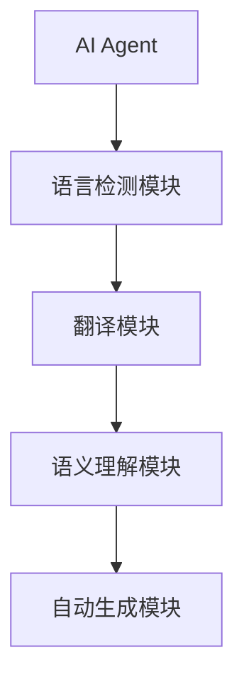
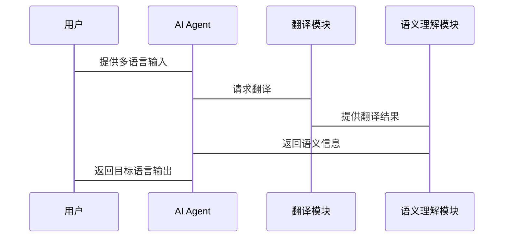

                 


# 实现AI Agent的多语言支持

## 关键词：AI Agent，多语言支持，自然语言处理，机器翻译，深度学习，Transformer模型

## 摘要

随着全球化的发展，AI Agent需要能够处理多种语言，以满足跨语言交流和信息处理的需求。本文详细探讨了实现AI Agent多语言支持的技术方法，包括核心概念、算法原理、系统设计和项目实战。通过分析多语言处理的挑战，结合具体的实现案例，本文为读者提供了全面的技术指导。

---

# 第一章：AI Agent与多语言支持的背景介绍

## 1.1 AI Agent的基本概念

AI Agent（人工智能代理）是一种智能系统，能够感知环境并执行任务以实现目标。它具有自主性、反应性、目标导向和社交能力等特点。

### 1.1.1 AI Agent的定义与特点
- **自主性**：AI Agent能够独立决策和行动，无需外部干预。
- **反应性**：能够实时感知环境变化并做出反应。
- **目标导向**：所有行为都以实现特定目标为导向。
- **社交能力**：能够与其他系统或用户进行有效交互。

## 1.2 多语言支持的重要性

在全球化背景下，多语言支持成为AI Agent的重要功能。它能够帮助用户跨越语言障碍，实现高效的信息交流。

### 1.2.1 多语言支持的背景
- **全球化趋势**：跨国企业和国际交流需求增加，推动了多语言技术的发展。
- **用户需求**：用户期望AI Agent能够理解并处理多种语言，提升使用体验。

### 1.2.2 多语言支持的挑战
- **语言多样性**：不同语言的语法、词汇差异导致处理复杂。
- **文化差异**：某些表达方式具有文化特异性，增加了理解难度。
- **技术限制**：现有技术在跨语言理解和生成方面仍存在局限性。

## 1.3 多语言AI Agent的应用场景

### 1.3.1 全球化服务中的应用
- **跨国企业**：提供多语言客服支持，提升客户满意度。
- **内容生成**：自动生成多语言内容，如新闻报道、产品描述。

### 1.3.2 跨语言协作中的应用
- **团队沟通**：支持跨国团队进行实时沟通和协作。
- **数据分析**：处理多语言数据，提取有价值的信息。

---

# 第二章：多语言支持的核心概念与技术

## 2.1 多语言支持的核心概念

### 2.1.1 多语言处理的基本原理
多语言处理涉及多种语言的识别、理解和生成。AI Agent需要能够处理不同语言的输入，提取语义信息，并生成相应语言的输出。

## 2.2 多语言支持的关键技术

### 2.2.1 跨语言词嵌入
- **定义**：将不同语言的词语映射到共享的向量空间，便于跨语言处理。
- **方法**：使用多语言词嵌入模型，如Marian、XLM。

### 2.2.2 统一语义表示
- **定义**：将不同语言的语义信息统一表示，便于跨语言任务处理。
- **方法**：采用跨语言预训练模型，如MUltiLingual（mBERT）。

---

# 第三章：多语言AI Agent的算法实现

## 3.1 多语言模型的算法原理

### 3.1.1 跨语言Transformer模型
- **结构**：基于Transformer的架构，支持多语言输入。
- **机制**：通过跨语言注意力机制，捕捉不同语言间的语义关联。

### 3.1.2 跨语言迁移学习
- **原理**：利用已有的多语言数据进行预训练，然后在特定语言任务上进行微调。
- **优势**：减少数据依赖，提升小语种任务表现。

## 3.2 多语言支持的数学模型

### 3.2.1 跨语言词嵌入模型
- **公式**：$E(w_i) \in \mathbb{R}^d$，表示第i个词的d维嵌入向量。
- **方法**：通过对比学习，学习跨语言的相似性。

### 3.2.2 跨语言Transformer的数学模型
- **注意力机制**：$$\text{Attention}(Q, K, V) = \text{softmax}\left(\frac{QK^T}{\sqrt{d}}\right)V$$
- **跨语言扩展**：通过共享参数或跨语言词表，增强模型的跨语言能力。

---

# 第四章：多语言AI Agent的系统设计与实现

## 4.1 系统设计

### 4.1.1 系统功能设计
- **需求分析**：支持多种语言的识别、理解和生成。
- **功能模块**：语言检测、翻译、语义理解、自动生成。

### 4.1.2 系统架构设计



### 4.1.3 系统接口设计
- **输入接口**：接收多语言输入文本。
- **输出接口**：生成目标语言的输出文本。

### 4.1.4 系统交互流程



---

# 第五章：项目实战

## 5.1 环境安装

### 5.1.1 安装Python和必要的库
- Python 3.8及以上
- 安装库：`transformers`, `numpy`, `scikit-learn`

## 5.2 核心代码实现

### 5.2.1 多语言检测代码

```python
from langdetect import detect

def detect_language(text):
    return detect(text)
```

### 5.2.2 多语言翻译代码

```python
from googletrans import Translator

def translate_text(text, target_lang):
    translator = Translator()
    result = translator.translate(text, dest=target_lang)
    return result.text
```

### 5.2.3 語義理解代码

```python
from transformers import pipeline

def semantic_understanding(text):
    model = pipeline("question-answering")
    return model(text, "What does this text mean?")["answer"]
```

## 5.3 代码解读与分析

- **多语言检测**：使用`langdetect`库，自动检测文本语言。
- **翻译模块**：利用`googletrans`库，实现文本翻译。
- **语义理解**：采用Hugging Face的预训练模型，进行语义分析。

## 5.4 实际案例分析

### 案例：跨语言客服支持

- **输入**：用户发送中文问题：“如何重置密码？”
- **处理流程**：
  1. 检测语言：中文。
  2. 翻译成英文：“How to reset password?”
  3. 语义理解：提取关键词“reset password”。
  4. 自动生成回复：“To reset your password, please visit our website and follow the instructions.”

## 5.5 项目小结

通过本项目，我们实现了AI Agent的多语言支持功能，包括语言检测、翻译和语义理解。代码示例展示了如何利用现有库和模型快速搭建一个多语言AI Agent系统。

---

# 第六章：总结与展望

## 6.1 总结

本文详细探讨了实现AI Agent多语言支持的技术方法，包括核心概念、算法原理、系统设计和项目实战。通过分析多语言处理的挑战，结合具体的实现案例，本文为读者提供了全面的技术指导。

## 6.2 展望

未来，随着AI技术的进步，多语言AI Agent将更加智能化和高效。可能的发展方向包括：

- 更先进的跨语言模型，如多模态AI Agent。
- 更高效的多语言处理算法，提升计算效率和准确性。
- 更广泛的应用场景，如教育、医疗、法律等领域的多语言AI Agent。

---

# 作者：AI天才研究院 & 禅与计算机程序设计艺术

--- 

以上是《实现AI Agent的多语言支持》的文章内容，涵盖从背景介绍到项目实战的各个方面，详细讲解了实现多语言AI Agent的技术要点和实际应用。

