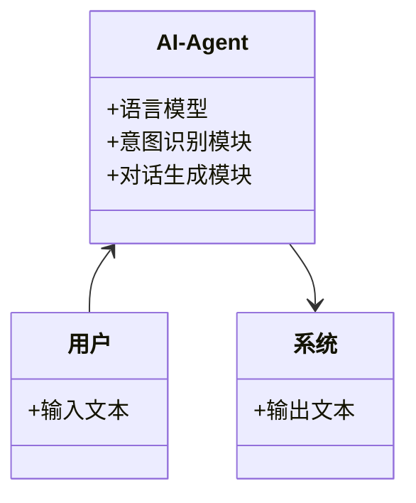
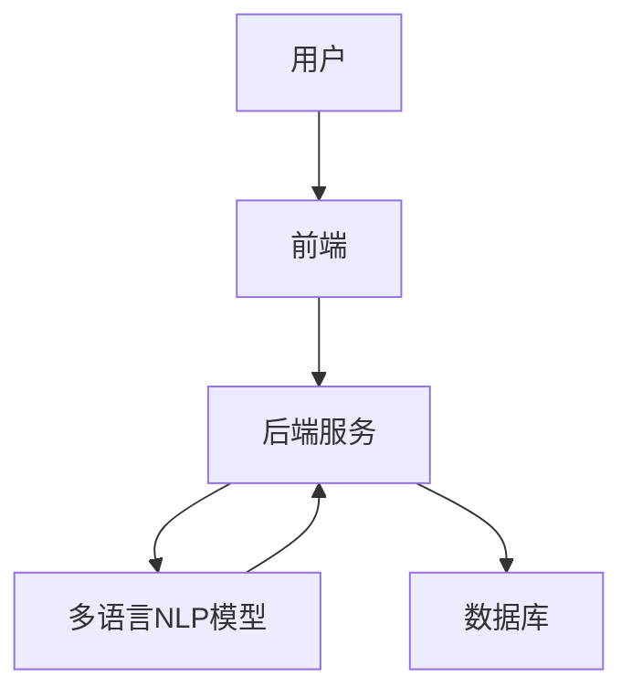
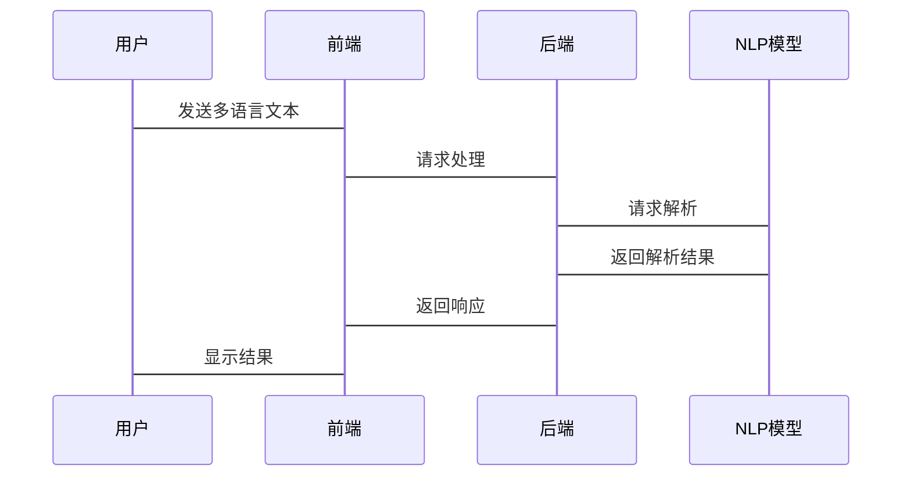

                 


# 实现AI Agent的多语言支持

> 关键词：AI Agent, 多语言支持, 自然语言处理, 系统架构, 项目实战, 最佳实践

> 摘要：本文详细探讨了AI Agent实现多语言支持的核心技术、算法原理、系统架构设计以及项目实战。文章从背景介绍出发，逐步分析了多语言支持在AI Agent中的重要性，详细讲解了自然语言处理（NLP）模型的算法原理和优化策略，提出了基于Transformer的多语言NLP模型，并通过项目实战展示了如何实现一个多语言AI Agent。最后，本文总结了实现AI Agent多语言支持的最佳实践和未来发展方向。

---

## 第1章: AI Agent的多语言支持背景与基础

### 1.1 AI Agent的基本概念与多语言支持的重要性

#### 1.1.1 AI Agent的基本概念
AI Agent（人工智能代理）是指能够感知环境、理解用户意图并执行相应操作的智能实体。AI Agent可以通过自然语言处理（NLP）技术与用户进行交互，理解用户的指令并执行任务。

#### 1.1.2 AI Agent的核心功能与应用场景
AI Agent的核心功能包括：
- **自然语言理解（NLU）**：通过NLP技术理解用户的输入文本。
- **意图识别**：识别用户的意图并将其转化为系统可执行的命令。
- **对话生成**：生成符合用户需求的自然语言回复。
- **任务执行**：根据用户意图执行相应的操作。

AI Agent的应用场景包括智能助手（如Siri、Alexa）、智能客服、智能音箱等。

#### 1.1.3 多语言支持在AI Agent中的重要性
在全球化背景下，用户可能使用多种语言与AI Agent交互。实现多语言支持可以提升用户体验，扩大AI Agent的应用范围。多语言支持的核心挑战在于如何高效地处理多种语言的文本数据，并保证跨语言交互的准确性。

---

### 1.2 多语言支持的背景与挑战

#### 1.2.1 全球化背景下多语言支持的需求
随着AI技术的普及，用户对多语言支持的需求日益增长。例如，跨国公司需要AI Agent能够支持多种语言的客服交互，以服务全球用户。

#### 1.2.2 AI Agent实现多语言支持的技术挑战
实现AI Agent的多语言支持面临以下技术挑战：
- **语言模型的训练**：需要训练支持多种语言的NLP模型。
- **跨语言理解与生成**：如何在不同语言之间实现准确的理解与生成。
- **性能优化**：多语言模型的计算复杂度较高，需要进行性能优化。

#### 1.2.3 多语言支持对用户体验的提升
通过多语言支持，AI Agent可以为用户提供更便捷、更个性化的服务，提升用户的满意度和使用体验。

---

## 第2章: AI Agent多语言支持的核心概念与联系

### 2.1 自然语言处理（NLP）的基础原理

#### 2.1.1 NLP的基本概念与技术
NLP是研究如何让计算机理解和生成人类语言的科学。核心技术包括分词、词性标注、句法分析、语义理解等。

#### 2.1.2 语言模型与文本生成的原理
语言模型通过概率分布预测下一个词，常用的模型包括n-gram模型和Transformer模型。文本生成基于语言模型，通过解码生成自然语言文本。

#### 2.1.3 多语言NLP模型的优势与局限性
多语言NLP模型可以在单一模型中处理多种语言，优势在于节省资源和提高效率，但其性能可能不如单语言模型。

---

### 2.2 多语言支持的实现机制

#### 2.2.1 多语言模型的训练与优化
多语言模型的训练需要使用多语言数据集，并采用适当的训练策略，如多任务学习和参数共享。

#### 2.2.2 多语言支持的实现方式对比
常用的实现方式包括：
- **单模型多语言**：一个模型支持多种语言。
- **多模型多语言**：为每种语言训练独立的模型。

#### 2.2.3 多语言支持的性能优化策略
性能优化策略包括：
- **共享参数**：共享语言无关的参数，减少模型大小。
- **语言嵌入**：为每种语言添加语言嵌入层。

---

## 第3章: AI Agent多语言支持的算法原理

### 3.1 Transformer模型的算法原理

#### 3.1.1 Transformer的基本结构
Transformer由编码器和解码器组成，编码器负责将输入序列映射为语义向量，解码器负责根据编码器的输出生成目标序列。

#### 3.1.2 自注意力机制
自注意力机制通过计算输入序列中每个词与其他词的相关性，生成注意力权重矩阵。

#### 3.1.3 多头注意力机制
多头注意力机制通过并行计算多个注意力头，提高模型的表达能力。

---

### 3.2 多语言NLP模型的优化策略

#### 3.2.1 多语言模型的训练策略
- **数据增强**：通过数据增强技术增加多语言数据的多样性。
- **预训练与微调**：利用多语言预训练模型进行微调。

#### 3.2.2 多语言模型的推理优化
- **语言切换机制**：根据输入语言动态切换模型的处理方式。
- **语言嵌入的动态调整**：根据输入语言调整语言嵌入层的参数。

---

## 第4章: AI Agent多语言支持的系统架构设计

### 4.1 问题场景介绍

#### 4.1.1 多语言AI Agent的应用场景
- **跨国企业客服**：支持多种语言的客户咨询。
- **多语言智能助手**：为不同语言用户提供个性化的服务。

#### 4.1.2 系统功能需求
- **多语言理解**：支持多种语言的自然语言理解。
- **多语言生成**：生成多种语言的自然语言回复。
- **跨语言对话**：支持用户使用不同语言进行对话。

---

### 4.2 系统功能设计

#### 4.2.1 领域模型设计


#### 4.2.2 系统架构设计


#### 4.2.3 系统接口设计
- **输入接口**：接收用户的自然语言输入。
- **输出接口**：输出系统生成的自然语言回复。

#### 4.2.4 系统交互流程


---

## 第5章: AI Agent多语言支持的项目实战

### 5.1 环境安装

#### 5.1.1 安装Python
```bash
# 安装Python
sudo apt-get install python3
```

#### 5.1.2 安装依赖库
```bash
pip install transformers torch
```

---

### 5.2 系统核心实现源代码

#### 5.2.1 多语言NLP模型的实现
```python
import torch
from transformers import AutoTokenizer, AutoModelForSeq2Seq

# 加载多语言模型
tokenizer = AutoTokenizer.from_pretrained("facebook/m2m-100")
model = AutoModelForSeq2Seq.from_pretrained("facebook/m2m-100")

# 多语言文本生成
def generate_response(input_text, target_lang):
    inputs = tokenizer(input_text, return_tensors="pt")
    outputs = model.generate(inputs.input_ids, max_length=50, forced_bos_token_id=tokenizer.get_lang_id(target_lang))
    return tokenizer.decode(outputs[0], skip_special_tokens=True)
```

#### 5.2.2 意图识别模块的实现
```python
import torch
import torch.nn as nn

class IntentClassifier(nn.Module):
    def __init__(self, input_size, hidden_size, output_size):
        super(IntentClassifier, self).__init__()
        self.fc = nn.Linear(input_size, hidden_size)
        self.relu = nn.ReLU()
        self.fc2 = nn.Linear(hidden_size, output_size)
    
    def forward(self, x):
        out = self.fc(x)
        out = self.relu(out)
        out = self.fc2(out)
        return out
```

---

### 5.3 代码应用解读与分析

#### 5.3.1 多语言NLP模型的代码解读
- 使用了Facebook开源的多语言模型m2m-100，支持多种语言的文本生成。
- 通过指定目标语言的`forced_bos_token_id`，实现了跨语言生成。

#### 5.3.2 意图识别模块的代码解读
- 模型通过两层全连接层实现意图分类。
- 使用ReLU激活函数，提高了模型的非线性表达能力。

---

### 5.4 实际案例分析和详细讲解

#### 5.4.1 案例分析
假设用户输入中文：“请帮我预订明天的机票。” AI Agent需要识别用户的意图是“预订机票”，并生成相应的回复：“请提供您的出发地和目的地。”

#### 5.4.2 代码实现分析
- 使用多语言模型将用户的输入翻译为目标语言。
- 使用意图识别模块识别用户的意图。
- 根据意图生成相应的回复。

---

## 第6章: AI Agent多语言支持的最佳实践与总结

### 6.1 最佳实践 tips

#### 6.1.1 模型选择
- 根据具体需求选择合适的多语言模型，如m2m-100、多语言GPT等。

#### 6.1.2 性能优化
- 使用模型压缩和量化技术降低模型的计算复杂度。

#### 6.1.3 用户体验
- 提供多语言切换功能，让用户可以根据需求选择使用不同的语言进行交互。

---

### 6.2 小结

通过本文的详细讲解，读者可以深入了解AI Agent多语言支持的核心技术、算法原理和系统架构设计。同时，通过项目实战部分，读者可以掌握如何实现一个多语言AI Agent。

---

### 6.3 注意事项

- 在实际应用中，需要注意多语言模型的训练数据质量。
- 需要根据具体需求进行模型的微调和优化。

---

### 6.4 拓展阅读

- 《Transformers: State-of-the-art language models》
- 《Deep Learning for NLP》

---

作者：AI天才研究院/AI Genius Institute & 禅与计算机程序设计艺术 /Zen And The Art of Computer Programming

