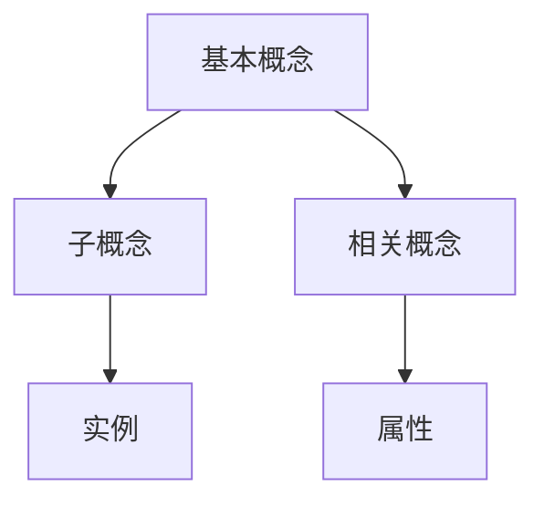

                 


# 实现AI Agent的概念学习与泛化能力

---

## 关键词：
AI Agent, 概念学习, 泛化能力, 深度学习, 知识表示, 符号学习, 强化学习

---

## 摘要：
AI Agent的概念学习与泛化能力是实现智能体核心功能的关键。本文从AI Agent的基本概念出发，探讨其概念学习的背景、问题背景和实际应用。通过分析符号学习与深度学习的差异，提出结合符号学习和深度学习的混合方法，以提升AI Agent的泛化能力。文章详细阐述了算法原理、系统架构设计和项目实战，并提供了最佳实践建议。

---

## 第一部分：AI Agent的概念学习与泛化能力背景

### 第1章：AI Agent的基本概念与问题背景

#### 1.1 问题背景
- **AI Agent的定义与核心目标**：
  AI Agent（智能体）是能够感知环境、自主决策并采取行动的实体。其核心目标是通过学习和推理，实现对复杂任务的高效处理。
- **概念学习与泛化能力的重要性**：
  概念学习使AI Agent能够理解抽象概念，而泛化能力则使其能够在不同场景中应用这些概念。
- **当前AI Agent在概念学习中的挑战**：
  当前AI Agent主要依赖大量数据和深度学习模型，但在概念理解和泛化能力方面仍存在不足。

#### 1.2 问题描述
- **AI Agent如何实现概念学习**：
  需要结合符号学习和深度学习，构建多层次的知识表示和推理机制。
- **泛化能力在实际应用中的意义**：
  泛化能力使AI Agent能够适应不同环境和任务，提升其通用性和灵活性。
- **当前技术的局限性**：
  当前AI Agent主要依赖统计学习方法，难以处理抽象概念和逻辑推理。

#### 1.3 问题解决
- **符号学习与深度学习的结合**：
  符号学习提供明确的知识表示，深度学习提供强大的特征学习能力，两者结合可提升概念学习和泛化能力。
- **知识图谱与强化学习的融合**：
  利用知识图谱构建概念间的关系，结合强化学习进行策略优化，提升AI Agent的决策能力。

#### 1.4 边界与外延
- **AI Agent的边界**：
  AI Agent的能力受限于其知识库和学习算法，无法处理超出训练范围的问题。
- **概念学习的外延**：
  概念学习不仅限于特定领域，还可扩展到跨领域的知识整合。

#### 1.5 概念结构与核心要素
- **概念结构**：
  包括基本概念、子概念、相关概念和例外情况。
- **核心要素**：
  包括概念的定义、属性、关系和实例。

---

## 第二部分：AI Agent的核心概念与联系

### 第2章：AI Agent的核心概念与联系

#### 2.1 概念结构的详细分析
- **基本概念**：
  每个概念由定义、属性和实例组成。
- **子概念与相关概念**：
  子概念是基本概念的细化，相关概念是与其他概念的关系。

#### 2.2 概念属性特征对比表
| 属性 | 符号学习 | 深度学习 |
|------|----------|----------|
| 表示方式 | 符号化 | 向量化 |
| 可解释性 | 高 | 低 |
| 学习效率 | 低 | 高 |

#### 2.3 概念关系图


---

## 第三部分：AI Agent的算法原理讲解

### 第3章：符号学习与深度学习的算法原理

#### 3.1 符号学习的算法原理
- **感知器模型**：
  ```mermaid
  graph TD
  Input --> W[权重]
  W --> Output[输出]
  ```
  感知器模型通过线性组合和阈值判断进行分类。
- **决策树与规则学习**：
  决策树通过特征选择构建规则，规则学习通过归纳逻辑规则进行分类。

#### 3.2 深度学习的算法原理
- **神经网络模型**：
  ```mermaid
  graph TD
  Input --> Neuron[神经元]
  Neuron --> Output[输出]
  ```
  神经网络通过多层非线性变换学习复杂的特征表示。
- **卷积神经网络（CNN）**：
  用于图像识别，通过卷积操作提取空间特征。

#### 3.3 混合学习算法
- **符号与深度学习的结合**：
  使用符号学习构建知识图谱，利用深度学习进行特征提取和关联推理。

---

## 第四部分：AI Agent的系统分析与架构设计

### 第4章：AI Agent系统分析与架构设计

#### 4.1 系统功能设计
- **领域模型**：
  ```mermaid
  classDiagram
  class Agent {
    + knowledge: KnowledgeBase
    + action: Executor
    + perception: Sensor
  }
  ```
  Agent包含知识库、执行器和感知器，分别负责知识存储、行动执行和环境感知。
- **系统架构图**：
  ```mermaid
  architecture
  Agent --> KnowledgeBase
  Agent --> Executor
  Agent --> Sensor
  ```
  Agent与知识库、执行器和传感器进行交互，实现感知、决策和行动。

#### 4.2 系统交互流程
- **交互流程图**：
  ```mermaid
  sequenceDiagram
  Agent -> Sensor: 获取环境信息
  Sensor -> Agent: 返回感知数据
  Agent -> KnowledgeBase: 查询知识库
  KnowledgeBase -> Agent: 返回相关知识
  Agent -> Executor: 执行动作
  Executor -> Agent: 返回执行结果
  ```

---

## 第五部分：AI Agent的项目实战

### 第5章：AI Agent项目实战

#### 5.1 环境安装与配置
- **安装Python环境**：
  使用Anaconda或虚拟环境，安装必要的库如TensorFlow、Keras和scikit-learn。
- **安装AI框架**：
  安装TensorFlow和PyTorch等深度学习框架，以及符号学习库如NLTK。

#### 5.2 系统核心实现
- **知识库构建**：
  使用符号学习方法构建知识图谱，定义概念、属性和关系。
- **模型训练**：
  使用深度学习模型训练分类器，提取特征并进行关联推理。

#### 5.3 案例分析与实现解读
- **案例分析**：
  以自然语言处理任务为例，构建一个问答系统，结合符号学习和深度学习进行推理。
- **代码实现**：
  ```python
  import tensorflow as tf
  from tensorflow.keras import layers
  model = tf.keras.Sequential([
      layers.Dense(64, activation='relu'),
      layers.Dense(10, activation='softmax')
  ])
  model.compile(optimizer='adam', loss='sparse_categorical_crossentropy', metrics=['accuracy'])
  model.fit(x_train, y_train, epochs=10)
  ```

---

## 第六部分：AI Agent的最佳实践

### 第6章：最佳实践

#### 6.1 小结
- **符号学习与深度学习的结合**：
  符号学习提供可解释性，深度学习提供强大的特征学习能力，两者结合可提升概念学习和泛化能力。
- **系统设计的关键点**：
  知识库构建、系统交互设计和模型优化是实现AI Agent的关键。

#### 6.2 注意事项
- **数据质量**：
  数据清洗和预处理是确保模型性能的重要步骤。
- **模型调优**：
  使用交叉验证和超参数调优提升模型性能。

#### 6.3 拓展阅读
- **相关书籍**：
  《深度学习》、《机器学习实战》。
- **论文推荐**：
  "Deep Learning for Symbolic Reasoning"、"Neural-symbolic Integration for AI".

---

## 第七部分：参考文献

1. LeCun, Y., Bengio, Y., & Hinton, G. (2015). Deep learning. Nature, 521(7552), 436-444.
2. Goodfellow, I., Bengio, Y., & Courville, A. (2016). Deep learning. MIT Press.
3. Russell, S., & Norvig, P. (2010). Artificial Intelligence: A Modern Approach. Pearson.

---

## 作者：AI天才研究院/AI Genius Institute & 禅与计算机程序设计艺术/Zen And The Art of Computer Programming

---

**联系与合作**：  
邮箱：contact@aicourse.com  
官网：https://www.aicourse.com

