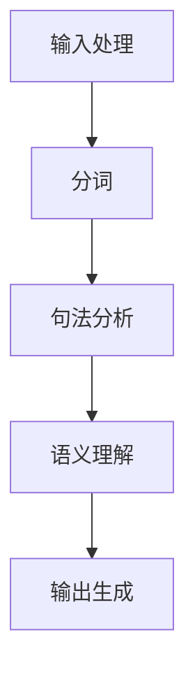

                 


# 实现AI Agent的自然语言理解能力

---

## 关键词  
AI Agent, 自然语言理解, 深度学习, 预训练语言模型, 语义理解, 对话系统, 实时交互

---

## 摘要  
本文将深入探讨实现AI Agent自然语言理解能力的核心技术与方法。从基础的自然语言处理技术到深度学习模型的应用，再到预训练语言模型的实现，结合系统架构设计与项目实战，全面解析如何构建一个具备自然语言理解能力的AI Agent。文章通过理论分析与实践结合，帮助读者掌握从概念到实现的完整流程。

---

# 第1章: AI Agent与自然语言理解概述

## 1.1 AI Agent的基本概念  
AI Agent（人工智能代理）是指能够感知环境并采取行动以实现目标的智能实体。在自然语言理解（NLU）领域，AI Agent需要能够理解用户的输入，解析其中的意图，并生成相应的响应。

### 1.1.1 AI Agent的定义与特点  
- **定义**：AI Agent是一个能够执行任务的智能实体，通常通过传感器或用户输入感知环境，并通过执行器或输出模块与环境交互。  
- **特点**：  
  - 智能性：能够理解输入并生成智能输出。  
  - 实时性：能够在较短时间内完成任务。  
  - 适应性：能够根据环境变化调整行为。  

### 1.1.2 自然语言理解在AI Agent中的作用  
自然语言理解是AI Agent的核心能力之一，它使得AI Agent能够理解人类语言的输入，从而实现人机交互。  

### 1.1.3 AI Agent的应用场景与挑战  
- **应用场景**：  
  - 智能助手（如Siri、Alexa）。  
  - 客服机器人。  
  - 智能对话系统。  
- **挑战**：  
  - 语言的歧义性。  
  - 实时处理的高效性。  
  - 多语言支持。  

---

## 1.2 自然语言理解的核心技术  
自然语言理解技术是实现AI Agent的关键，主要包括分词、句法分析和语义理解。

### 1.2.1 词法分析  
词法分析是将输入的文本分割成词语或符号的过程。  
- **分词算法**：  
  - 基于规则的分词（如正向最大匹配法）。  
  - 基于统计的分词（如动态规划）。  

### 1.2.2 句法分析  
句法分析是对文本的语法结构进行分析，通常用于理解句子的结构。  
- **句法分析算法**：  
  - 依赖句法分析（如 constituency parsing）。  

### 1.2.3 语义理解  
语义理解是理解文本含义的核心步骤。  
- **语义理解算法**：  
  - 基于规则的方法。  
  - 统计方法（如 TF-IDF）。  
  - 深度学习方法（如 LSTM）。  

---

## 1.3 本章小结  
本章介绍了AI Agent的基本概念、自然语言理解的核心技术以及应用场景与挑战。通过理解这些内容，我们可以为后续的实现打下基础。

---

# 第2章: 自然语言处理的核心技术

## 2.1 分词技术  
分词技术是自然语言处理的基础，用于将连续的文本分割成有意义的词语。  

### 2.1.1 分词的基本概念  
- **分词**：将连续的字符序列分割成有意义的词语。  
- **分词的挑战**：  
  - 生僻词的处理。  
  - 词语的歧义性。  

### 2.1.2 常见的分词算法  
- **基于规则的分词**：  
  - 正向最大匹配法。  
  - 反向最大匹配法。  
- **基于统计的分词**：  
  - HMM（隐马尔可夫模型）。  

---

## 2.2 句法分析  
句法分析是对文本语法结构的分析，帮助理解句子的结构关系。  

### 2.2.1 句法分析的基本概念  
- **句法分析**：研究句子的语法结构，确定词语之间的关系。  
- **句法分析的类型**：  
  - 主谓关系。  
  - 动宾关系。  

---

## 2.3 语义理解  
语义理解是自然语言处理的核心，旨在理解文本的含义。  

### 2.3.1 语义理解的基本概念  
- **语义理解**：理解文本的含义，提取有用的信息。  
- **语义理解的挑战**：  
  - 文本的歧义性。  
  - 文化和上下文的影响。  

---

## 2.4 本章小结  
本章详细介绍了自然语言处理的核心技术，包括分词、句法分析和语义理解。这些技术是实现AI Agent自然语言理解能力的基础。

---

# 第3章: 基于深度学习的自然语言理解

## 3.1 深度学习基础  
深度学习是一种基于人工神经网络的机器学习方法，广泛应用于自然语言处理领域。  

### 3.1.1 深度学习的基本概念  
- **深度学习**：通过多层神经网络模拟人脑的计算方式。  
- **深度学习的特点**：  
  - 非线性特征提取。  
  - 自动学习特征。  

---

## 3.2 神经网络基础  
神经网络是深度学习的核心，用于模拟人脑的计算方式。  

### 3.2.1 神经网络的基本结构  
- **神经网络的组成**：  
  - 输入层。  
  - 隐藏层。  
  - 输出层。  

---

## 3.3 预训练语言模型  
预训练语言模型（如BERT）是当前自然语言处理的主流技术，能够通过大规模数据预训练实现高效的语义理解。  

### 3.3.1 BERT模型的原理  
- **BERT模型**：基于Transformer的预训练模型。  
- **BERT模型的优势**：  
  - 能够理解上下文关系。  
  - 支持多语言任务。  

---

## 3.4 本章小结  
本章介绍了基于深度学习的自然语言理解技术，包括深度学习基础、神经网络基础和预训练语言模型。这些技术为实现AI Agent的自然语言理解提供了强大的工具。

---

# 第4章: 系统架构与项目实战

## 4.1 系统架构设计  
AI Agent的系统架构设计是实现自然语言理解能力的关键。  

### 4.1.1 系统架构图  


### 4.1.2 功能模块设计  
- **输入处理模块**：接收用户输入并进行预处理。  
- **分词模块**：将文本分割成词语。  
- **句法分析模块**：分析句子的语法结构。  
- **语义理解模块**：理解文本的含义并生成响应。  

---

## 4.2 项目实战  
通过一个简单的AI Agent项目，展示如何实现自然语言理解能力。  

### 4.2.1 环境安装  
```bash
pip install numpy
pip install scikit-learn
pip install transformers
```

### 4.2.2 核心代码实现  
```python
from transformers import BertTokenizer, BertModel
import torch

tokenizer = BertTokenizer.from_pretrained('bert-base-chinese')
model = BertModel.from_pretrained('bert-base-chinese')

def text_classification(text):
    inputs = tokenizer(text, return_tensors='pt')
    outputs = model(**inputs)
    return outputs.last_hidden_state[:, 0, :]
```

### 4.2.3 代码解读与分析  
- **代码功能**：对输入文本进行分词和编码，然后通过BERT模型生成文本的语义表示。  
- **关键点**：  
  - 使用预训练的BERT模型。  
  - 生成文本的语义向量。  

---

## 4.3 本章小结  
本章通过系统架构设计和项目实战，展示了如何实现AI Agent的自然语言理解能力。通过代码实现和系统设计，读者可以更好地理解理论知识。

---

# 第5章: 总结与展望

## 5.1 总结  
本文详细介绍了实现AI Agent自然语言理解能力的核心技术与方法，包括分词、句法分析、语义理解、深度学习和系统架构设计。

## 5.2 展望  
未来，随着深度学习和大模型技术的发展，AI Agent的自然语言理解能力将更加智能化和个性化。

---

# 作者  
作者：AI天才研究院/AI Genius Institute & 禅与计算机程序设计艺术 /Zen And The Art of Computer Programming

