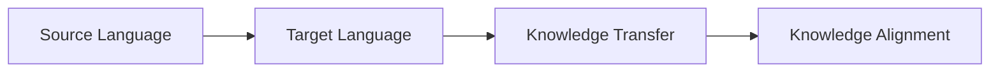
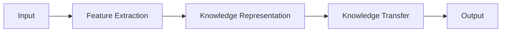
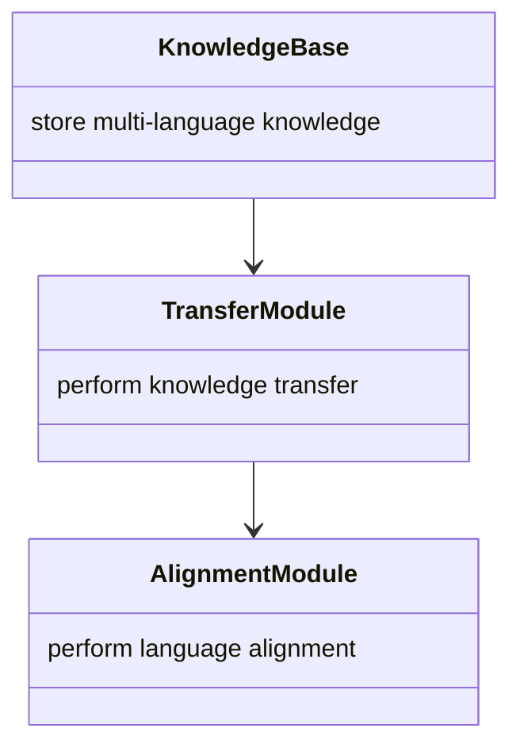
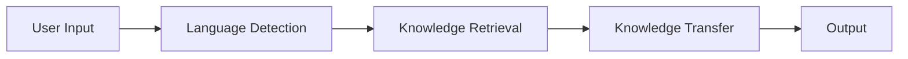

                 


# 实现AI Agent的跨语言知识迁移

> 关键词：AI Agent, 跨语言知识迁移, 人工智能, 自然语言处理, 机器学习, 知识图谱, 系统架构

> 摘要：本文将详细探讨AI Agent的跨语言知识迁移的核心概念、算法原理、系统架构以及实现方法。通过对AI Agent的知识表示、跨语言知识迁移的原理与机制、算法实现、系统架构设计、项目实战和最佳实践的深入分析，为读者提供一个全面而系统的视角，帮助理解并实现跨语言知识迁移。

---

# 第1章 AI Agent的基本概念

## 1.1 AI Agent的定义与特点

### 1.1.1 AI Agent的定义
AI Agent（人工智能代理）是指能够感知环境、理解任务目标并采取行动以实现目标的智能实体。它可以是一个软件程序、一个机器人或一个虚拟助手，通过与环境交互来完成特定任务。

### 1.1.2 AI Agent的核心特点
- **自主性**：AI Agent能够在没有外部干预的情况下独立运作。
- **反应性**：能够实时感知环境并做出反应。
- **目标导向性**：通过设定目标来指导行为和决策。
- **学习能力**：能够通过经验或数据不断优化自身的知识和能力。

### 1.1.3 AI Agent与传统AI的区别
传统AI主要依赖预定义的规则和数据，而AI Agent具有更强的自主性和适应性，能够根据环境动态调整行为。

---

## 1.2 跨语言知识迁移的背景

### 1.2.1 多语言AI Agent的需求
随着全球化的发展，AI Agent需要能够理解并处理多种语言的信息，以满足跨语言场景的需求。

### 1.2.2 知识迁移的必要性
跨语言知识迁移能够使AI Agent在一种语言环境中学习的知识和经验，能够在另一种语言环境中得到有效应用。

### 1.2.3 跨语言知识迁移的挑战
- **语言差异**：不同语言之间的语义和语法差异。
- **数据稀疏性**：某些语言的数据量较少，影响迁移效果。
- **文化差异**：不同语言背后的文化背景可能影响知识的适用性。

---

# 第2章 跨语言知识迁移的核心问题

## 2.1 跨语言知识迁移的定义
跨语言知识迁移是指将一种语言中的知识、经验或模型迁移到另一种语言中，以提高AI Agent在目标语言环境中的性能。

## 2.2 跨语言知识迁移的关键问题
- **知识表示**：如何在不同语言之间统一表示知识。
- **知识对齐**：如何将不同语言中的知识进行对齐，使其能够相互理解和应用。
- **知识适应**：如何根据目标语言的特点调整知识的表达方式。

## 2.3 跨语言知识迁移的边界与外延
跨语言知识迁移的边界包括语言本身的差异和文化差异，外延则涉及多模态数据和多语言模型的结合。

## 2.4 跨语言知识迁移的核心要素组成
- **知识库**：存储多语言知识的数据结构。
- **迁移算法**：用于将知识从一种语言迁移到另一种语言的算法。
- **评估指标**：衡量跨语言知识迁移效果的标准。

---

# 第3章 AI Agent的知识表示与存储

## 3.1 知识表示的定义与方法
知识表示是将知识以计算机可理解的形式存储和表达的过程。常见的知识表示方法包括符号表示、语义网络和知识图谱。

## 3.2 跨语言知识的存储结构
- **多语言知识图谱**：将不同语言的知识以图结构的形式存储。
- **跨语言词汇映射**：通过词汇对齐技术，建立不同语言词汇之间的映射关系。

## 3.3 知识图谱的构建与应用
知识图谱是一种以图结构形式表示知识的数据库，广泛应用于搜索引擎、问答系统和推荐系统。

---

# 第4章 跨语言知识迁移的原理与机制

## 4.1 知识迁移的基本原理
知识迁移的核心是通过某种机制，将源语言的知识转化为目标语言的知识，同时保持知识的语义一致性。

## 4.2 跨语言知识迁移的机制
- **直接迁移**：将源语言的知识直接应用于目标语言，适用于语义相似的语言。
- **间接迁移**：通过中间语言或跨语言对齐技术，实现知识的迁移。

## 4.3 跨语言知识迁移的核心算法
- **对比学习**：通过对比源语言和目标语言的特征，实现知识的对齐。
- **自适应学习**：通过自适应模型，调整知识的表达方式，使其适用于目标语言。

---

# 第5章 跨语言知识迁移的核心概念关系图

## 5.1 知识表示与迁移的关系
知识表示是跨语言知识迁移的基础，通过统一的知识表示形式，可以实现知识的跨语言迁移。

## 5.2 跨语言知识迁移的实体关系图


---

# 第6章 跨语言知识迁移的算法原理

## 6.1 跨语言知识迁移的基本算法


## 6.2 跨语言知识迁移的对比学习
对比学习通过对比源语言和目标语言的特征，实现知识的对齐。其核心公式为：
$$ \text{loss} = \frac{1}{|B|} \sum_{i=1}^{B} \text{contrast}(x_i, y_i) $$
其中，$B$是批次大小，$x_i$是源语言特征，$y_i$是目标语言特征。

---

# 第7章 跨语言知识迁移的数学模型与公式

## 7.1 跨语言知识迁移的概率模型
概率模型通过计算不同语言之间的条件概率，实现知识的迁移：
$$ P(y|x) = \frac{P(x|y)P(y)}{P(x)} $$

## 7.2 跨语言知识迁移的损失函数
常用的损失函数包括交叉熵损失和对比损失：
$$ \text{loss}_{\text{cross-entropy}} = -\sum_{i=1}^{N} y_i \log p_i $$
$$ \text{loss}_{\text{contrast}} = \frac{1}{N} \sum_{i=1}^{N} \text{contrast}(x_i, y_i) $$

---

# 第8章 跨语言知识迁移的系统架构与设计

## 8.1 系统功能模块设计


## 8.2 系统架构设计


---

# 第9章 项目实战

## 9.1 环境安装
- **Python 3.8+**
- **TensorFlow 2.0+**
- **Transformers库**

## 9.2 系统核心实现源代码
```python
import tensorflow as tf
from transformers import *

class MultiLanguageAgent:
    def __init__(self, languages):
        self.languages = languages
        self.models = {lang: self._initialize_model(lang) for lang in languages}
    
    def _initialize_model(self, lang):
        return AutoModel.from_pretrained(lang_model)
    
    def transfer_knowledge(self, source_lang, target_lang):
        source_model = self.models[source_lang]
        target_model = self.models[target_lang]
        # Perform knowledge transfer
        return target_model
```

## 9.3 代码解读与分析
- **MultiLanguageAgent**：管理多语言模型的初始化和知识迁移。
- **transfer_knowledge**：实现从源语言到目标语言的知识迁移。

## 9.4 实际案例分析
通过具体案例分析，展示跨语言知识迁移的实际应用和效果。

---

# 第10章 最佳实践

## 10.1 小结
跨语言知识迁移是实现AI Agent多语言能力的关键技术，通过合理的知识表示和高效的迁移算法，可以显著提升AI Agent的跨语言性能。

## 10.2 注意事项
- 确保数据质量和多样性。
- 选择合适的迁移算法和模型。
- 定期评估和优化迁移效果。

## 10.3 拓展阅读
建议读者进一步阅读相关领域的最新研究成果和论文。

---

# 作者

作者：AI天才研究院/AI Genius Institute & 禅与计算机程序设计艺术 /Zen And The Art of Computer Programming

