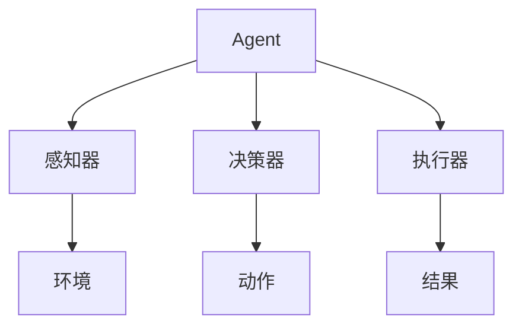
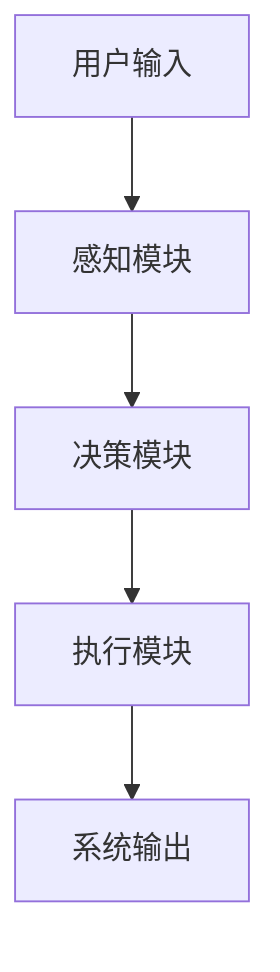
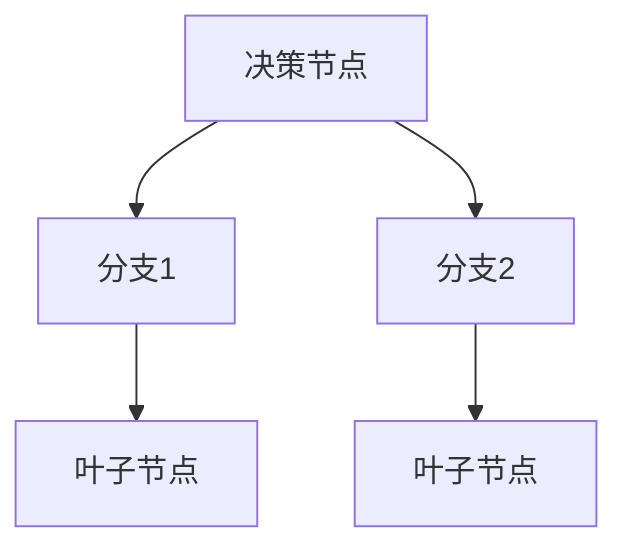
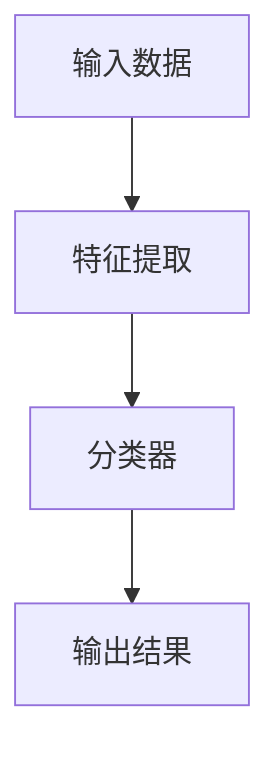
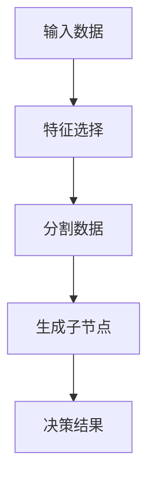
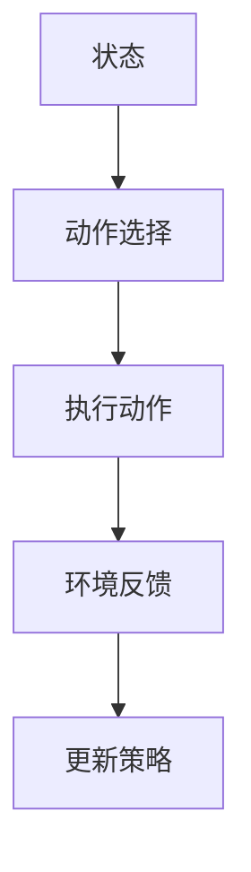
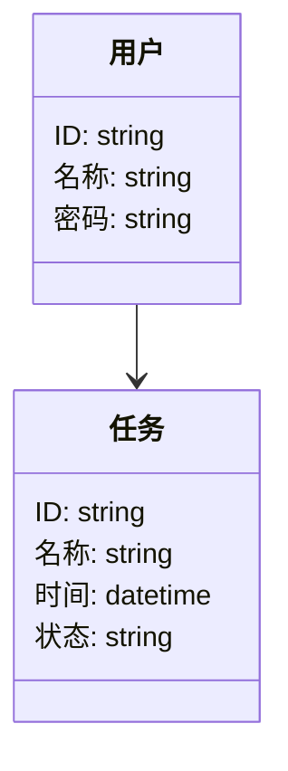
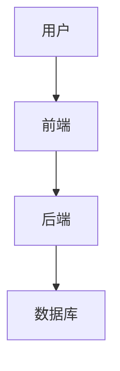
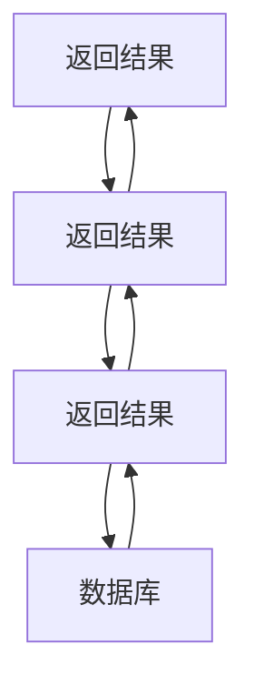

                 


# 实现基于AI Agent的个人助理系统

> 关键词：AI Agent，个人助理，智能代理，算法原理，系统架构，项目实战

> 摘要：本文从零开始，系统地介绍如何实现一个基于AI Agent的个人助理系统。我们将从AI Agent的基本概念和应用场景入手，逐步深入探讨其实现的核心算法原理、系统架构设计以及项目实战。通过本文的学习，读者将能够掌握从理论到实践的完整流程，从而开发出一个功能强大的AI Agent驱动的个人助理系统。

---

# 第1章: AI Agent与个人助理系统概述

## 1.1 AI Agent的基本概念

### 1.1.1 什么是AI Agent

AI Agent（人工智能代理）是指能够感知环境、自主决策并执行任务的智能实体。它通过与用户和环境的交互，完成特定的目标。AI Agent可以是软件程序、机器人或其他智能设备，其核心在于具备智能性和自主性。

### 1.1.2 AI Agent的核心特征

AI Agent的核心特征包括：

1. **自主性**：能够在没有外部干预的情况下自主运行。
2. **反应性**：能够实时感知环境并做出反应。
3. **目标导向性**：具备明确的目标，并通过行动实现目标。
4. **学习能力**：能够通过经验改进自身的性能。

### 1.1.3 AI Agent的分类与应用场景

AI Agent可以根据功能和应用场景分为以下几类：

- **简单反射型Agent**：基于当前输入做出简单反应，如计算器。
- **基于模型的反射型Agent**：利用内部模型进行决策，如推荐系统。
- **目标驱动型Agent**：根据目标选择行动，如任务管理器。
- **实用驱动型Agent**：通过效用函数优化决策，如智能音箱。

应用场景包括智能音箱、任务管理、聊天机器人、自动驾驶助手等。

---

## 1.2 个人助理系统的发展历程

### 1.2.1 从传统任务管理到智能化助手

早期的个人助理系统主要依赖手动输入和固定规则，功能简单，无法处理复杂任务。随着AI技术的发展，智能化助手逐渐取代传统工具，具备了自主决策和学习能力。

### 1.2.2 个人助理系统的发展

个人助理系统的演变经历了以下几个阶段：

1. **阶段一：简单工具阶段**：提供基本的任务管理功能，如日历、提醒。
2. **阶段二：规则驱动阶段**：基于预设规则自动执行任务，如自动回复邮件。
3. **阶段三：智能代理阶段**：引入AI技术，具备自主学习和决策能力，如Siri、Alexa。

### 1.2.3 当前AI Agent在个人助理中的应用

当前，AI Agent在个人助理中的应用越来越广泛，典型应用包括：

- **语音交互**：通过语音识别和自然语言处理技术实现人机交互。
- **任务自动化**：自动安排日程、发送邮件、管理文件。
- **信息检索与推荐**：根据用户需求推荐相关内容或服务。

---

## 1.3 本章小结

本章介绍了AI Agent的基本概念和核心特征，并分析了个人助理系统的发展历程及其应用场景。通过本章的学习，读者可以理解AI Agent在个人助理系统中的重要性及其发展趋势。

---

# 第2章: AI Agent的核心概念与原理

## 2.1 AI Agent的实体关系图

通过以下实体关系图，我们可以清晰地理解AI Agent的核心组成部分：



## 2.2 AI Agent的系统架构

AI Agent的系统架构如下：



## 2.3 AI Agent的核心原理

### 2.3.1 感知模块的工作原理

感知模块通过传感器或API接口获取环境中的信息，如用户输入、设备状态等。其数学模型可以表示为：

$$
y = f(x)
$$

其中，$x$ 是输入，$f$ 是感知器函数。

### 2.3.2 决策模块的算法选择

决策模块基于感知到的信息，选择最优行动。常用的算法包括决策树和强化学习。决策树的结构如下：



### 2.3.3 执行模块的实现方式

执行模块根据决策结果执行实际操作，如发送邮件、调整设备参数等。

---

## 2.4 本章小结

本章详细讲解了AI Agent的核心概念与原理，并通过实体关系图和系统架构图展示了其内部结构。通过本章的学习，读者可以理解AI Agent的组成和工作流程。

---

# 第3章: AI Agent的核心算法

## 3.1 感知器算法

### 3.1.1 感知器的数学模型

感知器算法的数学模型可以表示为：

$$
y = f(x)
$$

其中，$x$ 是输入，$f$ 是感知器函数。

### 3.1.2 感知器算法的实现

感知器算法的实现流程如下：



---

## 3.2 决策器算法

### 3.2.1 决策树算法

决策树算法的流程如下：


### 3.2.2 决策树算法的实现

决策树算法的实现流程如下：



---

## 3.3 执行器算法

### 3.3.1 强化学习算法

强化学习算法的目标是通过与环境的交互最大化累积奖励。其数学模型可以表示为：

$$
R = r_1 + r_2 + ... + r_n
$$

其中，$R$ 是总奖励，$r_i$ 是单个奖励。

### 3.3.2 强化学习算法的实现

强化学习算法的实现流程如下：



---

## 3.4 本章小结

本章详细讲解了AI Agent的核心算法，包括感知器算法、决策树算法和强化学习算法。通过本章的学习，读者可以理解AI Agent内部算法的实现原理。

---

# 第4章: 系统分析与架构设计

## 4.1 问题场景分析

### 4.1.1 用户需求分析

用户需求包括：

1. 自然语言理解：支持多轮对话。
2. 任务自动化：自动安排日程、发送邮件。
3. 信息检索：根据用户需求推荐相关内容。

### 4.1.2 系统功能分析

系统功能包括：

1. 用户交互界面：支持语音和文本输入。
2. 任务管理模块：自动安排和跟踪任务。
3. 信息检索模块：根据用户需求推荐相关内容。

### 4.1.3 系统性能分析

系统性能指标包括：

1. 响应时间：小于1秒。
2. 准确率：95%以上。
3. 并发能力：支持多用户同时使用。

---

## 4.2 系统功能设计

### 4.2.1 领域模型设计

领域模型类图如下：



### 4.2.2 系统架构设计

系统架构图如下：



### 4.2.3 系统接口设计

系统接口设计如下：

- **用户登录接口**：`POST /login`
- **任务管理接口**：`POST /tasks`
- **信息检索接口**：`POST /search`

### 4.2.4 系统交互流程

系统交互流程如下：



---

## 4.3 本章小结

本章详细分析了AI Agent个人助理系统的功能需求，并设计了系统的架构和接口。通过本章的学习，读者可以理解如何将理论应用于实际系统设计。

---

# 第5章: 项目实战

## 5.1 环境安装

项目实战需要以下环境：

1. Python 3.8+
2. pip
3. 以下Python库：
    - `numpy`
    - `pandas`
    - `scikit-learn`
    - `flask`

安装命令如下：

```bash
pip install numpy pandas scikit-learn flask
```

---

## 5.2 系统核心实现

### 5.2.1 感知模块实现

感知模块代码如下：

```python
import numpy as np

def感知器(x, weights):
    return np.dot(x, weights)
```

### 5.2.2 决策模块实现

决策模块代码如下：

```python
from sklearn.tree import DecisionTreeClassifier

def决策树训练(X, y):
    model = DecisionTreeClassifier()
    model.fit(X, y)
    return model
```

### 5.2.3 执行模块实现

执行模块代码如下：

```python
import random

def强化学习动作选择():
    return random.choice(['动作1', '动作2', '动作3'])
```

---

## 5.3 项目小结

本章通过项目实战，详细讲解了AI Agent个人助理系统的实现过程。通过本章的学习，读者可以掌握从理论到实践的完整流程。

---

# 第6章: 总结与展望

## 6.1 本章总结

本文系统地介绍了基于AI Agent的个人助理系统的实现过程，包括核心概念、算法原理、系统架构和项目实战。通过本文的学习，读者可以掌握从理论到实践的完整流程。

## 6.2 未来展望

未来，AI Agent在个人助理系统中的应用将更加广泛。随着AI技术的发展，AI Agent将具备更强的自主学习和决策能力，能够更好地满足用户需求。

---

# 作者

作者：AI天才研究院/AI Genius Institute & 禅与计算机程序设计艺术 /Zen And The Art of Computer Programming

---

**全文完**

