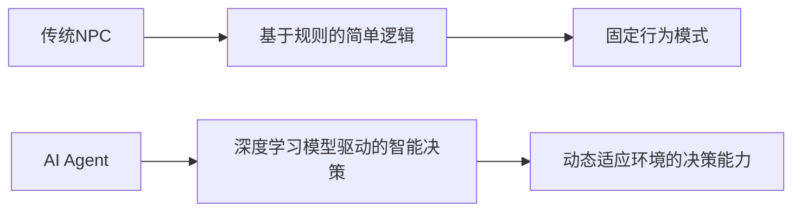
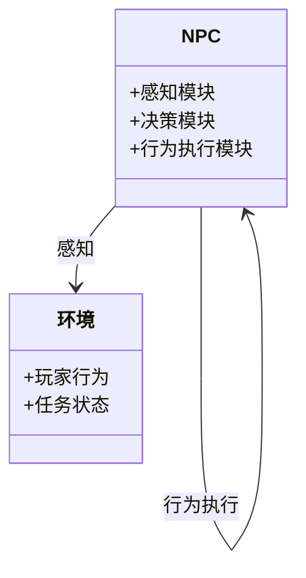
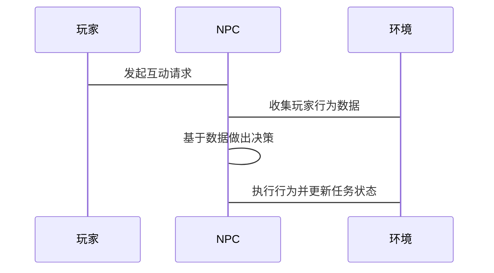

                 


# 《实现基于AI Agent的智能游戏NPC》

## 关键词：人工智能，游戏开发，智能NPC，AI Agent，强化学习

## 摘要：  
本文将深入探讨如何利用人工智能代理（AI Agent）实现智能游戏NPC（非玩家角色）。通过分析AI Agent的核心原理、算法实现、系统架构和项目实战，本文将为游戏开发者提供从理论到实践的全面指导，帮助他们打造更加智能化、动态适应环境的游戏角色。

---

# 第一部分: 基于AI Agent的智能游戏NPC背景介绍

---

## 第1章: 游戏NPC与AI Agent概述

### 1.1 游戏NPC的基本概念  
#### 1.1.1 游戏NPC的定义与作用  
- 游戏NPC（Non-Player Character）是游戏中与玩家互动的虚拟角色，负责提供任务、剧情推进或与玩家互动。  
- NPC的核心作用是增强游戏的沉浸感和玩家体验。  

#### 1.1.2 传统游戏NPC的实现方式  
- 传统NPC的行为通常基于简单的规则，如固定任务流程或触发式对话。  
- 例如：玩家接近NPC时触发对话，完成任务后给予奖励。  

#### 1.1.3 传统NPC的局限性与改进方向  
- 局限性：  
  - 行为单一，缺乏灵活性。  
  - 无法动态适应环境变化。  
  - 对玩家行为的反应不够智能。  
- 改进方向：引入AI Agent技术，使NPC具备自主决策和学习能力。  

### 1.2 AI Agent的基本概念  
#### 1.2.1 AI Agent的定义与特征  
- AI Agent（人工智能代理）是指能够感知环境、自主决策并执行任务的智能实体。  
- 特征：  
  - 感知能力：通过传感器或数据输入感知环境。  
  - 决策能力：基于感知信息做出最优决策。  
  - 行为执行能力：通过执行器或模块化代码实现行为。  

#### 1.2.2 AI Agent与传统NPC的区别  
| 特性                | 传统NPC                     | AI Agent-based NPC           |  
|---------------------|-----------------------------|------------------------------|  
| 行为决策方式        | 基于固定规则或脚本           | 基于AI算法动态决策           |  
| 环境适应能力        | 无法动态适应复杂环境         | 能够动态适应环境变化         |  
| 与玩家互动深度      | 互动单一，缺乏个性化         | 支持复杂对话和个性化互动     |  

#### 1.2.3 基于AI Agent的智能NPC的优势  
- 提供更个性化的玩家体验。  
- 自主决策能力提升游戏NPC的智能性和趣味性。  
- 动态适应环境，增强游戏的可玩性和深度。  

### 1.3 基于AI Agent的智能NPC的应用场景  
#### 1.3.1 游戏NPC的智能化需求  
- 玩家希望与NPC互动更加自然和智能。  
- 开发者希望通过智能NPC提升游戏的沉浸感和可玩性。  

#### 1.3.2 AI Agent在游戏中的具体应用  
- 自动任务分配与路径规划。  
- 智能对话生成与情感识别。  
- 动态行为调整以适应玩家行为。  

#### 1.3.3 智能NPC对游戏体验的提升  
- 提供更加丰富和复杂的剧情发展。  
- 增强玩家与游戏世界的互动深度。  
- 提高游戏的可玩性和复玩价值。  

### 1.4 本章小结  
本章介绍了传统NPC的局限性以及AI Agent的基本概念，重点分析了基于AI Agent的智能NPC的优势和应用场景，为后续章节的深入探讨奠定了基础。

---

## 第2章: AI Agent的核心原理  

### 2.1 AI Agent的基本原理  
#### 2.1.1 AI Agent的感知模块  
- 感知模块负责收集环境中的数据，例如玩家的位置、行为、对话内容等。  
- 常见的感知方式包括传感器数据、API调用或数据库查询。  

#### 2.1.2 AI Agent的决策模块  
- 决策模块基于感知信息，结合预设目标和优化算法，生成决策指令。  
- 常见的决策算法包括基于规则的决策、基于机器学习的决策和基于强化学习的决策。  

#### 2.1.3 AI Agent的行为执行模块  
- 行为执行模块负责将决策指令转化为具体的行为，例如移动、对话或触发任务。  
- 行为执行依赖于游戏引擎的API或自定义脚本。  

### 2.2 AI Agent与游戏NPC的关系  
#### 2.2.1 游戏NPC作为AI Agent的应用场景  
- NPC作为AI Agent，能够自主决策并执行任务，例如巡逻、任务分配或与玩家互动。  

#### 2.2.2 AI Agent在游戏NPC中的角色与功能  
- AI Agent作为NPC的“大脑”，负责感知玩家行为、做出决策并执行相应的动作。  

### 2.3 AI Agent的核心算法与技术  
#### 2.3.1 基于规则的AI Agent  
- 通过预设的规则和条件判断来实现简单的逻辑推理。  
- 优点：简单易实现，适合处理规则明确的任务。  
- 缺点：缺乏灵活性，难以应对复杂场景。  

#### 2.3.2 基于机器学习的AI Agent  
- 利用机器学习模型（如神经网络）进行分类、回归或聚类任务。  
- 优点：能够处理复杂数据，发现隐藏的模式。  
- 缺点：需要大量数据和计算资源，开发周期较长。  

#### 2.3.3 基于强化学习的AI Agent  
- 通过强化学习算法（如Q-learning或Deep Q-Network）进行决策优化。  
- 优点：能够动态适应环境，实现自主学习和优化。  
- 缺点：训练过程复杂，需要设计合适的奖励机制。  

---

## 第3章: 基于AI Agent的智能NPC核心概念对比  

### 3.1 AI Agent与传统NPC的特征对比  
#### 3.1.1 基于表格的特征对比  
| 特性                | 传统NPC                     | AI Agent-based NPC           |  
|---------------------|-----------------------------|------------------------------|  
| 行为决策方式        | 基于固定规则或脚本           | 基于AI算法动态决策           |  
| 环境适应能力        | 无法动态适应复杂环境         | 能够动态适应环境变化         |  
| 与玩家互动深度      | 互动单一，缺乏个性化         | 支持复杂对话和个性化互动     |  

#### 3.1.2 基于图的特征关系图  



---

## 第4章: 基于AI Agent的智能NPC算法原理  

### 4.1 基于强化学习的智能NPC算法  
#### 4.1.1 强化学习的基本原理  
- 强化学习是一种通过试错机制进行学习的算法，通过不断尝试不同的行为并根据反馈（奖励或惩罚）来优化决策策略。  

#### 4.1.2 基于强化学习的智能NPC算法  


- 算法公式：  
  $$ Q(s, a) = Q(s, a) + \alpha (r + \max Q(s', a') - Q(s, a)) $$  
  其中，\( s \) 是状态，\( a \) 是动作，\( r \) 是奖励，\( \alpha \) 是学习率，\( Q(s, a) \) 是Q值函数。  

### 4.2 基于深度学习的智能NPC算法  
#### 4.2.1 深度学习的基本原理  
- 深度学习通过多层神经网络来学习数据的高层次特征，能够处理复杂的非线性关系。  

#### 4.2.2 基于深度学习的智能NPC算法  


- 算法公式：  
  $$ y = f(x) $$  
  其中，\( x \) 是输入，\( y \) 是输出，\( f \) 是深度神经网络模型。  

---

## 第5章: 基于AI Agent的智能NPC系统分析与架构设计  

### 5.1 系统架构设计  
#### 5.1.1 系统功能模块  
- 感知模块：收集玩家行为、环境数据等。  
- 决策模块：基于感知数据做出决策。  
- 行为执行模块：根据决策执行具体动作。  

#### 5.1.2 系统架构图  



### 5.2 系统接口设计  
- 环境接口：提供玩家行为和任务状态的数据接口。  
- NPC接口：提供与玩家互动的API，例如对话生成和任务触发。  

### 5.3 系统交互流程  



---

## 第6章: 基于AI Agent的智能NPC项目实战  

### 6.1 环境安装与配置  
#### 6.1.1 安装Python和相关库（如TensorFlow、Keras）  
#### 6.1.2 安装游戏引擎（如Unity或Unreal Engine）  

### 6.2 系统核心实现  
#### 6.2.1 NPC感知模块的实现  
- 使用传感器或API收集玩家行为数据。  

#### 6.2.2 NPC决策模块的实现  
- 使用强化学习算法进行决策优化。  

#### 6.2.3 NPC行为执行模块的实现  
- 通过脚本或API实现具体行为，例如移动、对话等。  

### 6.3 代码实现与解读  
#### 6.3.1 感知模块的Python代码示例  

```python
class PerceptionModule:
    def __init__(self):
        self.player_behavior = None
    
    def update(self):
        self.player_behavior = get_player_behavior()
```

#### 6.3.2 决策模块的强化学习代码示例  

```python
class DecisionModule:
    def __init__(self):
        self.model = self.build_model()
    
    def build_model(self):
        # 构建深度神经网络模型
        pass
    
    def decide(self, state):
        return self.model.predict(state)
```

#### 6.3.3 行为执行模块的Python代码示例  

```python
class ActionModule:
    def __init__(self):
        self.task_status = None
    
    def execute(self, action):
        self.task_status = update_task_status(action)
```

### 6.4 实际案例分析  
#### 6.4.1 智能NPC在MMORPG中的应用  
- 智能NPC可以根据玩家的等级和任务需求动态分配任务。  

#### 6.4.2 智能NPC在RTS游戏中的应用  
- 智能NPC可以作为敌方单位，根据战场情况自主决策。  

### 6.5 项目小结  
通过实际案例的分析，我们可以看到基于AI Agent的智能NPC在游戏开发中的巨大潜力和实际应用价值。

---

## 第7章: 总结与展望  

### 7.1 总结  
本文从背景介绍、核心概念、算法原理到项目实战，全面探讨了如何利用AI Agent实现智能游戏NPC。通过引入强化学习和深度学习技术，智能NPC能够动态适应环境并提供更加个性化的玩家体验。  

### 7.2 未来展望  
- **多智能体协作**：未来的游戏NPC可能需要与其他NPC或玩家协同工作，形成更加复杂的智能生态。  
- **强化学习的优化**：通过改进强化学习算法，进一步提升智能NPC的决策能力和学习效率。  
- **情感计算与人机交互**：结合情感计算技术，使智能NPC具备更丰富的情感表达和互动能力。  

---

## 作者：AI天才研究院/AI Genius Institute & 禅与计算机程序设计艺术 /Zen And The Art of Computer Programming  

---

通过以上目录和内容设计，您可以逐步展开每个章节的详细内容，结合实际案例和代码实现，为读者提供一份全面的基于AI Agent的智能游戏NPC的实现指南。

