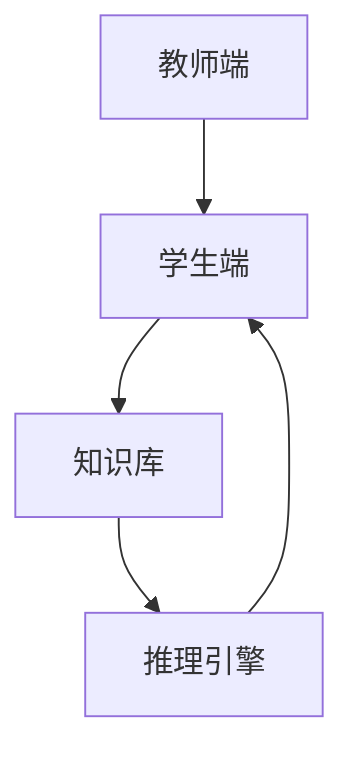
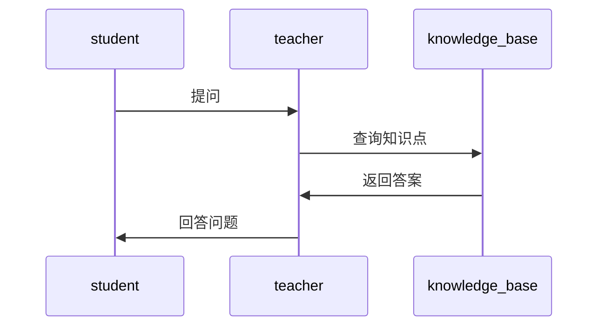

                 


# 实现基于AI Agent的智能虚拟教师

> 关键词：AI Agent, 智能虚拟教师, 人工智能教育, 教育科技, 智能系统设计, 知识图谱

> 摘要：本文章详细探讨了如何利用AI Agent技术构建智能虚拟教师系统，涵盖其核心原理、系统架构设计、算法实现及实际应用案例。通过分析教育场景中的问题，提出解决方案，并提供从理论到实践的详细指导，帮助读者掌握智能虚拟教师的实现方法。

---

## 目录大纲

### 第一章：背景介绍

#### 1.1 问题背景
- 传统教育中的痛点：资源分配不均、个性化需求未满足
- AI技术在教育中的应用潜力：提高效率、实现个性化学习

#### 1.2 问题描述
- 学生学习效率低下的原因
- 教师资源分配不均的问题

#### 1.3 问题解决
- AI Agent作为虚拟教师的优势
- 提供个性化学习支持

#### 1.4 边界与外延
- AI Agent的定义与范围
- 智能虚拟教师的应用场景

#### 1.5 核心概念与组成
- AI Agent的基本结构
- 智能虚拟教师的功能模块

### 第二章：核心概念与联系

#### 2.1 AI Agent的核心原理
- 感知模块：数据采集与处理
- 推理模块：知识表示方法
- 决策模块：决策树与策略学习
- 执行模块：动作规划与执行

#### 2.2 智能虚拟教师的系统架构
- 实体关系图：教师、学生、课程之间的关系
- 功能模块对比表：不同AI Agent的属性特征对比

#### 2.3 实体关系图（ER图）
```mermaid
er
actor 教师 {
  role 教授课程
}
actor 学生 {
  role 学习课程
}
actor 课程 {
  role 提供知识点
}
```

#### 2.4 功能模块对比表
| 功能模块       | 基于规则的AI Agent | 基于机器学习的AI Agent |
|----------------|--------------------|-------------------------|
| 感知能力       | 固定规则           | 学习后自适应            |
| 推理能力       | 确定性推理         | 概率推理               |
| 决策能力       | 预定义策略         | 强化学习优化策略       |
| 执行能力       | 执行预定义动作     | 根据反馈调整动作       |

### 第三章：算法原理讲解

#### 3.1 基于规则的AI Agent算法
- 算法流程：
  1. 输入问题。
  2. 匹配预定义规则。
  3. 生成决策。
  
- 代码实现：
  ```python
  def rule_based_agent(input):
      for rule in rules:
          if rule.condition(input):
              return rule.action
      return default_action
  ```

- 数学模型：
  $$ \text{如果输入} = \text{规则的条件} \rightarrow \text{执行规则的动作} $$

- 示例：学生提问类型判断，规则匹配后生成回答。

#### 3.2 基于机器学习的AI Agent算法
- 算法流程：
  1. 数据预处理。
  2. 模型训练。
  3. 推理与决策。

- 代码实现：
  ```python
  import tensorflow as tf
  model = tf.keras.Sequential([
      tf.keras.layers.Dense(64, activation='relu'),
      tf.keras.layers.Dense(10, activation='softmax')
  ])
  model.compile(optimizer='adam', loss='sparse_categorical_crossentropy', metrics=['accuracy'])
  model.fit(train_data, train_labels, epochs=10)
  ```

- 数学模型：
  $$ P(y|x) = \text{softmax}(Wx + b) $$

### 第四章：系统分析与架构设计

#### 4.1 问题场景介绍
- 教育场景中的需求：个性化学习、实时反馈、多语言支持

#### 4.2 系统功能设计
- 知识库管理模块：知识点存储与检索
- 学生建模模块：学生画像与学习状态跟踪
- 对话生成模块：自然语言处理与交互

#### 4.3 系统架构设计


#### 4.4 系统交互设计


### 第五章：项目实战

#### 5.1 环境安装
- 安装Python和必要的库：numpy、pandas、tensorflow、transformers

#### 5.2 核心代码实现
- 知识库管理：
  ```python
  class KnowledgeBase:
      def __init__(self):
          self.knowledge = {}

      def add_knowledge(self, topic, content):
          self.knowledge[topic] = content

      def retrieve(self, topic):
          return self.knowledge.get(topic, "")
  ```

- 对话生成模块：
  ```python
  from transformers import pipeline

  generator = pipeline('text-generation', model='gpt2')
  def generate_response(prompt):
      return generator(prompt, max_length=50)[0]['generated_text']
  ```

#### 5.3 案例分析与解读
- 实际案例：学生提问处理
- 代码解读：如何通过API调用生成回答

### 第六章：最佳实践与总结

#### 6.1 最佳实践
- 数据隐私保护
- 模型可解释性
- 多语言支持

#### 6.2 小结
- 通过本文章，读者可以掌握AI Agent的基本原理和智能虚拟教师的实现方法。

#### 6.3 注意事项
- 数据质量对模型性能的影响
- 模型更新与维护

#### 6.4 拓展阅读
- 推荐书籍与资源

### 作者

作者：AI天才研究院/AI Genius Institute & 禅与计算机程序设计艺术/Zen And The Art of Computer Programming

