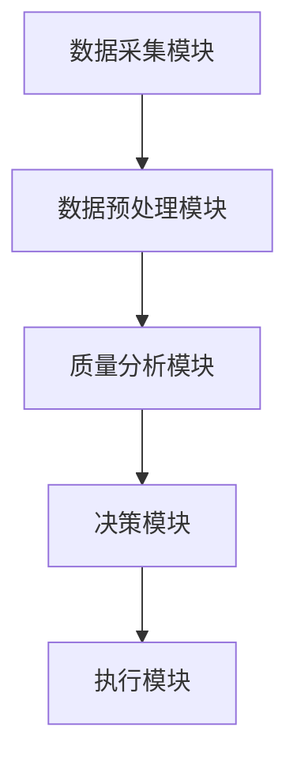

                 


# 实现基于AI Agent的智能质量控制系统

> 关键词：AI Agent，智能质量控制，算法原理，系统架构，项目实战

> 摘要：本文详细探讨了如何利用AI Agent技术构建智能质量控制系统。通过介绍AI Agent的基本概念、核心原理，结合数学模型和算法，分析系统的架构设计，并通过实际项目案例展示如何实现这一系统。文章还提供了最佳实践和注意事项，帮助读者在实际应用中避免常见问题。

---

## 第一部分: 基于AI Agent的智能质量控制系统概述

### 第1章: AI Agent与智能质量管理概述

#### 1.1 AI Agent的基本概念
##### 1.1.1 什么是AI Agent
人工智能代理（AI Agent）是指能够感知环境并采取行动以实现目标的智能实体。它可以是一个软件程序、机器人或其他智能系统，具备自主决策和执行的能力。

##### 1.1.2 AI Agent的核心特征
- **自主性**：能够在没有外部干预的情况下运行。
- **反应性**：能够实时感知环境并做出反应。
- **目标导向**：根据设定的目标采取行动。
- **学习能力**：通过经验改进自身性能。

##### 1.1.3 AI Agent与传统自动化的区别
传统自动化基于固定的规则和程序，而AI Agent具备学习和适应能力，能够处理复杂和动态的环境。

#### 1.2 智能质量控制的背景与意义
##### 1.2.1 质量管理的传统模式
传统质量管理依赖人工检查和固定规则，效率低且容易出错。

##### 1.2.2 智能化质量管理的需求
随着生产过程复杂化，传统方法难以满足高精度和高效率的要求。

##### 1.2.3 AI Agent在质量管理中的优势
- **实时监控**：快速响应质量问题。
- **自我优化**：通过学习提升检测精度。
- **灵活性**：适应不同生产环境。

---

## 第二部分: AI Agent的核心概念与原理

### 第2章: AI Agent的核心概念与原理

#### 2.1 AI Agent的分类
##### 2.1.1 简单反射式Agent
基于当前感知直接做出反应，没有内部状态。

##### 2.1.2 基于模型的反射式Agent
维护环境模型，根据模型推断行动。

##### 2.1.3 目标驱动的Agent
根据目标选择行动，可能涉及多步推理。

##### 2.1.4 学习驱动的Agent
通过机器学习不断改进性能。

#### 2.2 AI Agent的工作原理
##### 2.2.1 知识表示
将知识以符号或概率形式表示，如规则、语义网络等。

##### 2.2.2 感知与推理
通过传感器获取信息，运用推理算法得出结论。

##### 2.2.3 行为决策
基于推理结果选择最优行动。

##### 2.2.4 学习与优化
通过强化学习等方法优化决策策略。

#### 2.3 AI Agent与智能质量控制的结合
##### 2.3.1 质量数据的智能化处理
利用自然语言处理和计算机视觉技术分析数据。

##### 2.3.2 基于AI Agent的质量监控
实时监控生产过程，预测潜在缺陷。

##### 2.3.3 AI Agent在质量改进中的应用
通过反馈机制优化生产流程，降低缺陷率。

---

## 第三部分: AI Agent的数学模型与算法原理

### 第3章: AI Agent的数学模型与算法原理

#### 3.1 AI Agent的数学模型
##### 3.1.1 状态空间模型
将环境状态表示为一个向量，如$s = [s_1, s_2, ..., s_n]$。

##### 3.1.2 动作空间模型
定义可能的行动，如$a \in \{1, 2, ..., m\}$。

##### 3.1.3 奖励函数模型
定义每个行动的奖励，如$r(s, a) = \text{奖励值}$。

##### 3.1.4 策略函数模型
策略$\pi(a|s)$表示在状态$s$下选择行动$a$的概率。

#### 3.2 基于强化学习的AI Agent算法
##### 3.2.1 Q-Learning算法
$$ Q(s, a) = Q(s, a) + \alpha [r + \gamma \max Q(s', a') - Q(s, a)] $$

##### 3.2.2 Deep Q-Network (DQN)算法
使用神经网络近似Q值函数，结构包括卷积层和全连接层。

##### 3.2.3 Policy Gradient方法
通过优化策略函数的梯度来更新参数。

##### 3.2.4 Actor-Critic架构
同时学习策略（Actor）和价值函数（Critic），如：
$$ \text{Actor}: \pi(a|s) $$
$$ \text{Critic}: V(s) $$

#### 3.3 算法实现的数学公式
##### 3.3.1 Q-Learning的更新公式
$$ Q(s, a) = Q(s, a) + \alpha [r + \gamma \max Q(s', a') - Q(s, a)] $$

##### 3.3.2 DQN的网络结构
$$ \text{输入} \rightarrow \text{卷积层} \rightarrow \text{全连接层} \rightarrow \text{输出} $$

---

## 第四部分: 系统架构与设计

### 第4章: 系统架构与设计

#### 4.1 系统架构设计
##### 4.1.1 系统模块划分
- 数据采集模块：收集生产过程中的数据。
- 数据预处理模块：清洗和转换数据。
- 质量分析模块：应用AI Agent进行质量评估。
- 决策模块：生成优化建议。
- 执行模块：实施优化行动。

##### 4.1.2 模块间关系
数据流从采集到预处理，再到分析模块，最后由决策和执行模块处理。

##### 4.1.3 系统整体架构图（Mermaid）



#### 4.2 系统功能设计
##### 4.2.1 数据采集与预处理
- 采集传感器数据、图像等信息。
- 清洗数据，处理缺失值和异常值。

##### 4.2.2 质量分析与预测
- 应用计算机视觉和NLP技术进行质量评估。
- 使用强化学习算法预测潜在缺陷。

##### 4.2.3 决策与优化
- 根据预测结果生成优化策略。
- 调整生产参数以提高质量。

##### 4.2.4 执行与反馈
- 执行优化策略。
- 收集反馈信息以优化模型。

#### 4.3 系统接口设计
##### 4.3.1 数据接口
- 数据输入接口：接收传感器数据。
- 数据输出接口：发送处理后的数据。

##### 4.3.2 模块间接口
- 分析模块与决策模块之间的接口：传递预测结果。

#### 4.4 系统交互设计
##### 4.4.1 交互流程
- 用户输入指令。
- 系统处理并反馈结果。

##### 4.4.2 交互界面
- 用户界面：显示实时质量状态和优化建议。

---

## 第五部分: 项目实战

### 第5章: 项目实战

#### 5.1 环境安装与配置
- 安装Python、TensorFlow、Keras等库。
- 配置开发环境，如Jupyter Notebook。

#### 5.2 核心代码实现
##### 5.2.1 数据预处理代码
```python
import numpy as np
import pandas as pd

def preprocess_data(data):
    # 删除缺失值
    data = data.dropna()
    # 标准化处理
    data = (data - data.mean()) / data.std()
    return data
```

##### 5.2.2 强化学习算法实现
```python
class DQN:
    def __init__(self, state_space, action_space):
        self.state_space = state_space
        self.action_space = action_space
        # 定义神经网络
        self.model = self.build_model()
    
    def build_model(self):
        model = Sequential()
        model.add(Conv2D(32, (3,3), activation='relu', input_shape=(64,64,3)))
        model.add(MaxPooling2D((2,2)))
        model.add(Flatten())
        model.add(Dense(64, activation='relu'))
        model.add(Dense(self.action_space, activation='linear'))
        model.compile(optimizer='adam', loss='mse')
        return model
```

##### 5.2.3 系统集成与测试
- 将各个模块集成到一个系统中。
- 进行功能测试和性能优化。

#### 5.3 案例分析与详细解读
##### 5.3.1 案例背景
假设我们有一个汽车制造厂，需要实时监控焊接质量。

##### 5.3.2 数据分析
使用计算机视觉技术检测焊接缺陷。

##### 5.3.3 算法应用
应用DQN算法优化焊接参数，提高合格率。

##### 5.3.4 结果展示
通过可视化工具展示质量改善效果。

#### 5.4 项目小结
- 详细描述了项目的实施过程。
- 总结了经验和教训。

---

## 第六部分: 最佳实践与注意事项

### 第6章: 最佳实践与注意事项

#### 6.1 最佳实践
##### 6.1.1 数据质量管理
确保数据准确性和完整性。

##### 6.1.2 模型优化
定期更新模型，避免过拟合。

##### 6.1.3 系统维护
定期检查系统运行状态，及时修复问题。

#### 6.2 小结
简要总结全文内容，强调AI Agent在智能质量控制中的重要性。

#### 6.3 注意事项
- 确保系统安全性和稳定性。
- 遵守相关法律法规，保护用户隐私。

---

## 作者：AI天才研究院/AI Genius Institute & 禅与计算机程序设计艺术 /Zen And The Art of Computer Programming

---

以上是《实现基于AI Agent的智能质量控制系统》的详细目录大纲，涵盖了从理论到实践的各个方面，确保读者能够全面理解并掌握基于AI Agent的质量控制系统的设计与实现。

