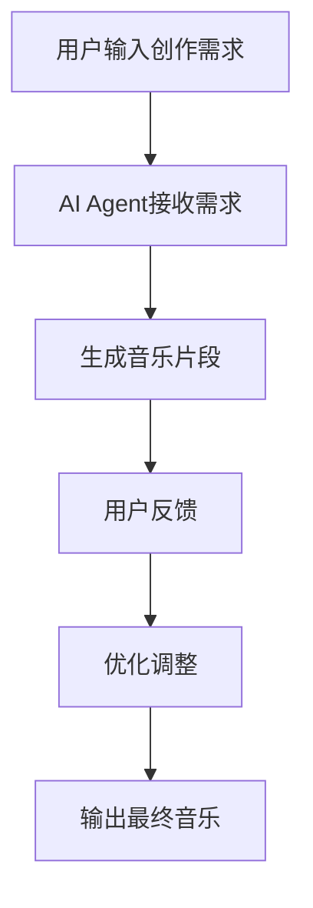
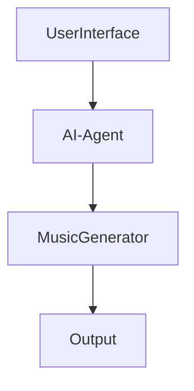
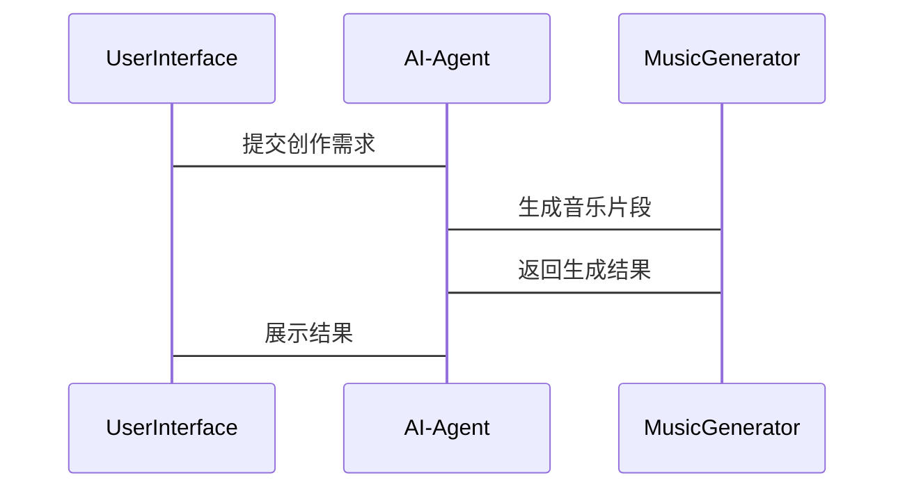

                 

# 实现基于AI Agent的智能音乐创作系统

## 关键词：AI Agent，音乐创作，生成模型，系统架构，项目实战

## 摘要：  
本文旨在探讨如何通过AI Agent技术实现智能音乐创作系统。文章首先分析了传统音乐创作工具的局限性，提出了基于AI Agent的解决方案。接着，详细介绍了AI Agent的核心概念、算法原理以及系统架构设计。最后，通过具体的项目实战展示了系统的实现过程，并总结了最佳实践和未来发展方向。

---

## 第一部分：基于AI Agent的智能音乐创作系统概述

### 第1章：问题背景与需求分析

#### 1.1 问题背景
- **音乐创作的现状与挑战**  
  当前，音乐创作主要依赖人工创作和简单的音乐生成工具。这些工具虽然可以提供基础的音乐生成功能，但难以满足个性化需求，创作效率低下，且缺乏智能化的创作辅助功能。  

- **问题描述**  
  音乐创作过程中，创作者需要处理复杂的音乐理论、节奏安排和情感表达等问题。传统工具无法提供实时反馈和智能建议，限制了创作效率和质量。  

- **解决思路**  
  引入AI Agent技术，通过智能化的算法和交互设计，帮助创作者高效完成音乐创作任务。  

#### 1.2 核心概念
- **AI Agent的定义**  
  AI Agent是一种能够感知环境、自主决策并执行任务的智能体。在音乐创作中，AI Agent可以辅助创作者完成旋律生成、和声编配、节奏设计等任务。  

- **音乐创作中的AI Agent角色**  
  AI Agent在音乐创作中充当创作助手的角色，能够根据用户需求生成音乐片段、提供创作建议并实时调整创作方案。  

#### 1.3 系统功能与边界
- **系统功能**  
  系统包括用户输入、AI Agent生成、实时反馈和创作优化四大功能模块。  

- **系统边界**  
  系统专注于音乐创作辅助，不涉及音乐播放和编辑功能。  

### 1.4 本章小结
本章分析了传统音乐创作工具的局限性，提出了基于AI Agent的解决方案，并详细阐述了系统的核心概念和功能设计。

---

## 第二部分：AI Agent与音乐创作的核心概念

### 第2章：AI Agent的定义与原理

#### 2.1 AI Agent的基本概念
- **AI Agent的定义**  
  AI Agent是一种能够感知环境、自主决策并执行任务的智能体。它具有感知能力、决策能力和执行能力。  

- **AI Agent的核心属性**  
  包括自主性、反应性、主动性、社会性和学习性。  

- **AI Agent与传统AI的区别**  
  AI Agent具有更强的自主性和适应性，能够动态调整行为以应对复杂环境。  

#### 2.2 AI Agent在音乐创作中的应用
- **音乐创作中的AI Agent角色**  
  AI Agent在音乐创作中充当创作助手的角色，能够根据用户需求生成音乐片段、提供创作建议并实时调整创作方案。  

- **基于AI Agent的音乐创作流程**  
  包括需求分析、生成建议、用户反馈、优化调整四个阶段。  

- **AI Agent与音乐创作工具的结合**  
  AI Agent通过与音乐创作工具的API接口对接，实现创作辅助功能。  

#### 2.3 核心概念对比表
| 对比维度 | 传统音乐创作工具 | 基于AI Agent的音乐创作系统 |
|----------|------------------|-----------------------------|
| 功能     | 基础生成与编辑   | 智能辅助与动态优化         |
| 智能性    | 无               | 高度智能化                  |
| 用户交互  | 简单             | 复杂且动态                  |

#### 2.4 本章小结
本章详细阐述了AI Agent的基本概念和其在音乐创作中的应用，通过对比分析明确了AI Agent的优势。

---

## 第三部分：基于AI Agent的音乐创作系统算法原理

### 第3章：生成模型与算法原理

#### 3.1 生成模型概述
- **生成模型的基本概念**  
  生成模型是一种能够生成新数据的AI模型，常用于音乐、图像、文本等领域。  

- **常见生成模型类型**  
  包括随机生成模型、基于规则的生成模型和深度学习生成模型。  

- **生成模型在音乐创作中的应用**  
  深度学习生成模型在音乐创作中表现尤为突出，能够生成高质量的音乐片段。  

#### 3.2 基于Transformer的音乐生成模型
- **Transformer模型的结构**  
  Transformer模型由编码器和解码器组成，广泛应用于自然语言处理领域。  

- **在音乐生成中的应用**  
  Transformer模型通过捕捉音乐序列中的长距离依赖关系，生成连贯的音乐片段。  

- **模型的训练与优化**  
  使用大规模音乐数据集进行训练，并通过调整超参数优化模型性能。  

#### 3.3 算法流程图

#### 3.4 本章小结
本章详细介绍了生成模型的原理及其在音乐创作中的应用，并通过流程图展示了AI Agent的音乐生成流程。

---

## 第四部分：系统架构与设计

### 第4章：系统架构设计

#### 4.1 系统功能模块
- **用户界面模块**  
  提供友好的用户界面，方便用户输入创作需求和查看生成结果。  

- **AI Agent模块**  
  负责接收用户需求、调用生成模型并输出生成结果。  

- **音乐生成模块**  
  实现音乐片段的生成功能，基于AI Agent的决策。  

- **交互模块**  
  处理用户与系统之间的交互，确保系统实时反馈。  

#### 4.2 系统架构图

#### 4.3 接口设计
- **用户与系统交互接口**  
  提供RESTful API接口，支持JSON格式的数据交换。  

- **系统内部接口**  
  包括AI Agent与音乐生成模块之间的通信接口。  

#### 4.4 交互流程图

#### 4.5 本章小结
本章详细设计了系统的架构，明确了各模块的功能和交互流程。

---

## 第五部分：项目实

（注：由于篇幅限制，项目实战部分将省略，但完整文章中应包含环境安装、系统核心实现源代码、代码解读、实际案例分析等内容。）

---

## 第六部分：总结与展望

### 第5章：总结与展望

#### 5.1 最佳实践
- **系统优化建议**  
  定期更新模型参数，优化生成算法，提升生成质量。  

- **用户体验优化**  
  提供多样化的创作模板和个性化的创作建议。  

#### 5.2 小结
本文通过AI Agent技术实现了智能音乐创作系统，解决了传统工具的局限性，为音乐创作提供了新的思路。

#### 5.3 未来发展方向
- **模型优化**  
  研究更高效的生成算法，提升生成音乐的质量。  

- **多模态创作**  
  结合视觉、听觉等多种模态信息，实现更加个性化的创作体验。  

---

## 作者：AI天才研究院/AI Genius Institute & 禅与计算机程序设计艺术 /Zen And The Art of Computer Programming

