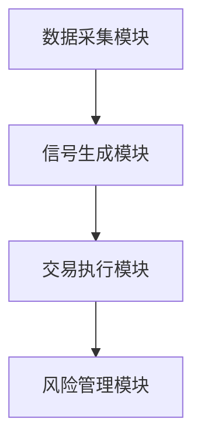
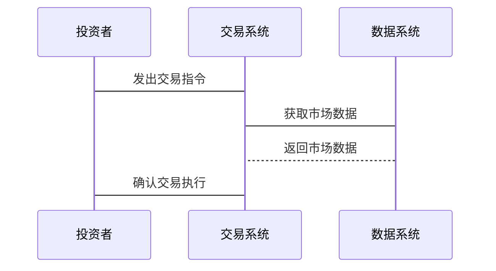

                 


# 对冲基金策略：专业投资者如何应对市场波动

## 关键词
对冲基金，市场波动，投资策略，风险管理，量化分析，统计套利

## 摘要
对冲基金是一种复杂的金融工具，旨在通过多种策略在市场波动中实现稳定收益。本文从对冲基金的基本概念入手，详细分析其核心策略，包括套利、统计套利、CTA策略等，并探讨如何通过数学模型和算法优化来应对市场波动。文章还结合实际案例，讲解对冲基金系统的架构设计和交易执行机制，最后总结对冲基金的投资策略和风险管理方法。

---

# 第一部分: 对冲基金策略的背景与基础

## 第1章: 对冲基金的定义与背景

### 1.1 对冲基金的定义
#### 1.1.1 对冲基金的基本概念
对冲基金是一种通过投资于多种金融工具（如股票、债券、期货、期权等）来实现相对收益的私募投资基金。其核心目标是通过套利、市场中性策略或统计套利等方式，在不同市场条件下实现稳定的绝对收益。

#### 1.1.2 对冲基金的历史与发展
对冲基金的起源可以追溯到20世纪50年代，但真正的发展是在20世纪80年代之后。随着金融市场的复杂化和量化技术的进步，对冲基金逐渐成为机构投资者和高净值个人的重要投资工具。

#### 1.1.3 对冲基金的分类与特点
对冲基金可以根据投资策略、资产类别或地域分为多种类型。常见的分类包括：
- **股票多空策略**：同时投资于多头和空头头寸，以抵消市场风险。
- **统计套利**：利用市场中的短期价格偏差进行投资。
- **CTA策略**：基于趋势预测进行投资。

### 1.2 对冲基金的核心目标
#### 1.2.1 降低市场波动风险
通过对冲策略，投资者可以减少市场波动对投资组合的影响，从而实现更稳定的收益。

#### 1.2.2 实现绝对收益
对冲基金的目标是在任何市场环境下实现正收益，而不是仅仅跑赢市场指数。

#### 1.2.3 对冲市场风险的策略
对冲基金通过多样化的投资策略和资产配置，降低单一资产的风险。

---

## 第2章: 对冲基金的运作机制

### 2.1 对冲基金的基本运作流程
#### 2.1.1 资金募集与管理
对冲基金通过私募方式募集资金，投资者通常是高净值个人或机构。

#### 2.1.2 投资策略的选择
根据市场环境选择合适的对冲策略，如套利、统计套利或CTA策略。

#### 2.1.3 风险控制与收益分配
通过对冲策略和严格的风险管理，确保基金的稳定收益，并按照约定分配收益。

### 2.2 对冲基金的主要参与者
#### 2.2.1 管理人（Manager）
对冲基金的管理人负责制定和执行投资策略。

#### 2.2.2 投资者（LP）
投资者提供资金，并根据合同获得收益。

#### 2.2.3 第三方服务提供商
包括托管银行、清算公司和数据供应商等，为对冲基金提供支持服务。

---

## 第3章: 对冲基金的核心策略概述

### 3.1 主要对冲策略类型
#### 3.1.1 套利策略（Arbitrage）
套利策略通过利用不同市场或资产之间的价格差异进行投资，以实现无风险收益。

#### 3.1.2 统计套利（Statistical Arbitrage）
统计套利通过分析资产价格的历史数据，寻找短期的价格偏差进行投资。

#### 3.1.3 股票多空策略（Long/Short Equities）
同时投资于多头和空头头寸，以抵消市场风险。

#### 3.1.4 商品期货套利（Commodity Futures）
利用商品期货市场的价格差异进行套利。

#### 3.1.5 量化对冲策略（Quantitative hedging）
基于量化模型的投资策略，利用算法进行高频交易。

### 3.2 对冲策略的优缺点对比
| 策略类型       | 优点                           | 缺点                           |
|----------------|--------------------------------|--------------------------------|
| 套利策略       | 风险低，收益稳定               | 收益有限，市场机会少           |
| 统计套利       | 可以捕捉短期价格偏差           | 需要大量数据支持，计算复杂       |
| 股票多空策略   | 抵消市场风险，收益稳定         | 需要精确选股，风险较高         |
| 商品期货套利   | 利用价格差异，收益可期         | 需要较高的市场流动性           |
| 量化对冲策略   | 高频交易，收益潜力大           | 计算复杂，需要强大的技术支持     |

---

# 第二部分: 对冲基金策略的核心概念与联系

## 第4章: 对冲基金策略的核心原理

### 4.1 对冲策略的数学模型
#### 4.1.1 市场中性策略的数学表达
市场中性策略通过多头和空头头寸的组合，使投资组合的β值接近于零。其数学表达式为：
$$ \beta = \frac{\text{投资组合收益} - \text{无风险利率}}{\text{市场收益} - \text{无风险利率}} $$

#### 4.1.2 套利机会的识别与建模
套利机会的识别通常基于资产价格的短期偏离。例如，股票A和股票B的价格差异可以通过以下公式进行建模：
$$ \text{价差} = |P_A - P_B| $$

#### 4.1.3 风险调整后的收益
风险调整后的收益可以通过夏普比率来衡量：
$$ \text{夏普比率} = \frac{\text{投资组合收益} - \text{无风险利率}}{\text{投资组合标准差}} $$

---

### 4.2 对冲策略的核心要素

#### 4.2.1 套利机会的识别
套利机会通常存在于市场流动性不足或信息不对称的情况下。例如，同一股票在不同市场的价格差异可以被套利者利用。

#### 4.2.2 风险对冲
通过对冲策略，投资者可以将市场风险降至最低。例如，通过同时投资于股票和股指期货，可以对冲股票市场的系统性风险。

#### 4.2.3 算法优化
对冲基金的算法优化是实现超额收益的关键。例如，统计套利模型可以通过回归分析来预测资产价格的变化。

---

## 第5章: 对冲策略的数学模型与算法

### 5.1 统计套利模型的实现

#### 5.1.1 数据收集与预处理
- 数据来源：股票价格、指数价格、期货价格等。
- 数据清洗：去除缺失值和异常值。

#### 5.1.2 建模与回测
- 模型选择：回归分析、时间序列分析等。
- 算法实现：使用Python的pandas和statsmodels库进行回归分析。

#### 5.1.3 交易信号的生成
- 基于模型的预测结果，生成买入或卖出信号。

### 5.2 套利机会的识别

#### 5.2.1 套利策略的数学表达
套利策略通常基于资产价格的差异。例如，股票A和股票B的价格差异可以通过以下公式进行建模：
$$ \text{价差} = |P_A - P_B| $$

#### 5.2.2 套利机会的检测
通过计算资产价格的均值回归，可以识别套利机会。例如，使用以下公式进行均值回归分析：
$$ \text{回归方程} = y = a + bx + \epsilon $$

---

## 第6章: 对冲策略的风险管理

### 6.1 风险评估与控制
#### 6.1.1 风险类型
- 市场风险
- 信用风险
- 操作风险

#### 6.1.2 风险控制方法
- 多元化投资
- 仓位控制
- 止损机制

### 6.2 风险调整后的收益
#### 6.2.1 夏普比率
$$ \text{夏普比率} = \frac{\text{投资组合收益} - \text{无风险利率}}{\text{投资组合标准差}} $$

#### 6.2.2 最大回撤
最大回撤是衡量投资组合风险的重要指标，公式为：
$$ \text{最大回撤} = \max(P_{\text{high}} - P_{\text{low}}) $$

---

## 第7章: 对冲基金的系统架构与交易执行

### 7.1 系统架构设计
#### 7.1.1 系统功能模块
- 数据采集模块
- 信号生成模块
- 交易执行模块
- 风险管理模块

#### 7.1.2 系统架构图


### 7.2 交易执行机制
#### 7.2.1 交易信号的生成
交易信号通常基于量化模型的预测结果。例如，统计套利模型可以生成买入或卖出信号。

#### 7.2.2 交易执行流程
- 接收交易信号
- 确定交易数量
- 下达交易指令
- 确认交易执行

### 7.3 交易系统的实现
#### 7.3.1 系统接口设计
- 数据接口：与数据供应商的接口。
- 交易接口：与交易执行系统的接口。

#### 7.3.2 系统交互流程


---

## 第8章: 项目实战

### 8.1 统计套利策略的实现

#### 8.1.1 环境搭建
- 安装Python环境
- 安装必要的库（pandas、numpy、statsmodels等）

#### 8.1.2 代码实现
```python
import pandas as pd
import numpy as np
from statsmodels import regression

# 数据预处理
data = pd.read_csv('stock_data.csv')
data = data.dropna()

# 建模
y = data['stock_price']
x = data[['factor1', 'factor2']]
model = regression.OLS(y, x).fit()

# 生成交易信号
residuals = model.resid
threshold = np.std(residuals)
trading_signal = np.where(residuals > threshold, 'buy', 'sell')
```

#### 8.1.3 案例分析
通过实际数据，展示统计套利策略的实现过程和收益情况。

---

## 第9章: 总结与展望

### 9.1 总结
对冲基金通过多种策略应对市场波动，实现稳定收益。本文详细介绍了对冲基金的核心策略、数学模型和系统架构。

### 9.2 未来展望
随着人工智能和大数据技术的进步，对冲基金的策略将更加多样化和复杂化。未来的对冲基金将更加依赖于量化分析和算法优化。

### 9.3 最佳实践
- 选择合适的对冲策略
- 严格控制风险
- 持续优化算法

---

作者：AI天才研究院/AI Genius Institute & 禅与计算机程序设计艺术/Zen And The Art of Computer Programming

