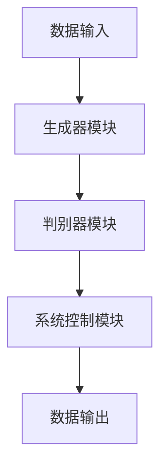
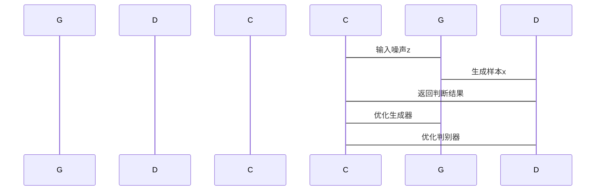

                 


# 对抗生成网络在AI Agent开发中的应用

> **关键词**：对抗生成网络、AI Agent、GANs、深度学习、生成模型、人工智能

> **摘要**：本文探讨了对抗生成网络（GANs）在AI Agent开发中的应用，分析了GANs的核心原理及其在数据生成、图像处理和自然语言处理等领域的具体应用。文章详细介绍了GANs的数学模型、系统架构设计，并通过实际案例展示了GANs在AI Agent中的潜力和优势。

---

## 第1章 对抗生成网络与AI Agent概述

### 1.1 对抗生成网络（GANs）的基本概念

#### 1.1.1 什么是对抗生成网络
对抗生成网络（GANs）是一种生成模型，由Ian Goodfellow等人于2014年提出。GANs由两部分组成：生成器（Generator）和判别器（Discriminator）。生成器负责生成数据，判别器负责区分真实数据和生成数据。

#### 1.1.2 GANs的核心思想与特点
GANs的核心思想是通过对抗训练来优化生成器和判别器。生成器的目标是生成与真实数据难以区分的样本，而判别器的目标是尽可能准确地区分真实数据和生成数据。两者的博弈过程使得生成器能够生成高质量的数据。

#### 1.1.3 GANs在AI Agent中的应用潜力
AI Agent需要处理多样化的任务，如图像生成、对话生成等。GANs在生成高质量数据方面的优势，使其成为AI Agent开发中的重要工具。

### 1.2 AI Agent的基本概念与分类

#### 1.2.1 什么是AI Agent
AI Agent是一种智能实体，能够感知环境并采取行动以实现目标。它可以是一个软件程序或物理设备，具备自主决策的能力。

#### 1.2.2 AI Agent的分类与应用场景
AI Agent可以分为简单反射型、基于模型的、目标驱动型和实用驱动型等。应用场景包括自动驾驶、智能客服、游戏AI等。

#### 1.2.3 对抗生成网络在AI Agent中的结合点
GANs可以用于生成训练数据、增强模型表现，以及实现复杂的交互任务，如对话生成和图像生成。

### 1.3 对抗生成网络在AI Agent中的应用背景

#### 1.3.1 当前AI Agent开发的挑战
AI Agent开发面临数据不足、生成数据质量低、复杂任务处理困难等问题。

#### 1.3.2 对抗生成网络如何解决这些挑战
GANs能够生成高质量的数据，提高模型的泛化能力，解决数据不足的问题。

#### 1.3.3 应用场景与实际案例
GANs在AI Agent中的应用场景包括图像生成辅助视觉导航、对话生成提升用户体验等。

---

## 第2章 对抗生成网络的核心原理

### 2.1 GANs的基本结构与工作原理

#### 2.1.1 生成器与判别器的结构
生成器通常使用深度神经网络，判别器也使用深度神经网络。生成器输入噪声，输出与真实数据相似的样本，判别器输入数据，输出真实数据的概率。

#### 2.1.2 GANs的损失函数与训练过程
生成器的损失函数是希望判别器输出的概率最大化，判别器的损失函数是希望区分真实数据和生成数据。训练过程中，生成器和判别器交替优化。

#### 2.1.3 GANs的训练动态与收敛性分析
GANs的训练过程可能会出现不稳定性，生成器和判别器的更新需要平衡。收敛性分析有助于理解训练过程中的动态变化。

### 2.2 GANs的改进与变体

#### 2.2.1 WGAN、WGAN-GP等改进方法
WGAN通过 Wasserstein距离优化损失函数，WGAN-GP引入梯度惩罚项，提高模型的稳定性。

#### 2.2.2 Conditional GAN（cGAN）与信息条件
cGAN在生成器和判别器中引入条件，生成条件样本。

#### 2.2.3 其他重要的GAN变体
包括StyleGAN、CycleGAN等，各有不同的应用场景和优势。

### 2.3 对抗生成网络的数学模型与公式

#### 2.3.1 生成器与判别器的数学表达
生成器：$G(z)$，输入噪声$z$，输出样本$x$。  
判别器：$D(x)$，输出$x$是真实的概率。

#### 2.3.2 GANs的损失函数推导
生成器的损失：$\mathbb{E}_{z}[\log(1 - D(G(z)))]$  
判别器的损失：$\mathbb{E}_{x_{\text{真实}}}[ \log(D(x))] + \mathbb{E}_{x_{\text{生成}}}[ \log(1 - D(x))]$

#### 2.3.3 WGAN-GP的数学模型
Wasserstein距离：$\mathbb{W}(P_{\text{真实}}, P_{\text{生成}})$  
梯度惩罚项：$\lambda \mathbb{E}_{x \sim \tilde{P}} [ (\|\nabla D(x)\|^2 - 1)^2 ]$

---

## 第3章 对抗生成网络在AI Agent中的应用场景

### 3.1 对抗生成网络在AI Agent中的核心应用领域

#### 3.1.1 数据生成与增强
GANs可以生成大量高质量的数据，增强模型的训练效果。

#### 3.1.2 对话系统与自然语言处理
GANs用于对话生成，提升用户体验。

#### 3.1.3 图像生成与视觉感知
GANs生成图像，辅助视觉导航任务。

### 3.2 对抗生成网络在AI Agent中的具体案例

#### 3.2.1 图像生成在视觉导航中的应用
GANs生成环境图像，帮助AI Agent进行导航决策。

#### 3.2.2 对话生成在智能客服中的应用
GANs生成自然的对话，提升客服效率。

#### 3.2.3 数据增强在模型训练中的应用
GANs生成多样化的数据，增强模型的泛化能力。

### 3.3 对抗生成网络与AI Agent的结合优势

#### 3.3.1 提高生成数据的质量与多样性
GANs生成高质量、多样化的数据，提升模型性能。

#### 3.3.2 提升AI Agent的交互能力
GANs在对话生成中的应用，使AI Agent具备更强的交互能力。

#### 3.3.3 降低数据依赖性
通过生成数据，减少对大量真实数据的依赖，降低数据获取成本。

---

## 第4章 对抗生成网络在AI Agent中的系统架构设计

### 4.1 系统功能模块设计

#### 4.1.1 数据生成模块
负责生成多样化的数据样本。

#### 4.1.2 判别器模块
用于区分真实数据和生成数据。

#### 4.1.3 生成器模块
负责生成高质量的数据样本。

#### 4.1.4 系统控制模块
协调各模块的工作，优化生成过程。

### 4.2 系统架构设计图



### 4.3 系统接口设计

#### 4.3.1 API接口
提供生成数据的接口，供其他模块调用。

#### 4.3.2 数据接口
定义数据的格式和传输方式。

### 4.4 系统交互流程

#### 4.4.1 数据生成流程
1. 输入噪声$z$到生成器。
2. 生成器生成样本$x$。
3. 判别器判断$x$是否为真实数据。
4. 根据判别结果，优化生成器和判别器。

#### 4.4.2 序列图



---

## 第5章 项目实战：对抗生成网络在AI Agent中的应用

### 5.1 环境配置与安装

#### 5.1.1 安装Python环境
使用Anaconda安装Python 3.8以上版本。

#### 5.1.2 安装依赖库
安装TensorFlow、Keras、numpy、matplotlib等库。

### 5.2 核心实现：GANs模型

#### 5.2.1 生成器实现
定义生成器网络结构，使用卷积层和全连接层。

#### 5.2.2 判别器实现
定义判别器网络结构，用于判别样本的真实性。

#### 5.2.3 损失函数与优化器
定义生成器和判别器的损失函数，选择合适的优化器如Adam。

### 5.3 代码实现与结果展示

#### 5.3.1 Python代码示例

```python
import tensorflow as tf
from tensorflow.keras import layers

# 生成器
def make_generator_model():
    model = tf.keras.Sequential()
    model.add(layers.Dense(256, activation='relu', input_shape=(100,)))
    model.add(layers.Dense(512, activation='relu'))
    model.add(layers.Dense(784, activation='sigmoid'))
    return model

# 判别器
def make_discriminator_model():
    model = tf.keras.Sequential()
    model.add(layers.Dense(512, activation='relu', input_shape=(784,)))
    model.add(layers.Dense(1, activation='sigmoid'))
    return model

# 损失函数与优化器
cross_entropy = tf.keras.losses.BinaryCrossentropy()
generator_optimizer = tf.keras.optimizers.Adam(1e-4)
discriminator_optimizer = tf.keras.optimizers.Adam(1e-4)

# 训练过程
def train_step(real_images, generator, discriminator):
    noise = tf.random.normal([batch_size, 100])
    generated_images = generator(noise)
    real_labels = tf.ones((batch_size, 1))
    generated_labels = tf.zeros((batch_size, 1))
    
    # 训练判别器
    with tf.GradientTape() as taping_c:
        d_real = discriminator(real_images)
        d_fake = discriminator(generated_images)
        d_loss = cross_entropy(real_labels, d_real) + cross_entropy(generated_labels, d_fake)
    grads_c = taping_c.gradient(d_loss, discriminator.trainable_weights)
    discriminator_optimizer.apply_gradients(zip(grads_c, discriminator.trainable_weights))
    
    # 训练生成器
    with tf.GradientTape() as taping_g:
        d_fake = discriminator(generated_images)
        g_loss = cross_entropy(real_labels, d_fake)
    grads_g = taping_g.gradient(g_loss, generator.trainable_weights)
    generator_optimizer.apply_gradients(zip(grads_g, generator.trainable_weights))

# 训练过程略...
```

#### 5.3.2 训练结果展示
展示生成器生成的图像，评估生成效果。

---

## 第6章 高级主题与未来趋势

### 6.1 多目标对抗生成网络
引入多个判别器或生成器，提升生成模型的多样性。

### 6.2 GANs在复杂任务中的应用
探讨GANs在多模态生成、视频生成等复杂任务中的应用。

### 6.3 未来的研究方向
包括更稳定的训练方法、更高效的模型架构、多模态生成等。

---

## 第7章 总结与展望

### 7.1 总结
总结GANs在AI Agent中的应用，强调其重要性和潜力。

### 7.2 最佳实践 tips
提供实际应用中的建议，如选择合适的GAN变体、优化训练策略等。

### 7.3 未来研究方向
展望GANs在AI Agent中的未来研究，如更高效、更稳定的生成模型。

---

## 作者：AI天才研究院/AI Genius Institute & 禅与计算机程序设计艺术 /Zen And The Art of Computer Programming

---

本文通过详细分析对抗生成网络（GANs）的核心原理和在AI Agent中的应用场景，展示了GANs在数据生成、图像处理和对话系统中的潜力。通过实际项目案例和系统架构设计，进一步验证了GANs在提升AI Agent性能和交互能力中的重要性。未来，随着GANs技术的不断发展，其在AI Agent中的应用将更加广泛和深入。

