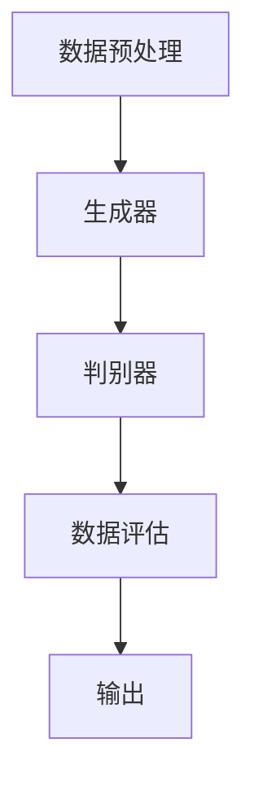

                 


# 对抗生成网络在金融数据增强中的应用

> 关键词：生成对抗网络，数据增强，金融数据，机器学习，深度学习

> 摘要：本文深入探讨了对抗生成网络（GAN）在金融数据增强中的应用。通过详细分析GAN的核心原理、算法实现以及在金融领域的实际应用，本文为读者提供了从理论到实践的全面指南。文章首先介绍了GAN的基本概念和金融数据增强的背景与挑战，然后深入讲解了GAN的数学模型与训练过程，接着分析了金融数据增强系统的架构设计与实现细节，最后通过实际案例展示了GAN在金融数据增强中的应用效果，并总结了相关经验和未来研究方向。

---

## 第1章: 对抗生成网络的基本概念

### 1.1 对抗生成网络的定义与特点

对抗生成网络（GAN，Generative Adversarial Networks）是一种生成式人工智能模型，由生成器（Generator）和判别器（Discriminator）两个神经网络构成。生成器的目标是生成与真实数据分布相似的样本，而判别器的目标是区分生成样本与真实样本。两者通过交替训练的方式不断优化，最终达到生成器能够生成高质量数据的目的。

#### 1.1.1 GAN的核心特点
- **对抗性训练**：生成器和判别器通过零和游戏的方式进行训练，生成器试图欺骗判别器，而判别器试图识破生成器。
- **无监督学习**：GAN可以在无标签数据的情况下进行训练，适用于金融数据中大量无标签样本的处理。
- **多样性生成**：GAN能够生成多样化且逼真的样本，适用于金融数据增强中的数据扩展。

#### 1.1.2 GAN在金融领域的应用潜力
金融领域涉及大量复杂的数据，如股票价格、交易记录和市场行为数据。GAN可以通过生成对抗网络生成新的金融数据，帮助填补数据缺口，增强数据多样性，提升模型的泛化能力。

---

### 1.2 生成对抗网络的训练过程

GAN的训练过程分为两个阶段：生成器和判别器的交替优化。

#### 1.2.1 生成器与判别器的对抗机制
- **生成器**：通过输入随机噪声，生成与真实数据分布相似的样本。
- **判别器**：通过输入真实样本或生成样本，输出概率判断（真实样本的概率）。

#### 1.2.2 GAN的损失函数与优化目标
判别器的损失函数为交叉熵损失，生成器的损失函数为对抗损失。两者的优化目标是通过交替训练逐步优化。

$$
\text{判别器损失} = -\left( y \log D(x) + (1-y) \log (1-D(x)) \right)
$$

$$
\text{生成器损失} = -\log D(G(z))
$$

其中，$x$ 是真实样本，$z$ 是随机噪声，$G$ 是生成器，$D$ 是判别器，$y$ 是真实样本的标签。

---

## 第2章: 金融数据增强的背景与挑战

### 2.1 金融数据增强的定义与目标

金融数据增强是指通过技术手段对现有金融数据进行扩展、变换和补充，以生成更多样化和高质量的数据，用于训练机器学习模型。其目标是提升模型的泛化能力，降低数据稀疏性的影响。

#### 2.1.1 数据增强的特殊性
金融数据具有高度的复杂性和不确定性，数据增强需要考虑市场的动态变化、数据的敏感性以及合规性要求。

#### 2.1.2 数据增强在金融领域的应用价值
- **数据扩展**：解决金融数据稀缺性问题。
- **数据多样性**：提升模型的鲁棒性。
- **数据隐私保护**：通过生成数据替代真实数据，保护隐私。

---

### 2.2 金融数据增强的主要挑战

#### 2.2.1 数据稀疏性与不平衡性
金融数据往往分布不均匀，某些事件（如市场崩盘）的概率极低，导致数据稀疏。

#### 2.2.2 数据隐私与合规性要求
金融数据通常涉及敏感信息，数据增强需要在保护隐私的前提下进行。

#### 2.2.3 数据质量与噪声干扰
金融数据中存在噪声和错误，数据增强需要考虑如何处理这些干扰。

---

## 第3章: 对抗生成网络的数学基础

### 3.1 概率分布与生成模型

#### 3.1.1 概率密度函数与分布参数化
生成模型的目标是通过参数化概率分布来生成数据。

$$
P(x) = \text{参数化概率分布}
$$

#### 3.1.2 生成模型的基本原理
生成模型通过学习数据的分布，生成新的样本。

#### 3.1.3 最大似然估计与KL散度
最大似然估计用于参数估计，KL散度用于衡量两个概率分布的差异。

$$
KL(P||Q) = \int P(x) \log \frac{P(x)}{Q(x)} dx
$$

---

### 3.2 GAN的损失函数与优化目标

#### 3.2.1 判别器的损失函数
判别器的目标是最小化真实样本被误判为生成样本的概率。

$$
\mathcal{L}_D = -\mathbb{E}_{x \sim P_r}[\log D(x)] - \mathbb{E}_{z \sim P_z}[\log (1 - D(G(z)))]
$$

#### 3.2.2 生成器的损失函数
生成器的目标是最大化生成样本被判别器误判为真实样本的概率。

$$
\mathcal{L}_G = -\mathbb{E}_{z \sim P_z}[\log D(G(z))]
$$

#### 3.2.3 GAN的联合优化目标
GAN通过交替优化生成器和判别器的损失函数，最终达到生成器生成高质量样本的目的。

---

## 第4章: GAN的算法原理与实现细节

### 4.1 GAN的训练过程

#### 4.1.1 判别器的更新步骤
判别器在每一步优化中，基于真实样本和生成样本更新参数，以区分真实样本和生成样本。

#### 4.1.2 生成器的更新步骤
生成器在每一步优化中，基于判别器的反馈，更新参数以生成更逼真的样本。

#### 4.1.3 GAN的交替优化策略
生成器和判别器交替训练，生成器的损失函数影响判别器的更新，反之亦然。

---

### 4.2 GAN的改进算法

#### 4.2.1 WGAN-GP的改进思路
Wasserstein GAN with Gradient Penalty（WGAN-GP）通过引入梯度惩罚项，使得生成器和判别器的优化更加稳定。

$$
\mathcal{L}_{\text{WGAN-GP}} = \mathbb{E}_{x \sim P_r, z \sim P_z}[\text{Wasserstein distance}]
$$

#### 4.2.2 StyleGAN的创新点
StyleGAN通过引入风格编码，提升了生成样本的质量和多样性。

---

## 第5章: 对抗生成网络的数学模型

### 5.1 GAN的数学表达式

#### 5.1.1 判别器的数学模型
判别器通常使用多层感知机（MLP）或卷积神经网络（CNN）结构。

$$
D(x) = \sigma(w_2 \sigma(w_1 x + b_1) + b_2)
$$

其中，$\sigma$ 是sigmoid函数，$w_1, w_2$ 是权重，$b_1, b_2$ 是偏置。

#### 5.1.2 生成器的数学模型
生成器通常也使用多层感知机或卷积神经网络结构。

$$
G(z) = \sigma(w_2 \sigma(w_1 z + b_1) + b_2)
$$

---

### 5.2 GAN的训练过程分析

#### 5.2.1 梯度计算与反向传播
通过链式法则计算生成器和判别器的梯度，并进行反向传播更新参数。

#### 5.2.2 参数更新与优化算法
通常使用随机梯度下降（SGD）或Adam优化器。

#### 5.2.3 模型收敛性分析
GAN的训练过程中可能面临模式坍缩等问题，需要通过改进算法或调整超参数来解决。

---

## 第6章: 金融数据增强的系统设计与实现

### 6.1 金融数据增强的系统功能设计

#### 6.1.1 数据预处理模块
对原始金融数据进行清洗、归一化等预处理，确保数据质量。

#### 6.1.2 模型训练模块
训练生成器和判别器，生成新的金融数据样本。

#### 6.1.3 数据评估模块
对生成的样本进行质量评估，确保其与真实数据分布一致。

---

### 6.2 金融数据增强系统的架构设计

#### 6.2.1 系统架构图


#### 6.2.2 系统交互流程
1. 数据预处理模块将原始数据输入生成器。
2. 生成器生成新的数据样本。
3. 判别器对生成样本进行分类，判断是否为真实样本。
4. 数据评估模块对生成样本进行质量评估。
5. 输出生成的高质量数据样本。

---

### 6.3 项目实战

#### 6.3.1 环境安装
安装所需的深度学习框架（如TensorFlow或PyTorch）和相关库。

#### 6.3.2 核心实现代码
以下是生成器和判别器的实现示例：

```python
import tensorflow as tf
from tensorflow.keras import layers

def make_generator_model():
    model = tf.keras.Sequential()
    model.add(layers.Dense(256, activation='relu', input_shape=(100,)))
    model.add(layers.Dense(512, activation='relu'))
    model.add(layers.Dense(128, activation='sigmoid'))
    return model

def make_discriminator_model():
    model = tf.keras.Sequential()
    model.add(layers.Dense(256, activation='relu', input_shape=(128,)))
    model.add(layers.Dense(1, activation='sigmoid'))
    return model
```

#### 6.3.3 案例分析与代码解读
通过训练生成器和判别器，生成新的金融数据样本，并与真实数据进行对比，评估生成样本的质量。

---

## 第7章: 总结与展望

### 7.1 总结
本文详细探讨了对抗生成网络在金融数据增强中的应用，从理论到实践，全面分析了GAN的核心原理、算法实现以及实际应用效果。

### 7.2 展望
未来的研究方向包括改进GAN的稳定性、提升生成数据的质量，以及探索GAN在金融领域的更多应用场景。

---

作者：AI天才研究院/AI Genius Institute & 禅与计算机程序设计艺术 /Zen And The Art of Computer Programming

