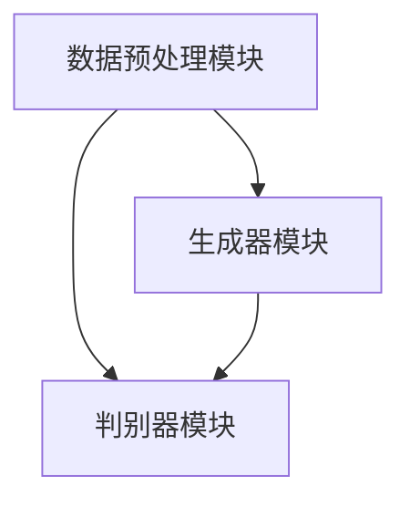

                 


# 对抗训练：提高AI Agent的鲁棒性

> **关键词**：对抗训练，AI Agent，鲁棒性，生成对抗网络，深度学习，博弈论

> **摘要**：  
> 对抗训练是一种通过模拟博弈过程来提高AI Agent鲁棒性的技术。本文从对抗训练的基本概念出发，详细探讨其在AI Agent中的应用，包括生成对抗网络（GAN）的原理、算法实现、系统架构设计以及实际案例分析。通过逐步分析，本文揭示了对抗训练如何帮助AI Agent在复杂环境中保持稳定性和准确性。

---

## 第1章：对抗训练与AI Agent概述

### 1.1 对抗训练的背景与意义

#### 1.1.1 对抗训练的基本概念
对抗训练是一种基于博弈论的训练方法，通过两个模型（生成器和判别器）的对抗过程，使得生成器能够生成更逼真、更符合目标分布的数据，而判别器则试图区分真实数据和生成数据。这种博弈过程使得两个模型相互促进，最终达到一种平衡状态。

#### 1.1.2 AI Agent的定义与特点
AI Agent（智能体）是一种能够感知环境、做出决策并执行动作的智能系统。AI Agent的特点包括自主性、反应性、目标导向和社交能力。AI Agent需要在动态和不确定的环境中做出合理的决策，这对模型的鲁棒性提出了更高的要求。

#### 1.1.3 对抗训练在AI Agent中的作用
对抗训练通过引入对抗机制，迫使模型在复杂的环境中学习，从而提高其对异常输入的处理能力。对抗训练可以增强AI Agent的鲁棒性，使其在面对敌对或对抗性输入时仍然能够保持稳定性能。

### 1.2 鲁棒性与对抗训练的关系

#### 1.2.1 鲁棒性的定义
鲁棒性是指模型在面对输入数据的微小变化时，仍然能够保持稳定输出的能力。鲁棒性是衡量AI Agent性能的重要指标，特别是在实际应用中，数据噪声和对抗攻击是常见的挑战。

#### 1.2.2 对抗训练如何提高鲁棒性
对抗训练通过引入对抗样本（adversarial examples）来训练模型，使得模型能够在面对这些对抗样本时仍然保持正确的输出。通过这种方式，模型的鲁棒性得到了显著提升。

#### 1.2.3 鲁棒性评估的指标与方法
鲁棒性评估的指标包括模型在对抗攻击下的准确率、误识别率和鲁棒性距离等。评估方法包括基于梯度的对抗攻击（如FGSM）和基于优化的攻击方法。

---

## 第2章：对抗训练的核心概念与原理

### 2.1 对抗训练的基本原理

#### 2.1.1 生成器与判别器的博弈过程
生成器的目标是生成能够欺骗判别器的样本，而判别器的目标是区分真实样本和生成样本。通过交替优化生成器和判别器的损失函数，两个模型的能力不断提升。

#### 2.1.2 对抗训练的数学模型
对抗训练的数学模型可以表示为一个最小化-最大化问题。生成器的损失函数是最小化判别器输出的损失，而判别器的损失函数是最大化区分真实样本和生成样本的能力。

### 2.2 生成对抗网络（GAN）的原理

#### 2.2.1 GAN的基本结构
GAN由生成器和判别器两个部分组成。生成器通常使用卷积生成网络（GAN的变体，如DCGAN），而判别器则使用卷积判别网络。

#### 2.2.2 GAN的训练过程
GAN的训练过程包括两个阶段：首先优化生成器，然后优化判别器。通过交替训练，生成器和判别器的能力不断提升，最终达到一个平衡状态。

---

## 第3章：生成对抗网络（GAN）的算法原理

### 3.1 GAN的数学模型

#### 3.1.1 生成器的损失函数
生成器的损失函数可以表示为：
$$ \mathcal{L}_G = -\mathbb{E}_{z \sim p_z(z)} [\log(1 - D(G(z)))] $$
其中，$z$是生成器的输入噪声，$D$是判别器，$G$是生成器。

#### 3.1.2 判别器的损失函数
判别器的损失函数可以表示为：
$$ \mathcal{L}_D = -\mathbb{E}_{x \sim p_data(x)} [\log(D(x))] - \mathbb{E}_{z \sim p_z(z)} [\log(1 - D(G(z)))] $$

### 3.2 GAN的训练过程

#### 3.2.1 生成器的优化步骤
生成器通过梯度下降优化，使得生成样本能够欺骗判别器。生成器的更新规则为：
$$ G \leftarrow G - \eta \frac{\partial \mathcal{L}_G}{\partial G} $$

#### 3.2.2 判别器的优化步骤
判别器通过梯度下降优化，使得其能够区分真实样本和生成样本。判别器的更新规则为：
$$ D \leftarrow D - \eta \frac{\partial \mathcal{L}_D}{\partial D} $$

#### 3.2.3 GAN的平衡点与模式崩溃问题
GAN的平衡点是指生成器和判别器达到纳什均衡的状态。模式崩溃问题是指生成器在训练过程中倾向于生成有限几种模式，导致判别器无法有效区分真实样本和生成样本。

---

## 第4章：生成对抗网络（GAN）的系统架构设计

### 4.1 系统模块划分

#### 4.1.1 数据预处理模块
数据预处理模块负责将原始数据转换为适合生成器和判别器输入的格式。

#### 4.1.2 生成器模块
生成器模块负责生成对抗样本。

#### 4.1.3 判别器模块
判别器模块负责区分真实样本和生成样本。

### 4.2 系统架构图
以下是一个简单的GAN系统架构图：



### 4.3 系统接口设计

#### 4.3.1 生成器接口
生成器接口负责接收噪声输入并返回生成样本。

#### 4.3.2 判别器接口
判别器接口负责接收样本输入并返回真实样本的概率。

### 4.4 系统交互流程

#### 4.4.1 训练阶段
1. 生成器生成样本。
2. 判别器判断样本是否为真实样本。
3. 根据判别器的输出，更新生成器和判别器的参数。

#### 4.4.2 推理阶段
1. 生成器生成样本。
2. 判别器判断样本是否为真实样本。

---

## 第5章：生成对抗网络（GAN）的项目实战

### 5.1 环境安装

#### 5.1.1 安装Python环境
需要安装Python 3.6及以上版本。

#### 5.1.2 安装深度学习框架
推荐使用TensorFlow或Keras。

### 5.2 代码实现

#### 5.2.1 生成器实现

```python
import tensorflow as tf
from tensorflow.keras.layers import Dense, LeakyReLU

def make_generator_model():
    model = tf.keras.Sequential()
    model.add(Dense(256, input_shape=(100,)))
    model.add(LeakyReLU(alpha=0.2))
    model.add(Dense(512))
    model.add(LeakyReLU(alpha=0.2))
    model.add(Dense(784, activation='sigmoid'))
    return model
```

#### 5.2.2 判别器实现

```python
def make_discriminator_model():
    model = tf.keras.Sequential()
    model.add(Dense(512, input_shape=(784,)))
    model.add(LeakyReLU(alpha=0.2))
    model.add(Dense(256))
    model.add(LeakyReLU(alpha=0.2))
    model.add(Dense(1, activation='sigmoid'))
    return model
```

#### 5.2.3 训练循环

```python
def train(generator, discriminator, dataset, epochs=100, batch_size=256, learning_rate=0.0002):
    generator_optimizer = tf.keras.optimizers.Adam(learning_rate)
    discriminator_optimizer = tf.keras.optimizers.Adam(learning_rate)

    for epoch in range(epochs):
        for batch in dataset:
            noise = tf.random.normal([batch_size, 100])
            generated_images = generator(noise)

            real_labels = tf.ones([batch_size, 1])
            generated_labels = tf.zeros([batch_size, 1])

            # 判别器训练
            with tf.GradientTape() as tape:
                real_outputs = discriminator(batch)
                generated_outputs = discriminator(generated_images)
                discriminator_loss = tf.keras.losses.binary_crossentropy(real_labels, real_outputs) + \
                    tf.keras.losses.binary_crossentropy(generated_labels, generated_outputs)
            gradients = tape.gradient(discriminator_loss, discriminator.trainable_weights)
            discriminator_optimizer.apply_gradients(zip(gradients, discriminator.trainable_weights))

            # 生成器训练
            with tf.GradientTape() as tape:
                generated_outputs = discriminator(generated_images)
                generator_loss = tf.keras.losses.binary_crossentropy(generated_labels, generated_outputs)
            gradients = tape.gradient(generator_loss, generator.trainable_weights)
            generator_optimizer.apply_gradients(zip(gradients, generator.trainable_weights))

    return generator, discriminator
```

### 5.3 案例分析

#### 5.3.1 图像生成
使用GAN生成手写数字的案例，展示生成器和判别器的训练过程。

#### 5.3.2 文本生成
使用GAN生成文本，展示生成器如何生成逼真的文本样本。

### 5.4 小结
通过项目实战，我们可以看到对抗训练在图像生成和文本生成中的应用，进一步理解GAN的实现和训练过程。

---

## 第6章：生成对抗网络（GAN）的实际案例分析

### 6.1 图像生成案例

#### 6.1.1 问题描述
手写数字生成问题。

#### 6.1.2 解决方案
使用GAN生成手写数字，展示生成器和判别器的训练过程。

#### 6.1.3 实验结果
展示生成器生成的数字图像，分析生成器和判别器的损失曲线。

#### 6.1.4 鲁棒性评估
评估生成器在对抗攻击下的鲁棒性。

### 6.2 文本生成案例

#### 6.2.1 问题描述
文本生成问题。

#### 6.2.2 解决方案
使用GAN生成文本，展示生成器如何生成逼真的文本样本。

#### 6.2.3 实验结果
展示生成器生成的文本样本，分析生成器和判别器的损失曲线。

#### 6.2.4 鲁棒性评估
评估生成器在对抗攻击下的鲁棒性。

### 6.3 小结
通过实际案例分析，我们可以看到对抗训练在图像生成和文本生成中的应用效果，进一步理解GAN的实现和训练过程。

---

## 第7章：总结与展望

### 7.1 总结
对抗训练是一种通过模拟博弈过程来提高AI Agent鲁棒性的技术。通过对GAN的原理、实现和应用的分析，我们可以看到对抗训练在图像生成和文本生成中的广泛应用。

### 7.2 展望
未来，对抗训练将在更多领域得到应用，包括自然语言处理、图像识别、机器人控制等。对抗训练的研究将更加深入，模型的鲁棒性和泛化能力将不断提高。

---

## 附录

### 附录A：推荐论文
1. "Generative Adversarial Nets"（GAN的论文）
2. "Deep Learning"（深度学习的综述）

### 附录B：推荐工具
1. TensorFlow
2. Keras
3. PyTorch

### 附录C：数学公式汇总
1. 生成器的损失函数：
   $$ \mathcal{L}_G = -\mathbb{E}_{z \sim p_z(z)} [\log(1 - D(G(z)))] $$
2. 判别器的损失函数：
   $$ \mathcal{L}_D = -\mathbb{E}_{x \sim p_data(x)} [\log(D(x))] - \mathbb{E}_{z \sim p_z(z)} [\log(1 - D(G(z)))] $$

---

## 作者信息

作者：AI天才研究院/AI Genius Institute & 禅与计算机程序设计艺术/Zen And The Art of Computer Programming

---

以上是对抗训练：提高AI Agent的鲁棒性技术博客文章的完整大纲和内容。

