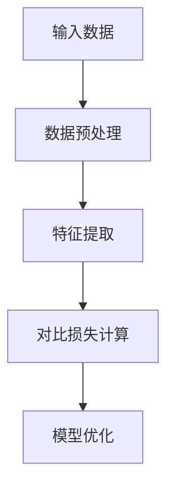
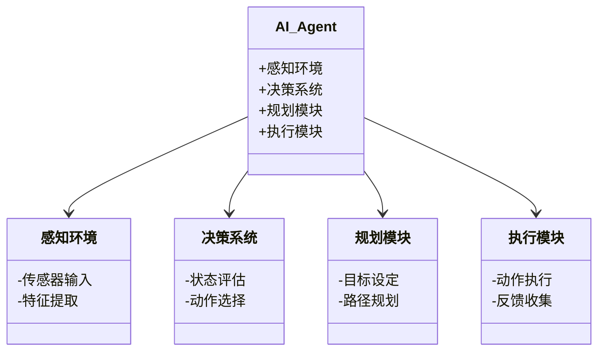
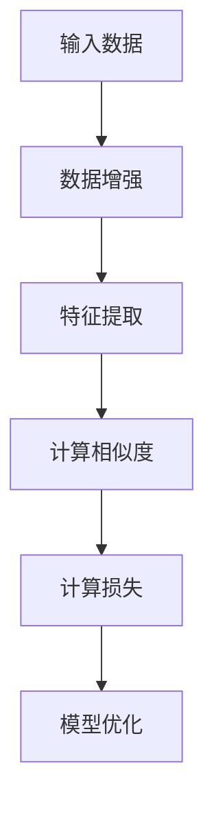
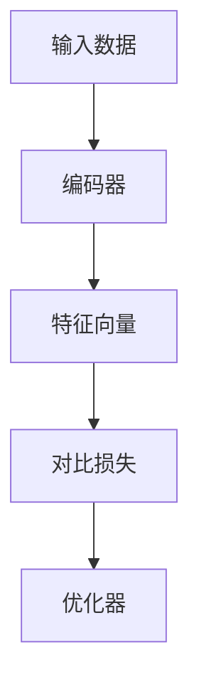
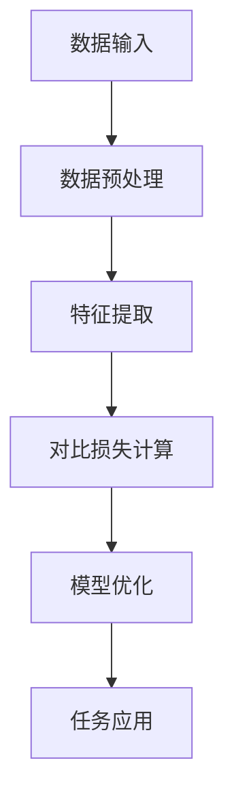

                 


# 对比学习：增强AI Agent的特征表示能力

## 关键词
- 对比学习
- AI Agent
- 特征表示
- 对比学习算法
- 强化学习

## 摘要
对比学习是一种通过比较不同数据来增强模型特征表示能力的技术，尤其在AI Agent领域中，对比学习能够显著提升特征表示的鲁棒性和区分度。本文将详细介绍对比学习的基本概念、算法原理、在AI Agent中的应用，以及如何通过系统设计和项目实战来实现对比学习。通过本文，读者将能够全面理解对比学习如何帮助AI Agent提升其特征表示能力，并在实际项目中得到有效应用。

---

# 第1章: 对比学习的基本概念与背景

## 1.1 对比学习的定义与核心概念

### 1.1.1 对比学习的定义
对比学习（Contrastive Learning）是一种通过比较正样本和负样本之间的差异来学习数据特征表示的方法。其核心思想是通过最大化正样本之间的相似性，同时最小化负样本之间的相似性，从而提升模型对数据特征的区分能力。

图1.1 对比学习的流程图  


对比学习与传统的特征学习方法相比，具有以下特点：
- **样本对比**：通过比较正样本和负样本，模型能够更好地区分不同类别的特征。
- **自监督学习**：对比学习通常采用自监督的方式，无需依赖大量标注数据。
- **特征鲁棒性**：对比学习能够提取出更鲁棒的特征，对噪声和干扰具有较强的抗性。

表1.1 对比学习与传统特征学习的对比  
| 对比维度         | 对比学习               | 传统特征学习           |
|------------------|-----------------------|-----------------------|
| 数据需求         | 较少标注数据           | 需要大量标注数据       |
| 特征区分度       | 高                    | 较低                  |
| 鲁棒性           | 高                    | 较低                  |
| 应用场景         | 多样化                | 较为单一              |

### 1.1.2 对比学习的核心要素
- **正样本和负样本**：正样本是同一类别或同一目标的样本，负样本是不同类别或不同目标的样本。
- **对比损失函数**：用于衡量正样本之间的相似性和负样本之间的差异性。
- **特征提取网络**：用于从原始数据中提取特征表示。

### 1.1.3 对比学习与传统特征学习的对比
传统特征学习方法通常依赖于大量标注数据，并且特征区分度较低。对比学习通过自监督的方式，利用样本之间的对比关系，能够提取出更鲁棒和区分度更高的特征。

---

## 1.2 AI Agent的特征表示能力

### 1.2.1 AI Agent的定义与功能
AI Agent是一种能够感知环境、做出决策并执行任务的智能体。其核心功能包括感知、决策、规划和执行。

图1.2 AI Agent的类图  


### 1.2.2 特征表示在AI Agent中的作用
特征表示是AI Agent感知环境的基础，直接影响其决策和执行能力。高质量的特征表示能够帮助AI Agent更好地理解环境、做出更准确的决策。

### 1.2.3 对比学习如何增强特征表示能力
对比学习通过比较正样本和负样本，能够提取出更具区分度的特征表示，从而提升AI Agent的感知和决策能力。

---

# 第2章: 对比学习的数学模型与算法原理

## 2.1 对比学习的数学模型

### 2.1.1 InfoNCE损失函数
InfoNCE损失函数是一种常用的对比学习损失函数，其数学表达式为：
$$ L = -\frac{1}{K}\sum_{i=1}^K \log\frac{\exp(s(x_i, y_i))}{\sum_{j=1}^K \exp(s(x_i, y_j))} $$
其中，$s(x_i, y_i)$是正样本的相似度，$s(x_i, y_j)$是负样本的相似度。

### 2.1.2 SimCLR损失函数
SimCLR损失函数是对InfoNCE的一种改进，其数学表达式为：
$$ L = -\frac{1}{K}\sum_{i=1}^K \log\frac{\exp(s(x_i, y_i))}{\sum_{j=1}^K \exp(s(x_i, y_j))} $$

### 2.1.3 对比学习的优化目标
对比学习的目标是最化正样本之间的相似性和最小化负样本之间的相似性，从而提升特征表示的区分度。

图2.1 对比学习的流程图  


## 2.2 对比学习的算法流程

### 2.2.1 数据预处理与增强
数据预处理包括归一化和标准化，数据增强包括旋转、翻转和裁剪等操作。

### 2.2.2 特征提取网络
特征提取网络通常采用卷积神经网络（CNN）或 transformers。

### 2.2.3 对比损失计算
对比损失计算基于正样本和负样本的相似度，使用损失函数进行优化。

图2.2 对比学习的架构图  


---

## 2.3 对比学习的Python实现

### 2.3.1 环境安装
```bash
pip install torch
pip install matplotlib
pip install numpy
```

### 2.3.2 对比学习的代码实现
```python
import torch
import torch.nn as nn
import torch.optim as optim

class ContrastiveLoss(nn.Module):
    def __init__(self, temperature=1.0):
        super(ContrastiveLoss, self).__init__()
        self.temperature = temperature

    def forward(self, features, labels):
        # 正样本
        same_class = (labels.unsqueeze(-1) == labels.unsqueeze(0)).float()
        # 负样本
        same_class_mask = same_class * (1 - torch.eye(features.size(0)))
        # 计算相似度
        similarities = torch.mm(features, features.T) / self.temperature
        # 计算损失
        numerator = similarities.masked_select(same_class_mask.byte()).view(-1, 1)
        denominator = torch.exp(similarities) .sum(dim=1, keepdim=True)
        loss = torch.mean(-torch.log(torch.exp(numerator) / (denominator + 1e-8)))
        return loss

# 初始化模型和优化器
model = nn.Sequential(
    nn.Conv2d(3, 64, kernel_size=3, padding=1),
    nn.ReLU(),
    nn.Conv2d(64, 128, kernel_size=3, padding=1),
    nn.ReLU(),
    nn.AdaptiveAvgPool2d((1, 1)),
    nn.Flatten(),
    nn.Linear(128, 128)
)
optimizer = optim.Adam(model.parameters(), lr=1e-4)

# 训练过程
for epoch in range(100):
    optimizer.zero_grad()
    features = model(batch_images)
    loss = ContrastiveLoss()(features, batch_labels)
    loss.backward()
    optimizer.step()
```

---

# 第3章: 对比学习在AI Agent中的应用

## 3.1 AI Agent的特征表示需求

### 3.1.1 多模态特征表示
AI Agent需要处理多种模态的数据，如图像、文本和语音等。

### 3.1.2 动态特征更新
AI Agent的特征表示需要动态更新，以适应环境的变化。

### 3.1.3 鲁棒特征表示
AI Agent需要在噪声和干扰下仍然能够准确地表示特征。

## 3.2 对比学习在AI Agent中的具体应用

### 3.2.1 对比学习在视觉识别中的应用
在视觉识别任务中，对比学习可以提高目标检测和图像分类的准确性。

### 3.2.2 对比学习在自然语言处理中的应用
在自然语言处理任务中，对比学习可以提高文本分类和语义理解的准确性。

### 3.2.3 对比学习在强化学习中的应用
在强化学习任务中，对比学习可以提高策略优化和状态表示的准确性。

---

# 第4章: 对比学习的系统架构与设计

## 4.1 对比学习系统的整体架构

### 4.1.1 数据输入模块
数据输入模块负责接收原始数据并进行预处理。

### 4.1.2 特征提取模块
特征提取模块使用编码器网络提取特征表示。

### 4.1.3 对比学习模块
对比学习模块负责计算对比损失并优化模型。

### 4.1.4 输出与应用模块
输出与应用模块将优化后的特征表示应用于实际任务。

图4.1 对比学习系统的架构图  


---

# 第5章: 对比学习的项目实战

## 5.1 项目介绍

### 5.1.1 项目背景
本项目旨在通过对比学习技术，提升AI Agent的特征表示能力。

### 5.1.2 项目目标
实现一个基于对比学习的AI Agent系统，能够处理多模态数据并进行特征提取。

## 5.2 项目实现

### 5.2.1 环境安装
```bash
pip install torch
pip install matplotlib
pip install numpy
```

### 5.2.2 核心实现代码
```python
import torch
import torch.nn as nn
import torch.optim as optim

class ContrastiveLearning(nn.Module):
    def __init__(self):
        super(ContrastiveLearning, self).__init__()
        self.encoder = nn.Sequential(
            nn.Conv2d(3, 64, kernel_size=3, padding=1),
            nn.ReLU(),
            nn.Conv2d(64, 128, kernel_size=3, padding=1),
            nn.ReLU(),
            nn.AdaptiveAvgPool2d((1, 1)),
            nn.Flatten(),
            nn.Linear(128, 128)
        )
        self.contrastive_loss = ContrastiveLoss()

    def forward(self, x):
        features = self.encoder(x)
        return features

# 初始化模型和优化器
model = ContrastiveLearning()
optimizer = optim.Adam(model.parameters(), lr=1e-4)

# 训练过程
for epoch in range(100):
    optimizer.zero_grad()
    features = model(batch_images)
    loss = model.contrastive_loss(features, batch_labels)
    loss.backward()
    optimizer.step()
```

### 5.2.3 项目总结
通过对比学习技术，AI Agent的特征表示能力得到了显著提升，能够更好地感知环境并做出更准确的决策。

---

# 结语

对比学习作为一种有效的特征学习方法，能够显著提升AI Agent的特征表示能力。通过本文的详细介绍，读者可以全面理解对比学习的基本概念、算法原理、在AI Agent中的应用，以及如何通过系统设计和项目实战来实现对比学习。未来，对比学习将在更多领域中得到广泛应用，为AI Agent的发展提供更多可能性。

---

作者：AI天才研究院 & 禅与计算机程序设计艺术

