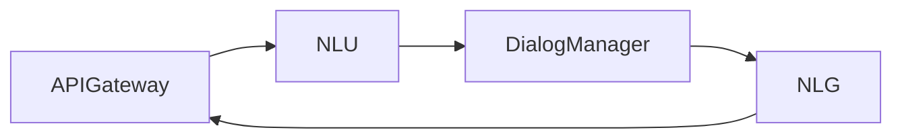

                 


# 对话式AI Agent：提升用户交互体验

> 关键词：对话式AI Agent，用户交互体验，自然语言处理，对话管理，机器学习，系统架构

> 摘要：对话式AI Agent通过自然语言处理和机器学习技术，能够实现与用户的智能对话，提升用户体验。本文将从对话式AI Agent的核心概念、算法原理、系统架构、项目实战等方面进行详细分析，帮助读者深入了解对话式AI Agent的设计与实现。

---

## 第一部分: 对话式AI Agent基础概述

### 第1章: 对话式AI Agent的定义与特点

#### 1.1 对话式AI Agent的定义
对话式AI Agent（Dialogue AI Agent）是一种能够通过自然语言与用户进行交互的智能系统，旨在通过理解和生成人类语言，提供智能化的服务。它不仅仅是一个简单的聊天机器人，而是能够根据上下文、用户意图和历史对话进行推理和决策，从而提供更精准和个性化的服务。

#### 1.2 对话式AI Agent的特点
- **智能性**：能够理解用户的意图，并通过上下文进行推理。
- **个性化**：根据用户的偏好和历史行为，提供个性化的服务。
- **实时性**：能够实时响应用户的输入，并保持流畅的对话。
- **可扩展性**：支持多种应用场景和功能扩展。

#### 1.3 对话式AI Agent与传统聊天机器人的区别
| 特性                 | 对话式AI Agent                | 传统聊天机器人             |
|----------------------|-------------------------------|-----------------------------|
| 智能性               | 高                            | 中或低                     |
| 对话管理             | 基于上下文和意图进行推理     | 基于预设规则或关键词匹配   |
| 个性化               | 支持用户偏好和历史行为分析   | 通常不支持                 |
| 实时性               | 高                            | 中                         |
| 应用场景             | 复杂场景，如客服、教育、医疗 | 简单场景，如娱乐、信息查询 |

---

### 第2章: 对话式AI Agent的技术基础

#### 2.1 自然语言处理（NLP）
自然语言处理是对话式AI Agent的核心技术之一，主要任务包括：
- **分词**：将输入文本分割成词语或短语。
- **词性标注**：为每个词语标注其词性（名词、动词、形容词等）。
- **句法分析**：分析句子的语法结构，确定词语之间的关系。
- **意图识别**：识别用户的意图，如“查询天气”、“预订酒店”等。

#### 2.2 对话管理
对话管理是对话式AI Agent的另一大核心技术，主要任务包括：
- **对话状态表示**：记录当前对话的状态，如用户意图、上下文信息等。
- **对话策略**：根据当前对话状态，生成合适的回复。
- **对话历史记录**：保存历史对话记录，以便后续对话的上下文推理。

#### 2.3 机器学习
机器学习在对话式AI Agent中的应用主要体现在：
- **监督学习**：通过标注数据训练模型，识别用户的意图和情感。
- **无监督学习**：通过聚类等技术，发现数据中的潜在模式。

---

## 第二部分: 对话式AI Agent的核心技术

### 第3章: 对话式AI Agent的算法原理

#### 3.1 机器学习算法
- **监督学习**：通过标注数据训练模型，识别用户的意图和情感。
  ```python
  # 示例：监督学习算法（决策树）
  from sklearn.tree import DecisionTreeClassifier
  # 训练数据
  X = [[...], [...]]  # 特征
  y = [...]
  # 训练模型
  model = DecisionTreeClassifier()
  model.fit(X, y)
  ```

- **无监督学习**：通过聚类等技术，发现数据中的潜在模式。
  ```python
  # 示例：无监督学习算法（K-means）
  from sklearn.cluster import KMeans
  # 训练数据
  X = [[...], [...]]  # 特征
  # 训练模型
  model = KMeans(n_clusters=3)
  model.fit(X)
  ```

---

## 第三部分: 对话式AI Agent的系统架构

### 第4章: 对话式AI Agent的系统架构设计

#### 4.1 对话系统模块化架构
```mermaid
graph TD
    A[用户输入] --> B[自然语言理解(NLU)]
    B --> C[对话管理器]
    C --> D[自然语言生成(NLG)]
    D --> E[用户输出]
```

#### 4.2 系统架构设计


---

## 第四部分: 对话式AI Agent的项目实战

### 第5章: 对话式AI Agent的项目实现

#### 5.1 项目环境配置
- **Python版本**：Python 3.8+
- **依赖库**：`transformers`, `tensorflow`, `scikit-learn`

#### 5.2 核心代码实现
```python
# 对话管理器实现
class DialogManager:
    def __init__(self):
        self.dialogue_state = {}
    
    def process_input(self, input_text):
        # 分析输入文本
        intent = self.predict_intent(input_text)
        # 更新对话状态
        self.dialogue_state['intent'] = intent
        return self.dialogue_state
```

---

## 第五部分: 对话式AI Agent的最佳实践

### 第6章: 对话式AI Agent的设计与优化

#### 6.1 数据质量
- 确保训练数据的多样性和代表性。
- 处理数据中的噪声和歧义。

#### 6.2 模型训练
- 选择合适的模型架构和训练策略。
- 定期更新模型，以适应用户行为的变化。

#### 6.3 用户体验
- 提供多轮对话支持，确保对话的连贯性。
- 处理用户的反馈，优化对话流程。

---

## 小结

对话式AI Agent通过自然语言处理和机器学习技术，能够实现与用户的智能对话，提升用户体验。本文从对话式AI Agent的核心概念、算法原理、系统架构、项目实战等方面进行了详细分析，帮助读者深入了解对话式AI Agent的设计与实现。

---

作者：AI天才研究院 & 禅与计算机程序设计艺术

