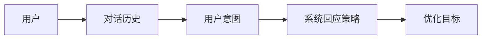

                 


# 对话策略优化：提升AI Agent的交互质量

## 关键词
对话策略优化、AI Agent、交互质量、自然语言处理、强化学习、监督学习

## 摘要
对话策略优化是提升AI Agent与用户交互质量的关键技术，涉及自然语言处理、强化学习和监督学习等领域的知识。本文将从背景、核心概念、算法原理、系统设计、项目实战到最佳实践，全面解析对话策略优化的方法与应用。

---

# 正文

## 第一部分: 对话策略优化的背景与核心概念

### 第1章: 对话策略优化的背景与问题背景

#### 1.1 问题背景
- **当前AI Agent交互中的问题**  
  AI Agent在与用户对话时，常面临以下问题：  
  1. 无法准确理解用户意图。  
  2. 回应缺乏逻辑性或相关性。  
  3. 对话过程僵硬，用户体验差。  
  4. 对上下文的依赖处理不当，导致对话中断。  

- **对话策略优化的必要性**  
  通过优化对话策略，AI Agent能够更自然地与用户交互，提升用户体验和任务完成效率。  

- **问题的边界与外延**  
  对话策略优化主要关注如何生成更合理的回应，但涉及的上下文理解、意图识别等是优化的基础。

#### 1.2 问题描述
- **对话策略优化的核心目标**  
  提高对话的流畅性和准确性，增强用户体验。  

- **问题的关键要素与属性**  
  | 关键要素 | 属性 |  
  |----------|------|  
  | 对话历史 | 时间序列、内容相关性 |  
  | 用户意图 | 显式或隐式、单一或复合 |  
  | 系统回应 | 及时性、相关性、情感一致性 |  

- **问题的场景与应用领域**  
  - 智能客服、虚拟助手、在线教育等领域。  
  - 基于不同场景的优化策略有所不同。  

### 第2章: 对话策略优化的核心概念与联系

#### 2.1 对话策略优化的核心概念
- **对话策略的定义与特征**  
  对话策略是AI Agent在对话过程中，基于当前对话状态和用户输入，生成合适的回应的一系列规则或模型。  
  其特征包括：目标导向性、上下文依赖性、动态适应性。  

- **对话策略优化的原理**  
  通过学习或规则定义，优化AI Agent的回应策略，使其更符合用户期望。  

- **对话策略优化与相关概念的关系**  
  - 对话生成：生成回应的过程。  
  - 意图识别：理解用户需求。  
  - 上下文管理：维护对话状态。  

#### 2.2 对话策略优化的核心要素
- **对话历史与上下文**  
  对话历史是优化的基础，上下文决定了回应的方向。  

- **用户意图识别**  
  准确识别用户意图是优化的关键，包括显式意图（如“预订机票”）和隐式意图（如“寻求建议”）。  

- **系统回应策略**  
  包括生成策略（基于规则或模型生成回应）和选择策略（从多个候选中选择最优回应）。  

#### 2.3 对话策略优化的ER实体关系图


---

## 第二部分: 对话策略优化的算法原理

### 第3章: 对话策略优化的算法原理

#### 3.1 基于强化学习的对话策略优化
- **强化学习的基本原理**  
  强化学习通过与环境交互，学习最优策略。在对话中，环境是用户，策略是回应方式。  

- **对话策略优化中的状态空间**  
  状态由对话历史、用户意图、上下文等因素构成。  

- **奖励函数的设计与实现**  
  奖励函数定义了用户对系统回应的反馈，常用指标包括任务完成度、用户满意度、对话长度等。  
  例如，任务完成度高的回应得高分，反之则低分。  

#### 3.2 基于监督学习的对话策略优化
- **监督学习的基本原理**  
  监督学习通过标注数据训练模型，使其能够预测目标输出。  

- **数据标注与训练集构建**  
  数据标注需要明确标注每个对话回合的用户输入和期望的系统回应。  

- **模型训练与评估**  
  使用标注数据训练模型，评估指标包括准确率、召回率、F1值等。  

#### 3.3 对话策略优化的数学模型
- **基于强化学习的数学模型**  
  状态-动作价值函数：  
  $$ V(s) = \max_a Q(s,a) $$  
  其中，$s$ 是状态，$a$ 是动作。  

- **基于监督学习的数学模型**  
  系统回应生成模型：  
  $$ y = f(x; \theta) $$  
  其中，$x$ 是输入，$y$ 是输出，$\theta$ 是模型参数。  

---

## 第三部分: 对话策略优化的系统分析与架构设计

### 第4章: 对话策略优化的系统分析与架构设计

#### 4.1 系统分析
- **问题场景介绍**  
  以智能客服为例，用户咨询问题，AI Agent需要根据对话历史和用户意图生成合适的回应。  

- **项目介绍与目标**  
  开发一个基于强化学习的对话优化系统，提升用户体验。  

- **系统功能设计**  
  - 对话历史记录与管理。  
  - 用户意图识别与分类。  
  - 系统回应生成与优化。  

#### 4.2 系统架构设计
- **领域模型设计**  
  ```mermaid
  classDiagram
  class 用户 {
    id
    对话历史
  }
  class 对话历史 {
    id
    内容
  }
  class 用户意图 {
    id
    类型
  }
  用户 --> 对话历史
  对话历史 --> 用户意图
  ```

- **系统架构图**  
  ```mermaid
  graph LR
  A[用户] --> B[对话历史]
  B --> C[用户意图]
  C --> D[系统回应策略]
  D --> E[优化目标]
  ```

- **系统接口设计**  
  - 用户输入接口：接收用户输入。  
  - 系统输出接口：生成并发送回应。  

- **系统交互流程**  
  ```mermaid
  sequenceDiagram
  User -> AI Agent: 发送查询请求
  AI Agent -> 分析器: 解析用户意图
  分析器 -> 策略引擎: 生成回应策略
  策略引擎 -> 回应生成器: 生成回应
  回应生成器 -> User: 返回回应
  ```

---

## 第四部分: 对话策略优化的项目实战

### 第5章: 对话策略优化的项目实战

#### 5.1 环境安装
- Python 3.8+
- 深度学习框架（如TensorFlow或PyTorch）
- 自然语言处理库（如spaCy或NLTK）

#### 5.2 系统核心实现源代码
以下是一个基于强化学习的对话策略优化框架的Python代码示例：

```python
import numpy as np
import tensorflow as tf

class DQN:
    def __init__(self, state_space, action_space):
        self.state_space = state_space
        self.action_space = action_space
        self.gamma = 0.99
        self.epsilon = 1.0
        self.epsilon_min = 0.01
        self.epsilon_decay = 0.995

        self.model = self.build_model()

    def build_model(self):
        model = tf.keras.Sequential([
            tf.keras.layers.Dense(64, activation='relu', input_shape=(self.state_space,)),
            tf.keras.layers.Dense(32, activation='relu'),
            tf.keras.layers.Dense(self.action_space, activation='linear')
        ])
        model.compile(optimizer='adam', loss='mean_squared_error')
        return model

    def act(self, state):
        if np.random.random() < self.epsilon:
            return np.random.randint(self.action_space)
        else:
            q_values = self.model.predict(np.array([state]))
            return np.argmax(q_values[0])

    def remember(self, state, action, reward, next_state):
        # 简化版的记忆存储，实际可使用更复杂的结构
        pass

    def replay(self, batch_size):
        # 简化版的重放策略，实际可使用更复杂的策略
        pass

    def decay_epsilon(self):
        self.epsilon = max(self.epsilon_min, self.epsilon * self.epsilon_decay)
```

#### 5.3 实际案例分析和详细讲解剖析
以智能客服对话优化为例：  
- 用户输入：“我的订单在哪里？”  
- 系统分析用户意图：查询订单状态。  
- 系统生成多个候选回应，如：  
  1. “您可以在我的订单页面查看详细信息。”  
  2. “请提供订单号，我帮您查询。”  
- 根据历史数据和用户反馈，选择最优回应。  

---

## 第五部分: 最佳实践与总结

### 第6章: 对话策略优化的最佳实践

#### 6.1 小结
- 对话策略优化是提升AI Agent交互质量的核心技术。  
- 强化学习和监督学习是主要的优化方法。  

#### 6.2 注意事项
- 数据质量对优化效果至关重要。  
- 需要考虑实际场景的多样性。  

#### 6.3 拓展阅读
- 《Deep Learning for NLP》  
- 《Reinforcement Learning: Theory and Practice》  

---

## 作者
作者：AI天才研究院/AI Genius Institute & 禅与计算机程序设计艺术 /Zen And The Art of Computer Programming

