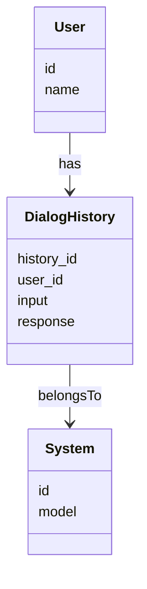
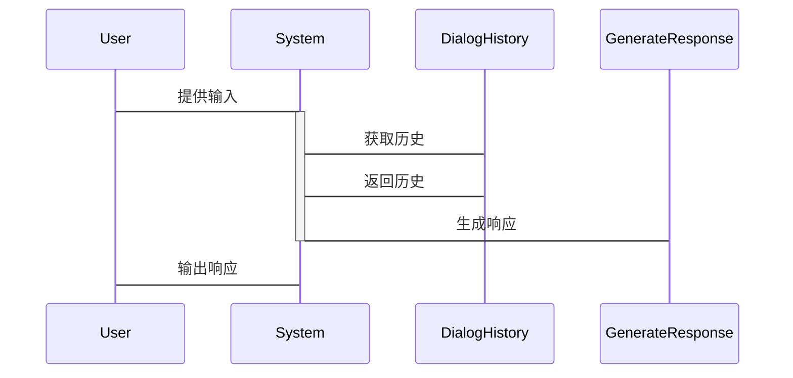

                 


# 对话管理系统：构建流畅自然的人机交互

## 关键词：对话管理、人机交互、自然语言处理、系统架构、算法原理

## 摘要：对话管理系统是实现流畅自然人机交互的核心技术，本文从背景、概念、算法、架构、实战和最佳实践等多个维度全面解析对话管理系统的构建过程，帮助读者深入理解其原理和应用。

## 第一部分：对话管理系统的背景与核心概念

### 第1章：对话管理系统的背景介绍

#### 1.1 问题背景
- **1.1.1 人机交互的发展历程**
  - 从命令行到图形界面，再到自然语言交互的演变。
  
- **1.1.2 当前对话交互的痛点**
  - 对话中断率高、意图识别错误、系统响应不自然。
  
- **1.1.3 对话管理系统的必要性**
  - 提高用户体验，降低开发成本，增强系统智能性。

#### 1.2 问题描述
- **1.2.1 对话管理的核心问题**
  - 如何理解用户意图，如何保持对话流畅。
  
- **1.2.2 用户需求与系统响应的矛盾**
  - 用户期望自然对话，系统受限于技术实现。
  
- **1.2.3 对话流畅性的关键因素**
  - 上下文理解、意图识别、多轮对话管理。

#### 1.3 问题解决
- **1.3.1 对话管理系统的解决方案**
  - 采用自然语言处理和机器学习技术。
  
- **1.3.2 自然语言处理技术的应用**
  - 分词、实体识别、情感分析等技术提升对话质量。
  
- **1.3.3 人机协作的实现方式**
  - 结合规则和模型，实现更自然的对话流程。

#### 1.4 边界与外延
- **1.4.1 对话管理系统的边界**
  - 系统只处理对话内容，不涉及外部服务调用。
  
- **1.4.2 相关领域的外延**
  - 语音识别、图像识别等多模态交互技术。
  
- **1.4.3 系统与环境的交互边界**
  - 对话管理系统与其他模块的接口定义。

#### 1.5 核心要素组成
- **1.5.1 对话上下文**
  - 包括对话历史、用户状态等信息。
  
- **1.5.2 用户意图识别**
  - 通过意图分类确定用户需求。
  
- **1.5.3 系统响应策略**
  - 根据上下文生成合适的回复。

## 第二部分：对话管理系统的核心概念与联系

### 第2章：对话管理的核心概念原理

#### 2.1 对话管理的基本原理
- **2.1.1 对话流程的分解**
  - 输入处理、意图识别、策略选择、生成响应。
  
- **2.1.2 上下文的处理机制**
  - 维护对话历史，管理当前状态。
  
- **2.1.3 用户意图的识别方法**
  - 基于规则和机器学习的意图分类。

#### 2.2 对话管理系统的属性特征对比
| 属性 | 特征1 | 特征2 | 特征3 |
|------|-------|-------|-------|
| 输入方式 | 文本 | 语音 | 多模态 |
| 响应方式 | 文本 | 语音 | 图像 |
| 理解方式 | 规则 | 统计 | 深度学习 |

#### 2.3 实体关系图
```mermaid
graph TD
    User->DialogHistory: 提供输入
    DialogHistory->System: 提供上下文
    System->Response: 生成响应
```

## 第三部分：对话管理系统的算法原理

### 第3章：对话管理算法的核心原理

#### 3.1 基于规则的对话管理
- **算法流程**
  - 用户输入 -> 分词 -> 实体识别 -> 意图分类 -> 生成响应。

```mermaid
graph TD
    Start->Input: 用户输入
    Input->Tokenize: 分词
    Tokenize->NER: 实体识别
   NER->IntentClassification: 意图分类
    IntentClassification->GenerateResponse: 生成响应
    GenerateResponse->Output: 输出
```

- **Python代码实现**
  ```python
  def generate_response(user_input):
      tokens = tokenize(user_input)
      entities = ner(tokens)
      intent = classify_intent(entities)
      response = generate(intent)
      return response
  ```

- **数学模型与公式**
  - 概率计算：P(intent|input) = ∏P(word|intent, user)
  - 示例：计算“天气”的概率。

#### 3.2 基于统计的对话管理
- **算法流程**
  - 使用历史对话数据训练模型，基于概率生成回复。

```mermaid
graph TD
    Start->Input: 用户输入
    Input->History: 查找历史
    History->TrainModel: 训练模型
    TrainModel->GenerateResponse: 生成响应
    GenerateResponse->Output: 输出
```

- **Python代码实现**
  ```python
  def generate_response(user_input):
      history = get_history(user_input)
      model = train_model(history)
      response = generate(model, history)
      return response
  ```

- **数学模型与公式**
  - 贝叶斯公式：P(A|B) = P(B|A)P(A)/P(B)

#### 3.3 基于深度学习的对话管理
- **算法流程**
  - 使用预训练模型如BERT进行对话理解，生成回复。

```mermaid
graph TD
    Start->Input: 用户输入
    Input->PretrainModel: 加入预训练模型
    PretrainModel->GenerateResponse: 生成响应
    GenerateResponse->Output: 输出
```

- **Python代码实现**
  ```python
  def generate_response(user_input):
      model = load_pretrained_model()
      response = generate(model, user_input)
      return response
  ```

- **数学模型与公式**
  - 损失函数：L = -Σ(y log p(y|θ))
  - 示例：计算交叉熵损失。

## 第四部分：对话管理系统的系统分析与架构设计

### 第4章：对话管理系统的分析与设计

#### 4.1 问题场景介绍
- **4.1.1 对话管理系统的应用场景**
  - 智能客服、智能音箱、虚拟助手等。

#### 4.2 项目介绍
- **4.2.1 项目目标**
  - 实现一个基于深度学习的对话管理系统。
  
- **4.2.2 项目范围**
  - 支持文本输入，生成自然语言响应。

#### 4.3 系统功能设计
- **4.3.1 领域模型**


- **4.3.2 系统架构设计**
```mermaid
graph TD
    User->DialogHistory: 提供输入
    DialogHistory->System: 提供上下文
    System->Response: 生成响应
    Response->User: 输出
```

- **4.3.3 系统接口设计**
  - 输入接口：接收用户输入。
  - 输出接口：返回系统响应。

#### 4.4 系统交互流程图


## 第五部分：对话管理系统的项目实战

### 第5章：对话管理系统实战

#### 5.1 环境安装
- Python 3.8+
- pip install transformers

#### 5.2 核心代码实现
- **模型加载**
  ```python
  from transformers import AutoModelForSeq2Seq, AutoTokenizer

  model = AutoModelForSeq2Seq.from_pretrained('t5-base')
  tokenizer = AutoTokenizer.from_pretrained('t5-base')
  ```

- **对话处理函数**
  ```python
  def process_dialogue(user_input):
      inputs = tokenizer.encode(user_input, return_tensors='pt')
      outputs = model.generate(inputs, max_length=50)
      response = tokenizer.decode(outputs[0], skip_special_tokens=True)
      return response
  ```

#### 5.3 代码应用解读与分析
- **输入处理**
  - 分词、编码、模型生成。
  
- **响应生成**
  - 解码生成的tokens为自然语言文本。

#### 5.4 实际案例分析
- **案例1**
  - 用户输入：'今天天气怎么样？'
  - 系统响应：'今天天气很好，晴朗。'

- **案例2**
  - 用户输入：'推荐一本好书。'
  - 系统响应：'您喜欢哪种类型的书？'

#### 5.5 项目小结
- 项目实现了一个基本的对话管理系统，基于预训练模型实现自然语言处理，能够处理简单的对话请求。

## 第六部分：对话管理系统的最佳实践

### 第6章：对话管理系统的最佳实践

#### 6.1 小结
- 对话管理系统的构建需要结合自然语言处理和机器学习技术，注重上下文理解和意图识别。

#### 6.2 注意事项
- 数据质量：训练数据需多样化，避免模型过拟合。
- 系统性能：优化算法，提升响应速度。
- 用户隐私：确保数据安全，保护用户隐私。

#### 6.3 拓展阅读
- 《自然语言处理入门》
- 《深度学习对话模型》
- 《系统架构设计实践》

## 作者：AI天才研究院 & 禅与计算机程序设计艺术

---

这篇文章系统地介绍了对话管理系统的构建过程，从背景分析到算法实现，再到系统设计和项目实战，帮助读者全面理解对话管理系统的原理和应用。希望对您在构建流畅自然的对话系统有所帮助。

