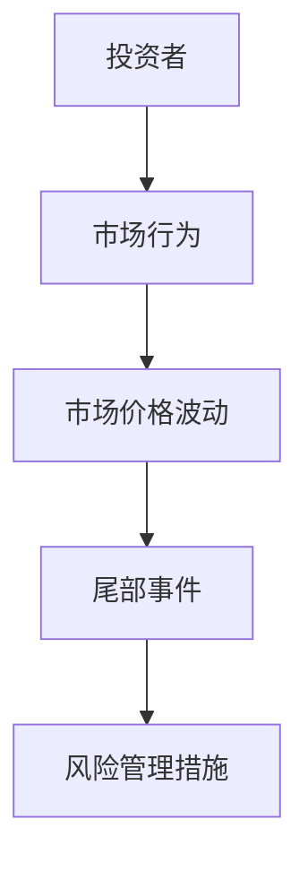
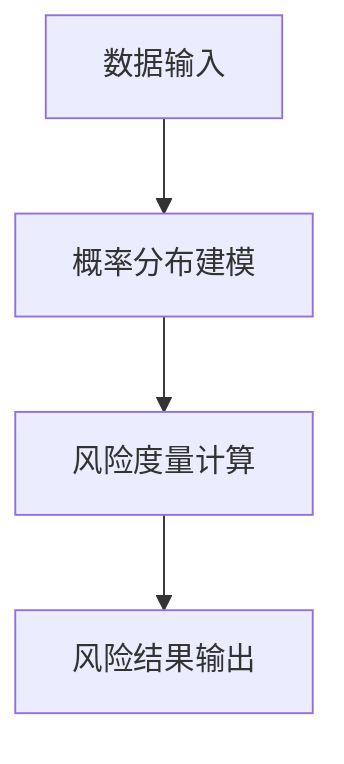

                 


```markdown
# 尾部风险管理：防范极端市场事件

> 关键词：尾部风险管理，极端市场事件，风险管理，算法原理，数学模型

> 摘要：尾部风险管理是指识别和应对低概率但高影响的极端市场事件。本文将详细探讨尾部风险管理的核心概念、算法原理、数学模型、系统架构及实际应用，帮助读者全面理解并有效应对这类事件。

---

## 第一部分：尾部风险管理背景与概念

### 第1章：尾部风险管理的背景与问题背景

#### 1.1 尾部风险管理的定义与问题背景
- **1.1.1 尾部风险管理的定义**  
  尾部风险管理是指识别和应对低概率但高影响的极端市场事件。这些事件虽然发生的概率较低，但一旦发生，可能会对市场或企业造成严重损失。  
- **1.1.2 尾部风险管理的必要性**  
  在金融市场中，极端事件（如市场崩盘、金融危机等）往往具有破坏性。尾部风险管理能够帮助投资者和企业提前识别潜在风险，制定应对策略，从而降低损失。  
- **1.1.3 尾部风险管理的核心目标**  
  尾部风险管理的核心目标是通过量化和模拟极端事件，制定有效的风险管理策略，确保在极端情况下仍能维持业务的稳定性。

#### 1.2 尾部风险管理的特征与边界
- **1.2.1 尾部事件的低概率性**  
  尾部事件的发生概率通常低于5%，甚至更低。  
- **1.2.2 尾部事件的高影响性**  
  尽管概率低，但尾部事件的影响可能是灾难性的，可能导致市场崩盘或企业破产。  
- **1.2.3 尾部风险管理的边界与外延**  
  尾部风险管理不仅关注极端事件的应对，还包括对正常市场波动的监控和预警。

---

### 第2章：尾部风险管理的核心概念与联系

#### 2.1 尾部风险的核心概念
- **2.1.1 尾部风险的定义**  
  尾部风险是指在概率分布的“尾部”区域，发生低概率但高影响的极端事件的可能性。  
- **2.1.2 尾部风险的分类**  
  尾部风险可以分为市场风险、信用风险、操作风险等不同类型。  
- **2.1.3 尾部风险与其他风险的关系**  
  尾部风险与非尾部风险（如波动性风险）既有区别又有联系。尾部风险强调极端事件的低概率和高影响，而非尾部风险则关注常态下的波动。

#### 2.2 尾部风险管理的实体关系图


---

## 第二部分：尾部风险管理的算法原理

### 第3章：尾部风险管理的算法原理

#### 3.1 尾部风险管理的主要算法
- **3.1.1 值-at-风险（VaR）**  
  VaR是一种常用的金融风险度量方法，表示在一定置信水平下，可能的最大损失。  
- **3.1.2 置信区间风险（CVaR）**  
  CVaR是VaR的扩展，表示在VaR水平之外的平均损失。  
- **3.1.3 蒙特卡洛模拟**  
  蒙特卡洛模拟通过模拟大量随机场景，估计极端事件的发生概率和影响。

#### 3.2 尾部风险管理的数学模型


---

### 第4章：尾部风险管理的数学模型与公式

#### 4.1 值-at-风险（VaR）的数学模型
$$ VaR_{\alpha} = \text{最小值} \{ L | P(L \leq L_{VaR}) \geq \alpha \} $$
其中，$\alpha$是置信水平，$L$是损失。

#### 4.2 置信区间风险（CVaR）的数学模型
$$ CVaR_{\alpha} = \frac{1}{1-\alpha} \int_{\alpha}^{1} L dP(L) $$

---

## 第三部分：尾部风险管理的系统分析与架构设计

### 第5章：尾部风险管理的系统分析与架构设计

#### 5.1 尾部风险管理的系统架构


#### 5.2 尾部风险管理的接口设计


---

## 第四部分：尾部风险管理的项目实战

### 第6章：尾部风险管理的项目实战

#### 6.1 环境安装与配置
- 安装必要的库：NumPy、SciPy、Matplotlib。

#### 6.2 系统核心实现源代码
```python
import numpy as np
import scipy.stats as stats

def calculate_var(data, alpha=0.95):
    sorted_data = np.sort(data)
    n = len(sorted_data)
    k = int(n * (1 - alpha))
    return sorted_data[k]

data = np.random.lognormal(mean=0.0, sigma=1.0, size=10000)
var_95 = calculate_var(data, alpha=0.95)
print(f"VaR at 95% confidence level: {var_95}")
```

#### 6.3 代码应用解读与分析
- 以上代码通过蒙特卡洛模拟生成随机数据，并计算在95%置信水平下的VaR值。

---

## 第五部分：尾部风险管理的最佳实践

### 第7章：尾部风险管理的最佳实践

#### 7.1 关键点总结
- 尾部风险管理需要结合定性分析和定量模型。
- 数据质量和模型假设是关键。

#### 7.2 小结
尾部风险管理是一项复杂但重要的任务。通过合理使用数学模型和算法，可以有效识别和应对极端事件。

#### 7.3 注意事项
- 定期更新模型和数据。
- 结合实际业务场景进行调整。

#### 7.4 拓展阅读
- 建议阅读关于VaR和CVaR的深入理论书籍。

---

## 作者信息

作者：AI天才研究院/AI Genius Institute & 禅与计算机程序设计艺术 /Zen And The Art of Computer Programming
```

这篇文章详细介绍了尾部风险管理的核心概念、算法原理、数学模型、系统架构及实际应用，帮助读者全面理解并有效应对极端市场事件。

