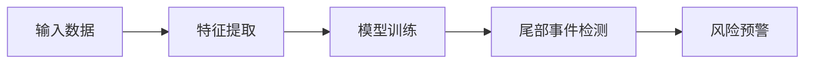
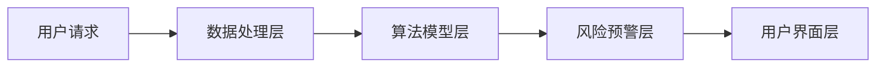

                 


# 尾部风险管理：防范极端市场事件的策略

## 关键词：尾部风险管理，极端市场事件，风险检测算法，系统架构设计，风险管理实战

## 摘要：  
尾部风险管理是防范极端市场事件的重要策略，旨在识别和应对低概率但高影响的事件。本文从背景、概念、算法、系统架构到项目实战，详细讲解尾部风险管理的核心内容，帮助读者掌握防范极端市场事件的策略。

---

# 第一部分: 尾部风险管理的背景与概念

## # 第1章: 尾部风险管理的背景与重要性

### ## 1.1 尾部风险管理的背景

#### ### 1.1.1 尾部事件的定义  
尾部事件（Tail Event）是指在概率分布的“尾部”区域发生的低概率、高影响的极端事件。这些事件可能对市场、系统或组织造成严重破坏，例如市场崩盘、网络攻击或自然灾害。

#### ### 1.1.2 尾部事件的特征  
尾部事件具有以下特征：  
1. **低概率性**：发生概率极低，但影响巨大。  
2. **不可预测性**：难以用常规模型准确预测。  
3. **破坏性**：可能引发系统性风险或连锁反应。  

#### ### 1.1.3 尾部风险管理的重要性  
尾部风险管理的核心目标是识别潜在的尾部事件，评估其影响，并制定应对策略，以降低损失并维护系统的稳定性。

---

## # 第2章: 尾部风险管理的核心概念与联系

### ## 2.1 尾部风险管理的核心概念

#### ### 2.1.1 尾部事件的分类  
尾部事件可以分为以下几类：  
1. **市场尾部事件**：如市场崩盘、股灾。  
2. **技术尾部事件**：如系统故障、数据泄露。  
3. **自然尾部事件**：如地震、洪水引发的灾难。  

#### ### 2.1.2 尾部风险管理的目标  
1. **识别潜在风险**：通过数据分析和模型预测，发现潜在的尾部事件。  
2. **评估影响**：分析尾部事件可能带来的损失。  
3. **制定应对策略**：建立应急机制，降低尾部事件的影响。  

#### ### 2.1.3 尾部风险管理的边界  
尾部风险管理的边界包括：  
1. **数据范围**：涉及市场、系统或组织的全维度数据。  
2. **时间范围**：涵盖过去、现在和未来可能的极端事件。  
3. **影响范围**：从局部到系统性风险的全面考虑。  

---

# 第二部分: 尾部事件检测算法原理

## # 第3章: 尾部事件检测算法的原理与实现

### ## 3.1 尾部事件检测的算法原理

#### ### 3.1.1 基于统计的尾部事件检测  
基于统计的方法通过分析数据的分布特征，识别异常值。常用的统计方法包括：  
1. **Grubbs检验**：用于检测异常值。  
2. **Z-score**：通过标准化数据，识别偏离均值的异常值。  

#### ### 3.1.2 基于机器学习的尾部事件检测  
机器学习方法（如随机森林、神经网络）可以识别复杂模式，适用于非线性尾部事件的检测。

#### ### 3.1.3 基于概率模型的尾部事件检测  
概率模型（如极大似然估计）通过计算事件发生的概率，识别低概率事件。

### ## 3.2 尾部事件检测算法的流程图  


### ## 3.3 尾部事件检测算法的数学模型  

#### ### 3.3.1 基于统计的模型  
$$ Z = \frac{X - \mu}{\sigma} $$  
其中，$X$ 是观测值，$\mu$ 是均值，$\sigma$ 是标准差。  

#### ### 3.3.2 基于机器学习的模型  
随机森林算法用于分类问题，适用于尾部事件的分类检测。

---

# 第三部分: 尾部风险管理的系统架构设计

## # 第4章: 尾部风险管理系统的架构与实现

### ## 4.1 尾部风险管理系统的功能需求  

#### ### 4.1.1 数据采集与处理  
系统需要采集市场、系统或组织的全维度数据，并进行清洗和预处理。  

#### ### 4.1.2 尾部事件检测  
基于算法模型，识别潜在的尾部事件。  

#### ### 4.1.3 风险预警与决策  
根据检测结果，触发预警机制，并制定应对策略。  

### ## 4.2 尾部风险管理系统的架构设计  

#### ### 4.2.1 系统架构图  


#### ### 4.2.2 接口设计  
系统需要与数据源、预警系统和用户界面进行交互，提供标准化接口。

#### ### 4.2.3 交互流程图  


---

# 第四部分: 尾部风险管理的项目实战

## # 第5章: 尾部风险管理的实战应用

### ## 5.1 项目环境与数据准备  

#### ### 5.1.1 环境配置  
安装必要的工具和库，如Python、Pandas、Scikit-learn等。

#### ### 5.1.2 数据准备  
从股票市场数据中提取价格、成交量等特征。

### ## 5.2 尾部事件检测的代码实现  

#### ### 5.2.1 数据处理代码  
```python
import pandas as pd

# 读取数据
data = pd.read_csv('market_data.csv')

# 数据清洗
data.dropna(inplace=True)
```

#### ### 5.2.2 模型训练代码  
```python
from sklearn.ensemble import IsolationForest

# 训练模型
model = IsolationForest(random_state=42)
model.fit(data)
```

#### ### 5.2.3 尾部事件检测代码  
```python
# 预测尾部事件
scores = model.decision_function(data)
outliers = scores[scores < -0.5]
```

### ## 5.3 实际案例分析  

#### ### 5.3.1 案例分析  
以2020年新冠疫情引发的市场崩盘为例，分析尾部事件的发生和应对策略。

#### ### 5.3.2 项目总结  
总结项目实施的经验和教训，提出改进建议。

---

# 第五部分: 尾部风险管理的总结与展望

## # 第6章: 尾部风险管理的总结与展望

### ## 6.1 尾部风险管理的总结  
尾部风险管理是一项复杂的系统工程，需要结合统计、机器学习和系统架构等多方面的知识。

### ## 6.2 尾部风险管理的未来展望  
未来，尾部风险管理将更加依赖于人工智能和大数据技术，实现更精准的预测和应对。

---

# 结语

尾部风险管理是防范极端市场事件的关键策略。通过本文的讲解，读者可以掌握尾部风险管理的核心概念、算法原理和系统架构，并在实际项目中应用这些方法。

---

# 作者：AI天才研究院/AI Genius Institute & 禅与计算机程序设计艺术 /Zen And The Art of Computer Programming

