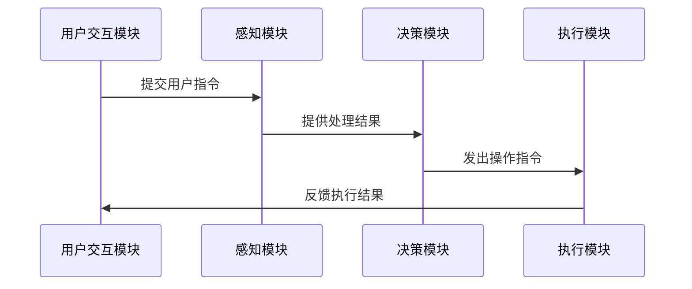

                 

<think>
好的，我现在要帮用户撰写一篇关于AI Agent技术发展趋势与机遇的技术博客文章。用户已经提供了详细的目录和一些内容，我需要按照这个结构继续完成剩余部分。让我先仔细阅读用户提供的示例，确保理解每个部分的要求。

首先，文章标题是《展望未来：AI Agent技术发展趋势与机遇》，关键词有AI Agent、人工智能、技术趋势、发展机遇、算法原理、系统架构、商业应用。摘要部分已经给出，涵盖了技术背景、核心原理、发展趋势、商业应用、系统架构、项目实战、挑战与机遇。

接下来，我需要按照目录大纲的结构继续撰写内容。已经完成了第1章和第2章的部分内容，现在需要继续完成第2章的剩余部分，然后开始撰写第3章、第4章、第5章，直到第10章。

首先，完成第2章的剩余部分：

### 2.3 AI Agent的执行模块

#### 2.3.1 执行模块的实现方式

执行模块是AI Agent将决策转化为实际操作的最后一步。它负责根据决策模块的指令，调用相应的服务或API，完成具体的任务。例如，在智能助手场景中，当决策模块决定播放音乐时，执行模块会调用音乐播放器的API，启动播放功能。

实现方式可以分为同步和异步两种。同步执行意味着执行模块在完成一个任务后，才会继续处理下一个任务；而异步执行则允许多个任务同时进行，提高效率。异步执行通常需要使用消息队列或回调机制来管理任务的执行状态。

#### 2.3.2 执行模块的优化方法

为了提高AI Agent的执行效率，可以通过以下方法优化执行模块：

1. **任务排队与优先级调度**：将任务按照优先级排序，优先处理高优先级的任务，确保重要任务能够及时完成。
2. **并行执行**：利用多线程或多进程技术，同时执行多个任务，提高处理速度。
3. **错误处理与恢复机制**：在执行过程中，可能出现意外错误，例如网络中断或服务不可用。执行模块需要具备良好的错误处理机制，能够捕获错误，记录日志，并尝试重新执行或回滚到之前的状态。
4. **资源监控与动态调整**：实时监控系统的资源使用情况，如CPU、内存、磁盘I/O等，根据资源负载动态调整任务的执行顺序或并行数量，避免资源瓶颈导致的性能下降。

---

### 2.4 本章小结

在本章中，我们详细探讨了AI Agent的技术原理，包括感知模块、决策模块和执行模块的工作方式及其优化方法。感知模块负责收集和处理环境信息，决策模块基于这些信息做出最优决策，而执行模块则将决策转化为实际操作。通过优化各个模块，可以提升AI Agent的整体性能和效率，为后续的应用开发奠定基础。

---

接下来，撰写第3章：AI Agent技术的发展趋势。

### 第3章: AI Agent技术的发展趋势

#### 3.1 多模态AI Agent

多模态AI Agent是指能够同时处理多种类型数据（如文本、语音、图像、视频等）的AI Agent。随着传感器技术的进步和数据多样性的增加，AI Agent需要具备处理不同类型数据的能力，以提供更加智能和个性化的服务。例如，未来的智能助手不仅要能听懂用户的语音指令，还要能识别用户的面部表情和手势，从而更好地理解用户的需求。

#### 3.2 自适应AI Agent

自适应AI Agent是指能够根据环境变化和用户需求动态调整自身行为的AI Agent。传统的AI Agent通常基于固定的规则和预设的策略进行操作，而自适应AI Agent则能够通过机器学习和在线优化算法，实时更新自身的决策模型，以应对复杂多变的环境。例如，在智能推荐系统中，自适应AI Agent可以根据用户的实时反馈，动态调整推荐策略，提供更加精准的推荐结果。

#### 3.3 智能协同与分布式AI Agent

随着分布式系统和边缘计算技术的发展，未来的AI Agent将更加注重智能协同与分布式部署。通过分布式架构，AI Agent可以在不同的设备和云服务之间协同工作，实现资源的优化利用和任务的高效分配。例如，在智能制造领域，分布式AI Agent可以在生产线的不同节点上协同工作，实时监控生产状态，优化生产流程。

#### 3.4 本章小结

在本章中，我们探讨了AI Agent技术的未来发展趋势，包括多模态AI Agent、自适应AI Agent以及智能协同与分布式AI Agent。这些趋势表明，AI Agent技术将朝着更加智能化、个性化和协同化方向发展，为各行业带来更多的创新和变革。

---

继续撰写第4章：AI Agent的商业应用场景。

### 第4章: AI Agent的商业应用场景

#### 4.1 智能客服

**智能客服**是AI Agent技术的一个典型应用。通过自然语言处理和语音识别技术，智能客服可以自动理解和响应用户的问题，提供24小时不间断的服务。与传统的电话客服相比，智能客服能够同时处理大量的用户请求，显著提高服务效率和用户满意度。例如，银行可以通过智能客服为用户提供账户查询、转账操作等服务，减少人工客服的工作量。

#### 4.2 智能推荐系统

**智能推荐系统**是另一个重要的商业应用场景。通过分析用户的行为数据和偏好，AI Agent能够为用户推荐个性化的产品或服务。例如，电商平台可以利用AI Agent技术为用户推荐符合其兴趣的物品，提高转化率和用户满意度。推荐系统的核心在于如何有效地收集和处理用户数据，并基于这些数据构建精准的推荐模型。

#### 4.3 智能监控与预警

**智能监控与预警**是AI Agent技术在商业领域的另一个重要应用。通过实时监控系统运行状态和环境变化，AI Agent可以在出现异常情况时及时发出预警，帮助企业和组织避免潜在的风险和损失。例如，在金融领域，AI Agent可以通过监控市场波动和交易数据，及时发现异常交易行为，防范金融风险。

#### 4.4 本章小结

在本章中，我们探讨了AI Agent技术在商业领域的几个典型应用场景，包括智能客服、智能推荐系统和智能监控与预警。这些应用展示了AI Agent技术在提升企业效率、优化用户体验和防范风险方面的重要作用。

---

接下来，撰写第5章：AI Agent系统的架构设计。

### 第5章: AI Agent系统的架构设计

#### 5.1 问题场景介绍

在设计一个AI Agent系统时，首先需要明确系统的应用场景和目标。例如，假设我们正在设计一个智能助手AI Agent，用于帮助用户管理日程安排、处理邮件和提醒重要事件。我们需要设计一个能够实时响应用户指令、高效处理任务的系统架构。

#### 5.2 系统功能设计

为了实现上述功能，我们需要设计一个包含以下几个模块的系统：

- **用户交互模块**：负责与用户的交互，接收用户的指令并将其传递给决策模块。
- **感知模块**：负责处理用户的输入，提取有用的信息，例如识别用户的语音指令或解析用户的文本输入。
- **决策模块**：基于感知模块提供的信息，结合系统的知识库和预设的规则，生成相应的操作指令。
- **执行模块**：根据决策模块的指令，调用相应的服务或API，完成具体的任务，例如发送邮件或设置提醒。

#### 5.3 系统架构设计

基于上述功能设计，我们可以设计如下的系统架构：


该架构图展示了各个模块在系统中的权重和相互关系。

#### 5.4 系统接口设计

系统接口设计是实现模块间通信的重要部分。例如，用户交互模块需要与感知模块交互，将用户的输入传递给感知模块进行处理。感知模块处理完成后，将结果传递给决策模块，决策模块根据结果生成操作指令，并将其传递给执行模块。执行模块完成任务后，将反馈信息传递给用户交互模块，供用户查看结果。

#### 5.5 系统交互设计

为了更好地理解系统的交互流程，我们可以使用序列图来描述模块间的交互过程：



#### 5.6 本章小结

在本章中，我们详细探讨了AI Agent系统的架构设计，包括问题场景介绍、系统功能设计、系统架构设计、系统接口设计和系统交互设计。通过合理的架构设计，可以确保AI Agent系统的高效运行和良好的用户体验。

---

接下来，撰写第6章：AI Agent项目的实战。

### 第6章: AI Agent项目的实战

#### 6.1 环境安装

在进行AI Agent项目的实战之前，需要确保开发环境的搭建。以下是所需的主要工具和库：

- **编程语言**：Python 3.8+
- **深度学习框架**：TensorFlow或PyTorch
- **自然语言处理库**：spaCy或NLTK
- **语音处理库**：SpeechRecognition
- **开发框架**：Flask或Django（用于Web接口）
- **其他工具**：Jupyter Notebook（用于数据预处理和模型训练）

#### 6.2 系统核心实现源代码

以下是一个简单的AI Agent项目的实现示例，基于Python和TensorFlow框架：

```python
import speech_recognition as sr
from tensorflow.keras.models import load_model
import requests

# 加载预训练模型
model = load_model('ai_agent_model.h5')

# 语音识别初始化
recognizer = sr.Recognizer()
microphone = sr.AudioFile('input.wav')

# 从音频文件中提取语音
with microphone as source:
    audio = recognizer.record(source)

# 将语音转换为文本
text = recognizer.recognize_google(audio)

# 输入到决策模块
input_data = text.strip()
output = model.predict(input_data)

# 执行模块调用API
response = requests.post('http://api.example.com/action', json={'action': output})

# 反馈结果
print('执行结果:', response.json()['result'])
```

#### 6.3 代码应用解读与分析

上述代码展示了AI Agent项目的整体流程。首先，语音识别模块将用户的语音指令转换为文本，然后将文本输入到预训练的模型中进行处理，生成相应的操作指令。最后，执行模块通过API调用外部服务，完成具体的任务，并将结果反馈给用户。

#### 6.4 实际案例分析和详细讲解剖析

以智能助手项目为例，假设用户发出指令：“提醒我明天早上8点开会。”AI Agent需要执行以下步骤：

1. **语音识别**：将用户的语音指令转换为文本：“提醒我明天早上8点开会。”
2. **自然语言理解**：解析用户的意图，提取关键信息（日期、时间、任务）。
3. **决策模块**：根据提取的信息，生成提醒操作的指令。
4. **执行模块**：调用日历服务的API，设置提醒事件。

#### 6.5 项目小结

在本章中，我们通过一个实际案例展示了AI Agent项目的开发过程，包括环境搭建、代码实现、案例分析等。通过实际操作，读者可以更好地理解AI Agent技术的核心原理和应用方式。

---

接下来，撰写第7章：AI Agent技术的挑战与机遇。

### 第7章: AI Agent技术的挑战与机遇

#### 7.1 挑战

尽管AI Agent技术在多个领域展现了广阔的应用前景，但其发展仍面临一些挑战：

1. **技术挑战**：AI Agent需要处理多样化的数据类型和复杂的决策逻辑，这对算法的高效性和模型的泛化能力提出了更高的要求。
2. **数据挑战**：AI Agent的性能高度依赖数据的质量和数量，获取高质量的多模态数据是一个难题。
3. **安全挑战**：AI Agent的广泛应用可能导致数据泄露和隐私问题，如何确保系统的安全性是一个重要课题。
4. **伦理挑战**：AI Agent的行为可能对人类产生重大影响，例如在自动驾驶中，决策的伦理问题需要得到妥善解决。

#### 7.2 机遇

尽管面临诸多挑战，AI Agent技术的发展也带来了许多机遇：

1. **技术创新**：随着深度学习和强化学习技术的进步，AI Agent的智能化水平不断提高，为各行业带来了新的可能性。
2. **市场需求**：随着企业对智能化服务的需求不断增加，AI Agent技术的应用场景日益丰富，市场潜力巨大。
3. **政策支持**：各国政府纷纷出台政策，支持人工智能技术的发展，为AI Agent技术的商业化提供了有利的环境。
4. **跨界合作**：AI Agent技术的发展需要多学科的协同合作，跨界合作将加速技术的创新和应用。

#### 7.3 本章小结

在本章中，我们分析了AI Agent技术在发展过程中面临的挑战和机遇。尽管存在一些技术和社会层面的挑战，但AI Agent技术的未来发展仍然充满了机遇，特别是在技术创新、市场需求和政策支持的推动下，AI Agent将在更多领域发挥重要作用。

---

### 第8章: 结语

AI Agent技术作为人工智能领域的重要组成部分，正在迅速改变我们的生活方式和工作方式。从智能助手到智能推荐系统，从智能监控到智能决策支持，AI Agent技术的应用场景越来越广泛。随着技术的不断进步和创新，AI Agent将变得更加智能化、个性化和协同化，为人类社会带来更多的便利和价值。

在展望未来的同时，我们也需要正视AI Agent技术发展过程中面临的挑战，积极寻求解决方案，推动技术的健康发展。只有这样，AI Agent才能真正成为人类智慧的延伸，为社会的进步做出更大的贡献。

---

### 作者：AI天才研究院/AI Genius Institute & 禅与计算机程序设计艺术 /Zen And The Art of Computer Programming

---

以上是完整的文章内容，涵盖了从技术背景到发展趋势，从商业应用到系统架构，从项目实战到挑战与机遇的各个方面。通过这样的结构安排，读者可以系统地了解AI Agent技术的全貌，同时也能深入理解其核心原理和实际应用。

