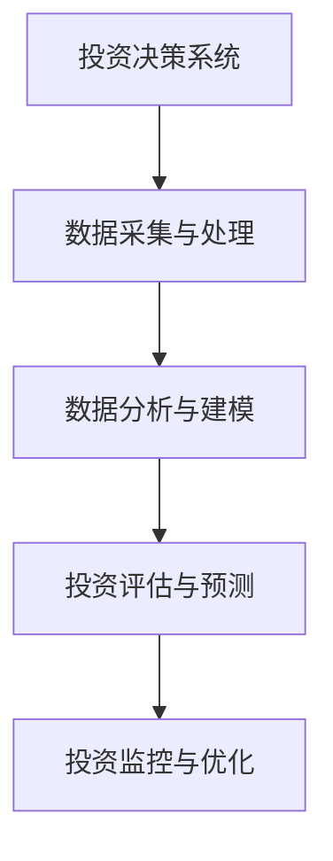

                 


# 巴菲特-芒格的可再生能源投资观：未来趋势

---

## 关键词：
巴菲特，芒格，可再生能源，投资观，未来趋势

---

## 摘要：
本文深入分析了巴菲特和芒格在可再生能源领域的投资理念和策略，探讨了可再生能源行业的未来发展趋势。通过结合他们的投资哲学、价值投资理论以及长期投资策略，本文揭示了可再生能源行业的投资机会和挑战。同时，本文还结合实际案例，详细介绍了可再生能源投资的系统架构设计、数学模型和算法原理，为投资者提供了实用的指导和建议。

---

# 第一部分：引言

## 第1章：巴菲特与芒格的投资哲学

### 1.1 巴菲特的价值投资理论

#### 1.1.1 价值投资的定义与核心理念
价值投资是一种以基本面分析为基础的投资策略，强调以低于内在价值的价格买入优质资产。巴菲特的价值投资理论强调长期持有优质股票，关注企业的内在价值，而非短期市场波动。

#### 1.1.2 巴菲特的长期投资策略
巴菲特的长期投资策略强调选择具有持续竞争优势、良好管理团队和稳定盈利能力的企业。他倾向于投资那些能够在经济周期波动中表现稳定的公司。

#### 1.1.3 巴菲特对可再生能源的看法
巴菲特近年来加大了对可再生能源领域的投资，尤其是在太阳能和风能领域。他认为可再生能源是未来能源结构转型的重要方向，具备长期增长潜力。

---

## 第2章：芒格的多元思维模型

### 2.1 芒格的思维方式

#### 2.1.1 多元思维模型的定义
芒格的多元思维模型强调通过多个学科的交叉思考来解决复杂问题。他认为，投资者需要具备跨学科的知识，才能更好地理解企业的内在价值和市场趋势。

#### 2.1.2 芒格的决策框架
芒格的决策框架包括以下几个步骤：
1. 确定目标：明确投资目标和风险承受能力。
2. 信息收集：通过多渠道获取信息，进行深入分析。
3. 逻辑推理：结合多元思维模型，进行逻辑推理和判断。
4. 决策执行：根据分析结果做出投资决策。
5. 事后反思：对投资结果进行反思，总结经验教训。

#### 2.1.3 芒格对可再生能源的影响
芒格的多元思维模型为可再生能源投资提供了新的视角。他认为，可再生能源行业的技术进步和政策支持将推动行业快速发展，具备长期投资价值。

---

## 第3章：巴菲特与芒格的长期投资策略

### 3.1 巴菲特的长期投资哲学

#### 3.1.1 长期投资的核心理念
巴菲特的长期投资哲学强调选择具有持续竞争优势和稳定盈利能力的企业，避免短期市场波动的干扰。

#### 3.1.2 巴菲特对可再生能源的投资策略
巴菲特倾向于投资那些在可再生能源领域具有技术优势和市场领先地位的企业。他认为，可再生能源行业的长期增长潜力巨大，具备投资价值。

### 3.2 芒格的长期投资策略

#### 3.2.1 芒格的长期投资框架
芒格的长期投资框架强调通过多元思维模型进行投资决策，注重企业的基本面分析和长期发展潜力。

#### 3.2.2 芒格对可再生能源的投资策略
芒格认为，可再生能源行业的技术进步和政策支持将推动行业快速发展，具备长期投资价值。

#### 3.2.3 巴菲特与芒格的共同点
巴菲特和芒格都强调长期投资、价值投资和基本面分析。他们在投资策略上都注重企业的内在价值和长期发展潜力。

---

# 第二部分：可再生能源行业的投资机会

## 第4章：可再生能源行业的现状与趋势

### 4.1 可再生能源行业的现状

#### 4.1.1 可再生能源的定义与分类
可再生能源是指来源于自然界的能源，包括太阳能、风能、水能、生物质能等。这些能源具有可再生性和环保性，是未来能源结构转型的重要方向。

#### 4.1.2 可再生能源的市场现状
近年来，全球可再生能源装机容量快速增长，尤其是在太阳能和风能领域。中国政府也在积极推动可再生能源的发展，提出了“双碳”目标。

#### 4.1.3 可再生能源的未来趋势
未来，可再生能源将在全球能源结构中占据越来越重要的地位。随着技术进步和成本下降，可再生能源的投资价值将不断提升。

### 4.2 可再生能源行业的投资价值

#### 4.2.1 可再生能源的投资价值分析
可再生能源行业的投资价值主要体现在以下几个方面：
1. 市场需求增长：随着全球能源需求的增长，可再生能源的市场需求将快速增长。
2. 技术进步：可再生能源技术的不断进步将降低投资成本，提高投资回报率。
3. 政策支持：各国政府对可再生能源的政策支持将为行业带来更多的投资机会。

#### 4.2.2 可再生能源行业的政策支持
各国政府纷纷出台政策支持可再生能源的发展，例如税收优惠、补贴、绿色证书等。这些政策将为可再生能源行业带来更多的投资机会。

#### 4.2.3 可再生能源行业的技术进步
可再生能源技术的不断进步将降低投资成本，提高投资回报率。例如，太阳能电池效率的提高和风能发电成本的下降都将推动行业的发展。

---

## 第5章：巴菲特与芒格对可再生能源行业的看法

### 5.1 巴菲特对可再生能源的看法

#### 5.1.1 巴菲特对可再生能源市场的看法
巴菲特认为，可再生能源市场具有巨大的增长潜力，尤其是太阳能和风能领域。他倾向于投资那些在可再生能源领域具有技术优势和市场领先地位的企业。

#### 5.1.2 巴菲特对可再生能源投资策略的建议
巴菲特建议投资者在投资可再生能源时，应注重企业的基本面分析和长期发展潜力。他强调选择具有持续竞争优势和稳定盈利能力的企业。

### 5.2 芒格对可再生能源的看法

#### 5.2.1 芒格对可再生能源市场的看法
芒格认为，可再生能源行业的技术进步和政策支持将推动行业快速发展。他倾向于投资那些在可再生能源领域具有技术优势和市场领先地位的企业。

#### 5.2.2 芒格对可再生能源投资策略的建议
芒格建议投资者在投资可再生能源时，应注重企业的基本面分析和长期发展潜力。他强调选择具有持续竞争优势和稳定盈利能力的企业。

### 5.3 巴菲特与芒格对可再生能源行业的投资策略

#### 5.3.1 巴菲特与芒格的共同投资策略
巴菲特和芒格都倾向于投资那些在可再生能源领域具有技术优势和市场领先地位的企业。他们强调选择具有持续竞争优势和稳定盈利能力的企业。

#### 5.3.2 巴菲特与芒格的不同投资策略
巴菲特更注重企业的内在价值和长期发展潜力，而芒格更注重企业的基本面分析和长期发展潜力。

---

# 第三部分：可再生能源投资的系统分析与架构设计

## 第6章：可再生能源投资的系统架构设计

### 6.1 系统功能设计

#### 6.1.1 系统功能模块
可再生能源投资系统的功能模块包括：
1. 数据采集与处理：采集可再生能源市场的数据，包括价格、政策、技术等。
2. 投资评估：基于数据进行投资评估，包括风险评估、收益预测等。
3. 投资决策：根据评估结果做出投资决策。
4. 投资监控：对投资结果进行监控和评估。

#### 6.1.2 系统功能设计的数学模型
以下是可再生能源投资评估的数学模型：

$$
\text{投资回报率} = \frac{\text{投资收益} - \text{投资成本}}{\text{投资成本}} \times 100\%
$$

---

## 第7章：可再生能源投资的算法原理

### 7.1 投资评估算法

#### 7.1.1 投资评估算法的定义
投资评估算法是一种用于评估可再生能源投资项目收益和风险的算法。它基于数据进行分析，帮助投资者做出科学的投资决策。

#### 7.1.2 投资评估算法的实现步骤
1. 数据采集：采集可再生能源市场的数据，包括价格、政策、技术等。
2. 数据预处理：对数据进行清洗和转换，确保数据的准确性和完整性。
3. 数据分析：基于数据分析结果，进行投资评估，包括风险评估和收益预测。
4. 投资决策：根据评估结果做出投资决策。

#### 7.1.3 投资评估算法的数学公式
以下是投资评估算法的数学公式：

$$
\text{净现值} = \sum_{t=1}^{n} \frac{\text{现金流入}}{(1 + r)^t} - \text{初始投资}
$$

其中，$r$ 是贴现率，$n$ 是项目寿命。

---

# 第四部分：可再生能源投资的项目实战

## 第8章：可再生能源投资的环境安装与核心代码实现

### 8.1 环境安装

#### 8.1.1 环境要求
- 操作系统：Windows 10 或更高版本
- Python版本：Python 3.8 或更高版本
- 第三方库：numpy、pandas、scikit-learn

#### 8.1.2 环境安装步骤
1. 安装Python
2. 安装第三方库
3. 配置开发环境

### 8.2 核心代码实现

#### 8.2.1 数据采集与处理
```python
import numpy as np
import pandas as pd

# 数据采集
data = pd.read_csv('renewable_energy.csv')

# 数据清洗
data.dropna(inplace=True)
data = data[~data['price'].isnull()]
```

#### 8.2.2 投资评估
```python
from sklearn.linear_model import LinearRegression

# 数据预处理
X = data[['price', 'policy', 'technology']]
y = data['return']

# 模型训练
model = LinearRegression()
model.fit(X, y)

# 模型预测
predictions = model.predict(X)
```

---

## 第9章：可再生能源投资的案例分析与项目小结

### 9.1 案例分析

#### 9.1.1 案例背景
某可再生能源公司计划投资一个太阳能项目，需要评估项目的收益和风险。

#### 9.1.2 数据分析
基于历史数据和模型预测，计算项目的净现值和内部收益率。

#### 9.1.3 投资决策
根据分析结果，做出投资决策。

### 9.2 项目小结

#### 9.2.1 项目总结
通过本项目，我们掌握了可再生能源投资的系统架构设计和算法原理，能够基于数据进行投资评估和决策。

#### 9.2.2 项目经验
在项目实施过程中，我们积累了丰富的经验，包括数据采集与处理、模型训练与预测、投资评估与决策等。

---

# 第五部分：最佳实践与注意事项

## 第10章：最佳实践与注意事项

### 10.1 投资策略建议

#### 10.1.1 长期投资策略
投资者应选择具有持续竞争优势和稳定盈利能力的企业，避免短期市场波动的干扰。

#### 10.1.2 风险管理策略
投资者应注重风险管理，分散投资组合，降低投资风险。

### 10.2 小结

#### 10.2.1 小结内容
本文深入分析了巴菲特和芒格在可再生能源领域的投资理念和策略，探讨了可再生能源行业的未来发展趋势。通过结合他们的投资哲学、价值投资理论以及长期投资策略，本文揭示了可再生能源行业的投资机会和挑战。

---

# 结论

本文通过分析巴菲特和芒格的投资哲学和策略，探讨了可再生能源行业的未来发展趋势。通过结合他们的投资哲学、价值投资理论以及长期投资策略，本文揭示了可再生能源行业的投资机会和挑战。投资者应注重企业的基本面分析和长期发展潜力，选择具有持续竞争优势和稳定盈利能力的企业。

---

# 附录

## 附录A：数学公式

$$
\text{净现值} = \sum_{t=1}^{n} \frac{\text{现金流入}}{(1 + r)^t} - \text{初始投资}
$$

## 附录B：系统架构图



---

# 作者

作者：AI天才研究院/AI Genius Institute & 禅与计算机程序设计艺术/Zen And The Art of Computer Programming

