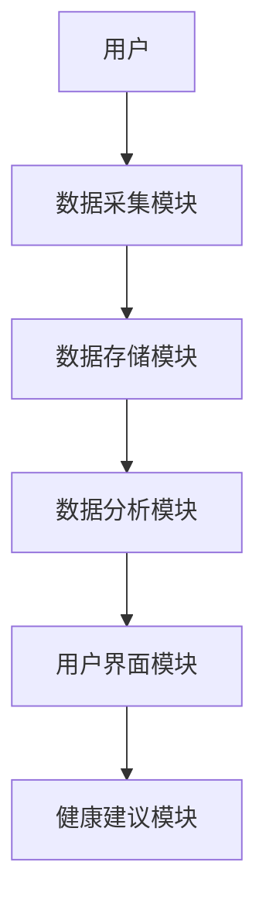
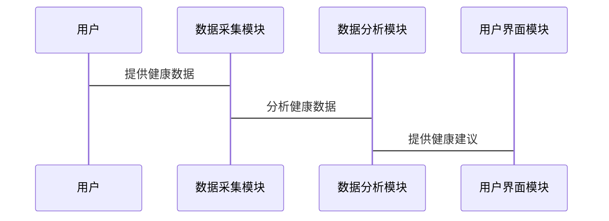

                 


# 巴菲特-芒格的可穿戴设备投资：健康监测的未来

---

## 关键词：巴菲特、芒格、可穿戴设备、健康监测、投资策略、技术应用、医疗健康

---

## 摘要：  
巴菲特和芒格的投资哲学为科技领域的投资提供了独特的视角，而可穿戴设备作为健康监测的重要工具，正在改变医疗健康行业。本文通过分析巴菲特和芒格的投资理念，探讨他们在可穿戴设备领域的投资策略，并深入解析可穿戴设备在健康监测中的技术应用和未来发展趋势。文章结合实际案例，从技术、市场和投资的角度，为读者提供全面的视角，揭示健康监测领域的投资机会与挑战。

---

## 第一部分：巴菲特与芒格的投资哲学

### 第1章：巴菲特与芒格的投资理念

#### 1.1 投资哲学概述

##### 1.1.1 巴菲特的价值投资理论
巴菲特的价值投资理论强调长期投资、安全边际和企业内在价值。他主张通过研究企业的基本面，寻找具有持续竞争优势和良好管理的公司。这种投资哲学在科技领域的可穿戴设备投资中，表现为对技术创新能力和市场领导地位的关注。

##### 1.1.2 芒格的多元思维模型
芒格的多元思维模型强调通过多个学科的交叉应用来理解问题。他主张投资者要具备跨领域的知识，能够从多个角度分析问题，从而做出更明智的投资决策。这种思维方式在科技投资中尤为重要，因为技术的进步往往涉及多个学科的融合。

##### 1.1.3 两人投资理念的异同
尽管巴菲特和芒格的投资理念有许多相似之处，但也有不同之处。巴菲特更注重企业的财务状况和内在价值，而芒格则更关注企业的竞争优势和管理层能力。两者的结合使得他们在科技领域的投资更加稳健和具有前瞻性。

---

## 第二部分：可穿戴设备的市场现状

### 第2章：可穿戴设备的定义与分类

#### 2.1 可穿戴设备的定义与分类

##### 2.1.1 基于功能的分类
可穿戴设备可以根据功能分为健康监测类（如智能手表、健康手环）、运动追踪类（如运动 bracelets）、医疗设备类（如智能健康监测设备）等。

##### 2.1.2 基于技术的分类
可穿戴设备可以根据所采用的技术分为基于传感器的设备、基于人工智能的设备、基于物联网的设备等。

##### 2.1.3 市场现状与发展趋势
近年来，随着技术的进步，可穿戴设备的市场迅速增长。根据市场研究机构的数据，2023年全球可穿戴设备市场价值已经超过千亿美元，且未来几年将继续保持快速增长。

---

## 第三部分：巴菲特与芒格的可穿戴设备投资案例

### 第3章：巴菲特与芒格的可穿戴设备投资分析

#### 3.1 苹果公司投资分析

##### 3.1.1 苹果公司的产品布局
苹果公司在可穿戴设备领域的主要产品是Apple Watch，该设备集成了健康监测功能，如心率监测、血氧监测、ECG心电图监测等。

##### 3.1.2 苹果手表的健康监测功能
Apple Watch的健康监测功能不仅能够监测用户的健康数据，还能通过AI算法分析数据，为用户提供个性化的健康建议。

##### 3.1.3 投资收益与战略意义
巴菲特和芒格对苹果公司的投资不仅带来了巨大的财务回报，也体现了他们对科技企业长期竞争优势的认可。

#### 3.2 IBM与Watson Health投资分析

##### 3.2.1 IBM的健康数据解决方案
IBM的Watson Health平台通过整合健康数据，提供个性化的医疗解决方案。该平台能够处理大量的健康数据，并利用AI技术进行分析。

##### 3.2.2 Watson Health的应用场景
Watson Health的应用场景包括疾病预防、慢性病管理和个性化医疗。通过AI技术，Watson Health能够帮助医生更好地诊断疾病，并制定治疗方案。

##### 3.2.3 投资逻辑与长期价值
巴菲特和芒格对IBM的投资体现了他们对AI技术在医疗健康领域应用的看好。Watson Health不仅能够提高医疗效率，还能降低医疗成本。

---

## 第四部分：可穿戴设备在健康监测中的技术应用

### 第4章：可穿戴设备在健康监测中的技术应用

#### 4.1 健康数据采集技术

##### 4.1.1 心率监测技术
心率监测技术是可穿戴设备的重要功能之一。通过光学传感器和AI算法，设备可以实时监测用户的心率，并识别心律异常。

##### 4.1.2 血氧监测技术
血氧监测技术通过测量血液中的氧气含量，帮助用户了解身体的健康状况。这种技术在高原环境和睡眠呼吸暂停综合征的监测中尤为重要。

##### 4.1.3 加速度传感器的应用
加速度传感器可以监测用户的运动数据，如步频、步幅和运动轨迹。这些数据可以帮助用户了解自己的运动状态，并提供运动建议。

#### 4.2 数据分析与疾病预防

##### 4.2.1 机器学习在健康数据分析中的应用
机器学习技术可以对大量的健康数据进行分析，识别潜在的健康问题。例如，通过分析心率和血氧数据，AI算法可以预测用户的心脏病风险。

##### 4.2.2 健康数据与慢性病管理
通过可穿戴设备，用户可以实时监测自己的健康数据，并通过AI算法进行分析。这种技术可以帮助用户更好地管理慢性病，如糖尿病和高血压。

---

## 第五部分：投资机会与风险

### 第5章：可穿戴设备的投资机会与风险

#### 5.1 投资机会分析

##### 5.1.1 技术创新带来的投资机会
随着技术的进步，可穿戴设备的功能将更加多样化。例如，未来的设备可能会集成更多的传感器，提供更精准的健康监测。

##### 5.1.2 市场需求的增长
随着人们对健康的关注增加，可穿戴设备的市场需求将持续增长。特别是在医疗健康领域，可穿戴设备将发挥越来越重要的作用。

#### 5.2 投资风险分析

##### 5.2.1 技术瓶颈
可穿戴设备的技术发展面临诸多挑战，如传感器精度、数据隐私和电池寿命等问题。

##### 5.2.2 市场竞争
可穿戴设备市场竞争激烈，企业需要不断创新才能保持竞争优势。

##### 5.2.3 数据隐私问题
健康数据的隐私保护是可穿戴设备面临的重要问题。如何确保数据的安全性，是企业需要解决的难题。

---

## 第六部分：系统架构与项目实战

### 第6章：健康监测系统的系统架构设计

#### 6.1 系统功能设计

##### 6.1.1 用户界面设计
健康监测系统的用户界面需要简洁直观，方便用户查看健康数据和使用功能。

##### 6.1.2 数据采集模块
数据采集模块负责采集用户的健康数据，如心率、血氧和运动数据。

##### 6.1.3 数据分析模块
数据分析模块利用AI算法对健康数据进行分析，提供个性化的健康建议。

#### 6.2 系统架构设计

##### 6.2.1 系统架构图
以下是健康监测系统的架构图：



##### 6.2.2 系统接口设计
系统接口设计需要考虑数据的输入输出格式，以及与第三方平台的集成。

##### 6.2.3 系统交互序列图
以下是系统交互的序列图：



---

## 第七部分：项目实战

### 第7章：基于巴菲特和芒格投资策略的可穿戴设备分析

#### 7.1 项目背景与目标
本项目旨在通过分析巴菲特和芒格的投资策略，评估可穿戴设备的投资价值。

#### 7.2 数据采集与分析

##### 7.2.1 数据采集
数据采集包括收集可穿戴设备的市场数据、技术参数和用户反馈。

##### 7.2.2 数据分析
利用Python进行数据分析，采用机器学习算法对数据进行建模和预测。

#### 7.3 投资决策模型

##### 7.3.1 投资决策模型的设计
投资决策模型基于巴菲特和芒格的投资理念，结合可穿戴设备的技术和市场数据。

##### 7.3.2 投资决策模型的实现
以下是投资决策模型的Python代码：

```python
import pandas as pd
from sklearn import linear_model

# 加载数据
data = pd.read_csv('wearable_device.csv')

# 定义模型
model = linear_model.LinearRegression()

# 训练模型
model.fit(data[['revenue', 'profit_margin']], data['stock_price'])

# 预测股票价格
predicted_price = model.predict([[100, 20]])
print(predicted_price)
```

---

## 第八部分：总结与展望

### 第8章：总结与展望

#### 8.1 投资策略总结
巴菲特和芒格的投资策略为可穿戴设备的投资提供了重要的指导。通过分析企业的技术实力、市场地位和管理能力，投资者可以更好地识别投资机会。

#### 8.2 未来展望
随着技术的进步，可穿戴设备在健康监测中的应用将更加广泛。未来的设备将更加智能化和个性化，能够更好地满足用户的需求。

---

## 作者：AI天才研究院 & 禅与计算机程序设计艺术

---

**注：** 如果您需要更详细的讲解或代码示例，请随时告知！

