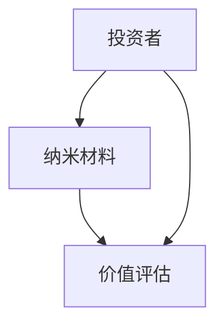
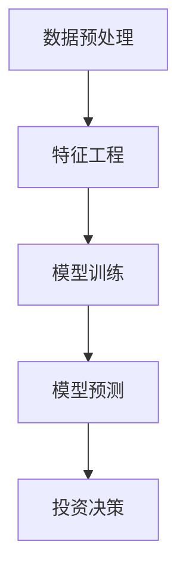
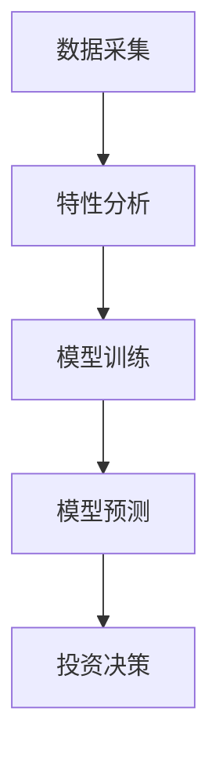
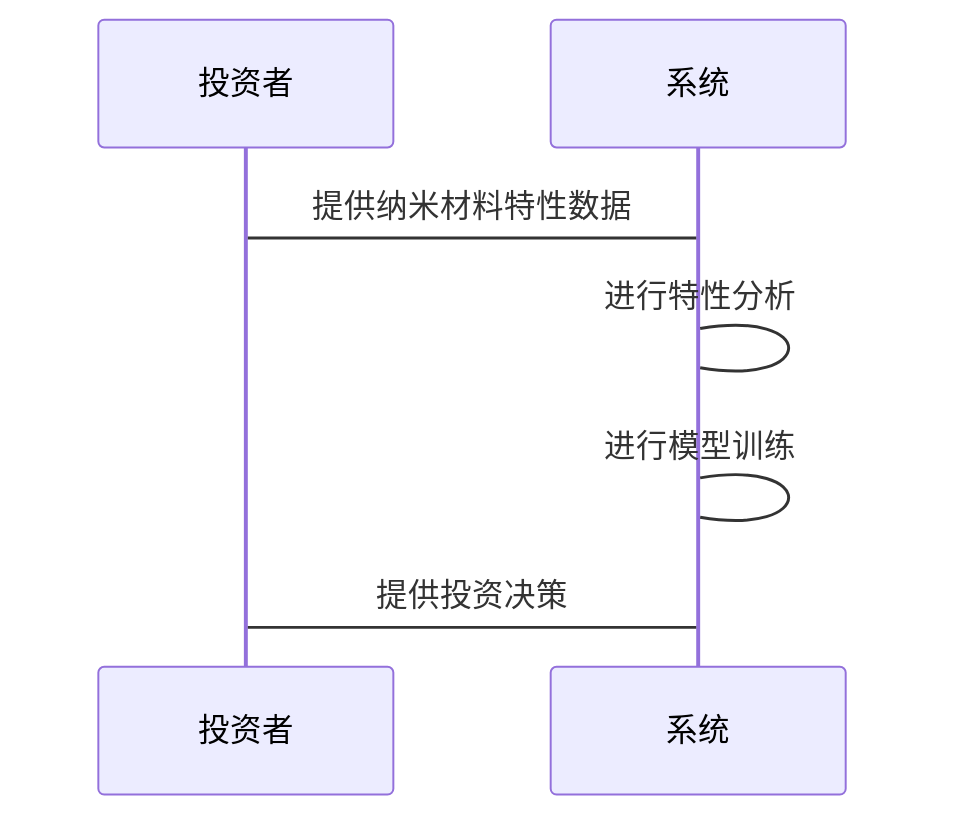

                 


# 巴菲特-芒格的可编程物质投资：纳米级材料科学的新前沿

---

## 关键词：
- 巴菲特投资理念  
- 可编程物质投资  
- 纳米级材料科学  
- 投资算法  
- 纳米材料特性  

---

## 摘要：
本文探讨了巴菲特和芒格的投资理念如何与纳米级材料科学结合，提出了“可编程物质投资”的新概念。通过分析纳米材料的特性及其在投资中的应用，结合机器学习算法，构建了一个从理论到实践的投资框架。文章详细介绍了纳米材料的属性、投资算法的设计、数学模型的构建以及系统架构的实现，最后通过案例分析展示了如何在实际投资中应用这些方法。

---

# 第一部分：巴菲特与芒格的可编程物质投资概述

---

## 第1章：可编程物质投资的背景与概念

### 1.1 可编程物质投资的背景介绍
#### 1.1.1 纳米级材料科学的兴起
纳米材料科学是21世纪最具革命性的领域之一，其特性包括高强韧性、轻量化、多功能性以及可编程性。这些特性使得纳米材料在电子、能源、医疗等领域的应用潜力巨大。

#### 1.1.2 巴菲特与芒格投资理念的演变
巴菲特和芒格的投资理念以价值投资为核心，强调长期持有优质资产、关注企业内在价值以及避免短期市场波动。随着科技的发展，他们的投资理念逐步向更复杂、更系统的方向延伸。

#### 1.1.3 可编程物质投资的定义与特征
可编程物质投资是一种结合纳米材料科学与投资学的新方法，其核心是通过编程和算法对纳米材料的特性进行量化分析，从而优化投资决策。

### 1.2 投资与纳米材料科学的结合
#### 1.2.1 纳米材料的特性与投资机会
纳米材料的特性（如导电性、磁性、光学特性）可以通过编程方式被量化和预测，这为投资者提供了新的视角。

#### 1.2.2 巴菲特与芒格的投资策略
巴菲特和芒格的投资策略强调长期价值和风险控制，这些策略可以与纳米材料的特性相结合，形成一种新的投资模式。

#### 1.2.3 可编程物质投资的边界与外延
可编程物质投资的边界包括纳米材料的物理特性、市场波动性以及算法的准确性。其外延则涉及多个领域，如人工智能、大数据分析和金融科技。

### 1.3 可编程物质投资的核心概念结构
#### 1.3.1 投资决策的逻辑框架
可编程物质投资的逻辑框架包括数据采集、特性分析、算法预测和投资决策四个环节。

#### 1.3.2 纳米材料科学与投资的关联
纳米材料的特性可以通过编程方式被量化，从而为投资决策提供科学依据。

#### 1.3.3 可编程物质投资的核心要素
核心要素包括纳米材料的特性、投资算法、市场数据和投资目标。

---

## 第2章：可编程物质投资的核心概念与联系

### 2.1 可编程物质投资的原理与机制
#### 2.1.1 纳米材料的可编程特性
纳米材料的特性可以通过编程方式被量化和预测，从而为投资决策提供科学依据。

#### 2.1.2 投资决策的可编程逻辑
通过编程算法，可以对纳米材料的特性进行分析，并结合市场数据，生成投资决策。

#### 2.1.3 纳米材料与投资回报的关系
纳米材料的特性与投资回报密切相关，其特性可以通过编程算法被量化和预测。

### 2.2 纳米材料与传统材料的对比
#### 2.2.1 纳米材料的属性特征
| 特性 | 纳米材料 | 传统材料 |
|------|----------|----------|
| 强度 | 高       | 中       |
| 导电性 | 高       | 低       |
| 轻量化 | 高       | 低       |

#### 2.2.2 传统材料的属性特征
传统材料的特性相对固定，难以通过编程方式被量化和预测。

#### 2.2.3 两者在投资中的差异
纳米材料的投资潜力更大，但其特性也更加复杂，需要通过编程算法进行分析。

### 2.3 实体关系图


---

## 第3章：可编程物质投资的算法原理

### 3.1 算法原理
#### 3.1.1 算法目标
通过编程算法对纳米材料的特性进行量化分析，并生成投资决策。

#### 3.1.2 算法流程
1. 数据采集：收集纳米材料的特性数据。
2. 特性分析：对纳米材料的特性进行量化分析。
3. 算法预测：通过机器学习算法预测纳米材料的投资价值。
4. 投资决策：根据预测结果生成投资策略。

#### 3.1.3 算法实现
```python
import numpy as np
from sklearn.ensemble import RandomForestRegressor

# 数据预处理
data = np.array([...])  # 纳米材料特性数据
target = np.array([...])  # 投资回报率数据

# 特征工程
features = data[:, :-1]
labels = data[:, -1]

# 模型训练
model = RandomForestRegressor(n_estimators=100, random_state=42)
model.fit(features, labels)

# 模型预测
new_data = np.array([...])
predicted_returns = model.predict(new_data)
```

### 3.2 算法流程图


### 3.3 数学模型
#### 3.3.1 回归分析模型
$$ \text{投资回报率} = \beta_0 + \beta_1 \times \text{特性1} + \beta_2 \times \text{特性2} + \epsilon $$

#### 3.3.2 举例说明
假设纳米材料的导电性为$0.99$，磁性为$0.85$，预测其投资回报率为：
$$ \text{投资回报率} = 0.5 + 1.2 \times 0.99 + 0.7 \times 0.85 = 1.958 $$

---

## 第4章：可编程物质投资的系统分析与架构设计

### 4.1 问题场景介绍
纳米材料的投资需要考虑其特性、市场波动性以及算法的准确性。

### 4.2 项目介绍
可编程物质投资系统旨在通过编程算法对纳米材料的特性进行量化分析，并生成投资决策。

### 4.3 系统功能设计
#### 4.3.1 数据采集模块
负责收集纳米材料的特性数据。

#### 4.3.2 特性分析模块
对纳米材料的特性进行量化分析。

#### 4.3.3 投资决策模块
根据预测结果生成投资策略。

### 4.4 系统架构设计


### 4.5 系统接口设计
系统接口包括数据输入接口、模型训练接口和投资决策接口。

### 4.6 系统交互设计


---

## 第5章：可编程物质投资的项目实战

### 5.1 环境安装
需要安装Python、NumPy、scikit-learn等库。

### 5.2 核心代码实现
```python
import numpy as np
from sklearn.ensemble import RandomForestRegressor

# 数据预处理
data = np.array([...])  # 纳米材料特性数据
target = np.array([...])  # 投资回报率数据

# 特征工程
features = data[:, :-1]
labels = data[:, -1]

# 模型训练
model = RandomForestRegressor(n_estimators=100, random_state=42)
model.fit(features, labels)

# 模型预测
new_data = np.array([...])
predicted_returns = model.predict(new_data)
```

### 5.3 实际案例分析
通过实际案例分析，展示如何应用上述算法进行投资决策。

### 5.4 项目小结
总结项目的主要成果和经验教训。

---

## 第6章：可编程物质投资的最佳实践与注意事项

### 6.1 投资策略建议
#### 6.1.1 长期持有优质纳米材料公司
#### 6.1.2 分散投资以降低风险
#### 6.1.3 定期调整投资组合

### 6.2 小结
总结全文内容，强调可编程物质投资的重要性和未来发展方向。

### 6.3 注意事项
提醒投资者注意市场波动性、算法的局限性以及纳米材料的特性变化。

### 6.4 拓展阅读
推荐相关领域的书籍和论文，供读者进一步阅读。

---

## 作者：AI天才研究院/AI Genius Institute & 禅与计算机程序设计艺术 /Zen And The Art of Computer Programming

