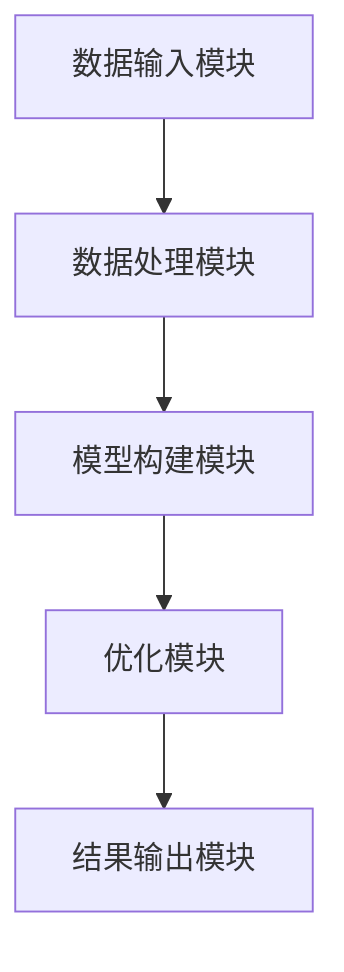
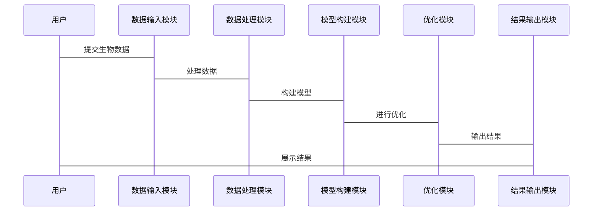

                 


# 巴菲特-芒格的合成生物学计算平台投资：生命科学的数字化转型

> 关键词：巴菲特，芒格，合成生物学，计算平台，数字化转型，生命科学，投资策略

> 摘要：本文探讨了巴菲特和芒格在合成生物学计算平台领域的投资策略，分析了生命科学的数字化转型趋势，并详细介绍了合成生物学计算平台的核心原理、算法模型和系统架构。文章通过实际案例分析，展示了如何将巴菲特和芒格的投资理念与现代科技相结合，以实现高效的投资决策和价值创造。

---

# 第一部分: 合成生物学与计算平台投资的背景介绍

## 第1章: 合成生物学与计算平台的概述

### 1.1 合成生物学的基本概念

#### 1.1.1 合成生物学的定义与研究领域
合成生物学（Synthetic Biology）是生物学与工程学、化学、信息科学等多学科交叉的新兴领域，旨在通过设计和构建新的生物系统或改造现有生物系统，以实现特定的功能或目标。其研究领域包括基因编辑、代谢工程、生物传感器、人工细胞等。

#### 1.1.2 合成生物学的核心目标与应用方向
合成生物学的核心目标是通过工程化的方法，设计和构建具有特定功能的生物系统。其主要应用方向包括：
1. **医疗健康**：开发新药、治疗疾病。
2. **工业生产**：生产化学品、生物燃料。
3. **环境保护**：治理污染、降解有害物质。
4. **农业**：改良作物、提高产量。

#### 1.1.3 合成生物学与传统生物学的区别
合成生物学与传统生物学的区别在于其工程化和系统化的特点。传统生物学侧重于对自然生物系统的观察和研究，而合成生物学则注重对生物系统的重新设计和构建。

### 1.2 计算平台在合成生物学中的作用

#### 1.2.1 计算平台的定义与分类
计算平台是指用于支持合成生物学研究的软件工具或系统，其分类包括：
1. **数据处理平台**：用于处理和分析生物数据。
2. **模型构建平台**：用于构建和模拟生物系统。
3. **优化平台**：用于优化生物系统的性能。

#### 1.2.2 计算平台在合成生物学中的应用场景
计算平台在合成生物学中的应用场景包括：
1. **基因设计与优化**：通过计算模拟优化基因序列。
2. **代谢路径设计**：通过计算模拟设计新的代谢路径。
3. **生物系统预测**：通过计算模型预测生物系统的性能。

#### 1.2.3 计算平台的优势与挑战
计算平台的优势在于其高效性和准确性，能够显著提高研究效率。然而，其挑战在于数据的复杂性和模型的准确性。

---

## 第2章: 巴菲特与芒格的投资理念

### 2.1 巴菲特与芒格的投资哲学

#### 2.1.1 巴菲特的价值投资理念
巴菲特的价值投资理念强调长期稳健的投资回报，注重公司的基本面、管理层和行业地位。

#### 2.1.2 芒格的多元思维模型
芒格的多元思维模型强调将不同领域的知识结合起来，寻找跨领域的投资机会。

#### 2.1.3 两人投资理念的异同点
虽然巴菲特和芒格的投资理念有所不同，但他们都强调长期投资和价值创造。

### 2.2 巴菲特与芒格对科技投资的看法

#### 2.2.1 科技投资的核心要素
科技投资的核心要素包括技术创新、市场需求和竞争优势。

#### 2.2.2 巴菲特与芒格对合成生物学的潜在兴趣
合成生物学作为一项新兴科技，具有巨大的市场潜力，可能成为巴菲特和芒格的投资目标。

#### 2.2.3 科技投资中的长期主义思维
科技投资需要长期关注技术创新和市场发展，注重企业的持续价值创造。

---

## 第3章: 生命科学的数字化转型

### 3.1 数字化转型的定义与趋势

#### 3.1.1 数字化转型的定义
数字化转型是指利用数字技术改变传统业务模式、流程、文化与治理，以实现业务创新和价值创造。

#### 3.1.2 当前生命科学领域的数字化转型趋势
生命科学领域的数字化转型趋势包括数据驱动的研究、人工智能的应用和生物技术的创新。

#### 3.1.3 数字化转型对生命科学的影响
数字化转型将显著提高研究效率，降低成本，并推动生物技术的创新。

### 3.2 合成生物学中的数字化工具

#### 3.2.1 合成生物学中的数据驱动方法
数据驱动方法通过大数据分析和机器学习优化生物系统的设计。

#### 3.2.2 计算模拟在合成生物学中的应用
计算模拟用于预测生物系统的性能，并优化实验设计。

#### 3.2.3 数字化工具对合成生物学研究的推动作用
数字化工具显著提高了研究效率，并降低了实验成本。

---

# 第二部分: 合成生物学计算平台的核心概念与联系

## 第4章: 合成生物学计算平台的核心原理

### 4.1 合成生物学计算平台的原理

#### 4.1.1 数据输入与处理
计算平台通过输入生物数据（如基因序列、代谢数据）进行处理和分析。

#### 4.1.2 模型构建与优化
计算平台构建生物系统的数学模型，并通过优化算法提高系统的性能。

#### 4.1.3 结果输出与反馈
计算平台输出优化后的设计方案，并根据实验结果进行反馈和调整。

### 4.2 计算平台与合成生物学的结合

#### 4.2.1 数据驱动的合成生物学研究
数据驱动方法通过大量数据的分析和挖掘，优化生物系统的设计。

#### 4.2.2 计算模拟在基因工程中的应用
计算模拟用于预测基因编辑的效果，并优化实验设计。

#### 4.2.3 计算平台对合成生物学研究的推动作用
计算平台显著提高了研究效率，并降低了实验成本。

---

## 第5章: 合成生物学计算平台的算法原理

### 5.1 合成生物学计算平台的算法模型

#### 5.1.1 基因优化算法
基因优化算法通过计算模拟优化基因序列。

#### 5.1.2 代谢路径优化算法
代谢路径优化算法通过数学建模优化代谢路径。

#### 5.1.3 生物系统预测算法
生物系统预测算法通过机器学习模型预测生物系统的性能。

### 5.2 计算平台的数学模型

#### 5.2.1 基因优化的数学模型
基因优化的数学模型可以通过线性规划或遗传算法进行求解。

#### 5.2.2 代谢路径优化的数学模型
代谢路径优化的数学模型可以通过非线性规划或动态规划进行求解。

#### 5.2.3 生物系统预测的数学模型
生物系统预测的数学模型可以通过回归分析或神经网络进行建模。

---

## 第6章: 合成生物学计算平台的系统架构设计

### 6.1 系统功能设计

#### 6.1.1 数据输入模块
数据输入模块用于接收生物数据并进行初步处理。

#### 6.1.2 模型构建模块
模型构建模块用于构建生物系统的数学模型。

#### 6.1.3 优化模块
优化模块用于优化生物系统的性能。

### 6.2 系统架构图



### 6.3 系统接口设计

#### 6.3.1 数据输入接口
数据输入接口用于接收生物数据并进行初步处理。

#### 6.3.2 数据输出接口
数据输出接口用于输出优化后的设计方案。

#### 6.3.3 用户界面设计
用户界面设计用于方便用户操作和查看结果。

### 6.4 系统交互流程图



---

## 第7章: 合成生物学计算平台的项目实战

### 7.1 环境安装

#### 7.1.1 安装Python环境
使用Anaconda安装Python 3.8或更高版本。

#### 7.1.2 安装必要的库
安装numpy、pandas、scikit-learn等库。

### 7.2 核心代码实现

#### 7.2.1 数据处理代码
```python
import numpy as np
import pandas as pd

# 读取数据
data = pd.read_csv('input.csv')
# 数据预处理
data_processed = data.dropna()
```

#### 7.2.2 模型构建代码
```python
from sklearn.model_selection import train_test_split
from sklearn.linear_model import LinearRegression

# 划分训练集和测试集
X_train, X_test, y_train, y_test = train_test_split(data_processed.drop('target', axis=1), data_processed['target'], test_size=0.2, random_state=42)

# 构建线性回归模型
model = LinearRegression()
model.fit(X_train, y_train)
```

#### 7.2.3 优化代码
```python
from sklearn.metrics import mean_squared_error

# 预测结果
y_pred = model.predict(X_test)
# 计算均方误差
mse = mean_squared_error(y_test, y_pred)
print(f'均方误差: {mse}')
```

### 7.3 案例分析

#### 7.3.1 案例背景
假设我们正在设计一种新的代谢路径，目标是提高某种化学物质的产量。

#### 7.3.2 数据分析
通过计算平台分析现有数据，优化代谢路径的设计。

#### 7.3.3 优化结果
优化后的代谢路径显著提高了化学物质的产量。

---

## 第8章: 总结与展望

### 8.1 总结
本文探讨了巴菲特和芒格在合成生物学计算平台领域的投资策略，分析了生命科学的数字化转型趋势，并详细介绍了合成生物学计算平台的核心原理、算法模型和系统架构。通过实际案例分析，展示了如何将巴菲特和芒格的投资理念与现代科技相结合，以实现高效的投资决策和价值创造。

### 8.2 投资建议
投资者在进行合成生物学计算平台的投资时，应关注企业的技术创新能力和市场前景，同时注重长期价值创造。

### 8.3 注意事项
投资者在进行科技投资时，应充分考虑技术风险和市场风险，避免盲目跟风。

### 8.4 拓展阅读
1. 巴菲特和芒格的经典著作。
2. 合成生物学领域的最新研究成果。

---

# 作者：AI天才研究院/AI Genius Institute & 禅与计算机程序设计艺术 /Zen And The Art of Computer Programming

