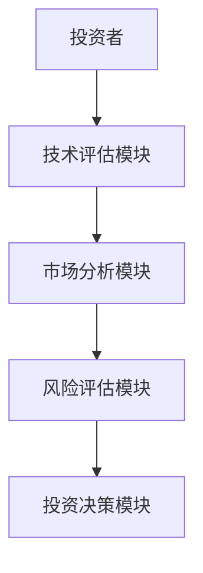

                 


# 巴菲特-芒格的合成食品投资：解决全球粮食危机

## 关键词：
- 巴菲特
- 芒格
- 合成食品
- 粮食危机
- 投资策略
- 技术创新

## 摘要：
本文深入分析了巴菲特和芒格如何通过投资合成食品来应对全球粮食危机。文章首先介绍了巴菲特和芒格的投资哲学，探讨了合成食品的技术背景和市场潜力，然后详细分析了他们的投资逻辑，包括技术可行性、市场潜力和经济可行性。最后，文章结合系统架构与风险分析，提出了合成食品投资的解决方案，并通过实际案例展示了投资的可行性与潜力。

---

## 第一部分：巴菲特与芒格的投资哲学

### 第1章：巴菲特与芒格的投资理念

#### 1.1 巴菲特与芒格的生平简介

##### 1.1.1 巴菲特的早年经历与投资理念
沃伦·巴菲特（Warren Buffett）是世界著名投资家，被誉为“股神”。他出生于1930年，早年通过投资俱乐部和合伙企业积累了丰富的投资经验。巴菲特的投资理念以价值投资为核心，强调寻找具有持续竞争优势的企业，并长期持有。

##### 1.1.2 芒格的哲学思维与决策模式
查理·芒格（Charlie Munger）是巴菲特的长期合作伙伴，他的多元思维模型（mental model）强调跨学科思考，将物理学、心理学、经济学等多个领域的知识整合到投资决策中。芒格的决策模式注重长期逻辑和理性分析。

##### 1.1.3 巴菲特与芒格合作的里程碑事件
巴菲特和芒格的合作始于1957年，他们的投资哲学和思维方式在长期合作中不断完善。芒格的多元思维模型为巴菲特的投资决策提供了重要的补充，而巴菲特的价值投资理念也帮助芒格在投资实践中取得了巨大成功。

#### 1.2 巴菲特与芒格的投资哲学

##### 1.2.1 巴菲特的价值投资理论
巴菲特的价值投资理论强调寻找市场低估的企业，关注企业的内在价值和长期盈利能力。他认为，投资的本质是寻找具有强大护城河（competitive moat）的企业，并在市场恐慌时买入，市场狂热时卖出。

##### 1.2.2 芒格的多元思维模型
芒格的多元思维模型强调跨学科思考，他认为只有通过多个学科的交叉验证，才能做出更明智的投资决策。芒格尤其注重物理学、心理学和经济学的基本原理，将其应用于投资分析中。

##### 1.2.3 两人投资理念的结合与互补
巴菲特和芒格的投资理念在长期合作中形成了互补关系。巴菲特关注企业的基本面和长期盈利能力，而芒格则通过多元思维模型帮助巴菲特规避投资风险，提升决策的准确性。

---

## 第二部分：合成食品的技术背景与市场潜力

### 第2章：合成食品的定义与技术背景

#### 2.1 合成食品的基本概念

##### 2.1.1 合成食品的定义与分类
合成食品是指通过生物工程、化学合成或其他技术手段制造的食品，与传统农业生产的食品相比，合成食品具有更高的生产效率和更低的环境影响。常见的合成食品包括合成肉、合成乳制品和合成淀粉等。

##### 2.1.2 合成食品的技术基础
合成食品的技术基础主要包括细胞培养技术、基因编辑技术和化学合成技术。这些技术的应用使得合成食品的生产更加高效和可持续。

##### 2.1.3 合成食品与传统食品的主要区别
与传统食品相比，合成食品的生产过程更加可控，能够减少资源消耗和环境污染。此外，合成食品还可以通过基因编辑技术改良营养成分和风味。

#### 2.2 合成食品的技术发展现状

##### 2.2.1 合成肉的技术路径
合成肉的生产过程包括细胞提取、细胞培养和组织构建等步骤。通过生物工程手段，可以将动物细胞培养成肉类产品，从而减少对传统畜牧业的依赖。

##### 2.2.2 合成乳制品的技术突破
合成乳制品的生产通过微生物发酵技术实现，能够生产出与传统乳制品相似的蛋白质和脂肪成分。这种技术可以显著降低乳制品的生产成本和环境影响。

##### 2.2.3 合成食品的成本与规模化生产
目前，合成食品的生产成本仍然较高，但随着技术的进步和规模化生产，成本将逐步下降。合成食品的生产效率和规模经济效应将使其在未来具备与传统食品竞争的能力。

---

### 第3章：全球粮食危机的现状与挑战

#### 3.1 粮食危机的定义与表现

##### 3.1.1 粮食短缺的全球分布
全球粮食短缺主要集中在发展中国家，特别是在非洲、亚洲和拉丁美洲的部分地区。这些地区的粮食生产受到气候变化、土地资源有限和农业技术落后等因素的制约。

##### 3.1.2 粮食价格波动的影响因素
粮食价格波动受到多种因素的影响，包括气候变化、能源价格、国际贸易政策和投机资本的介入等。这些因素的综合作用使得全球粮食市场面临着巨大的不确定性。

##### 3.1.3 气候变化对粮食生产的影响
气候变化导致的极端天气事件（如干旱、洪水和飓风）对粮食生产造成了严重威胁。气候变化还可能导致农业生产力下降，进一步加剧全球粮食危机。

#### 3.2 粮食危机的经济与社会影响

##### 3.2.1 粮食价格波动对全球经济的影响
粮食价格波动对全球经济产生了深远影响。价格上涨会导致消费者负担加重，企业生产成本增加，进而影响整体经济的稳定。此外，粮食价格波动还可能导致国际贸易摩擦和政治不稳定。

##### 3.2.2 粮食短缺对社会稳定的影响
粮食短缺可能导致社会动荡，特别是在发展中国家。粮食价格的持续上涨可能引发社会抗议和政治动荡，进一步加剧全球政治不稳定。

##### 3.2.3 粮食危机的长期解决方案
解决粮食危机的长期方案需要从技术创新、政策调整和国际合作等多个方面入手。合成食品作为一种新兴的技术解决方案，具有广阔的应用前景。

---

## 第三部分：巴菲特与芒格的合成食品投资逻辑

### 第4章：巴菲特与芒格的合成食品投资逻辑

#### 4.1 投资逻辑的核心要素

##### 4.1.1 合成食品的技术可行性
巴菲特和芒格认为，合成食品的技术可行性是投资的关键因素。他们关注合成食品的生产效率、成本控制和技术创新能力，认为这些因素将决定合成食品的市场竞争力。

##### 4.1.2 合成食品的市场潜力
合成食品的市场潜力巨大，特别是在解决全球粮食危机方面。随着技术的进步和生产成本的下降，合成食品有望在未来成为传统食品的重要替代品。

##### 4.1.3 合成食品的经济可行性
巴菲特和芒格认为，合成食品的经济可行性是投资的重要考量。他们关注合成食品的生产成本、市场规模和利润率，认为这些因素将决定投资的回报率。

#### 4.2 投资逻辑的数学模型

##### 4.2.1 投资回报率的计算公式
$$ ROI = \frac{Net Profit}{Initial Investment} \times 100\% $$

##### 4.2.2 市场需求与供给的平衡模型
$$ Q = Q_d = Q_s $$

#### 4.3 投资逻辑的案例分析

##### 4.3.1 巴菲特对某合成食品公司的投资案例
巴菲特对某合成食品公司的投资案例展示了其对合成食品技术可行性和市场潜力的高度重视。通过深入分析公司的技术优势和市场定位，巴菲特认为该公司具有长期的盈利能力。

##### 4.3.2 芒格对合成食品技术公司的投资分析
芒格对某合成食品技术公司的投资分析体现了其多元思维模型的应用。他从技术、市场、管理和财务等多个角度对该公司进行了全面评估，认为其具有较大的投资价值。

---

## 第四部分：合成食品投资的系统架构与风险分析

### 第5章：合成食品投资的系统架构与风险分析

#### 5.1 系统架构设计

##### 5.1.1 合成食品投资系统的组成模块
合成食品投资系统的组成模块包括技术评估、市场分析、风险评估和投资决策等模块。

##### 5.1.2 系统功能需求分析
系统功能需求分析包括对合成食品的技术可行性、市场潜力和经济可行性进行全面评估。

##### 5.1.3 系统架构的Mermaid图表示


#### 5.2 投资风险

##### 5.2.1 技术风险
合成食品的生产技术尚未完全成熟，存在技术失败和成本过高的风险。

##### 5.2.2 市场风险
合成食品的市场需求可能受到消费者接受度和价格因素的影响，存在市场推广的不确定性。

##### 5.2.3 政策风险
合成食品的生产可能受到政策法规的限制，存在政策不确定性带来的投资风险。

---

## 第五部分：项目实战与总结

### 第6章：项目实战

#### 6.1 环境安装
为了进行合成食品投资分析，需要安装相关的数据分析工具和建模软件。推荐使用Python、R和MATLAB等工具进行数据分析和建模。

#### 6.2 系统核心实现源代码
以下是一个简单的投资回报率计算的Python代码示例：
```python
def calculateROI(net_profit, initial_investment):
    return (net_profit / initial_investment) * 100

net_profit = 1000000
initial_investment = 5000000
roi = calculateROI(net_profit, initial_investment)
print(f"投资回报率为：{roi}%")
```

#### 6.3 代码应用解读与分析
上述代码计算了合成食品投资的回报率，展示了如何通过数学模型评估投资的经济可行性。通过调整输入参数，可以模拟不同的投资情景，帮助投资者做出更明智的决策。

#### 6.4 实际案例分析和详细讲解剖析
以某合成食品公司为例，分析其投资回报率、市场定位和技术优势，展示如何通过实际案例分析评估投资的可行性。

#### 6.5 项目小结
通过实际案例分析，我们可以看到合成食品投资的潜力和挑战。投资者需要综合考虑技术、市场和政策等多个因素，才能做出最优的投资决策。

---

## 第六部分：总结与展望

### 第7章：总结与展望

#### 7.1 总结
本文分析了巴菲特和芒格如何通过投资合成食品来应对全球粮食危机。文章从投资哲学、技术背景、市场潜力、投资逻辑和系统架构等多个方面进行了详细探讨，展示了合成食品投资的广阔前景。

#### 7.2 展望
未来，随着合成食品技术的不断进步和市场化的推进，合成食品的投资潜力将进一步释放。投资者需要密切关注技术发展和市场变化，抓住投资机遇，应对潜在风险。

---

## 作者信息

作者：AI天才研究院/AI Genius Institute & 禅与计算机程序设计艺术 /Zen And The Art of Computer Programming

---

这篇文章系统地探讨了巴菲特和芒格的合成食品投资逻辑，结合了技术分析和投资策略，为读者提供了全面的视角和深入的见解。

