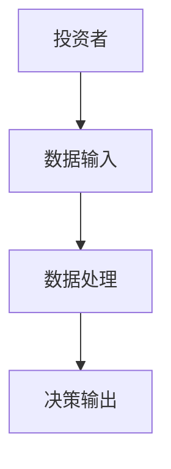

                 


# 巴菲特-芒格的基因治疗个性化医疗投资：精准医学的新纪元

## 关键词：
- 巴菲特，芒格，基因治疗，个性化医疗，精准医学，投资策略，系统架构

## 摘要：
本书探讨了巴菲特和芒格的价值投资理念在基因治疗和精准医学领域的应用。通过分析基因治疗的技术进展、个性化医疗的经济学模型，以及精准医学的投资策略，结合系统架构设计和项目实战案例，展示了如何将投资哲学与现代医疗技术相结合，开启精准医学的新纪元。

---

## 第0章：引言

### 0.1 本书的目的与范围
基因治疗和精准医学的快速发展为医疗行业带来了革命性的变化。本书旨在探讨巴菲特和芒格的价值投资理念如何应用于这一新兴领域，通过系统分析和案例研究，揭示精准医学的投资机会与挑战。

### 0.2 核心概念与联系
- **基因治疗**：通过修改基因序列来治疗疾病的技术。
- **精准医学**：基于个体基因、环境和生活方式的个性化医疗。
- **投资哲学**：巴菲特和芒格的价值投资策略，注重长期价值和基本面分析。

### 0.3 本书的结构
本书分为七章，涵盖投资哲学、基因治疗、精准医学、经济学分析、系统架构、项目实战和结论展望。

---

## 第1章：巴菲特和芒格的投资哲学

### 1.1 价值投资的核心理念
巴菲特和芒格的价值投资策略强调长期持有、基本面分析和安全边际。

#### 1.1.1 巴菲特和芒格的投资策略
- **长期视角**：投资于具有持续竞争优势的企业。
- **基本面分析**：关注企业的财务状况、管理团队和行业地位。
- **安全边际**：以低于内在价值的价格买入。

#### 1.1.2 医疗行业的投资分析
医疗行业的投资潜力巨大，尤其是基因治疗和精准医学领域。

---

## 第2章：基因治疗与精准医学的概述

### 2.1 基因治疗的基本原理
基因治疗通过替换或修复缺陷基因来治疗疾病。

#### 2.1.1 基因治疗的技术进展
- CRISPR-Cas9技术：基因编辑工具。
- 基因疗法的临床应用：治疗遗传性疾病、癌症等。

#### 2.1.2 精准医学的概念
精准医学基于个体基因信息制定个性化治疗方案。

### 2.2 精准医学的优势与应用
精准医学的优势包括提高治疗效果、减少副作用和降低医疗成本。

---

## 第3章：个性化医疗的经济学分析

### 3.1 个性化医疗的成本与收益
- **成本**：基因测序、治疗方案定制化增加了医疗成本。
- **收益**：提高治疗效果，减少不必要的医疗支出。

### 3.2 投资决策模型
构建投资决策模型，评估个性化医疗的投资回报。

#### 3.2.1 投资模型的构建
- 收益预测：基于市场渗透率和治疗效果。
- 风险评估：考虑技术风险和市场风险。

---

## 第4章：精准医学的投资策略

### 4.1 投资策略的制定
结合巴菲特的价值投资理念，制定精准医学领域的投资策略。

#### 4.1.1 投资模型的构建
- 选择具有技术优势和市场潜力的企业。
- 关注企业的研发能力和管理团队。

#### 4.1.2 案例分析
分析某基因治疗公司的投资价值，包括财务状况、研发进展和市场前景。

---

## 第5章：系统分析与架构设计

### 5.1 系统架构设计
构建投资决策支持系统，辅助投资者进行精准医学领域的投资决策。

#### 5.1.1 数据流图
展示系统的数据流和处理流程。



#### 5.1.2 类图
展示系统功能模块之间的关系。


---

## 第6章：项目实战与案例分析

### 6.1 项目环境安装
安装必要的工具和库，如Python、Pandas、NumPy。

### 6.2 核心实现
编写Python代码，进行数据处理和模型构建。

#### 6.2.1 数据处理代码
```python
import pandas as pd
import numpy as np

# 数据加载
data = pd.read_csv('medical_data.csv')

# 数据清洗
data.dropna(inplace=True)
data = data[~data['gene_treatment'].isna()]
```

#### 6.2.2 投资模型构建
```python
from sklearn.linear_model import LinearRegression

model = LinearRegression()
model.fit(X, y)
```

### 6.3 案例分析
分析某基因治疗公司的投资回报，验证模型的有效性。

---

## 第7章：结论与展望

### 7.1 总结
结合巴菲特和芒格的投资理念，精准医学领域具有巨大的投资潜力。

### 7.2 未来展望
随着技术进步和市场成熟，精准医学将带来更多的投资机会。

---

## 作者：AI天才研究院 & 禅与计算机程序设计艺术

---

这本书通过系统分析和实际案例，展示了如何将价值投资理念应用于基因治疗和精准医学领域。希望读者能从中获得启发，抓住精准医学的投资机遇，开启医疗投资的新纪元。

