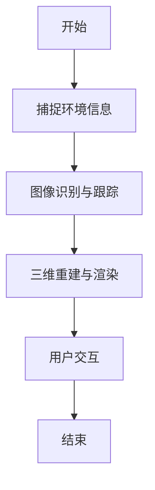
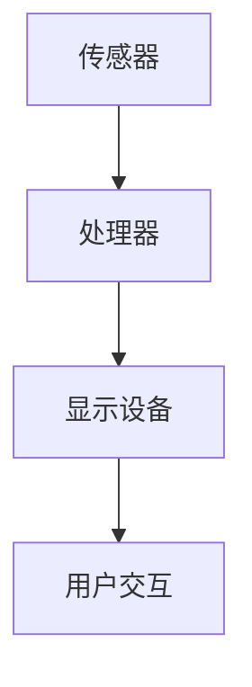
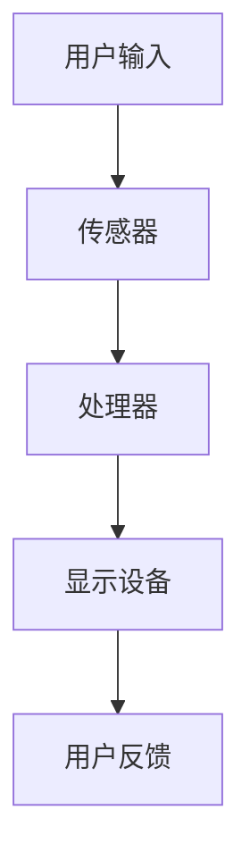

                 

# 巴菲特-芒格的增强现实技术投资：改变人机交互的未来

> **关键词**: 巴菲特, 芒格, 增强现实, 人机交互, 投资, 技术趋势, 未来展望

> **摘要**: 巴菲特和芒格的投资理念与增强现实（AR）技术的结合，为我们揭示了未来人机交互的重要方向。本文深入分析了AR技术的核心原理、投资机会以及其对人机交互的深远影响。

---

## 目录

1. **巴菲特和芒格的投资理念概述**
   - 1.1 巴菲特的价值投资理论
   - 1.2 芒格的多元思维模型
   - 1.3 AR技术的基本概念
   - 1.4 人机交互的未来发展趋势

2. **AR技术的核心原理与数学模型**
   - 2.1 AR技术的定义与组成
   - 2.2 图像识别与跟踪算法
   - 2.3 三维重建与渲染技术
   - 2.4 用户交互机制
   - 2.5 相关数学公式与流程图

3. **巴菲特和芒格投资理念与AR技术的结合**
   - 3.1 AR技术的长期潜力
   - 3.2 AR技术在消费电子、教育培训和医疗健康领域的应用
   - 3.3 AR技术的风险控制与安全边际

4. **AR技术的投资分析与决策模型**
   - 4.1 AR技术的市场分析与竞争格局
   - 4.2 商业模式与盈利潜力
   - 4.3 政策环境与法律风险
   - 4.4 巴菲特-芒格投资决策模型的应用

5. **AR技术的系统架构与实现**
   - 5.1 系统功能模块划分
   - 5.2 系统组件的交互关系
   - 5.3 硬件与软件要求
   - 5.4 关键算法实现与优化
   - 5.5 系统架构图与流程图

6. **AR技术的未来发展与投资展望**
   - 6.1 AR技术的未来趋势
   - 6.2 对人机交互的深远影响
   - 6.3 投资者应关注的关键领域
   - 6.4 未来可能出现的新机会与挑战

---

## 作者

作者：AI天才研究院/AI Genius Institute & 禅与计算机程序设计艺术 /Zen And The Art of Computer Programming

---

### 第1章 巴菲特和芒格的投资理念概述

#### 1.1 巴菲特的价值投资理论
巴菲特的价值投资理论强调长期持有优质资产，注重企业的内在价值。他认为市场波动是投资的敌人，而优质企业是长期投资的基石。

#### 1.2 芒格的多元思维模型
芒格的多元思维模型强调跨学科思考，通过多个角度分析问题，避免单一思维的局限性。

#### 1.3 AR技术的基本概念
AR（Augmented Reality，增强现实）技术通过将数字信息叠加到现实世界中，提供沉浸式的交互体验。

#### 1.4 人机交互的未来发展趋势
随着技术的进步，人机交互将更加自然和智能，AR技术在其中扮演着关键角色。

---

### 第2章 AR技术的核心原理与数学模型

#### 2.1 AR技术的定义与组成
AR系统通常由传感器、摄像头、处理器和显示设备组成，通过实时捕捉环境信息并叠加虚拟内容。

#### 2.2 图像识别与跟踪算法
AR技术依赖于图像识别和跟踪算法，常用的算法包括ORB-SLAM和ARKit。

#### 2.3 三维重建与渲染技术
三维重建技术通过深度学习实现物体建模，渲染技术则将虚拟内容与现实环境无缝融合。

#### 2.4 用户交互机制
AR技术支持手势识别、语音控制等多种交互方式，提升用户体验。

#### 2.5 相关数学公式与流程图
以下是AR技术中常用的数学公式和流程图：

- **图像识别中的特征提取公式**：
  $$I(x, y) = f(x, y)$$

- **三维重建中的坐标变换公式**：
  $$X = K \cdot R \cdot t$$

- **用户交互中的概率模型**：
  $$P(action | input) = \sigma(w \cdot input + b)$$

以下是一个AR技术的流程图：

---

### 第3章 巴菲特和芒格投资理念与AR技术的结合

#### 3.1 AR技术的长期潜力
AR技术具有广阔的市场前景，尤其是在消费电子、教育培训和医疗健康领域。

#### 3.2 AR技术在消费电子、教育培训和医疗健康领域的应用
- **消费电子**：AR眼镜、智能手机应用
- **教育培训**：虚拟实验室、模拟训练
- **医疗健康**：手术模拟、患者诊断

#### 3.3 AR技术的风险控制与安全边际
巴菲特和芒格的投资理念强调风险控制和安全边际，AR技术的投资也需要考虑市场波动和竞争风险。

---

### 第4章 AR技术的投资分析与决策模型

#### 4.1 AR技术的市场分析与竞争格局
分析AR技术的市场现状、主要竞争对手和潜在机会。

#### 4.2 商业模式与盈利潜力
AR技术的商业模式包括硬件销售、软件服务和内容分发。

#### 4.3 政策环境与法律风险
AR技术的发展需要关注相关政策和法律法规。

#### 4.4 巴菲特-芒格投资决策模型的应用
结合多元思维模型和长期价值投资理念，制定AR技术的投资策略。

---

### 第5章 AR技术的系统架构与实现

#### 5.1 系统功能模块划分
AR系统通常包括传感器模块、处理模块和显示模块。

#### 5.2 系统组件的交互关系
以下是AR系统的交互关系图：

#### 5.3 硬件与软件要求
硬件包括摄像头、GPU和传感器，软件包括操作系统和AR开发框架。

#### 5.4 关键算法实现与优化
通过优化图像识别和三维重建算法，提升AR系统的性能和用户体验。

#### 5.5 系统架构图与流程图
以下是AR系统的架构图：

---

### 第6章 AR技术的未来发展与投资展望

#### 6.1 AR技术的未来趋势
随着技术的进步，AR将更加智能化和普及化，应用场景将更加丰富。

#### 6.2 对人机交互的深远影响
AR技术将彻底改变人机交互的方式，使交互更加自然和高效。

#### 6.3 投资者应关注的关键领域
投资者应关注AR技术在消费电子、教育培训和医疗健康领域的应用。

#### 6.4 未来可能出现的新机会与挑战
AR技术的发展将带来新的投资机会，同时也需要应对技术瓶颈和市场竞争的挑战。

---

### 总结

通过巴菲特和芒格的投资理念，我们可以更好地理解AR技术的潜力和投资机会。AR技术作为未来人机交互的核心技术，将深刻改变我们的生活方式和工作方式。投资者应结合长期价值投资的理念，抓住AR技术带来的机遇。

---

作者：AI天才研究院/AI Genius Institute & 禅与计算机程序设计艺术 /Zen And The Art of Computer Programming

