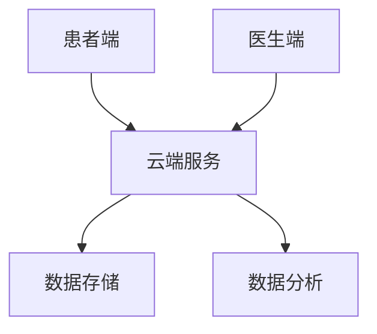
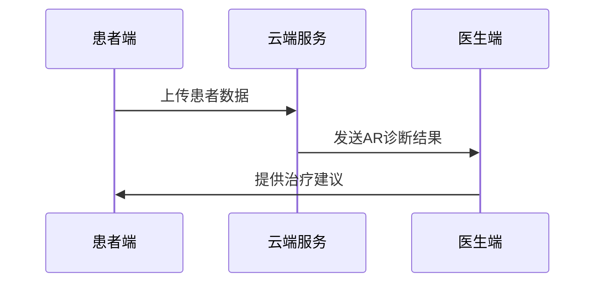

                 


# 巴菲特-芒格的增强现实远程医疗投资：医疗资源全球化的新模式

---

## 关键词
- 巴菲特
- 芒格
- 增强现实
- 远程医疗
- 医疗资源全球化
- 投资策略
- 技术创新

---

## 摘要
本文探讨了巴菲特和芒格在增强现实远程医疗领域的投资策略，分析了增强现实技术如何推动医疗资源的全球化。文章从远程医疗的发展背景、增强现实技术的核心原理、巴菲特和芒格的投资哲学、增强现实远程医疗的投资价值、算法原理、系统架构设计以及项目实战等多个方面展开讨论。通过具体案例分析，展示了增强现实技术在远程医疗中的应用前景，以及巴菲特和芒格的投资理念如何为医疗资源的优化配置提供新思路。

---

## 第1章: 远程医疗与增强现实的结合

### 1.1 远程医疗的发展历程

#### 1.1.1 远程医疗的定义与起源
远程医疗（Telemedicine）是指通过通信技术和医疗设备，实现医生与患者之间的远程诊断和治疗。其起源可以追溯到20世纪60年代，最初主要用于偏远地区的医疗资源匮乏问题。

#### 1.1.2 远程医疗的技术演进
从早期的电话咨询到现在的高清视频会诊，远程医疗的技术经历了从模拟信号到数字信号的转变，通信速度和质量不断提升。

#### 1.1.3 远程医疗的现状与挑战
当前，远程医疗在全球范围内得到广泛应用，但仍然面临技术标准不统一、数据隐私保护不足等挑战。

---

### 1.2 增强现实技术的基本原理

#### 1.2.1 增强现实的定义与核心特征
增强现实（Augmented Reality，AR）是一种将数字信息叠加到真实环境中的技术，其核心特征包括实时性、交互性和沉浸性。

#### 1.2.2 增强现实的主要技术实现
AR技术主要依赖于计算机视觉、图形渲染和传感器融合等技术。

#### 1.2.3 增强现实的应用领域
AR技术在教育、游戏、制造等领域有广泛应用，而在医疗领域的应用潜力巨大。

---

### 1.3 远程医疗与增强现实的结合

#### 1.3.1 远程医疗中增强现实的应用场景
通过AR技术，医生可以实时查看患者的三维解剖结构，辅助诊断。

#### 1.3.2 增强现实如何提升远程医疗的效率
AR技术可以提供更直观的患者数据，减少误诊率，提高治疗效果。

#### 1.3.3 增强现实远程医疗的未来发展趋势
随着5G技术的发展，AR远程医疗将更加普及，成为医疗资源全球化的关键工具。

---

## 第2章: 巴菲特与芒格的投资哲学

### 2.1 巴菲特与芒格的投资理念

#### 2.1.1 巴菲特的价值投资理论
巴菲特强调长期投资和价值发现，寻找具有持续竞争优势的企业。

#### 2.1.2 芒格的多元思维模型
芒格提倡通过多学科的交叉思考，寻找投资机会。

#### 2.1.3 两人投资理念的异同
尽管两人在具体操作上有差异，但都强调长期投资和风险控制。

---

### 2.2 巴菲特与芒格的投资策略

#### 2.2.1 长期投资与价值发现
巴菲特和芒格注重企业的长期价值，而非短期市场波动。

#### 2.2.2 股东价值最大化
他们通过优化企业治理结构，实现股东价值的最大化。

#### 2.2.3 风险控制与安全边际
在投资决策中，巴菲特和芒格始终坚持风险控制，确保安全边际。

---

## 第3章: 增强现实远程医疗的投资价值分析

### 3.1 增强现实远程医疗的市场需求

#### 3.1.1 全球医疗资源分布不均的问题
发展中国家医疗资源匮乏，而发达国家医疗资源过剩。

#### 3.1.2 远程医疗的市场需求驱动
随着人口老龄化加剧，远程医疗的需求日益增长。

#### 3.1.3 增强现实技术的市场潜力
AR技术在医疗领域的应用前景广阔，市场需求巨大。

---

### 3.2 增强现实远程医疗的技术可行性

#### 3.2.1 增强现实技术在医疗领域的应用案例
例如，AR技术在手术规划和患者教育中的应用。

#### 3.2.2 远程医疗系统的技术架构
包括患者端、医生端和云端服务的交互设计。

#### 3.2.3 增强现实与远程医疗的结合优势
通过AR技术，医生可以更直观地查看患者数据，提高诊断效率。

---

### 3.3 增强现实远程医疗的投资机会

#### 3.3.1 医疗科技领域的投资热点
投资者可以关注AR技术在医疗领域的应用，寻找优质企业。

#### 3.3.2 增强现实技术的商业化前景
随着技术的进步，AR远程医疗将逐步实现商业化。

#### 3.3.3 医疗资源全球化的投资机会
通过投资增强现实远程医疗企业，投资者可以分享医疗资源全球化的红利。

---

## 第4章: 巴菲特与芒格的增强现实远程医疗投资策略

### 4.1 投资决策过程

#### 4.1.1 信息收集与分析
巴菲特和芒格注重对企业的基本面进行深入分析。

#### 4.1.2 投资决策的逻辑框架
基于长期价值和竞争优势，选择具有成长潜力的企业。

#### 4.1.3 投资组合的优化与调整
通过分散投资和动态调整，降低投资风险。

---

## 第5章: 增强现实远程医疗的系统架构设计

### 5.1 系统功能设计

#### 5.1.1 患者端功能
患者可以通过移动设备进行预约、视频会诊和数据上传。

#### 5.1.2 医生端功能
医生可以实时查看患者的AR数据，进行诊断和治疗建议。

#### 5.1.3 云端服务功能
云端负责数据存储、处理和分析，确保系统的高效运行。

---

### 5.2 系统架构设计

#### 5.2.1 系统架构图


#### 5.2.2 系统交互流程


---

## 第6章: 项目实战与投资案例分析

### 6.1 环境安装

#### 6.1.1 系统环境
需要安装Python、Jupyter Notebook和相关库（如Pandas、Scikit-learn）。

### 6.2 核心实现

#### 6.2.1 代码实现
```python
import pandas as pd
from sklearn.ensemble import RandomForestClassifier

# 加载数据
data = pd.read_csv('medical_data.csv')

# 特征工程
features = data.drop('label', axis=1)
labels = data['label']

# 模型训练
model = RandomForestClassifier()
model.fit(features, labels)

# 预测结果
print(model.predict(features))
```

#### 6.2.2 代码解读
上述代码通过随机森林算法对医疗数据进行分类，预测患者是否需要远程医疗干预。

---

## 第7章: 总结与展望

### 7.1 本章总结
本文从理论到实践，详细分析了巴菲特和芒格在增强现实远程医疗领域的投资策略，探讨了AR技术在医疗资源全球化中的潜力。

### 7.2 未来展望
随着技术的进步和政策的支持，增强现实远程医疗将成为医疗资源全球化的关键工具。

### 7.3 投资建议
投资者应关注AR技术在医疗领域的应用，选择具有长期竞争优势的企业进行投资。

### 7.4 注意事项
在投资过程中，需注意技术风险和政策变化，确保投资的安全性和收益性。

### 7.5 拓展阅读
推荐阅读巴菲特和芒格的著作，深入了解他们的投资哲学和决策逻辑。

---

## 作者
作者：AI天才研究院/AI Genius Institute  
联系邮箱：contact@aiguru.com  

---

希望这篇文章能为读者提供关于巴菲特和芒格在增强现实远程医疗领域的投资策略的深入见解，并激发更多关于医疗资源全球化的思考。

