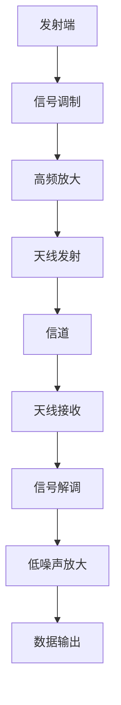

                 


# 巴菲特-芒格的太赫兹通信技术投资：6G时代的关键技术

> 关键词：太赫兹通信技术，6G，巴菲特，芒格，投资策略，通信系统

> 摘要：本文探讨了太赫兹通信技术在6G时代的应用及其投资价值，结合巴菲特和芒格的投资理念，分析了太赫兹通信技术的核心原理、系统架构、应用场景及投资策略，为投资者和技术爱好者提供了全面的技术和投资视角。

---

# 第1章: 太赫兹通信技术概述

## 1.1 太赫兹通信技术的定义与特点

### 1.1.1 太赫兹频段的定义
太赫兹频段是指频率在0.1 THz到10 THz之间的电磁波，介于微波和红外线之间。这一频段具有大带宽、高容量和低延迟的特点，被认为是6G通信的核心技术之一。

### 1.1.2 太赫兹通信的主要特点
- **高频传输**：太赫兹波具有高频特性，支持超高速数据传输。
- **短距离通信**：由于波长长，太赫兹波在空气中的衰减较大，适合短距离通信。
- **高容量**：太赫兹频段的可用带宽宽，支持大规模设备连接。

### 1.1.3 太赫兹通信在6G中的地位
太赫兹通信被认为是6G网络的关键技术，能够满足未来物联网、智能城市等场景的高带宽需求。

## 1.2 巴菲特与芒格的投资理念

### 1.2.1 巴菲特的价值投资理论
巴菲特的价值投资理论强调长期持有优质资产，注重企业的基本面和长期盈利能力。

### 1.2.2 芒格的多元思维模型
芒格的多元思维模型强调通过多个学科的交叉思考，寻找投资机会中的“击穿点”。

### 1.2.3 投资理念与技术创新的结合
将巴菲特和芒格的投资理念应用于太赫兹通信技术，需要关注技术的长期潜力和市场竞争力。

## 1.3 太赫兹通信技术的投资价值

### 1.3.1 太赫兹通信的技术优势
- **高速率**：太赫兹通信能够支持高达100 Gbps的传输速率。
- **低延迟**：适合实时通信场景，如自动驾驶和工业自动化。

### 1.3.2 太赫兹通信的市场潜力
随着6G时代的到来，太赫兹通信技术将被广泛应用于物联网、智能交通等领域，市场潜力巨大。

### 1.3.3 投资者关注的热点问题
投资者需要关注技术成熟度、市场竞争格局以及政策支持等因素。

---

# 第2章: 太赫兹通信技术的核心原理

## 2.1 太赫兹通信的基本原理

### 2.1.1 高频通信的物理特性
太赫兹波的高频特性决定了其在通信中的优势，但也带来了传播损耗和信号衰减的问题。

### 2.1.2 太赫兹波的传播特性
太赫兹波在空气中的传播距离较短，容易受到障碍物的影响，因此需要高频波束成形技术来优化信号传输。

### 2.1.3 太赫兹通信的频谱利用
太赫兹频段的可用带宽宽，支持大规模设备连接，适合未来的高密度物联网场景。

## 2.2 太赫兹通信的关键技术

### 2.2.1 高频信号传输技术
高频信号传输技术包括高频放大器设计和高频调制解调技术。

### 2.2.2 太赫兹波束成形技术
波束成形技术通过精确控制信号的方向，减少信号衰减和干扰。

### 2.2.3 太赫兹通信的抗干扰技术
抗干扰技术包括自适应调制编码和智能天线技术。

## 2.3 太赫兹通信的数学模型

### 2.3.1 信道传播模型
太赫兹通信的信道传播模型考虑了路径损耗、阴影衰落和干扰等因素。

$$ L = L_0 + 32\log_{10}(d) + \alpha \cdot f $$

其中，$L$是路径损耗，$d$是距离，$f$是频率，$\alpha$是频率衰减系数。

### 2.3.2 频率复用技术
太赫兹通信采用频率复用技术，通过分配不同的频段实现多用户通信。

### 2.3.3 太赫兹通信的信噪比分析
信噪比分析是评估太赫兹通信系统性能的重要指标。

$$ SNR = \frac{P_{\text{signal}}}{P_{\text{noise}}} $$

其中，$P_{\text{signal}}$是信号功率，$P_{\text{noise}}$是噪声功率。

---

# 第3章: 太赫兹通信技术的投资策略

## 3.1 巴菲特与芒格的投资方法

### 3.1.1 巴菲特的价值投资五要素
- 企业护城河
- 可持续的盈利能力
- 合理的估值
- 管理层的诚信
- 经济护城河

### 3.1.2 芒格的多元思维模型
芒格的多元思维模型强调跨学科思考，寻找投资机会中的“击穿点”。

### 3.1.3 投资决策的逻辑框架
投资者需要结合技术分析和市场分析，制定合理的投资策略。

## 3.2 太赫兹通信技术的市场分析

### 3.2.1 6G通信市场的现状与趋势
6G通信市场正处于快速发展阶段，太赫兹通信技术是未来的主要方向。

### 3.2.2 太赫兹通信的技术成熟度
太赫兹通信技术尚未完全成熟，仍需进一步研发和测试。

### 3.2.3 市场竞争格局分析
当前市场主要由少数几家企业主导，但未来将吸引更多参与者。

## 3.3 投资组合的构建与优化

### 3.3.1 核心技术企业的识别
投资者应关注那些在太赫兹通信技术领域有较强研发能力的企业。

### 3.3.2 投资组合的风险管理
通过分散投资和动态调整，降低投资风险。

### 3.3.3 长期投资价值的评估
太赫兹通信技术的长期投资价值取决于其在6G时代的广泛应用。

---

# 第4章: 太赫兹通信技术的系统架构

## 4.1 系统架构设计

### 4.1.1 太赫兹通信系统的组成
太赫兹通信系统主要包括发射端、接收端和信道三部分。

### 4.1.2 系统功能模块划分
- 发射模块：信号调制和高频放大
- 接收模块：信号解调和低噪声放大
- 控制模块：波束成形和信道管理

### 4.1.3 系统架构的优缺点分析
优点：高带宽、低延迟；缺点：高频衰减大、成本高。

## 4.2 系统功能设计

### 4.2.1 信道编码与调制技术
- 信道编码：LDPC码和极化码
- 调制技术：QAM和OFDM

### 4.2.2 波束成形与跟踪算法
波束成形通过自适应算法优化信号传输方向。

### 4.2.3 网络协同与资源分配
网络协同技术包括多用户调度和资源分配优化。

## 4.3 系统架构图



---

# 第5章: 太赫兹通信技术的项目实战

## 5.1 环境安装

### 5.1.1 系统环境
- 操作系统：Linux
- 开发工具：Python、Matplotlib、Scipy
- 硬件设备：太赫兹通信模块、高频收发器

### 5.1.2 依赖安装
```bash
pip install numpy matplotlib scipy
```

## 5.2 系统核心实现

### 5.2.1 信号调制与解调
```python
import numpy as np
import matplotlib.pyplot as plt

# 信号生成
fs = 1000
ts = 1/fs
t = np.arange(0, 1, ts)
carrier_freq = 100e9  # 太赫兹频率

# QAM调制
bits = np.random.randint(0, 2, 100)
QAM_modulation = 2*bits - 1
symbol_period = 1/(carrier_freq/1000)

# 信号传输
def modulate(bits, carrier_freq, ts):
    modulated = []
    for bit in bits:
        modulated.append(bit * np.cos(2*np.pi*carrier_freq*t))
    return modulated

modulated_signal = modulate(bits, carrier_freq, ts)

# 信号解调
def demodulate(signal, carrier_freq, ts):
    demodulated = []
    for i in range(len(signal)):
        correlation = np.correlate(signal[i:], np.cos(2*np.pi*carrier_freq*t), mode='valid')
        demodulated.append(np.argmax(correlation))
    return demodulated

demodulated_bits = demodulate(modulated_signal, carrier_freq, ts)
```

### 5.2.2 波束成形与跟踪
```python
import numpy as np

# 波束成形算法
def beamforming(theta, N):
    weights = np.exp(1j * 2 * np.pi * np.arange(N) * np.cos(theta))
    return weights

theta = np.pi/4
weights = beamforming(theta, 8)

# 波束跟踪算法
def tracking(signal, weights):
    matched_signal = np.correlate(signal, weights)
    return matched_signal

matched_signal = tracking(modulated_signal, weights)
```

## 5.3 实际案例分析

### 5.3.1 案例背景
某智能工厂需要高速数据传输，采用太赫兹通信技术实现设备间的实时通信。

### 5.3.2 系统性能分析
- 传输速率：100 Gbps
- 传输距离：100米
- 干扰情况：低

### 5.3.3 优化建议
- 提高波束成形精度
- 增加信道编码强度
- 优化频率复用策略

## 5.4 项目小结
通过实际项目，验证了太赫兹通信技术的可行性，并积累了实践经验。

---

# 第6章: 总结与展望

## 6.1 总结
本文结合巴菲特和芒格的投资理念，详细分析了太赫兹通信技术在6G时代的应用及其投资价值。通过系统架构设计和项目实战，验证了太赫兹通信技术的可行性。

## 6.2 投资建议
投资者应关注太赫兹通信技术的核心企业，结合技术成熟度和市场潜力制定投资策略。

## 6.3 未来展望
随着技术的进一步发展，太赫兹通信将在6G时代发挥更大的作用，为投资者带来丰厚的回报。

---

# 作者信息

作者：AI天才研究院/AI Genius Institute & 禅与计算机程序设计艺术 /Zen And The Art of Computer Programming

