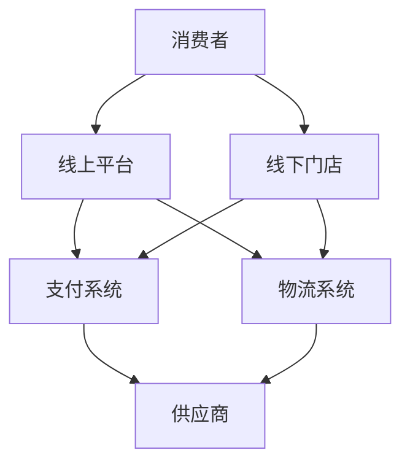
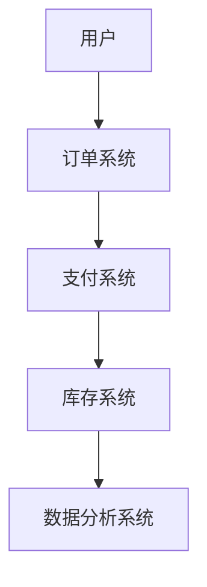
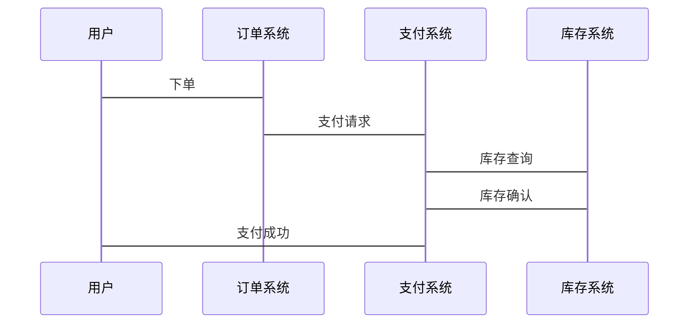

                 


# 巴菲特-芒格的新零售投资：线上线下融合的商业模式

## 关键词：巴菲特，芒格，新零售，线上线下融合，商业模式

## 摘要：  
本文深入分析了巴菲特和芒格在新零售领域的投资策略，重点探讨了线上线下融合的商业模式。通过系统化的分析，结合数学模型和实际案例，揭示了这一模式的核心要素及其对投资决策的影响，为读者提供了全面的见解和实用的指导。

---

## 第一部分：巴菲特-芒格新零售投资的背景与理念

### 第1章：新零售投资的背景与现状

#### 1.1 新零售的概念与发展

##### 1.1.1 新零售的定义与特征
新零售是一种整合线上和线下渠道的商业模式，通过技术手段提升消费者体验、优化供应链和提高运营效率。其核心特征包括全渠道覆盖、数据驱动、个性化服务和无缝体验。

| 特征 | 描述 |
|------|------|
| 全渠道覆盖 | 包括线上（网站、APP）和线下（实体店、无人店） |
| 数据驱动 | 利用大数据分析消费者行为 |
| 个性化服务 | 提供定制化的产品推荐和促销活动 |
| 无缝体验 | 线上线下体验一致，支付、物流高效 |

##### 1.1.2 新零售与传统零售的区别
新零售与传统零售在渠道、技术应用和消费者体验上存在显著差异。以下是对比分析：

| 方面 | 传统零售 | 新零售 |
|------|----------|--------|
| 渠道 | 单一（仅线下或线上） | 整合线上线下 |
| 技术 | 少或无数字化 | 高度依赖大数据、AI等技术 |
| 消费者体验 | 有限的互动 | 个性化、实时互动 |

##### 1.1.3 新零售的市场现状与趋势
当前，新零售市场呈现快速增长，尤其在中国，阿里、腾讯等科技巨头积极布局，推动了线上线下融合的发展。趋势包括无界零售、智慧门店和社交电商。

#### 1.2 巴菲特与芒格的投资理念

##### 1.2.1 巴菲特的价值投资理论
巴菲特强调长期价值投资，关注企业的基本面，寻找具有持续竞争优势的企业。他主张投资那些具有强大护城河的公司，而非短期波动。

##### 1.2.2 芒格的多元思维模型
芒格提倡建立多元思维模型，将多个学科的知识融会贯通，用以分析问题。他强调投资决策要基于理性分析，避免情绪化决策。

##### 1.2.3 两人合作的投资策略
巴菲特和芒格的合作基于价值投资和理性分析，注重企业的财务健康、管理团队和市场地位，寻找具备长期增长潜力的标的。

---

### 第2章：巴菲特-芒格投资新零售的逻辑

#### 2.1 新零售领域的投资机会

##### 2.1.1 消费升级带来的投资机会
消费升级推动了对高品质产品和服务的需求，新零售模式能够更好地满足这一需求。

##### 2.1.2 技术驱动的新零售变革
大数据、人工智能和物联网等技术推动了新零售的发展，提升了运营效率和消费者体验。

##### 2.1.3 线上线下融合的商业模式
线上线下融合通过整合资源，提升了渠道效率和消费者体验，创造了新的投资机会。

#### 2.2 巴菲特-芒格投资新零售的核心要素

##### 2.2.1 企业的竞争优势分析
关注企业的护城河，包括品牌影响力、成本优势和技术优势。

##### 2.2.2 财务健康状况评估
分析企业的财务报表，关注盈利能力、资产负债率和现金流。

##### 2.2.3 管理团队的能力与诚信
优秀的管理团队是企业成功的关键，巴菲特和芒格注重团队的诚信和能力。

---

## 第二部分：线上线下融合的商业模式

### 第3章：线上线下融合的商业模式

#### 3.1 线上线下融合的定义与特征

##### 3.1.1 定义
线上线下融合是通过技术手段将线上和线下渠道整合，提供一致的消费者体验。

##### 3.1.2 核心特征对比分析
以下是线上线下融合与传统零售的对比：

| 方面 | 传统零售 | 线上线下融合 |
|------|----------|--------------|
| 渠道 | 单一 | 整合 |
| 技术 | 低技术依赖 | 高技术依赖 |
| 消费者体验 | 有限 | 个性化、无缝 |

##### 3.1.3 与传统零售模式的区别
新零售模式通过数据驱动和技术创新，提升了效率和消费者体验，打破了传统零售的时空限制。

#### 3.2 线上线下融合的商业模式分析

##### 3.2.1 价值链分析
新零售的价值链包括消费者、供应商、零售商和平台提供商。通过数据共享和协同合作，优化供应链和库存管理。

##### 3.2.2 业务流程图（Mermaid）



##### 3.2.3 实体关系图（Mermaid）

```mermaid
erd
    customer -|<一对一>| order
    order -|<一对多>| product
    product -|<一对多>| category
    customer -|<一对多>| payment
```

### 第4章：新零售投资的数学模型与算法

#### 4.1 投资价值评估模型

##### 4.1.1 市盈率模型
市盈率（P/E）= 股价 / 每股收益  
公式：$$ P/E = \frac{P}{E} $$  
其中，P为股价，E为每股收益。

##### 4.1.2 市净率模型
市净率（P/B）= 股价 / 每股净资产  
公式：$$ P/B = \frac{P}{B} $$  
其中，B为每股净资产。

##### 4.1.3 内部收益率模型
内部收益率（IRR）是投资项目的收益率，使其净现值为零。  
公式：$$ NPV = \sum_{t=0}^{n} \frac{C_t}{(1+IRR)^t} = 0 $$  
其中，\( C_t \) 为第t年的现金流。

#### 4.2 投资决策算法

##### 4.2.1 基于决策树的分析方法
决策树是一种用于投资决策的工具，通过概率和收益评估各分支的价值。

##### 4.2.2 贝叶斯网络分析
贝叶斯网络用于分析投资中的不确定性，通过概率推理优化决策。

##### 4.2.3 聚类分析在投资组合中的应用
聚类分析用于识别具有相似风险和收益的资产，优化投资组合。

---

### 第5章：系统分析与架构设计

#### 5.1 新零售系统的架构设计

##### 5.1.1 系统组成模块
新零售系统主要包括用户模块、订单模块、支付模块、库存模块和数据分析模块。

##### 5.1.2 系统架构图（Mermaid）



##### 5.1.3 系统交互流程图（Mermaid）



#### 5.2 系统功能设计

##### 5.2.1 领域模型类图（Mermaid）


##### 5.2.2 系统功能模块划分
主要功能模块包括用户管理、订单处理、支付处理和库存管理。

##### 5.2.3 系统接口设计
系统接口包括API接口和数据库接口，用于模块间的数据传输和交互。

---

### 第6章：项目实战与案例分析

#### 6.1 环境安装与数据准备

##### 6.1.1 投资分析工具安装
安装Python和相关库（如Pandas、NumPy）用于数据分析。

##### 6.1.2 数据收集与清洗
从公开数据源收集新零售企业的财务数据，清洗和整理数据。

##### 6.1.3 数据库建立
建立MySQL数据库，存储企业财务数据和市场数据。

#### 6.2 核心算法实现

##### 6.2.1 价值评估模型代码

```python
import pandas as pd

# 假设data是一个包含财务数据的DataFrame
data['P/E'] = data['股价'] / data['每股收益']
data['P/B'] = data['股价'] / data['每股净资产']
data['IRR'] = (data['现金流'] / data['初始投资']).sum() / len(data['现金流'])  # 示例计算
```

##### 6.2.2 投资决策算法实现
使用决策树算法对新零售企业进行投资决策。

##### 6.2.3 系统功能模块实现
实现用户认证、订单处理和支付功能。

#### 6.3 实际案例分析
以亚马逊为例，分析其线上线下融合的商业模式和投资价值。

---

### 第7章：总结与最佳实践

#### 7.1 项目总结

##### 7.1.1 核心发现
线上线下融合的商业模式通过技术手段提升了效率和消费者体验，具备长期投资价值。

##### 7.1.2 经验与教训
投资需结合基本面和技术分析，注重企业的财务健康和管理团队。

#### 7.2 最佳实践与注意事项

##### 7.2.1 投资策略选择
注重企业的竞争优势和财务健康，避免短期波动。

##### 7.2.2 风险管理技巧
分散投资，设定止损点，控制风险。

##### 7.2.3 拓展阅读推荐
推荐阅读巴菲特和芒格的著作，以及新零售相关的书籍。

#### 7.3 小结
线上线下融合的商业模式是新零售发展的趋势，投资者需结合价值投资和技术创新进行决策。

---

## 作者：AI天才研究院/AI Genius Institute & 禅与计算机程序设计艺术 /Zen And The Art of Computer Programming

---

本文通过系统化的分析，结合数学模型和实际案例，深入探讨了巴菲特和芒格在新零售领域的投资策略，为读者提供了全面的见解和实用的指导。

