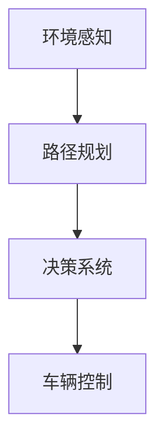
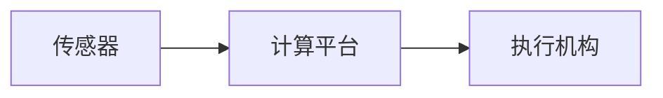

                 


# 巴菲特-芒格的无人驾驶技术投资：交通革命的前夜

## 关键词：无人驾驶技术、巴菲特、芒格、投资哲学、算法原理、系统架构、项目实战

## 摘要：无人驾驶技术作为未来交通革命的核心，正在吸引全球投资者的目光。本文通过分析巴菲特和芒格的投资哲学，深入探讨无人驾驶技术的核心算法与系统架构，并结合实际案例，展示无人驾驶技术的投资价值与未来发展趋势。

---

## 第一部分: 无人驾驶技术投资的背景与现状

### 第1章: 无人驾驶技术的定义与发展历程

#### 1.1 无人驾驶技术的定义与核心要素

无人驾驶技术是一种通过计算机视觉、传感器和人工智能算法实现车辆自主导航的技术。其核心要素包括：

1. **环境感知**：通过摄像头、激光雷达、雷达等传感器感知周围环境。
2. **路径规划**：基于感知数据，计算最优行驶路径。
3. **决策控制**：根据路径规划结果，控制车辆行驶。

无人驾驶技术与传统驾驶的主要区别在于，无人驾驶依赖于算法和传感器，而非人类驾驶员的判断。

#### 1.2 无人驾驶技术的发展历程

无人驾驶技术的发展可以分为以下几个阶段：

1. **早期探索阶段（20世纪初-20世纪末）**：研究者开始尝试将自动化技术应用于车辆。
2. **技术突破阶段（21世纪初-2010年代）**：随着人工智能和传感器技术的进步，无人驾驶技术取得重大进展。
3. **商业化探索阶段（2010年代至今）**：无人驾驶技术逐步应用于实际场景，如自动驾驶出租车和物流配送。

#### 1.3 无人驾驶技术的市场与经济影响

无人驾驶技术的市场潜力巨大，预计到2030年，全球无人驾驶市场规模将超过 trillion。它将彻底改变交通方式，减少交通事故，提高交通效率。

---

### 第2章: 巴菲特与芒格的投资哲学

#### 2.1 巴菲特的价值投资理念

巴菲特的价值投资理念强调长期投资、注重基本面分析和安全边际。他认为无人驾驶技术具备长期增长潜力，符合价值投资的原则。

#### 2.2 芒格的多元思维模型

芒格的多元思维模型强调跨学科思考和长期趋势分析。他认为无人驾驶技术的投资需要结合技术、经济和政策等多个因素。

---

## 第二部分: 无人驾驶技术的核心算法与系统架构

### 第3章: 无人驾驶技术的算法原理

#### 3.1 无人驾驶中的环境感知算法

环境感知是无人驾驶技术的核心，主要依赖于深度学习和传感器数据融合。

- **深度学习模型**：使用卷积神经网络（CNN）进行目标检测和语义分割。
- **传感器融合**：将激光雷达、摄像头和雷达的数据进行融合，提高感知精度。

#### 3.2 路径规划与决策算法

路径规划是无人驾驶技术的关键，主要依赖于强化学习和图搜索算法。

- **强化学习**：通过模拟训练，优化决策策略。
- **图搜索**：使用A*算法规划最优路径。

#### 3.3 无人驾驶算法的数学模型

1. **目标检测模型**：使用Faster R-CNN进行目标检测，公式如下：
   $$P(y|x) = \frac{P(x|y)P(y)}{P(x)}$$
2. **路径规划模型**：使用Dijkstra算法计算最短路径，公式如下：
   $$\text{distance} = \sum_{i=1}^{n} \sqrt{(x_i - x_{i-1})^2 + (y_i - y_{i-1})^2}$$

#### 3.4 无人驾驶算法的实现流程



---

### 第4章: 无人驾驶系统的架构设计

#### 4.1 系统功能设计

- **传感器模块**：负责采集环境数据。
- **计算平台**：负责数据处理和算法运行。
- **执行机构**：负责车辆控制。

#### 4.2 系统架构设计



---

## 第三部分: 无人驾驶技术的投资分析与未来展望

### 第5章: 无人驾驶技术的投资分析

#### 5.1 无人驾驶行业的投资价值

无人驾驶行业具有巨大的市场潜力，但技术成熟度和政策环境是主要风险。

#### 5.2 巴菲特和芒格的投资策略

巴菲特和芒格注重长期价值和风险管理，他们的投资策略为无人驾驶技术的投资者提供了重要启示。

### 第6章: 无人驾驶技术的未来展望

#### 6.1 无人驾驶技术的未来趋势

随着5G和人工智能的进一步发展，无人驾驶技术将更加智能化和普及。

#### 6.2 无人驾驶技术的挑战与应对

当前面临的主要挑战包括法律法规、伦理问题和技术瓶颈。

---

## 项目实战: 无人驾驶技术的实现

### 6.1 项目环境搭建

- **工具安装**：安装Python、ROS框架和相关库。
- **硬件配置**：配置摄像头和激光雷达。

### 6.2 核心代码实现

```python
import rospy
from geometry_msgs.msg import Twist

def move():
    rospy.init_node('car_controller', anonymous=True)
    pub = rospy.Publisher('/cmd_vel', Twist, queue_size=10)
    rate = rospy.Rate(10)
    while not rospy.is_shutdown():
        twist = Twist()
        twist.linear.x = 0.5
        twist.angular.z = 0.1
        pub.publish(twist)
        rate.sleep()
```

### 6.3 系统测试与优化

通过实际测试，优化算法参数和系统性能，确保无人驾驶技术的稳定性和可靠性。

---

## 结论

无人驾驶技术作为交通革命的核心，正在改变我们的生活方式。巴菲特和芒格的投资哲学为我们提供了重要的启示，而技术的不断进步将推动无人驾驶技术的未来发展。

---

## 作者

作者：AI天才研究院/AI Genius Institute & 禅与计算机程序设计艺术 /Zen And The Art of Computer Programming

