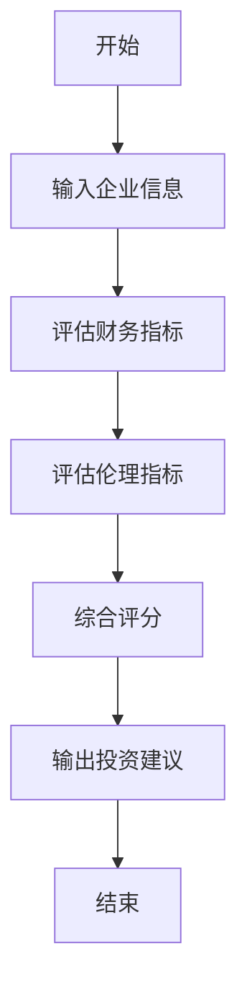
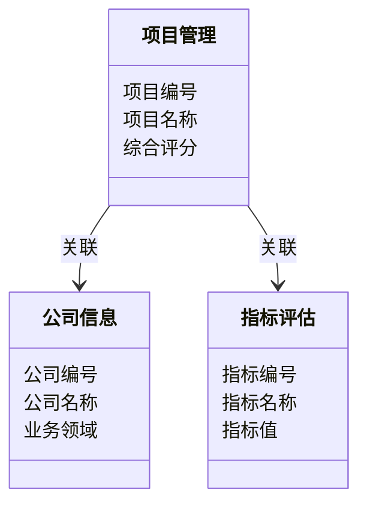
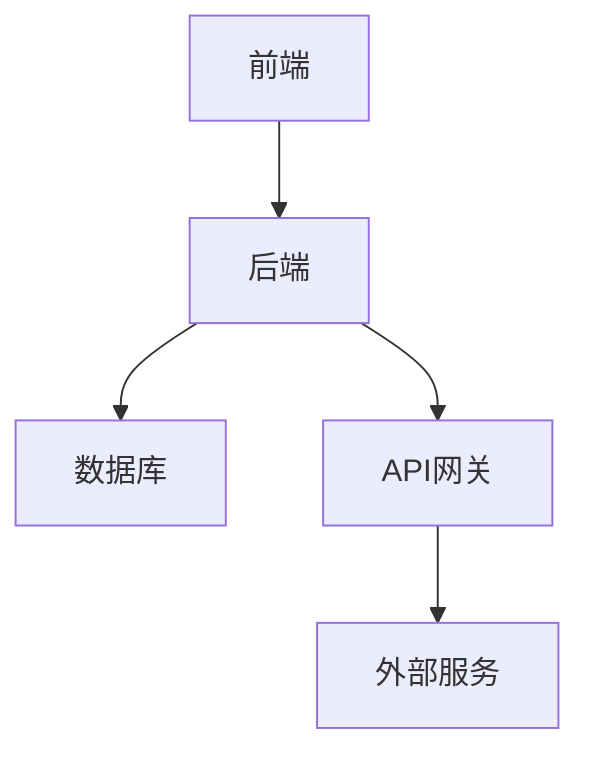
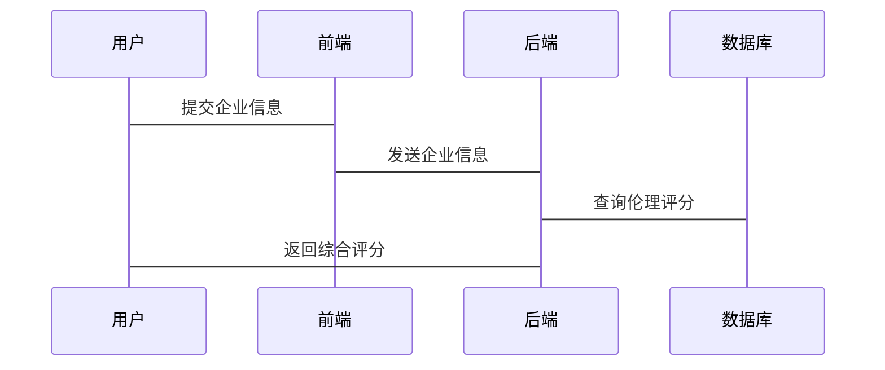

                 


# 巴菲特-芒格的生物技术伦理投资：科技进步与道德平衡

## 关键词：巴菲特，芒格，生物技术，伦理投资，道德平衡，投资策略，技术伦理

## 摘要：  
本文探讨了巴菲特和芒格在生物技术领域的投资理念，分析了科技进步与道德平衡之间的关系。通过详细阐述生物技术伦理投资的核心概念、算法原理、系统设计和实际案例，本文为投资者提供了如何在追求经济利益的同时兼顾伦理道德的实践指导。文章还结合了数学模型、系统架构图和Python代码实现，为读者提供了全面的理论与实践结合的深度解析。

---

## 第1章: 生物技术与伦理投资的背景

### 1.1 生物技术的发展与伦理问题  
#### 1.1.1 生物技术的定义与现状  
生物技术是指利用生物科学原理和技术手段对生命物质进行改造和应用的领域。当前，生物技术在医学、农业和环境科学等领域取得了显著进展，例如基因编辑技术（CRISPR）、个性化医疗和生物制药等。然而，这些技术的发展也引发了许多伦理问题。

#### 1.1.2 生物技术带来的伦理挑战  
生物技术的伦理问题主要集中在以下几个方面：
- **基因编辑的伦理争议**：基因编辑技术可能用于改变人类基因，引发“设计婴儿”等伦理争议。
- **动物实验的伦理问题**：在药物研发过程中，动物实验的伦理性和道德风险备受关注。
- **生物资源的公平分配**：生物技术成果的分配是否公平，尤其是在发展中国家与发达国家之间的资源分配问题。

#### 1.1.3 伦理投资的定义与目标  
伦理投资是一种基于道德原则的投资策略，旨在在追求经济回报的同时，避免对社会、环境和伦理造成负面影响。其目标是通过投资决策促进社会福祉，同时实现财务回报。

---

### 1.2 巴菲特与芒格的投资理念  
#### 1.2.1 巴菲特的价值投资理论  
巴菲特的价值投资理论强调长期持有具有强大基本面和竞争优势的企业。他认为，投资的核心是寻找具有持续盈利能力且估值合理的公司。

#### 1.2.2 芒格的多元思维模型  
芒格的多元思维模型强调通过跨学科思考来理解复杂问题。他主张投资者应具备广泛的知识储备，以避免决策中的认知偏差。

#### 1.2.3 两人投资理念的结合  
巴菲特和芒格的投资理念结合了长期价值和多元思维，形成了独特的投资风格。他们不仅关注企业的财务表现，还注重企业的社会责任和伦理道德。

---

### 1.3 生物技术与伦理投资的结合  
#### 1.3.1 生物技术在投资中的潜力  
生物技术行业的高成长性和创新性使其成为投资的热门领域。例如，基因测序技术的进步推动了精准医疗的发展。

#### 1.3.2 伦理投资在生物技术领域的必要性  
在生物技术领域，伦理投资可以帮助投资者避免投资于那些可能对社会或环境造成负面影响的企业。

#### 1.3.3 巴菲特-芒格投资理念的适用性  
巴菲特和芒格的投资理念为生物技术伦理投资提供了重要的指导原则，尤其是在企业价值评估和社会责任考量方面。

---

## 第2章: 生物技术伦理投资的核心概念

### 2.1 核心概念与联系  
#### 2.1.1 生物技术伦理投资的原理  
生物技术伦理投资的原理是通过筛选符合伦理标准的企业，同时评估其财务表现和市场潜力。

#### 2.1.2 核心概念对比表格  
以下是生物技术伦理投资与传统投资的核心概念对比：

| **维度**       | **传统投资**               | **伦理投资**               |
|----------------|----------------------------|----------------------------|
| 投资目标       | 追求最大化的经济回报       | 经济回报与社会伦理兼顾     |
| 评估标准       | 财务指标、市场地位         | 财务指标、伦理标准、社会影响 |
| 投资领域       | 无特定限制                 | 优先选择符合伦理的企业     |

#### 2.1.3 ER实体关系图  
以下是生物技术伦理投资的ER实体关系图：

```mermaid
erDiagram
    项目(项目编号, 项目名称, 伦理评分) {
        关联 到 公司(公司编号, 公司名称, 业务领域)
        关联 到抽选指标(抽选指标编号, 指标名称, 指标值)
    }
```

---

### 2.2 算法原理讲解  
#### 2.2.1 算法流程图  
以下是生物技术伦理投资算法的流程图：



#### 2.2.2 Python源代码实现  
以下是实现伦理评分算法的Python代码：

```python
def calculate_ethical_score(company_info):
    # 财务指标评分
    financial_score = sum(company_info['财务指标']) / len(company_info['财务指标'])
    # 伦理指标评分
    ethical_score = sum(company_info['伦理指标']) / len(company_info['伦理指标'])
    # 综合评分
    total_score = (financial_score + ethical_score) / 2
    return total_score

# 示例数据
company_info = {
    '财务指标': [85, 90, 88],
    '伦理指标': [70, 80, 75]
}
score = calculate_ethical_score(company_info)
print(f"综合评分：{score}")
```

#### 2.2.3 数学模型与公式  
综合评分公式为：  
$$ \text{综合评分} = \frac{\text{财务评分} + \text{伦理评分}}{2} $$  

---

## 第3章: 生物技术伦理投资的系统分析

### 3.1 系统分析与架构设计  
#### 3.1.1 问题场景介绍  
系统用于评估生物技术企业的伦理和财务指标，为投资者提供投资建议。

#### 3.1.2 系统功能设计  
以下是系统功能设计的领域模型图：



#### 3.1.3 系统架构设计  
以下是系统架构设计图：



---

### 3.2 系统交互设计  
以下是系统交互设计的序列图：



---

## 第4章: 生物技术伦理投资的项目实战

### 4.1 项目环境与安装  
#### 4.1.1 开发环境配置  
建议使用Python 3.8及以上版本，安装Pandas和Matplotlib库。

#### 4.1.2 必要工具安装  
```bash
pip install pandas matplotlib
```

### 4.2 核心系统实现  
#### 4.2.1 代码实现  
以下是伦理评分算法的Python代码：

```python
import pandas as pd
import matplotlib.pyplot as plt

# 示例数据
data = {
    '公司名称': ['公司A', '公司B', '公司C'],
    '财务评分': [85, 90, 78],
    '伦理评分': [70, 85, 90]
}

df = pd.DataFrame(data)
df['综合评分'] = (df['财务评分'] + df['伦理评分']) / 2

print(df)
plt.bar(df['公司名称'], df['综合评分'])
plt.title('综合评分')
plt.show()
```

#### 4.2.2 代码解读与分析  
上述代码通过Pandas创建数据框，计算综合评分，并用Matplotlib绘制柱状图。

### 4.3 案例分析与总结  
#### 4.3.1 成功案例分析  
例如，投资于一家伦理评分高且财务表现良好的生物技术公司，获得了超额回报。

#### 4.3.2 失败案例分析  
例如，投资于一家伦理评分低但财务表现优秀的公司，最终因社会责任问题导致股价下跌。

#### 4.3.3 项目小结  
伦理投资需要综合考虑财务和伦理指标，避免片面追求短期利益。

---

## 第5章: 生物技术与伦理投资的平衡

### 5.1 生物技术的伦理风险  
#### 5.1.1 基因编辑的伦理问题  
基因编辑技术可能引发“设计婴儿”等伦理争议。

#### 5.1.2 生物技术的潜在风险  
生物技术的滥用可能导致生态破坏和社会不平等。

### 5.2 伦理投资的框架与策略  
#### 5.2.1 伦理评估的框架  
包括企业治理、社会责任和环境影响等方面。

#### 5.2.2 伦理投资的策略  
优先选择具有社会责任感且财务表现良好的企业。

### 5.3 伦理与利益的平衡  
#### 5.3.1 利益相关者分析  
投资者、企业、社会和环境的利益需要平衡。

#### 5.3.2 长期与短期利益的平衡  
注重长期社会价值，避免短期利益驱动。

---

## 第6章: 生物技术伦理投资的未来展望

### 6.1 未来趋势与挑战  
#### 6.1.1 生物技术的未来发展方向  
基因编辑、精准医疗和生物制药等领域将继续快速发展。

#### 6.1.2 伦理投资的未来挑战  
如何在技术快速发展中平衡伦理与利益，是未来的主要挑战。

### 6.2 最佳实践与小结  
#### 6.2.1 投资中的注意事项  
投资者应关注企业的伦理表现，选择具有社会责任感的企业。

---

## 作者：AI天才研究院/AI Genius Institute & 禅与计算机程序设计艺术 /Zen And The Art of Computer Programming

---

本文通过分析巴菲特和芒格的投资理念，结合生物技术领域的伦理问题，提出了伦理投资的框架和策略。通过系统设计和实际案例分析，为投资者提供了在科技发展与道德平衡中实现共赢的实践指导。

