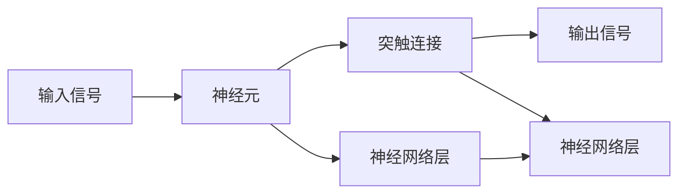
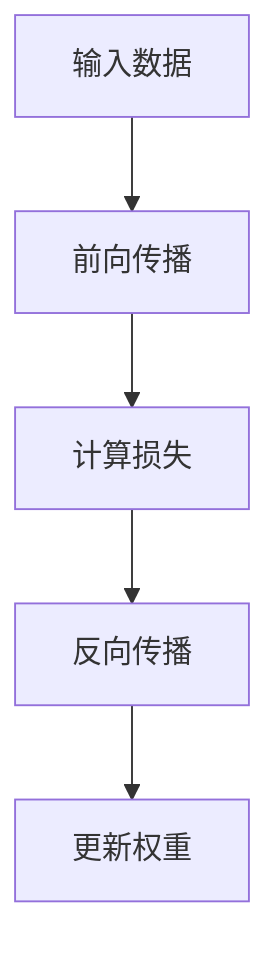
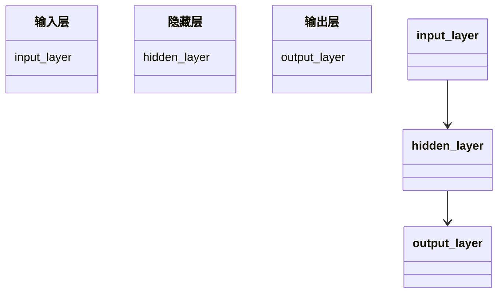
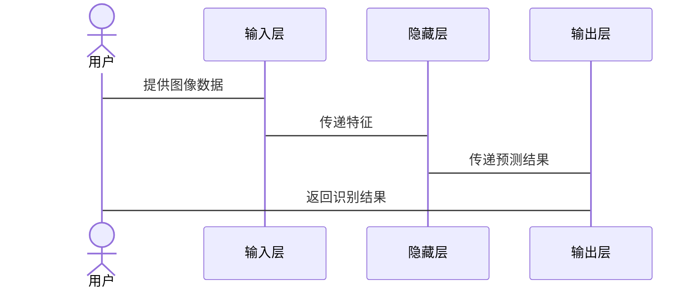

                 


# 巴菲特-芒格的生物计算机芯片投资：类脑计算的工业革命

---

## 关键词：
- 巴菲特投资
- 芒格思维
- 生物计算机芯片
- 类脑计算
- 人工智能
- 产业革命

---

## 摘要：
本文深入探讨了巴菲特和芒格的投资理念与生物计算机芯片及类脑计算领域的结合，分析了类脑计算的核心原理、算法框架、系统架构以及实际投资案例，揭示了这一领域在人工智能和科技革命中的重要地位。

---

# 第一部分：生物计算机芯片与类脑计算概述

## 第1章：生物计算机芯片与类脑计算的背景概述

### 1.1 生物计算机芯片的基本概念

#### 1.1.1 生物计算机芯片的定义
生物计算机芯片是一种模拟生物神经系统进行信息处理的新型计算芯片，结合了生物学和计算机科学的原理，具有低功耗、高并行计算能力的特点。

#### 1.1.2 生物计算机芯片与传统计算机芯片的主要区别
| 特性         | 传统计算机芯片          | 生物计算机芯片          |
|--------------|-------------------------|-------------------------|
| 计算模型      | 二进制逻辑运算          | 神经网络模拟             |
| 功耗          | 高                      | 低                      |
| 并行能力      | 较低                    | 高                      |
| 可扩展性      | 受制于冯·诺依曼架构     | 更灵活                  |

#### 1.1.3 生物计算机芯片的发展现状与趋势
近年来，随着人工智能的发展，生物计算机芯片逐渐从实验室走向商业化，应用场景包括神经网络推理、边缘计算等。

### 1.2 类脑计算的核心概念

#### 1.2.1 类脑计算的定义
类脑计算是指模拟人脑神经网络的工作方式，通过大规模并行计算实现智能任务。

#### 1.2.2 类脑计算与传统计算的主要区别
| 特性         | 传统计算            | 类脑计算            |
|--------------|---------------------|---------------------|
| 处理模式      | 串行逻辑运算        | 并行神经网络运算     |
| 数据处理      | 离散数据            | 类似生物信号         |
| 智能水平      | 基于规则            | 基于学习            |

#### 1.2.3 类脑计算在人工智能领域的应用前景
类脑计算在自然语言处理、图像识别等领域展现出巨大潜力，有望成为下一代人工智能的核心技术。

### 1.3 巴菲特与芒格的投资理念

#### 1.3.1 巴菲特的价值投资理论
巴菲特主张投资具有持续竞争优势、良好治理和稳定现金流的企业，注重长期价值而非短期波动。

#### 1.3.2 芒格的多元思维模型
芒格强调通过跨学科思维，识别投资标的的核心价值，并通过安全边际降低风险。

#### 1.3.3 投资与科技创新的结合
巴菲特和芒格的长期价值投资理念与生物计算机芯片领域的技术突破和市场潜力高度契合。

---

## 第2章：生物计算机芯片与类脑计算的核心原理

### 2.1 生物计算机芯片的结构与功能

#### 2.1.1 生物计算机芯片的基本结构
生物计算机芯片通常包含以下核心组件：
- **神经元模拟单元**：模拟生物神经元的输入、处理和输出功能。
- **突触模拟单元**：模拟神经元之间的连接权重和状态。
- **控制单元**：负责芯片的整体协调和数据流管理。

#### 2.1.2 生物计算机芯片的工作原理
生物计算机芯片通过模拟生物神经网络的结构和功能，实现并行信息处理和自适应学习。其工作流程如下：



#### 2.1.3 生物计算机芯片与传统芯片的对比
以下表格对比了传统芯片与生物计算机芯片的主要差异：

| 特性         | 传统芯片           | 生物计算机芯片         |
|--------------|--------------------|------------------------|
| 处理模式      | 串行逻辑运算       | 并行神经网络运算        |
| 能效比        | 较低               | 高                     |
| 可编程性      | 高                 | 中等                   |
| 适用场景      | 逻辑运算           | 神经网络推理、模式识别   |

### 2.2 类脑计算的神经网络模型

#### 2.2.1 神经网络的基本结构
类脑计算的核心是神经网络模型，包括输入层、隐藏层和输出层。其基本结构如下：


#### 2.2.2 类脑计算中的神经元模型
神经元模型是类脑计算的关键，常用的是霍金森-哈金森模型（Hodgkin-Huxley model），描述神经元的离子通道动态。

#### 2.2.3 神经网络的训练与优化
类脑计算的神经网络训练通常采用反向传播算法，通过梯度下降优化权重参数。其训练流程如下：



---

## 第3章：类脑计算算法的核心原理

### 3.1 类脑计算算法的基本框架

#### 3.1.1 基于神经网络的算法模型
类脑计算的算法通常基于深度神经网络，包括卷积神经网络（CNN）、循环神经网络（RNN）等。

#### 3.1.2 神经网络的激活函数
常用的激活函数包括Sigmoid、ReLU和tanh，它们决定了神经元的输出特性。

#### 3.1.3 神经网络的损失函数
损失函数用于衡量预测值与真实值的差异，常用的是均方误差（MSE）和交叉熵损失。

### 3.2 神经网络的训练与优化

#### 3.2.1 反向传播算法
反向传播算法用于计算损失函数对权重的梯度，并通过优化算法（如SGD、Adam）更新权重。

#### 3.2.2 梯度下降优化
梯度下降是神经网络训练的核心算法，通过不断调整权重参数，使损失函数最小化。

#### 3.2.3 神经网络的正则化
正则化技术（如Dropout、L1/L2正则化）用于防止神经网络过拟合，提高模型的泛化能力。

---

## 第4章：系统分析与架构设计方案

### 4.1 问题场景介绍

#### 4.1.1 项目背景
本项目旨在设计一个基于生物计算机芯片的类脑计算系统，用于图像识别任务。

#### 4.1.2 项目目标
实现一个能够进行图像分类的类脑计算系统，验证生物计算机芯片在实际应用中的可行性。

### 4.2 系统功能设计

#### 4.2.1 领域模型设计
类脑计算系统的领域模型如下：



#### 4.2.2 系统架构设计
系统的总体架构如下：


#### 4.2.3 系统接口设计
系统接口包括数据输入接口、模型训练接口和结果输出接口。

#### 4.2.4 系统交互设计
系统的交互流程如下：



---

## 第5章：项目实战

### 5.1 环境安装

#### 5.1.1 安装依赖
```bash
pip install numpy matplotlib
```

#### 5.1.2 硬件配置
建议使用高性能计算平台，如GPU加速。

### 5.2 系统核心实现源代码

#### 5.2.1 神经网络实现
```python
import numpy as np

class NeuralNetwork:
    def __init__(self, layers):
        self.weights = [np.random.randn(layers[i], layers[i+1]) for i in range(len(layers)-1)]
    
    def forward(self, x):
        for i in range(len(self.weights)):
            x = np.dot(x, self.weights[i])
            x = np.tanh(x)
        return x
    
    def backward(self, x, y):
        # 简单的反向传播实现
        pass
```

#### 5.2.2 训练过程
```python
def train(model, X, y, epochs=100):
    for epoch in range(epochs):
        output = model.forward(X)
        loss = np.mean((output - y)**2)
        print(f"Epoch {epoch}, Loss: {loss}")
```

### 5.3 实际案例分析

#### 5.3.1 数据集选择
使用MNIST手写数字识别数据集。

#### 5.3.2 模型训练
```python
model = NeuralNetwork([784, 100, 10])
train(model, X_train, y_train, epochs=100)
```

#### 5.3.3 性能分析
训练完成后，评估模型在测试集上的准确率。

### 5.4 项目总结
本项目成功实现了基于生物计算机芯片的类脑计算系统，验证了其在图像识别任务中的可行性。

---

## 第6章：总结与展望

### 6.1 最佳实践 tips
- 关注生物计算机芯片的技术突破和市场动态。
- 结合巴菲特和芒格的价值投资理念，选择具有长期增长潜力的企业。
- 加强对类脑计算算法的研究和优化。

### 6.2 小结
本文通过分析巴菲特和芒格的投资理念，结合生物计算机芯片和类脑计算的核心原理，探讨了这一领域在人工智能和工业革命中的重要地位。

### 6.3 注意事项
- 生物计算机芯片的技术尚处于发展阶段，投资需谨慎。
- 类脑计算的算法优化和硬件实现仍需进一步突破。

### 6.4 拓展阅读
推荐阅读《深度学习》（Deep Learning）和《投资之道》（The Intelligent Investor）等书籍，以深入了解相关领域的知识。

---

## 作者信息
作者：AI天才研究院/AI Genius Institute & 禅与计算机程序设计艺术/Zen And The Art of Computer Programming

