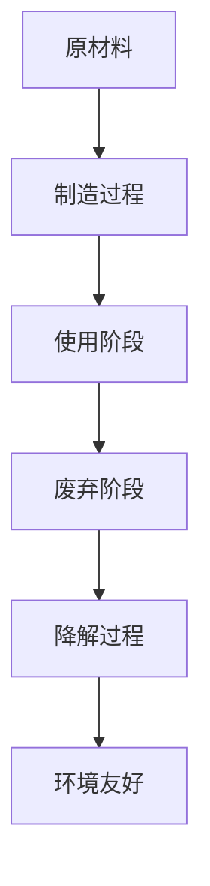
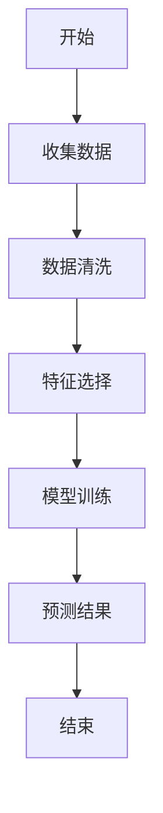
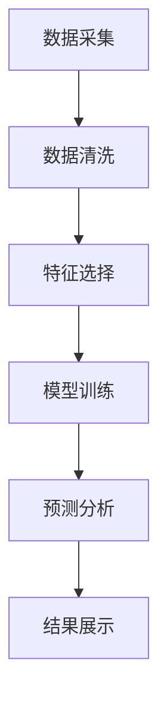
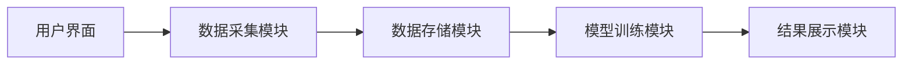
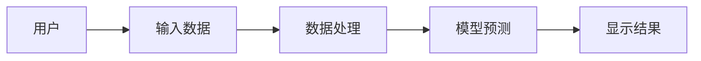

                 


# 巴菲特-芒格的生物降解智能材料投资：可持续科技的新方向

> 关键词：巴菲特, 芒格, 生物降解材料, 智能材料, 可持续科技, 投资策略, 环境保护

> 摘要：本文探讨了巴菲特和芒格在生物降解智能材料领域的投资策略，分析了这些材料在可持续科技中的重要性，结合技术原理、算法模型和实际案例，为读者提供了从理论到实践的全面解读。

---

## 第一部分：生物降解智能材料与可持续科技的背景

### 1.1 生物降解材料与智能材料的定义与特点

#### 1.1.1 生物降解材料的基本概念

生物降解材料是指在自然环境中能够被微生物分解为二氧化碳和水等简单化合物的材料。这类材料通常由可再生资源制成，如淀粉、纤维素、聚乳酸（PLA）和聚羟基脂肪酸酯（PHA）等。与传统塑料不同，生物降解材料可以在较短时间内分解，减少对环境的污染。

#### 1.1.2 智能材料的核心属性

智能材料是一种能够感知外界环境变化（如温度、湿度、光照等）并做出响应的材料。例如，形状记忆合金可以在外界刺激下改变形状，随后恢复原状；智能玻璃可以根据光照调节透明度。这些材料在建筑、医疗和电子等领域有广泛应用。

#### 1.1.3 可持续科技的背景与意义

可持续科技是指在技术开发和应用过程中，能够减少资源消耗和环境污染，同时满足社会需求的科技。生物降解智能材料的出现，为解决传统材料带来的环境问题提供了新思路。通过替代传统塑料和非环保材料，这些新型材料有助于推动绿色技术的发展。

### 1.2 巴菲特与芒格的投资理念

#### 1.2.1 巴菲特的价值投资原则

巴菲特的价值投资原则强调长期持有优质资产，关注企业的基本面和内在价值。他认为，投资的核心是找到那些具有持续竞争优势和良好管理的公司。这种理念在生物降解智能材料领域同样适用，因为这类材料代表了未来科技发展的方向。

#### 1.2.2 芒格的多元思维模型

芒格的多元思维模型强调将不同学科的知识结合起来，形成一个完整的知识框架。他认为，投资者需要从多个角度分析问题，避免单一思维的局限性。在生物降解智能材料的投资中，芒格可能会关注材料科学、环境政策和市场趋势等多个方面。

#### 1.2.3 投资与可持续发展的结合

随着全球环保意识的增强，可持续发展成为企业和投资者关注的焦点。生物降解智能材料不仅符合环保要求，还能满足市场对高性能材料的需求。因此，这类材料的投资不仅具有经济价值，还能带来社会价值。

### 1.3 生物降解智能材料的投资价值

#### 1.3.1 行业趋势与市场潜力

随着全球对环保的重视，生物降解材料的市场需求持续增长。根据市场研究机构的预测，到2030年，全球生物降解材料市场规模将超过1000亿美元。这一趋势为投资者提供了巨大的机遇。

#### 1.3.2 环境问题与政策支持

传统塑料带来的环境污染问题日益严重，许多国家和地区已经出台相关政策，限制传统塑料的使用，推广生物降解材料。例如，欧盟的“禁塑令”和中国的“限塑令”都为生物降解材料的应用提供了政策支持。

#### 1.3.3 技术创新与商业机会

生物降解智能材料的开发需要多学科的技术支持，包括材料科学、化学、生物技术和信息技术等。技术创新不仅提高了材料的性能，还降低了生产成本，为投资者提供了更多的商业机会。

---

## 第二部分：生物降解智能材料的核心概念与联系

### 2.1 核心概念原理

#### 2.1.1 生物降解材料的化学结构

生物降解材料的化学结构通常由可再生资源中的分子构成。例如，聚乳酸（PLA）是由乳酸通过聚合反应形成的，而乳酸可以由淀粉发酵制得。这种材料在微生物的作用下可以分解为二氧化碳和水。

#### 2.1.2 智能材料的响应机制

智能材料的响应机制依赖于其分子结构对外界刺激的敏感性。例如，形状记忆合金在外力作用下会变形，但在特定温度下又会恢复原状。这种特性使其在医疗和建筑领域有广泛应用。

#### 2.1.3 可持续性评估指标

可持续性评估指标包括材料的生命周期、生产过程的能耗、材料的可降解性和资源的可再生性等。通过综合评估这些指标，可以确定材料的可持续性。

### 2.2 概念属性特征对比表格

| 概念       | 生物降解材料       | 智能材料         |
|------------|--------------------|------------------|
| 定义       | 可被自然降解的材料 | 对环境有响应的材料 |
| 优点       | 减少环境污染       | 提高材料性能     |
| 应用领域     | 环保、农业         | 智能设备、医疗   |

### 2.3 材料生命周期的 Mermaid 流程图



---

## 第三部分：生物降解智能材料的投资策略与分析

### 3.1 投资决策模型

#### 3.1.1 投资模型的构建

投资决策模型需要考虑多个因素，包括市场需求、技术可行性、政策支持和企业竞争力等。通过权重分配，可以确定每个因素的重要性，并对潜在投资项目进行评分。

#### 3.1.2 数据收集与分析

数据收集包括市场调研、技术评估和政策分析等。通过数据分析，可以确定投资项目的优劣势，并预测其未来的市场表现。

#### 3.1.3 风险评估与收益

风险评估需要考虑市场风险、技术风险和政策风险等因素。收益预测需要结合市场需求和产品定价，评估项目的盈利能力。

### 3.2 算法原理讲解

#### 3.2.1 算法流程图



#### 3.2.2 算法实现代码

```python
import pandas as pd
from sklearn.model_selection import train_test_split
from sklearn.linear_model import LinearRegression

# 数据加载
data = pd.read_csv('material_data.csv')

# 特征选择
X = data[['market_size', 'tech_level', 'policy_support']]
y = data['investment_return']

# 数据分割
X_train, X_test, y_train, y_test = train_test_split(X, y, test_size=0.2, random_state=42)

# 模型训练
model = LinearRegression()
model.fit(X_train, y_train)

# 预测结果
predictions = model.predict(X_test)

# 输出结果
print('预测值:', predictions)
print('真实值:', y_test.values)
```

#### 3.2.3 算法数学模型

线性回归模型的数学公式为：

$$ y = \beta_0 + \beta_1x_1 + \beta_2x_2 + \beta_3x_3 + \epsilon $$

其中，$y$ 是投资回报率，$x_1$ 是市场规模，$x_2$ 是技术水平，$x_3$ 是政策支持，$\beta_0, \beta_1, \beta_2, \beta_3$ 是回归系数，$\epsilon$ 是误差项。

---

## 第四部分：生物降解智能材料的系统分析与架构设计

### 4.1 系统功能设计

#### 4.1.1 功能模块

系统功能模块包括数据采集、模型训练、预测分析和结果展示。

#### 4.1.2 功能流程图



### 4.2 系统架构设计

#### 4.2.1 系统架构图



#### 4.2.2 系统交互流程图



---

## 第五部分：生物降解智能材料的项目实战

### 5.1 项目环境配置

#### 5.1.1 环境要求

需要安装Python、Pandas、Scikit-learn和Mermaid工具。

### 5.2 核心实现代码

```python
import pandas as pd
from sklearn.linear_model import LinearRegression

# 加载数据
data = pd.read_csv('material_data.csv')

# 特征选择
X = data[['market_size', 'tech_level', 'policy_support']]
y = data['investment_return']

# 数据分割
X_train, X_test, y_train, y_test = train_test_split(X, y, test_size=0.2, random_state=42)

# 模型训练
model = LinearRegression()
model.fit(X_train, y_train)

# 预测结果
predictions = model.predict(X_test)

# 输出结果
print('预测值:', predictions)
print('真实值:', y_test.values)
```

### 5.3 项目小结

通过实际案例分析，我们可以看到生物降解智能材料的投资具有较高的市场潜力和良好的环境效益。投资者需要综合考虑市场需求、技术可行性和政策支持等因素，制定科学的投资策略。

---

## 第六部分：生物降解智能材料的投资未来展望

### 6.1 未来技术趋势

随着材料科学和人工智能的进步，生物降解智能材料的性能和应用领域将进一步扩大。例如，新型纳米材料的应用可以提高材料的强度和降解性能。

### 6.2 投资机会与挑战

未来，生物降解智能材料的投资机会主要集中在高性能材料开发、智能设备制造和环保技术应用等领域。然而，技术风险和政策变化也对投资者提出了更高的要求。

---

## 附录

### 术语表

- 生物降解材料：能够被微生物分解为二氧化碳和水的材料。
- 智能材料：能够感知外界环境变化并做出响应的材料。

### 参考文献

-巴菲特的《 Intelligent Investor》
-芒格的《Poor Charlie's Almanack》
-材料科学领域的相关研究论文

---

作者：AI天才研究院/AI Genius Institute & 禅与计算机程序设计艺术 /Zen And The Art of Computer Programming

